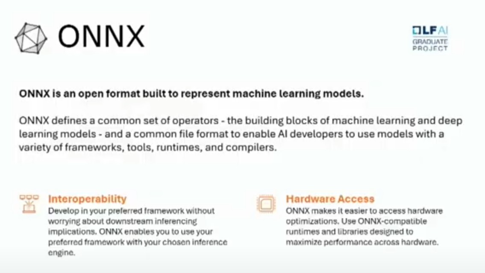
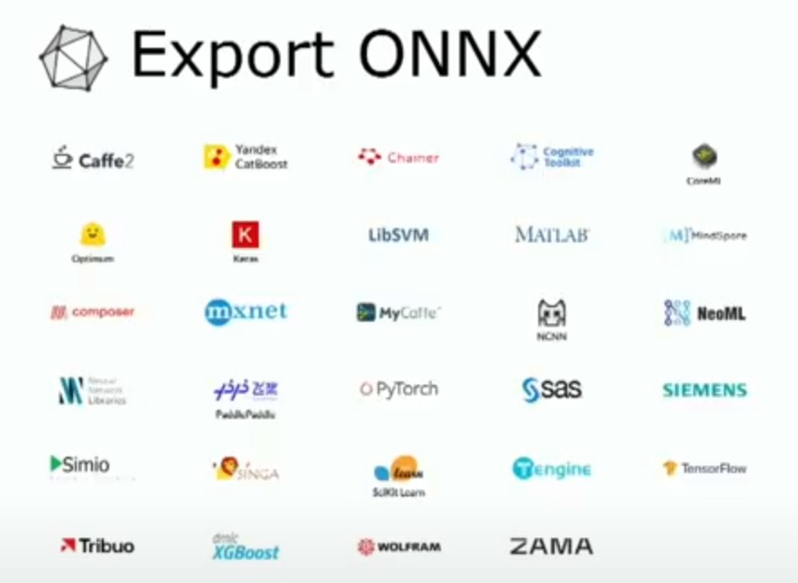
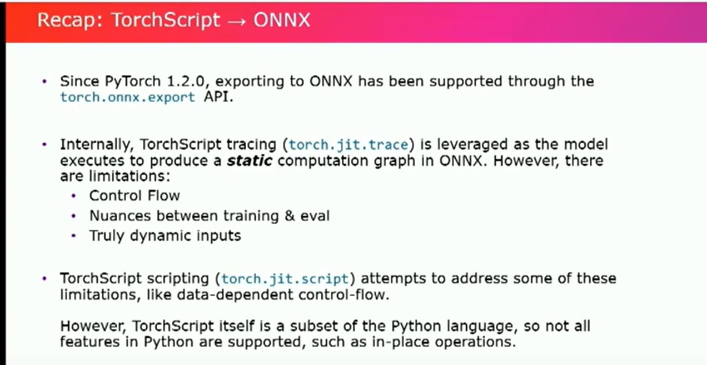
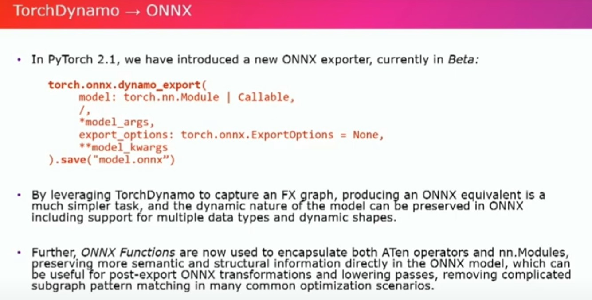
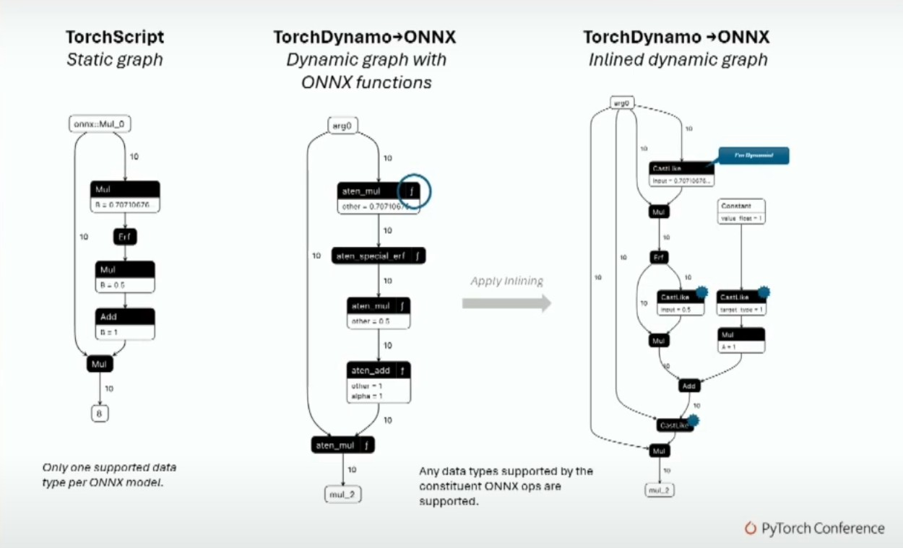
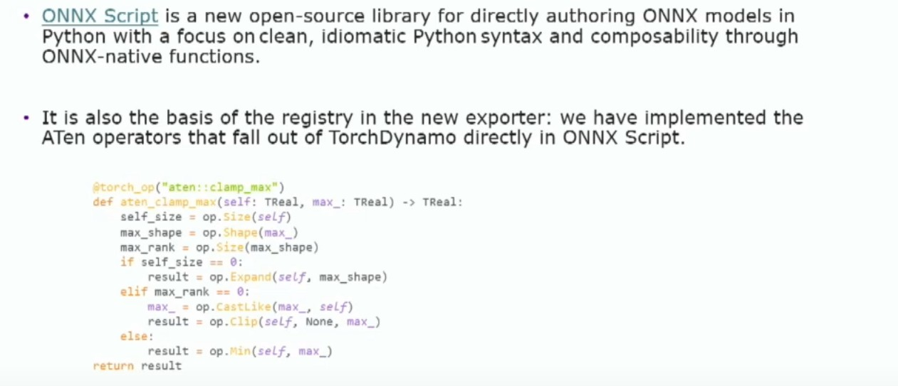

---

title: 11-使用新的ONNX导出器简化模型导出
keywords: ['pytorch']
---


## 大纲

1. ONNX背景介绍

2. 新的ONNX Exporter目标和意义

3. 新的ONNX Exporter技术实现方法  

4. 新的ONNX Exporter性能和优势

5. 新的ONNX Exporter使用方法

6. ONNX Script和未来工作

## 详细要点

### 1. 背景介绍

- ONNX定义了通用机器学习模型表示和交换格式

- 允许在不同框架和设备间转换模型

### 2. 新的ONNX Exporter目标和意义

- 解决旧Exporter限制,如不能处理动态图和控制流  

- 利用Dynamo追踪图,生成等价ONNX图保留动态特性

### 3. 技术实现

- Dynamo作为基础JIT编译器生成FX图

- Exporter使用FX图高效生成等价ONNX图

### 4. 性能和优势

- 支持虚假输入模式导出大模型

- 导出后有更多信息支持下游优化

### 5. 使用方法

- 使用新的API和ExportOptions配置Exporter

- 获取ExportOutput用于序列化和推理等

### 6. ONNX Script和未来工作

- ONNX Script简化编写ONNX算子

- ONNX转换和优化工具将推出

大家好。我叫Manav Dalal，今天我将讲解如何通过新的ONNX导出器简化模型导出流程。如果你还没有听说过ONNX，它是一种用于表示机器学习模型的开放格式。它定义了一套通用的运算符，机器学习和深度学习模型的基本原理，并提供了一个通用的文件格式，因此你可以保存并与各种工具一起使用,这样你就可以在你喜欢的框架中进行开发而且不用太担心与其相关的推理逻辑。



另一个很棒的地方是它真正解锁了许多硬件优化，无论你是在处理网络、NPU、GPU、CPU，还是其他任何设备，你都可以从ONNX访问你的模型。这是一些可以导出onnx的合作伙伴：





简单回顾一下自PyTorch 1.2以来的情况。我们使用torch.onnx.export API导出到Onnx模型。这个旧api有很多问题，通过Torch Script tracing(torch.jit.trace)可以在模型执行时生成静态图。虽然这样可以工作，但静态图存在很多限制。如果您有控制流程如if语句和循环，它在处理这些内容时就会表现很差。此外，它也不能很好地处理 training 和 eval 之间的细微差别。它也无法处理真正动态的输入。

现在，我们已经有了一些解决方案如torch.jit.script（比如对控制流问题的解决）Torch.jit.script本身是Python的一个子集，因此虽然有一对一的映射，但并非所有内容都有映射…因此，有时会忽略诸如原地操作之类的东西。

但接下来我们有了新的方式——Torch Dynamo。简而言之，在2.0版本中，它被视为一种JIT编译器，旨在加速未修改的PyTorch程序，从而实现可用性和性能的提升。它通过重写Python字节码，在FX图中获取PyTorch操作的部分，并使用它来获得我们想要的所有这些巨大的性能提升。它也是Torch Compile、Torch Export的基础引擎，



今天我要谈论的是新的ONNX Exporter。我们推出的一个目前还在测试阶段的新导出器。也许你们中的一些人已经使用过它，也可能有一些人还没用过。今天我在这里希望能够说服你们至少去试一试。它看起来有点类似于旧的API，但稍微复杂一些。你可以使用你的Torch.nn模块以及与该模块相关的参数进行导出（无论是位置参数还是关键字参数）。

还有一个新的参数导出选项，你可以直接添加一些相对具体的参数。通过利用Dynamo来捕捉graph，我们可以更容易地生成与该图形等效的ONNX，并且可以保留这些模型的动态特性。相对于以前的静态图，现在我们可以拥有动态图，我们可以用它们来获得一系列的好处。此外，onnx函数现在被用于封装ATen运算符和nn.modules，这对于导出后的onnx转换和lowering操作非常有用，可以去除复杂性，直接在onnx模型中保留更多语义和结构信息，这可以在许多常见的优化场景中用于子图模式匹配。

让我给你展示一个的例子。



你可以在这里看到不同的图表。左侧是旧的静态图表，这是可以的，在导出模型时工作正常，并且在某种程度上也经过了优化。但是，在中间，你可以看到现在的torch dynamo图表是什么样的。有更多的信息，并且所有的操作符都被捕捉在函数中。这真的很有用，因为实际上它们内联之后，你可以看到捕捉到了更多的信息。支持了许多数据类型。这是所有操作符支持的数据类型，而不仅仅是你用于导出模型的那个数据类型。这对于之后的优化非常有用。你只会得到更多的信息。

```text
新的torch.onnx.dynamo导出API通过可选的ExportOptions支持配置。值得注意的属性包括：

.onnxregistry：配置ATen分解，指定ATen IR到onnx运算符的映射，并提供API来支持三种主要的自定义运算场景。
- 处理不支持的ATen运算符（缺少的运算符）。
- custom operators 但是有已存在的onnx runtime support。
- custom operators 但是没有已存在的onnx runtime support。

.fake context：torch.onnx.enablefakemode()的结果是一个上下文管理器，它启用了导出大规模模型的虚拟模式输入支持，这些模型通常会在使用TorchScript导出时内存溢出。

diagnostic options：导出器中深度融入了一个新的诊断系统，以提高调试能力和自助服务能力。

它返回一个ExportOutput对象，通过该对象可以进一步通过.model proto属性进行推理或转换，或者通过.save(path)方法直接将内存中的onnx模型序列化到磁盘以方便使用。
```

因此，让我们谈谈我们开发的这个新API的亮点，希望你们能够使用。正如我之前提到的，我们有可选的导出选项，并且你可以用它做很多事情。首先，有onnx注册表，它允许你配置Aten分解，你可以为Onnx运算符预设AtenIR并进行映射，并提供API用于处理一些常见情况，比如处理不支持的A10运算符、具有现有OR支持的自定义运算符以及在Onnx运行时不支持的自定义运算符。因此，在前两种情况下，你可以提供这些运算符，并在Onnx脚本中自己编写它们（稍后会介绍）。这有点像一门语言，但是你基本上可以编写这些语言或运算符，并指定它们如果不可用时应该如何编写出来。在第三种情况下，你不仅可以编写自定义运算符，还可以编写所需注册的ORT内核。

我们还有fake上下文，这要归功于meta的虚假tensor。我们可以在不加载所有权重和运行模型的情况下导出模型。你知道，计算在如今是十分昂贵的，而且很难总是获得足够的计算资源来完成我们需要使用这些模型的任务，但是有了fake上下文，我们就能够做到。我们可以在所需设备准备好可以使用的ONNX模型，而无需花费可能多达几分钟的时间导出该模型。我们知道之前在大型模型方面，特别是最近大家都在谈论的LLAMA模型方面，使用Torch脚本导出器时会遇到问题。这是一个庞大的模型，是的，我们会遇到内存问题，但是有了fake上下文，你就不必遇到这些问题了。

我们还注意到，以前的Torch脚本导出器在调试能力和自助能力方面并不好，因此，在现在有很多诊断和自助能力选项，所以当你遇到错误时（因为现在仍处于测试阶段），很容易弄清楚该怎么做或如何解决这些错误。这是我们非常关注的问题，我们确实在意这个，现在，在你选择的模型上运行导出之后，你会得到ExportOutput对象。这是一个存在于内存中的对象，你可以进行推理并通过获取的模型 proto 属性来进行操作。因此，你可以查看它，会有很好的选项来对他进行更改和性能更新。当然，你也可以像保存其他 Onnx 模型一样将它保存到磁盘上，这个过程也非常简单。总之，效果非常好。[OnnxScript](https://github.com/microsoft/onnxscript "OnnxScript") 是我之前提到的用于实现新操作的方式。几个月前，它作为一个开放的仓库宣布出来。你可能已经读过相关博客，也可能没有。简而言之，它是一种符合惯用方式的简单方法来编写ONNX函数。



根据我的经验，在以前使用Onnx时，这实际上是一件很具挑战性的事情。我知道，像编写自己的运算符一样，这是一种痛苦的过程。但现在它非常简单明了。这是一个希望你能够阅读的函数操作符。如果你可以，你会发现代码相当直观。这要归功于OnnxScript让它变得非常容易。它非常简单明了，易于操作，而且对于那些不太精通技术的人来说也很易懂。所以整个过程都很容易上手。如果你选择，你也可以直接使用OnnxScript完全编写Onnx模型。这取决于你。但是，就像今天的演讲中的其他人提到的一样，我们将直接与Torch.export进行集成，


另外一个我提到的事情是，Onnx转换和优化工具将很快推出，以帮助利用这些模型。我们希望这个工具能被很多运行环境使用，谢谢。下列是一些参考资料：

```text
Install required packages:

pip install torch onnxscript onnxruntime
Export a PyTorch Model to ONNX:

Documentation: aka.ms/pytorchtoonnx
Extending the ONNX Registry:

Documentation: aka.ms/onnx/registry
API Docs for ONNX Dynamo:

Documentation: aka.ms/onnx/dynamo
Introducing ONNX Script:

Blog: aka.ms/onnxscript/blog1
ONNX:

Official website: aka.ms/onnx
ONNX Runtime:

Documentation: aka.ms/onnxruntime
ONNX Script:

Documentation: aka.ms/onnxscript
```
