---

title: 15-PyTorch Edge Developer Journey for Deploying AI Models Onto Edge Devices - Mengwei Liu & Angela Yi
keywords: ['pytorch']
---

## 大纲

1. 介绍ExecuTorch的背景和目标

2. ExecuTorch技术实现过程

- 提前编译阶段

- 运行时阶段

3. 满足运行时需求

- 可移植性

- 可定制性

- 性能

4. 使用ExecuTorch

- 如何编译和部署模型

- 运行时初始化和执行过程

5. 小结

## 详细要点

### 1. 背景介绍

- ExecuTorch目标是帮助开发者在边缘设备上部署PyTorch模型

- 将整个流程分为提前编译阶段和运行时阶段两个阶段

### 2. 提前编译过程

- 导出成Aten图,进行lowering和序列化

- 支持量化和backend delegation

### 3. 运行时需求

- 通过平台抽象层实现可移植性

- 设计二进制文件和内存管理器实现可定制性

- 准备输入、优化内核调用降低开销

### 4. ExecuTorch执行过程

- 加载二进制文件,初始化程序和方法

- 循环执行每条指令完成预测

### 5. 小结

- ExecuTorch提供了端到端解决方案帮助部署PyTorch模型

- 运行时考虑了可移植性、可定制性和性能三大需求

我的名字是孟伟，这是安吉拉。今天我们非常高兴地讲解ExecuTorch，这是我们的一个新的端到端技术栈，帮助开发者在边缘设备上部署他们的PyTorch模型，这些设备包括智能手机、智能可穿戴设备和虚拟现实头显等等。

对于开发者而言，我们将整个ExecuTorch技术栈分为两个阶段。首先，我们从一个PyTorch模型开始，这在大多数情况下是一个torch.in.module。然后我们从中捕获图形，并将其lowering并序列化为额外的torch二进制文件。这完成了我们的提前编译阶段。然后我们将二进制文件放入device并使用ExecuTorch运行时来运行。

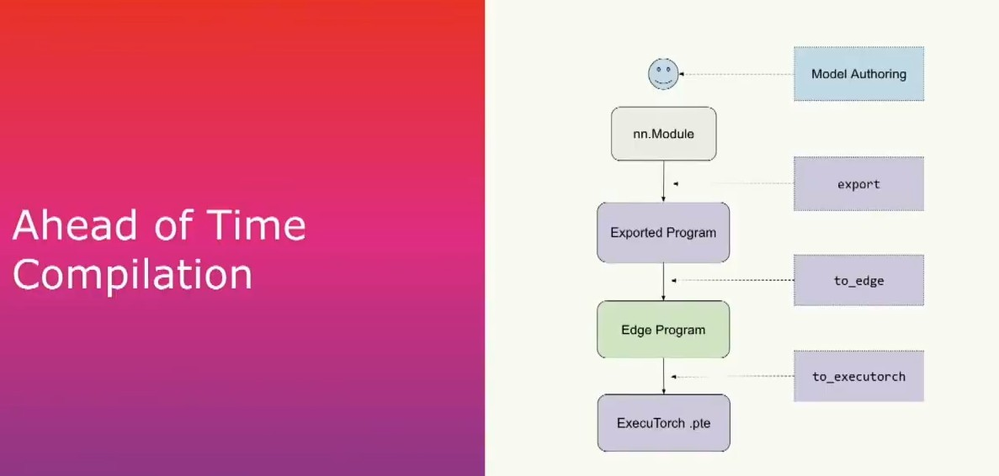

提前编译主要有三个步骤。首先是导出（export），将给定的模型（如NN模块或其他可调用对象）通过PyTorch2的torch export获取计算图。在这个模块内部，我们要列出所有正在进行的操作的列表，并且这将产生一个exported program，我们将在以后更详细地介绍它。

第二步是调用`to edge`，它将产生这个`edge` program，这是大多数执行器用户运行优化和转换的入口点。最后一步，我们将使用`to_executorch`来执行，它会将其变为一个扩展名为`.pt`的二进制文件。然后我们将把它传递给运行时。

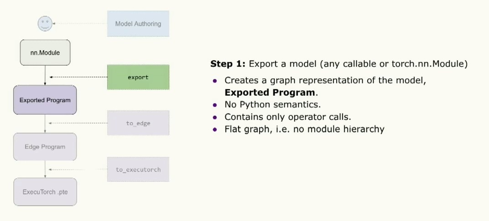

所以更近一步，第一步是导出模型，在这一步中，我们将创建这个模型的图形表示。这个图形表示是一个`fx`图形，你们中的一些人可能对此很熟悉，但它不包含任何Python语义，允许我们在没有Python运行时的环境下运行。这个图形只包含操作符调用。所以如果你熟悉`fx`图，就没有像调用模块或调用方法那样的东西。所以对我们来说，这是一个非常简单的图形。导出产生的结果是一个exported program，它与`torch`的`NN`模块非常相似，

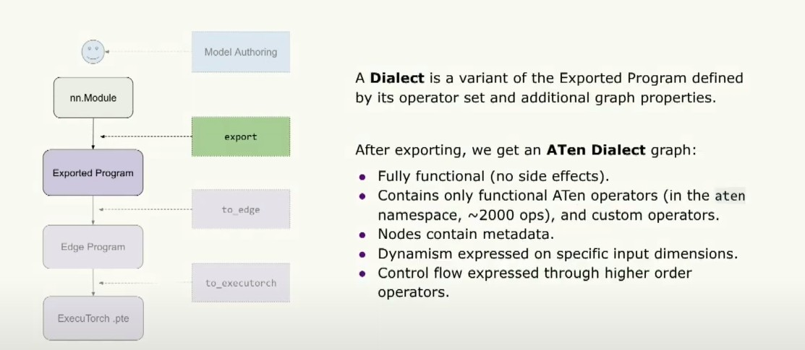

之后生成的graph，我们将其称为Aten Dialect graph。因此，通过Dialect，我们指的是此exported program的变体，其由其操作符集和一些其他graph属性定义。所以，通过Aten，我们指的是该图表仅包含torch.ops.aten操作符。而且，这些操作符仅为functional操作符，意味着没有副作用或突变。这涉及到约2000个左右的操作符。一些graph属性是graph包含元数据，例如指向原始模型的原始堆栈跟踪指针，还有graph内每个节点的输出data类型和形状。我们还可以通过这些特殊的高阶操作符在特定输入上表达动态性和控制流。如需了解更多信息，您可以在下午听Torch Expert的演讲。

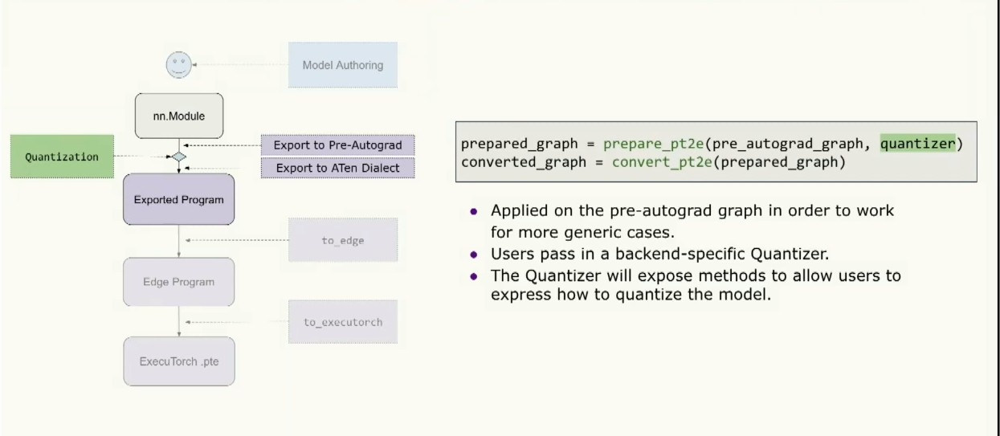

对量化而言，量化实际上在导出的中间阶段运行，因为它需要在更高级的opset上工作，这对于训练等一般情况也更安全。因此，工作流程是我们首先导出到Pre-Autograd，此东西训练是安全的，然后运行量化，然后降低到之前提到的Aten Dialect，然后传递到执行器 pipeline 的其余部分。
因此，这个API看起来像是准备PT2E(详情参考[https://pytorch.org/tutorials/prototype/pt2e\_quantizer.html），用户传入一个量化器，然后转换PT2E，然后将其传递给堆栈的其余部分。](https://pytorch.org/tutorials/prototype/pt2e_quantizer.html），用户传入一个量化器，然后转换PT2E，然后将其传递给堆栈的其余部分。 "https://pytorch.org/tutorials/prototype/pt2e_quantizer.html），用户传入一个量化器，然后转换PT2E，然后将其传递给堆栈的其余部分。")
所以，量化器是特定于后端实现的东西，它告诉用户在特定后端上可以量化什么以及如何对这些进行量化。它还公开了方法，允许用户表达他们想要如何量化这个后端。

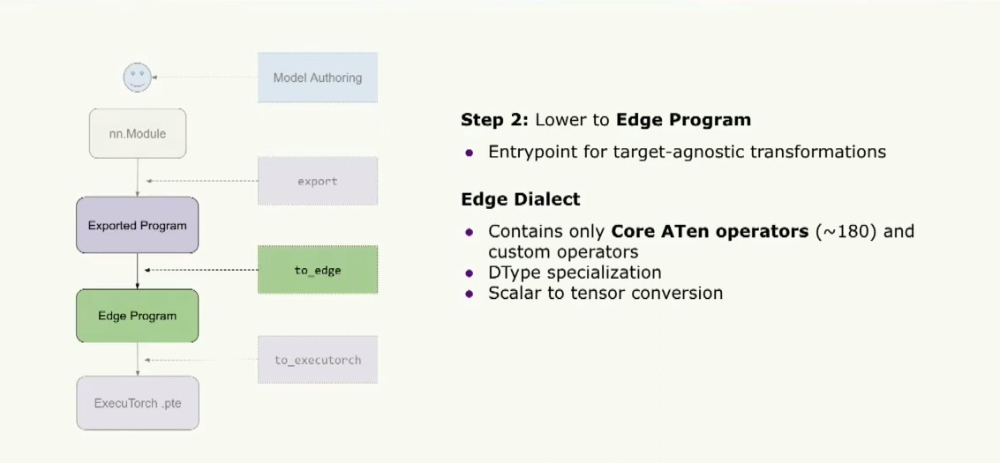

下一步是lower到Edge程序，这是Executorch用户运行他们的目标不可知转换的入口点。此时，我们正在处理这个Edge Dialect，其中只包含一组核心的aten运算符。大约只有180个运算符。因此，如果你是一个新的后端，正在尝试实现Executorch，你只需要实现这180个运算符就可以运行大多数模型，而不是之前来自Aten类的大约2000个运算符。

此外，这个方言还具有数据类型的专门化，这将允许executorch根据特定的dtype类型构建内核，以实现更优化的运行时。我们还通过将所有标量转换为张量来对输入进行归一化，从而使这些运算符内核不必隐式地进行这种归一化。

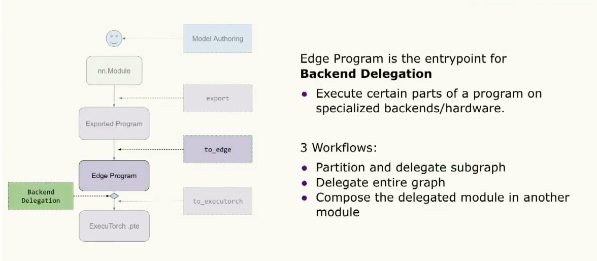

这个边缘程序的另一个入口是backend delegation，在这里用户可以选择在专门的硬件或后端上优化和处理部分或全部程序。通过这种方式，他们可以利用这些专用硬件来处理graph的某些部分。对于此，有大约三种工作流程。第一种是分割和delegation graph的部分。或者我们可以delegation整个图。或者我们可以做两者的组合，将这个delegation模块组合到更top的模块中。

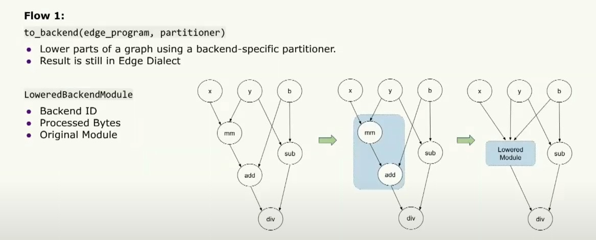

仔细看这一点，第一步是用户可以传递一个特定于后端的patitioner，它将告诉用户哪些操作符能在特定的后端上运行。然后，to\_backend API 将根据这个分区器对图进行分区，然后lower这些部分为一个较低层的后端模块。然后将该模块传递给运行时，以告诉后端需要运行的确切内容。它包含后端的ID，告诉我们正在运行的后端是哪个，并且包含一组处理过的片段，告诉专用硬件需要运行的内容。同时，它还包含用于调试目的的原始模块。

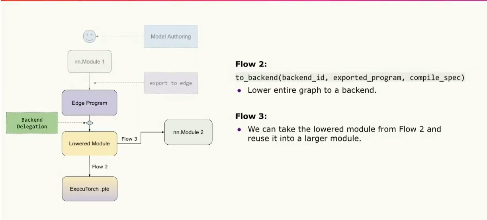

第二个流程是将整个graph lower到您的backend中，然后直接将其转换为二进制文件，然后传递给运行时在专用硬件上运行。第三个流程是我们将完全delegation的模块组合到其他模块中，以便在其他地方重用。

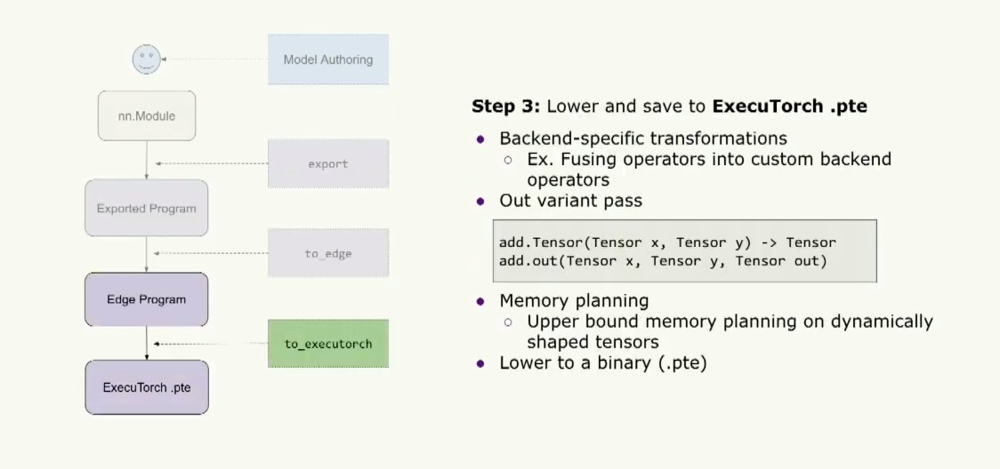

最后，我们可以将其转换并保存为ExecuTorch二进制文件。因此，用户可以开始运行特定于后端的转换，例如将运算符融合到特定的自定义后端运算符中。然后，我们将提前运行自定义内存规划过程，以确定此程序需要多少内存。为了准备graph执行此操作，我们首先将运行一个out variant pass，其目的是把所有运算符变成 out variant.这样做可以使内存规划变得更加容易，因为对于一个典型的算子（例如add.tensor），它会在内核中为输出的张量分配内存。但是如果我们想要进行内存规划，我们可以使用out variant ，它期望传入一个预分配的张量，并在内核中将结果张量赋值给这个预分配的张量。因此，我们可以运行内存规划，非常轻松地计算张量的生命周期，并提前确定这个程序需要多少内存，这样我们就不需要在运行时动态地进行内存分配。最后，我们可以将它转换为扩展名为.pte的二进制文件，并将其传递给运行时。

现在，孟炜将告诉我们运行时发生了什么。希望在完成所有这些步骤后，我们能够得到一个.pte文件。我们准备深入探讨运行时的过程。

到目前为止，我们假设开发人员能够按照Angela介绍的所有步骤进行操作。希望就像打个响指，我们就能够获取Executorch的二进制文件。现在我们要考虑一些需求，比如我们该如何运行这个二进制文件。从开发者的角度来看，他们可能会问的第一个自然问题是：它真的能在我的目标设备上运行吗？其中一些可能有CPU，或者一些可能有…甚至是微控制器。我们需要确保Executorch Runtime能够在所有这些平台上编译和运行。

现在我们能够在目标设备上编译Executorch Runtime后,开发者可能会提出一个后续问题。我的目标设备有一个非常特殊的地方…它包含两个内存缓冲区。一个速度非常快但很小，但另一个很慢但非常庞大。Executorch Runtime是否支持这种硬件配置呢？我认为这就是提出了我们的第二个需求，我们应该能够支持开发者想要的定制性，支持我们的开发人员想要的所有自定义。

好了，现在Executorch程序能够在目标设备上运行了。开发人员可能并不在意性能问题。请注意，设备上的AI处于资源受限的环境中。这意味着效率和性能至关重要。因此，我们需要确保Executorch Runtime具备高性能。因此，让我向您介绍一些我们为满足这些要求而所做的工作。

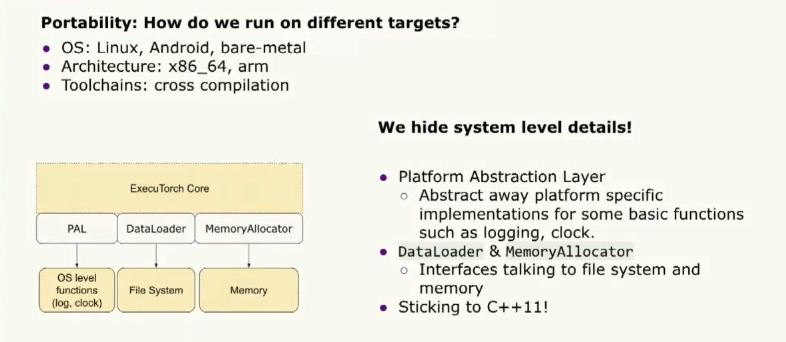

让我们谈谈可移植性。我们如何满足可移植性要求？目标设备包括不同的操作系统、不同的体系结构，甚至不同的工具链。我们解决所有这些要求的方法是隐藏系统级细节。我们通过提供一个平台抽象层来实现。这一层提供了一组统一的API，用于基本功能，如日志记录、时钟，并抽象了许多平台特定的实现细节。同样，我们还提供了数据加载器和内存分配器。访问Executorch runtime以与操作系统进行通信。最后但并非最不重要的是，我们确保我们的Executorch runtime遵循C++11标准，这是大多数工具链所接受的。

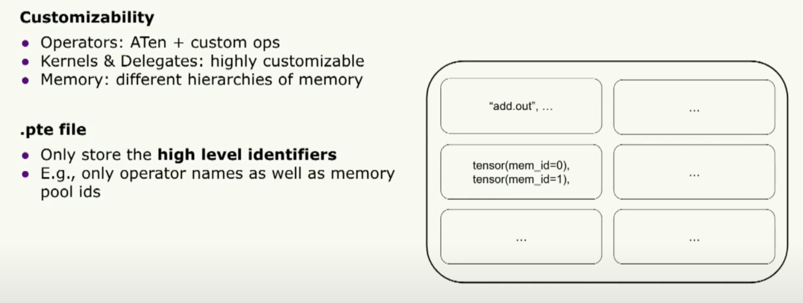

好的，接下来让我们谈谈可定制性。Executorch 二进制文件是编译和运行时之间的唯一桥梁。从这个意义上说，为了支持可定制性，我们必须设计二进制文件的架构。它只存储高级标识符。我们只存储运算符名称和内存池ID，但对此没有任何意见。实际上，它是在运行时上运行的内核。

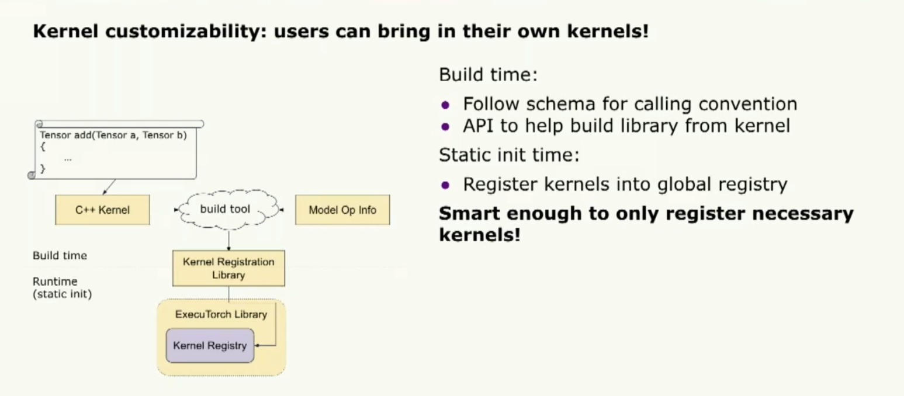

这样，我们为定制开启了很多机会。让我们谈谈内核的可定制性。我想要强调的一件事是允许用户带入他们自己的内核。我们提供了一个内部的可移植内核库。但它并不旨在优化性能。因此，我们允许用户带入他们自己的内核。注册自定义内核的方法非常简单，开发者只需要按照核心 aten 运算符的命名约定。然后，他们可以使用一个构建工具为它们的库注册内核。这个库将帮助将他们的内核注册到 Executorch 运行时中。

还有一件事我想提一下，如果开发者提供了模型级操作符信息，构建工具会智能地只注册必要的信息，这样我们可以缩小二进制文件的大小。

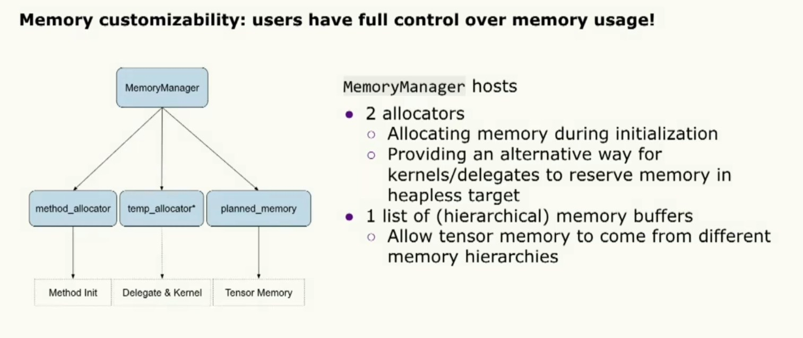

不同的环境对内存有非常特殊的需求，所以我们提供了名为MemoryManager的对象，允许用户进行大量的自定义配置。内存管理器由两个内存分配器组成。其中一个用于初始化过程，另一个用于内核和委托执行过程。除此之外，我们还为张量内存分配提供了一系列内存缓冲区。这样就完成了定制功能。

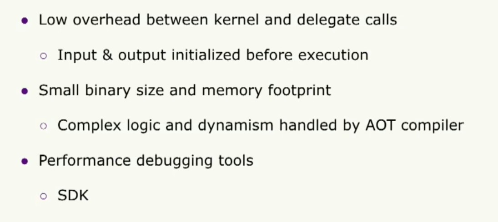

现在让我们稍微谈谈性能以及我们如何满足性能需求。我们确保我们的Executorch Torch运行时在内核和委托调用之间的开销非常低。这是通过在执行之前准备输入和输出张量来实现的。而用户只需要付出一次代价，即使他们想多次运行该模型。我们确保ExecuteTorch运行时的第二个原则是保持一个非常小的二进制文件大小以及内存占用，这是通过将复杂逻辑和动态性推移到提前编译器中来实现的，并确保Executorch运行时逻辑。

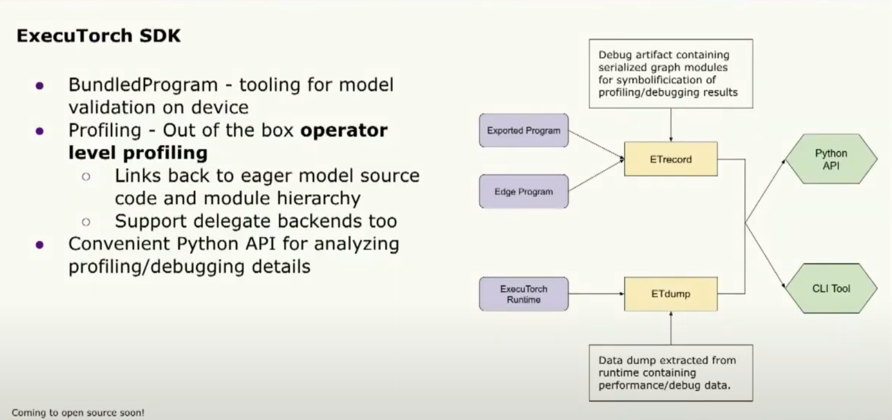

最后但并非最不重要的是，我们还提供了一套非常方便的性能调试工具，它在这个SDK中。让我多谈一点，我们提供了几个非常有用的API。其中之一是捆绑程序，我们可以将示例输入绑定到模型中。这样就能实现非常快速的执行。我们还提供调试和分析工具。分析器能够将统计数据连接到运算符上。为我们的程序确定瓶颈非常有帮助。所有这些都提供了Python API，以确保开发人员能够轻松使用它们。我谈了很多关于我们运行时的组件，但是我们如何将它们连接在一起并确保其正常工作呢？

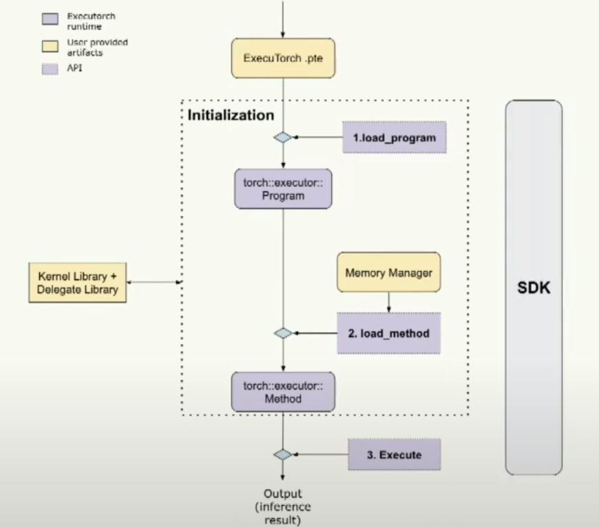

这是一个图表。基本上，我们加载Executorch的.pte文件。然后我们进行一些初始化，包括加载程序和加载方法。最后，我们可以执行它。使用SDK工具来覆盖整个流程，确保每一步都是正确的。

那么在初始化阶段，我们在做什么呢？基本上，我们为PyTorch模型的概念创建了C++对象。如您所见，根抽象称为program，类似于nn.module模块。一个program可以有多个方法。一个方法可能具有多个操作符，即kernel对象。

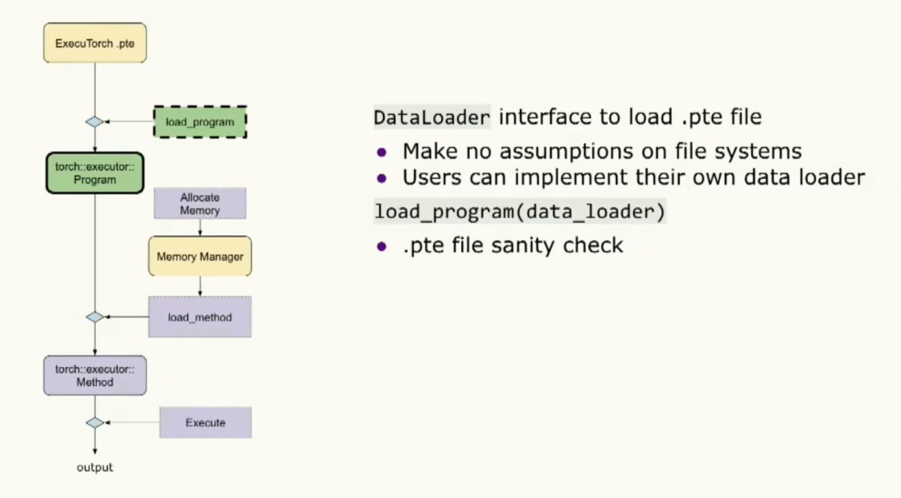

当我们加载程序时，实际上我们提供了数据加载器接口以便能够加载二进制文件。请注意，我们对文件系统不做任何假设，所以用户可以自由实现这个接口并在目标设备上加载程序。加载程序将使用该数据加载器进行二进制文件的合法性检查。同时，用户也可以在初始化阶段提供内存管理器。我想要强调的一点是用户可以管理自己的内存。

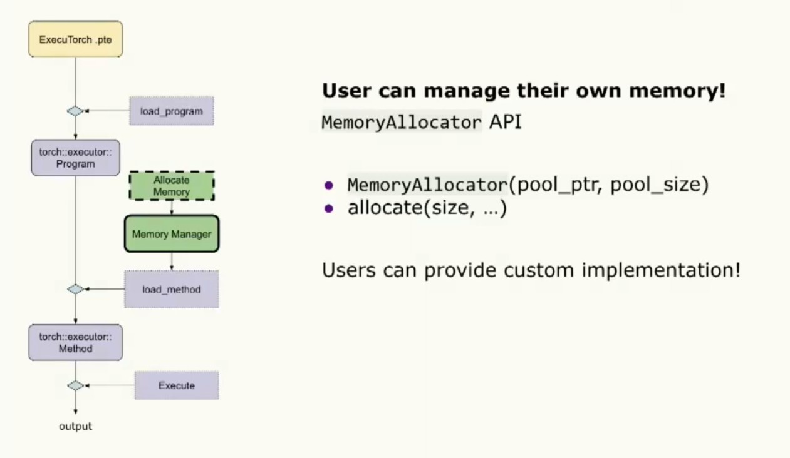

初始化的最后一步是调用加载方法，开发者需要提供他们想要执行的方法名称，还有内存管理器。

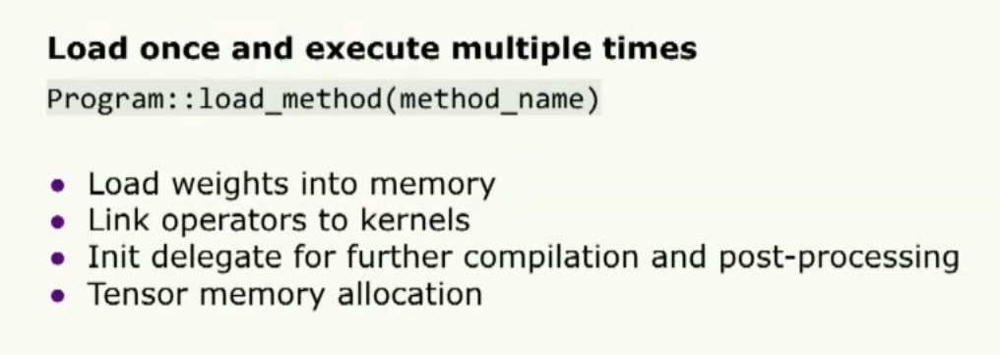

最后进入到执行的阶段：
这是很简单的循环遍历所有指令，执行能够通过跳转到特定的指令来处理控制流，并且每个指令参数都是Evalue(wrap all arg types).我们可以把他 unboxex 到不同的基础类型(tensor,scalar),我们还有一个内核运行时上下文可以处理一些事情。

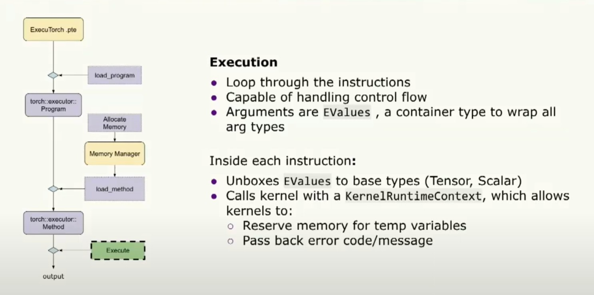

你可以查看安卓和ios的演示，github教程可用。到此结束，谢谢。
