## 大纲

1. 分布式预测的需要 

2. 模型并行化方法

3. TorchServe支持情况

4. TorchServe优化技术 

5. 实际案例分享

6. 待完善地方

## 详细要点

### 1. 分布式预测的需要

- 大模型无法在单GPU上运行
- 需要模型并行解决方案

### 2. 模型并行化方法

- 张量并行
- 流水线并行

### 3. TorchServe支持情况

- 集成主流框架如DeepSpeed、Accelerate等
- 提供自身PP和TP能力

### 4. TorchServe优化技术

- 微批处理
- 动态批处理 
- 流式预测API

### 5. 实际案例分享

- Lama案例优化效果
- Inferentia2成本优化

### 6. 待完善地方

- 模型优化如KV缓存、量化
- 引入新的功能

这里是Hamid，我来自PyTorch合作伙伴工程部。我将跟随Mark的讨论，讲解如何在TorchServe上提供LLMs的分布式推理和其他功能。首先，为什么需要分布式推理呢？简单来说，大部分这些模型无法适应单个GPU。


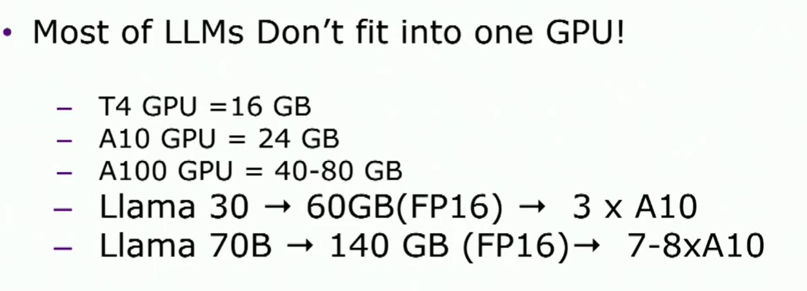

通常，GPU的内存介于16到40GB之间，如果考虑一个30B模型，在半精度下需要60GB的内存，或者70B Lama模型在半精度下至少需要140GB的内存。这意味着至少需要8个GPU。因此，我们需要一种解决方案将这些模型分区到多个设备上。我们来看看在这个领域有哪些模型并行化的解决方案和方法。

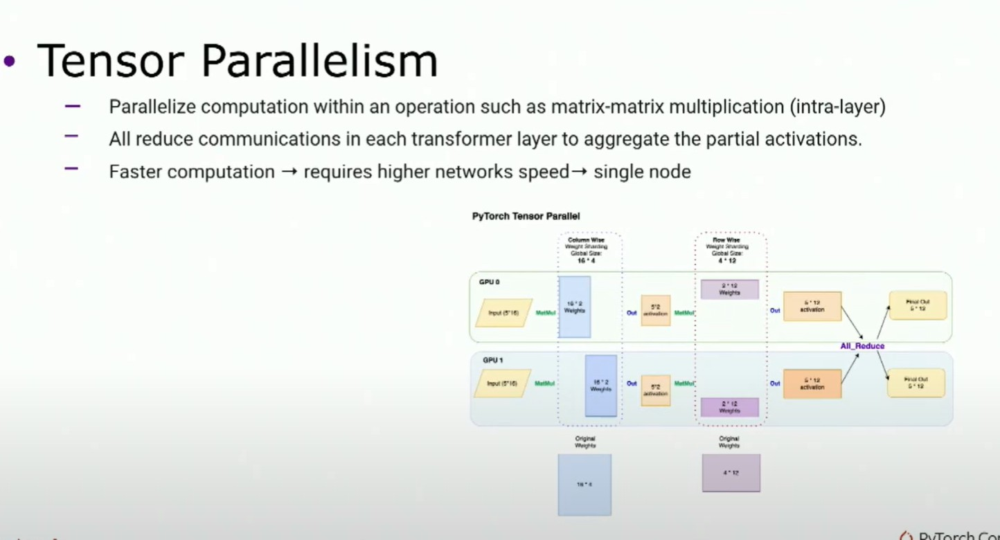

目前有两种主要方法。一种是张量并行，你基本上在op内部（如矩阵乘法）上切割你的模型，从而并行化计算。这会引入一个通信，就像全归约一样，如果你有足够的工作负载，使用流水线并行计算会更快，但需要更高速的网络。原因是要保持GPU忙碌，因为它是在操作并行化中。所以它更适用于单节点计算。

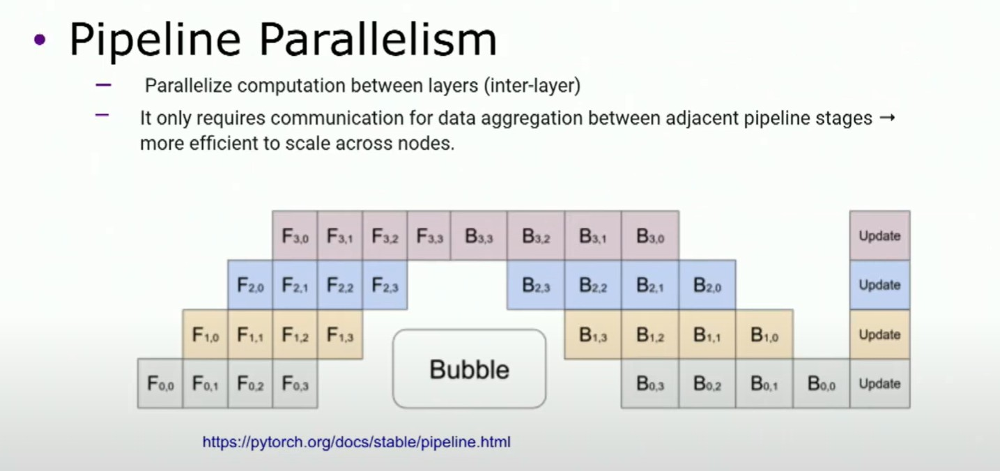

另一种主要方法是流水线并行，基本上将模型水平切分成多个阶段，每个阶段包含一组层。所以你将第一个阶段的输出作为第二个阶段的输入。在这里，我们需要将这种技术与micro批处理结合使用，否则无法有效利用GPU。由于通信的性质，流水线并行更适用于多节点的扩展。
```
· Modify Model Code
Megatron,TransformerNeuronx,Fairscale,etc.
DefineParallel layers-buildthe model withparallel layers
boundtospecifictrainers
· PyTorchAPIs
Wrapthe original model withAPIs
Automaticallypartitionthemodel
Traineragnostic
```
那么，我们今天在OSS空间实际上如何实现这些模型呢？这里有两种主要方法。一种是修改你的模型代码。基本上，定义你的并行层，并在这些并行层之上构建你的模型。这非常像transformers的风格。
我们在不同的repo中也看到了这一点，比如megatron,Transformer，Neuronics来自AWS。而且大多数这种并行性都限定在特定的训练上。而另一方面，我们有PyTorch的API，它采用了一种不同的策略。它大多数情况下不需要改变或只需进行最小的改动来适应您的模型，它只需要检查您的模型，并自动对其进行分割。它也可以在训练过程中保持中立。

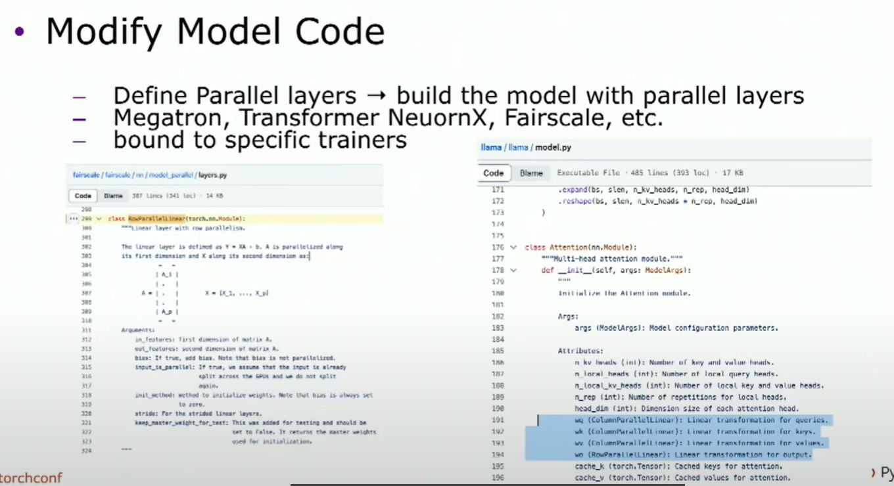

这里有一个修改模型代码的例子，这是在Fairscale上构建的LLAMA2模型的例子。正如您在左侧可以看到的那样，我们实际上正在定义那些并行层，在注意层中，您可以看到我们正在在那些并行层之上构建模型。如我所说，这是Fairscale，但是Megatron，Transformer和AX都是相同的性质。另一方面，这是PyTorch的API，用于流水线并行。我们有一个名为PP的软件包，它处于测试阶段。它的作用是使用模型并行地进行计算

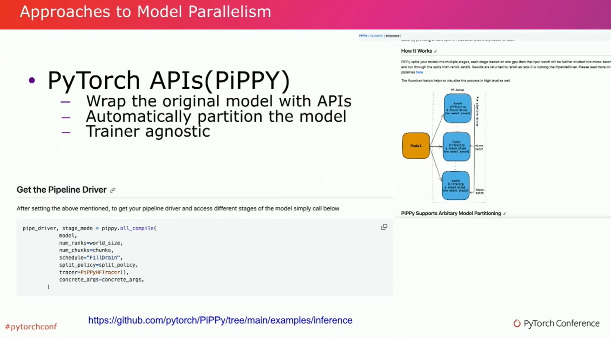

为了理解你的模型并将其分成多个阶段，使用tracing方法是非常重要的。这个框架提供了一个非常简单的API，只需要将你的模型输入其中，就能得到一个已经在不同GPU上进行了分布的多个阶段。它还支持延迟初始化，我们稍后会详细讨论。此外，我们还有适用于PyTorch的tensor并行API，与张量一起使用。

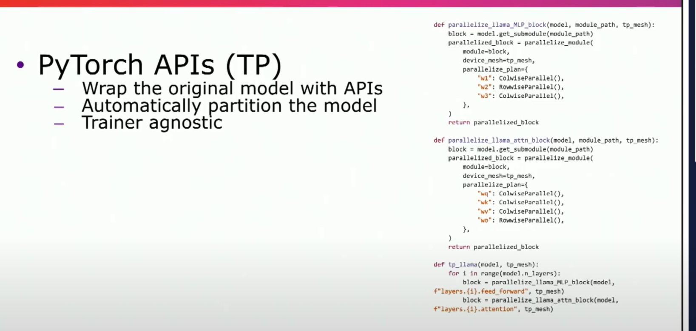

如果你看一下这些代码，基本上，你可以将你的分片策略传递给并行模块，它会简单地将你的模块并行化到不同的设备上。这又是相同的策略，你不需要改变你的模型代码。它们都是训练无关的，所以你可以在从不同库中导入任意的检查点时进行推理。接下来，我来强调一下我们在分布式推理中所面临的一些挑战。首先，大多数的开源解决方案都与特定的训练器绑定。

```
1. Most of the OS solutions are bound to specific trainers or require model changes：
   - Examples include DeepSpeed, Accelerate, ParallelFormer, TGI, vLLM, etc.

2. Automatic partitioning of arbitrary checkpoints:
   - APIs to automatically partition your model checkpoints (trainer-agnostic)
   - Enables automatic partitioning of arbitrary checkpoints.

3. Deferred initialization (loading pretrained weights):
   - Avoid loading the whole model on CPU or device.
   - Supports deferred initialization to load pretrained weights on demand.

4. Checkpoint conversion:
   - Convert checkpoints trained/saved with different ecosystem libraries to PyTorch Distributed checkpoints.
```

正如我提到的，他们需要模型的改变，比如deepspeed、VLLM等。所以这需要一种解决方案，能自动对模型和任意检查点进行分区。所以无论你用哪个训练器训练过你的模型，它实际上应该能够将你的模型进行分区。这里还有另外两个挑战，就是延迟初始化，正如Mark所谈的。它可以帮助你更快地加载模型，并在某些情况下避免在CPU和GPU上的开销。而且，如果你必须将模型放在操作系统上，也可以使用这种方式。然后我们有一个检查点转换，我这里稍微谈一下。这是今天的初始化方式。

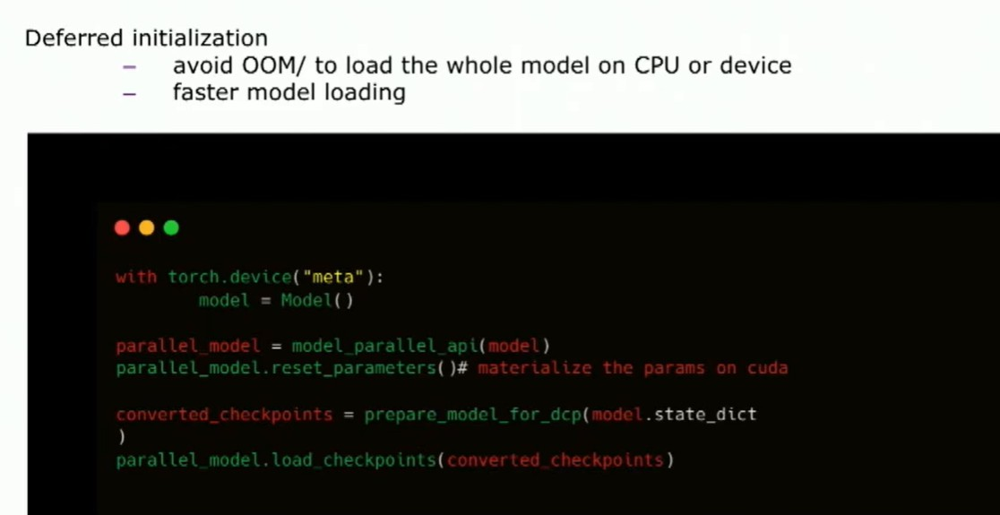

所以你可以使用元设备来初始化你的模型。然后你请求模型并行API并行化你的模型。你必须手动地实现你的参数。但是在这里还有一个额外的步骤，你必须将你的模型检查点转换为PyTorch分布式可以理解的张量形式。所以，在它们之间有一个检查点转换的过程。你可以使用PyTorch分布式检查点API来加载模型。这样，你实际上可以使用延迟初始化。这里有一个额外的步骤，我们正在研究如何在这里去除检查点转换。

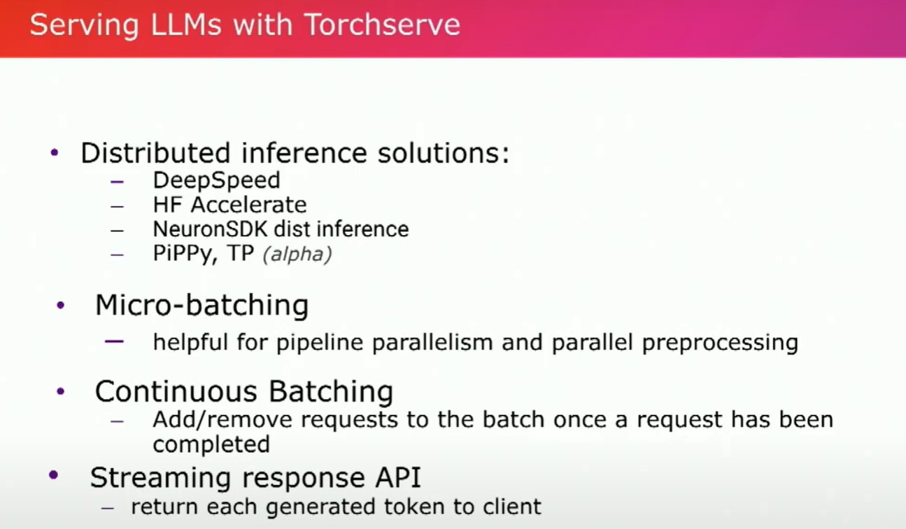

好的，谈论一下分布式推理和不同的模型并行化。现在让我们转向Torchserve，看看我们在Torchserve上支持什么。今天在Torchserve上，我们已经集成了分布式推理解决方案，我们与DeepSpeed、Hugging Face Accelerate、Neuron SDK与AWS自定义芯片都有集成。Torchserve原生API还具备PP和TP功能。我们还有微批处理、连续批处理和流式响应的API，这是我们团队和AWS的Matias和Lee共同开发的。

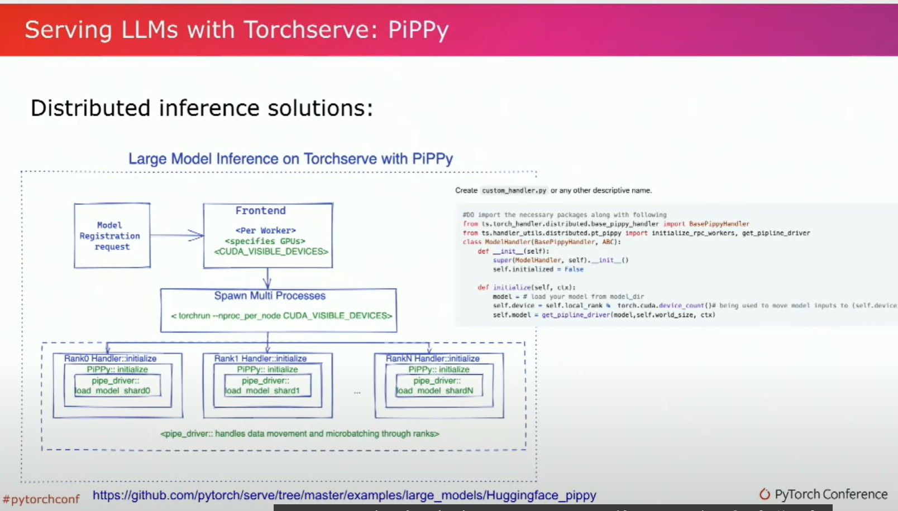

现在让我们来看一下PP。在这里，我们有高度流水线并行处理，我们已经初始化了这项工作，并启用了路径。我们的主要目标是专注于使用的便利性和功能。您可以看到，我们在这里提供了一个一行代码的API，您可以轻松地将您的模型传递进去，特别是所有的Hugging Face模型，您实际上可以获得阶段并简单地初始化您的模型。

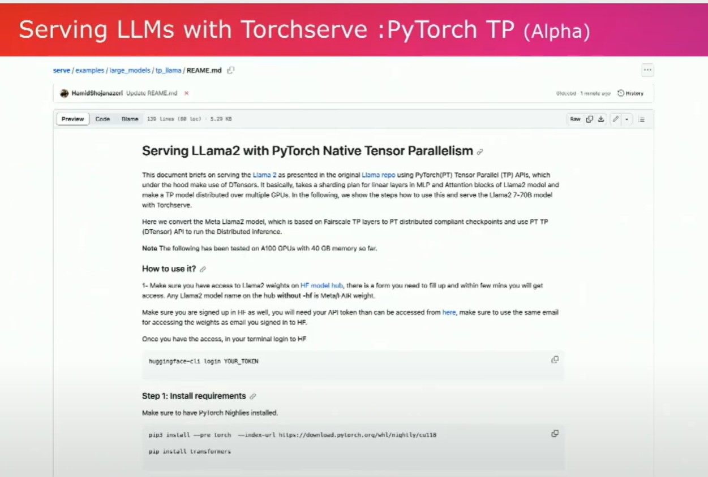

然后，我们最近还为Lama启用了d-tensors来实现张量并行。这是初始的一步。我们已经启用了这条路径，但我们也正在努力优化推理路径。所以请继续关注这里，很快就会有新的更新。

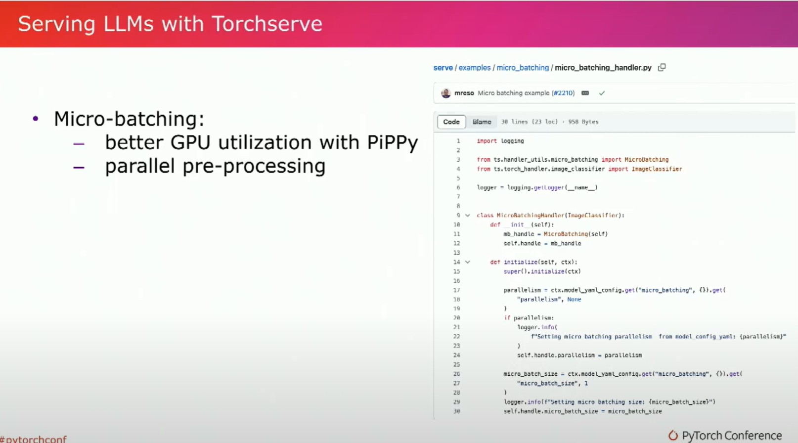

关于微批处理，如果您想要使用管道并行处理，微批处理非常重要。我们有一些非常好的微批处理示例，可以帮助您轻松入门。它既有助于更好地利用GPU，也可以在某些情况下并行化预处理，比如处理一些您正在处理的视觉模型。所以可以有一个繁重的预处理任务，我们可以在这里实现并行化，使用多线程。我们还有连续批处理和其他供LLM服务配置使用的成分。这里的想法是当一个请求完成时，将队列中的请求连续添加到当前批次中作为一个请求。所以你不需要等待整个批次完成再发送下一个请求。

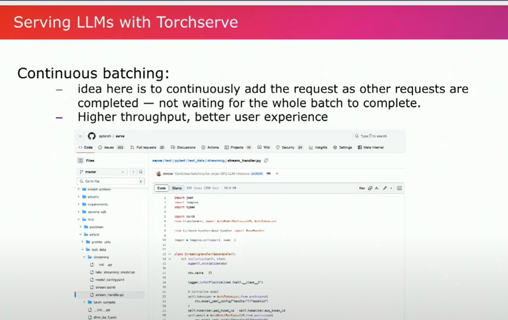

正如马克所说的，基本上就是动态批处理。因此，这将有助于提高吞吐量和用户体验。我们来看下一个功能，即流式响应API。

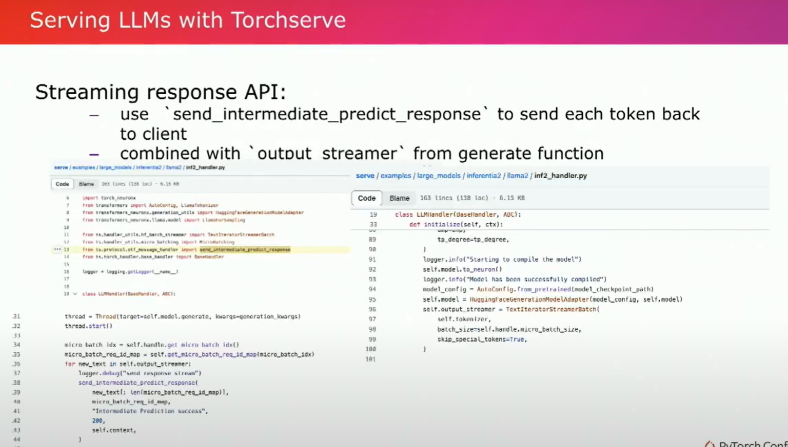

再次强调，当您向这些LLMs发送请求时，它们可能需要很长时间进行推理和生成令牌。因此，流式API将帮助您获取每个令牌的生成，而无需等待整个序列的生成。您将逐个生成的令牌返回到客户端。因此，这是一个很好的功能可以实现和集成到友好的环境中。在这里，您可以看到我们定义了两个API。一个是发送中间预测响应的API，您可以使用该API。我们使用了HuggingFace文本迭代器来进行流式批处理。通过这两个的组合，我们在这里实际上有LLAMA2的示例。

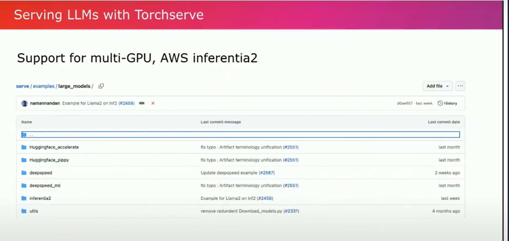

再说一次，正如我所谈到的，我们与所有这些功能进行了集成，包括所有这些不同的库，如HuggingFace、PP、DeepSpeed、DeepSpeedM2、Inferentia2。在这里，我们实际上已经发布了一个很新的推理示例，并且我们在此发布了一个使用案例。

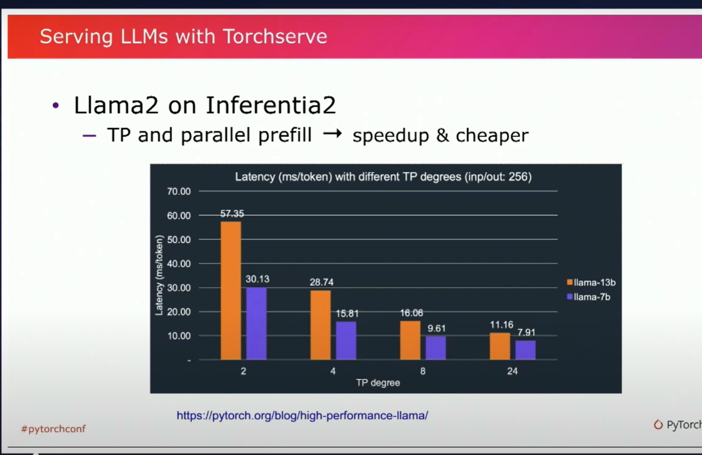

你可以看到我们在这里使用了张量并行和并行预填充。它实际上帮助大大加快了推理速度。与等效的GPU相比，它使得Inferentia 2的成本大幅降低了。我们获得了3倍更便宜的性能点。因此，我强烈建议你也看一看这个示例。

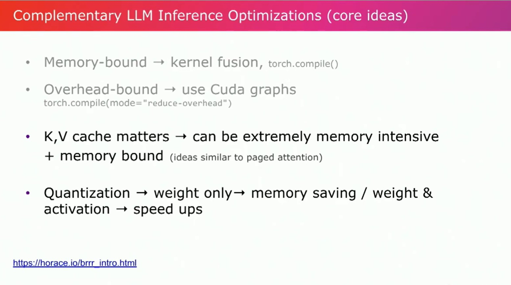

Mark谈了很多不同的优化，补充优化方法使模型更快。他谈到了内存限制、CPU限制，对于特定的LLMs来说，还有两个重要的事情，即KV缓存。这非常重要。它可能会占用非常多的内存，并且会受到内存限制的影响。因此，类似于pageattention的想法在这里可能有帮助。另一个要考虑的因素是量化。

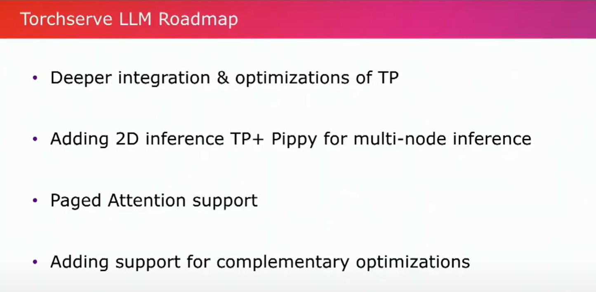

到此结束，谢谢。