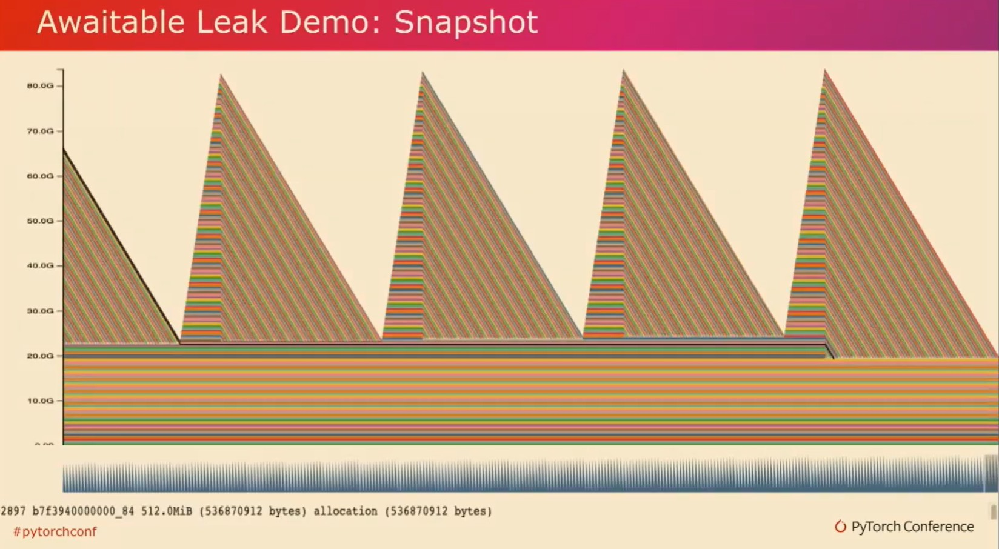

---

title: 20-Torch中针对GPU的显存分析调试工具
keywords: ['pytorch']
---

# 大纲

1. GPU内存管理问题引言
2. 内存快照记录器工具介绍
3. 工具应用：正常模型的内存使用分析
4. 工具应用：识别内存泄漏问题
5. 引用循环检测器工具
6. 实际复杂场景中的工具应用

## 详细要点

### 1. 引言

- Meta的PyTorch Perf Infra团队开发的工具
- 描述了CUDA OOM错误出现时的信息不足问题

### 2. 内存快照记录器工具

- 记录和分析GPU内存分配、释放和OOM事件
- 支持堆栈跟踪信息，提供可视化的内存分配时间线

### 3. 正常模型内存使用分析

- 监控前向传播、反向传播期间GPU内存的变化
- 观察模型迭代间内存使用的恢复情况

### 4. 内存泄漏问题识别与解决

- 通过工具追踪内存累积的峰值和一次性释放现象
- 显示如何通过调整代码逻辑（如提前清空梯度）来避免内存溢出
- 集成至PyTorch Profiler和内存分析器

### 5. 引用循环检测器

- 发现和警告导致Tensor无法正确回收的引用循环
- 提供object graph便于查看循环依赖关系

### 6. 实际复杂场景应用示例

- 展示一个涉及类和回调函数的隐晦引用循环案例
- 说明引用循环检测器如何帮助找到并修复此类问题

### 7. 工具集的实用性和兼容性

- 这些工具已应用于降低GPU内存使用和减少碎片化
- 在PyTorch 2.1版本中可获取和使用这些工具

我在Meta的PyTorch Perf Infra团队工作。今天我想和大家讨论一下我们开发的一些工具，以帮助我们更好地理解PyTorch在GPU上的内存使用情况。

```
- Where is GPU memory being used by PyTorch?
- Why did a CUDA out of memory (OOM) happen?
- torch.cuda.OutofMemoryError: CUDA out of memory. Tried to allocate 512.0 MiB. GPU 0 has a total capacity of 79.32 GiB, of which 401.56 MiB is free.
Including non-PyTorch memory, this process has 78.93 GiB memory in use. Of the allocated memory, 78.00 GiB is allocated by PyTorch, and 0 bytes is reserved by PyTorch but unallocated.
```

如果你已经使用过PyTorch一段时间，你肯定会遇到CUDA内存不足的错误。尽管这个错误信息告诉你有多少内存是空闲的，以及有多少内存被分配了，但它并没有完全回答诸如PyTorch使用了哪些GPU内存、为什么会发生CUDA内存不足等问题。也许你的批处理大小太大，或者你分配了实际上并不需要的内存。为了帮助你更快地回答这些问题，我们开发了一些工具来辅助你。


第一个工具是内存快照记录器。它的使用非常简单。你可以通过开始记录内存历史来启动API。这将收集所有的分配、释放和内存不足事件，并收集它们发生时的堆栈跟踪信息。在任何时候，你也可以将快照文件转储到本地磁盘中以备后用。您还可以随时停止记录内存历史。


通常，在CPU分配器（如malloc）上，有大量非常小的分配。这使得一次性绘制它们并不可行。然而，对于CUDA张量，它们的大小要大得多，数量要少得多。因此，我们实际上可以随时间绘制所有这些。我们在PyTorch.org上为您提供了一个工具。您可以拖放您的快照文件，并在时间轴上为您绘制内存分配情况。


现在让我们来看一个训练示例。在这个训练示例中，我们收集了五个迭代，如您在这五个峰值中所见。当观察这些峰值时，您可以观察到在前向传递中分配张量时，GPU内存使用量上升。然后，在反向传递和计算梯度张量时，您可以观察到GPU内存使用量下降。我们还可以观察到，GPU内存使用量在每个迭代之间恢复到其原始状态。我这是一个正常工作的模型，但是这个工具实际上对于一个不正常工作的模型效果最好。


现在让我们看一个带有错误的模型。正如你在这里所观察到的，第二次迭代使用的峰值内存比第一次迭代多得多。如果这个模型更大一些的话，第二次迭代可能会发生内存溢出，并且你对此没有太多的了解。但是通过使用这个工具，你可以观察到在第一次迭代中分配的张量，并且可以观察到这些张量在第二次迭代等等中保持存在。


如果你点击任何这些张量，你还可以看到它们的调用堆栈，这表明它们实际上是梯度张量。现在让我们来看看有问题的代码。


正如你在这里清楚看到的，我们在反向传播之前清空了梯度，而实际上我们可以在正向传播之前清空它们。


通过简单地在这里改动和添加这一行代码，将它移动到正向传播之前设置set to none，我们会修复这个错误。我们希望你能亲自尝试这个工具，并让我们知道它的效果如何。这也与PyTorch Profiler集成在一起，或称作内存分析器。


如你所见，在这里我们把相同的模型在五次迭代中绘制出来。分析器通过颜色编码将这些张量分配分成不同的桶。从蓝色中可以观察到梯度张量，在每次迭代后我们可以观察到梯度张量被释放。在黄色中，我们还可以观察到优化器状态，在第一次迭代后创建，并在作业过程中保持恒定。你可以在提供的链接中找到更多关于此的详细信息。现在让我们来看一个简单的内存泄露示例。


如你所见，张量会随着时间的推移被分配，并且会累积到这些峰值。然后突然间它们会一次性被释放。


我们在这里可以清楚地观察到一个问题。进一步调查发现，实际上这是由循环引用造成的问题，即引用循环。因此，Python会立即使用引用计数清理非循环引用的对象。然而，这无法清理引用循环。引用循环依赖于垃圾回收。所以，如果张量被这些引用循环所持有，这些张量也会一直存活，直到进行循环回收。


所以，我们可以通过在每100个迭代中调用`gccollect`来显式调用垃圾回收器。它确保在每次调用中释放张量，并使GPU内存恢复到零。


通过查看简单的泄漏代码，我们可以看到一个包含张量和链接的节点类。如果我们创建张量A和张量B，并将A链接到B，B链接到A，我们就创建了这个引用循环。我们期望的是当A和B超出范围时，垃圾回收器应该回收A和B。然而，事实并非如此，如果我们运行这个程序100,000次，我们实际上会遇到一个KUDA-oom错误。


Python的垃圾回收在CPU资源充裕的内存环境下表现良好。然而，在内存受限的环境下不太好。这包括GPU内存。循环收集器对GPU显存压力不敏感。尤其是在GPU训练中，我们经常会增加批次大小以利用仍然可用的空闲内存。因此，最好是避免引用循环。



现在让我们看一些更复杂的例子。在这个例子中，是一个更加现实的例子，虽然这个快照看起来几乎和我们之前看到的一样。模式看起来非常相似。


如果我们看代码本身，我们会看到一个类。当我们wait时，就会创建这个tensor。我们还有一个callback类。它包装了awaitable tensor并注册了一个视图回调函数。


如果我们创建一个名为A的tensor，它是一个awaitable tensor，并对其应用Awaitable....Callback，
我们所期望的是当A超出作用域时，A的引用计数应该达到零并且回收A。但是，当我们重复运行这个动作一百万次的时候，实际上我们会再次遇到麻烦。这段代码中存在一个引用循环，不过很难发现。


因此，我们引入了另一个工具来帮助你找到这些引用循环。让我向你介绍引用循环检测器。这个工具可以帮助你找到那些使PyTorch tensor保持活跃的引用循环。使用方法非常简单，在训练初始化过程中调用warn_tensor_cycles，在循环收集后释放GPU张量时，引用循环检测器会发出警告。


这些警告还会生成object graph，这样你就可以观察到这些引用循环以及被保持活动状态的张量。这里有一个我们刚才看过的示例。在外部循环依赖中，有一个引用循环，其中一个具有视图callback的可加权张量引用了自身。这就使得以红色突出显示的张量保持活跃。


一旦我们发现问题，实际上很容易修复。


我们在实际中使用了这个工具发现了很多问题降低了最大GPU内存使用，并且使其不那么容易碎片化，GPU在迭代间都会回到初始状态

这些工具在pytorch2.1中都可以用，欢迎使用，谢谢。


