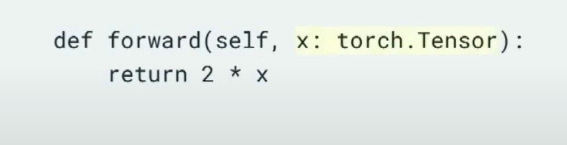
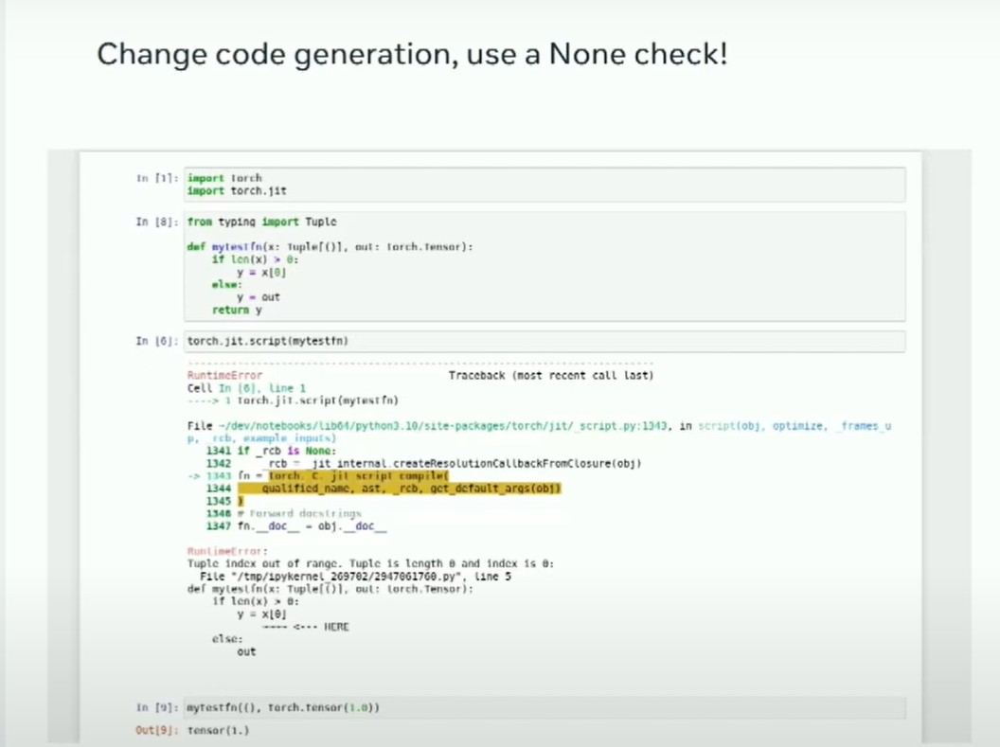

---

title: 21-为PyTorch构建中间日志记录
keywords: ['pytorch']
---

## 大纲

1. 理解模型运行机制

2. 用hook记录模型 running的值  

3. PyTorch中使用hook的API

4. TorchScript和其他转换中hook的限制
  
5. 解决这些限制的技巧
  
6. 应用示例

## 详细要点

### 1. 理解模型运行机制

- 查看模型穿过的所有值可以帮助理解模型

- 这些值包括模块参数、权重、缓冲区和输出值、梯度信息

### 2. 用hook记录模型running的值

- PyTorch提供register_forward_hook、register_backward_hook和tensor.register_hook三种hook

- 它们可以监控传入参数、模块输出和梯度信息

### 3. PyTorch中hook的API

- 前向钩子可以监控传入参数和模块输出

- 张量钩子可以监控张量的梯度

- 反向钩子可以捕获梯度信息

### 4. 转换中hook的限制

- TorchScript不支持反向钩子

- 其他转换如FX也存在限制
  
- 需要通过C++和特殊技巧解决这些限制

### 5. 解决限制的技巧

- 滥用前向钩子重写输出捕获值

- 动态生成钩子函数配合Inspect
  
- 将实际代码编码到函数名中分发

### 6. 应用示例

- 发现模型训练中的问题

- 理解不同转换前后的模型 behaving

- 帮助构建自己的转换工具

理解模型运行机制的最好方法之一就是直接查看所有穿过的数值。在这次演讲中，我将逐步介绍如何实现一个API来捕获PyTorch模型中的所有值：模块参数、权重、缓冲区以及输出值——包括梯度信息——这种方式能够确保即使你正在使用TorchScript、torch.compile对模型进行编译优化，或者利用Torch Fx转换模型，甚至通过torch.package分布模型，抑或简单地对其进行序列化并传递，API都能正常工作。在这个过程中，我们将不可避免地涉及多个Python和PyTorch内部机制。获取所有这些数值可以极大地帮助我们理解和调试模型，同时我还将讨论一些案例研究，尽管在这一领域我不是专家。

我是Meta的一名软件工程师。我在那里工作已经有12年了，过去的四年中，我一直在为机器学习工程师开发工具。我将讨论如何构建中间日志记录，并将详细介绍我所指的中间日志记录，希望您从演讲中能获得一些有趣的东西。在此，我将快速解释实现的一些比较棘手部分，并希望能给您一些技巧，以防您要实现您自己的版本。最后，我将谈谈我见过的一些应用案例。


那么，中间日志记录是什么意思呢？在定义PyTorch module时，有一些有趣的值。您可以拥有模型的内部状态参数和缓冲区，



您可以查看模型的前向参数。


模型会返回某些结果。


同时，当您运行梯度或进行反向传播时，我有点想看看所有的梯度。这些可能是module相对loss的输出的梯度，也可能是前向参数的梯度。它可能是像self.b.grad这样的梯度，或者其他任何梯度。这些是你可能想要查看的值，以了解模型在做什么。

```
Use hooks:
register_forward_hook: Register a forward hook.
register_full_backward_hook: Register a full backward hook.
tensor.register_hook: Register a hook on a tensor.
```

让我们进入实现部分：PyTorch有三个有趣的API，你可能会觉得有用，或者你可能已经熟悉。其中一个是一个前向钩子。


通过前向钩子，你可以对传递给模型的参数以及module返回的所有值进行监控。


还有一个张量钩子，你可以附加到一个张量上，并查看任何来自它的梯度。还有一个反向钩子，在调用反向传播时帮助你捕获任何梯度。


如果你只使用纯PyTorch模型或者只使用Torch.compile，那么这个讲座就结束了，你可以使用这三个API，捕获所有的值。（告辞！）

```
反向钩子（Backward hooks）通常在TorchScript/编译中不受支持。 张量钩子（Tensor hooks）不会保存到模型中，它们是直接附加到张量上的。 前向钩子（Forward hooks）在某种程度上可以工作，但在脚本化时需要针对每个module进行类型标注。
```

如果你没有那么幸运，只能做纯PyTorch，并且使用了FX变换，TorchScript，使用Torch打包和分发模型，你会遇到一些问题。最大的问题是TorchScript中不支持反向钩子，这是很多人都感到困惑的事情。我将在本演讲的剩余时间里深入探讨这个问题。

首先我将从滥用hook(钩子）开始。鉴于在PyTorch中，前向钩子API是唯一在不同转换中一贯受支持的API，你可以滥用它。整理从Stack Overflow上被最频繁提问的问题开始——如何在Torch脚本模型中获得梯度？这里的诀窍是你可以实现自己的C++ autograph函数。


这在TorchScript中得到了支持，在我们的实现中，在反向传播中我们基本上做了一个自动求导的功能，你可以观察到正在传递的梯度，并明确地记录下来。这使得你能够对系统进行一些观测。前向钩子允许你重写module的输出。所以你将这个函数应用于模型的输出，这样你就可以捕获到你关心的任何值。就像我说的，张量钩子和反向钩子并不受支持，所以你只需跳过它们，依赖于前钩子来完成一切。


当你使用TorchScript，你会遇到很多钩子的限制。最大的限制是每个module有不同的参数。每个钩子必须显式地接受一个支持这些参数的元组。我们解决这个问题的方法是动态生成钩子。动态生成代码，依据module的forward函数当前类型（大量依赖于inspect module来读取和生成类型注解）。我们会检查module的前向函数，查看传入的所有类型，生成代码，然后使用它来捕获所有钩子的值。


你也会遇到一些奇怪的事情，比如TorchFX会跳过最外层module的钩子。实际上，这并不是太糟糕，因为我看到大多数module倾向于有很多你不关心的封装module。


你还会注意到FX提供了一种方法确保graph包含除fx之外的函数。但是，直接应用于钩子时，FX不起作用。因此，应用hook内的函数来捕获目标值。

你还会遇到其他奇怪的问题，比如只有在钩子内部，torchscript才能接受一个module作为参数，但如果你试图使用一个module来调用TorchScript中的函数，那就会出错。(只有前向钩子可以接受module作为参数，同时还能保持对JIT Script的支持。因此，请相应地拆分函数。)



```
使用默认值和kwargs传递可变数量的参数可能会破坏TorchScript。

目前正在进行修复，解决在不必要的时候显式使用名称的问题，以便所有参数都能直接传递给钩子。同时正在探索更新TorchScript检查类型的方式，以允许forward hooks中使用Union类型，这样就能处理大小可变的元组。
```

还有其他一些奇怪的问题可能会遇到，我认为所有的编译工程师都会讨厌，那就是生成一个编译器无法区分的代码。

```
任何合理的转换工具都必须能够处理正常工作的代码——因为这种代码与模型可能生成的代码无法区分。
```

这段代码是无用的还是模型所有者实际想要运行的代码？


一个例子是FX和JIT.script_if_tracing都会忽略buffer。所以如果我只调用带有缓冲区的函数，它们会消失。解决这个问题的方法是将前向参数或输出参数直接放入函数调用中，并强制它们成为graph的一部分。

你可以看到，这个函数参数中隐藏着一个"_" 的参数 Any等于"none"的代码段，这就是你欺骗编译器的方法，告诉它：“嘿，我有这个重要的参数，请别抛弃我。”

强迫它的另一种方式是有时需要从函数中获得返回值。所以你需要写很多像"X = F(X)"这样的函数，来强制使F成为模型的图执行的一部分，并让它永久存在。

在做这些事情的同时，你还会注意到还有其他工具。所有这些工具都倾向于依赖于参数。如果您正在修改模型图本身，最好修改buffer而不是参数。我发现在实践中，这种方法通常效果还不错。

现在您已经有了很多完全正常工作的生成代码，并且已经绕过了所有这些转换的问题，当您尝试打包分发代码时会遇到这个难题——为了使TorchScript类似的代码正常工作，您需要让系统认为代码存在并在某个地方实例化。

下面是针对torch.package相关的例子 （什么是torch.package?参考<https://pytorch.org/docs/stable/package.html>)

```
使用Python的compile、linecache和importlib机制，让代码看起来真真切切地确实存在

约束条件 所有代码必须通过“inspect”对TorchScript和Torch.Package可见
```


最大的技巧就是将行缓存模块插入到Python中。这是受到Jupyter笔记本的工作方式的启发。当您在Jupyter中执行一个单元格时，它实际上会将值放入行缓存，并给它一个假文件名，然后编译并执行它。因此，我们在hook代码中也是这样做的。我们将hook代码放入行缓存中，这意味着Python的inspect会找到该代码并能够使用它。一旦您拥有了这个功能，Torch包仍然希望找到一个module来存储所有这些代码。


您需要显式地创建自己的导入库加载器，这可以帮助将虚拟module显示在路径中，并且Torch package将帮助我们实例化对应代码。当我们成功实现这个功能时，非常令人满意，因为我将Torch打包部署到文件夹中时，神奇地出现了显示出我们自动创建的挂钩的文件。

```
将实际的钩子代码编码到函数名中，这是pickle进行编码的方式 

在生成的模块中应用__getattr__来解包代码为一个真正的函数；通过依赖linecache隐藏这一点，使其对torch script和torch package不可见。
```

如果您通过纯粹的pickle发布模型，您将无法得到具体的pytorch源码，这是非常痛苦的。当pickle对模型、pickle模块或pickle函数进行pickling时，它要写入的唯一操作码是函数名称。与此完全没有关系的事实是，如果我对某个内容进行base 32编码，31个字符作为标识符是安全的，并且有一个等号。因此，如果您将等号替换为下划线，您可以生成一个有效的Python标识符。因此，我们对hook代码进行了压缩，进行了base 32编码，并将其作为函数名称。

```
将实际的钩子代码编码到函数名中，这是pickle进行编码的方式 在生成的模块中应用getattr来解包代码为一个真正的函数；通过依赖linecache隐藏这一点，使其对torch script和torch package不可见。
```

这样当它被pickle化时，它会被安全地分发，然后当你在模块内部使用时，解码它，解压它，执行我们刚刚讨论过的所有代码，随后恢复hook的正常使用。

```
最小化实现，不包含外部依赖项。 一如既往地通过“作弊”方式，在已修补importer的torch包上下文中执行动态生成的模块，但通过使用sys.meta_path操作将其暴露在顶级。
```

有时候你可能会发现一些场景，你添加到钩子中的所有代码也会被torch打包。

这里的诀窍是，你可以非常小心地在我们刚刚生成的钩子中执行它。所以如果你能在torch包本身的代码内部执行它，它会确保使用正确的依赖，并且正确地实例化。


在我们进行这个过程时，就像我们刚刚做的一样，每个潜在的模型转换都要显式地列出，提前添加hook，并确保所有转换后的代码都记录了正确的value。


对于这个项目，每次有变动，我们就有超过一百个测试在运行。现在，我会快速讲一下过去六个月里我见过的一些事情，可以说明一下这个工作具体有什么用。

训练多个目标模型的人们注意到，其中一些梯度相差很大。因此，一个任务进展很快，而其他任务却没有跟上。他们能够调整模型以解决这个问题，修复这种行为。
在模型中有一些经典的死亡神经元或饱和神经元的例子。我的一个队友使用类似的工具发现并修复这个问题，成功将他的模型缩小了一半。


对于那些正在构建自己的转换的人来说，这也很有用。这样你可以看到模型在之前和之后的行为，而且它还与源代码相映射，这样你就可以在模型构建的过程中弄清楚发生了什么。
我本来很希望能同时提供一些演示代码，这样你就可以应用它，但我没能合理安排好时间。但是在几周内我们应该会有一些可以使之成功的演示代码，把所有这些连接到一起，以便你可以借此构建自己的定制工具。
