## 大纲

1. PyTorch开发者基础设施简介

2. 开发者基础设施的工具介绍

3. PyTorch CI发布流程概述

4. 使用LLM改进PyTorch开发体验

## 详细要点

### 1. 开发者基础设施简介

- 使命:实现稳定性、提高速度、整合AI

### 2. 主要工具

- HUD: 开发者主要交互工具

- 不稳定测试检测与禁用: 自动处理不稳定测试

- 可重用工作流组件:简化CI/CD流程

### 3. PyTorch CI发布流程

- 构建不同平台、Python版本的二进制

- 使用模块化的GitHub Actions工作流

- 进行依赖感知的交错构建

### 4. 使用LLM改进开发体验

- 目标确定:只运行相关测试,缩短反馈循环

- 其他应用场景:日志解析,判断测试稳定性等

大家好，我是Eli Uriges。我是Meta公司的工程经理，负责支持PyTorch开发者基础设施团队。我们将会就PyTorch开发者基础设施的最新内容进行演讲，由我和团队中的工程师Omkar共同主讲。另外，我们团队还有一位叫Sergey的成员，我们一起做了许多不同的事情。


首先，我想先介绍一下PyTorch dev infra。这次演讲应该是我们团队首次在会议上发表演讲。所以，PyTorch开发者基础设施包括了在这个图片上除了Nikita以外的所有人。我想他今天可能会在场，他可能会在某个时刻对你的一些拉取请求提出修改意见，所以如果你对PyTorch做出了贡献，你肯定会见到他。

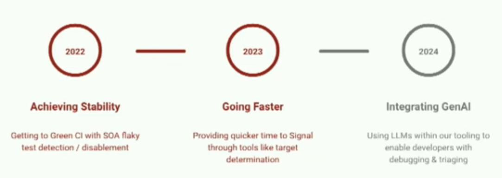

首先，我想先来介绍一下开发者基础设施的使命。在过去几年里，这个使命已经有了一些变化，我认为未来也会有所变化。所以首先，2022年我们的重点是实现稳定，比如CI都是绿的。

我们希望确保我们能够整合一些关于测试不稳定性检测和禁用的内容，以确保我们的开发人员获得最可靠的持续集成（CI）。今年，我们的主要关注点是变得更快。我们如何通过目标确定、测试重排等方式提供更快的响应时间？我们使用很多启发式方法来确定要运行的测试。

最后，我认为展望未来，我们真正尝试做的是整合llm。这就像是炙手可热的新趋势和新疯狂的事情。因此，我们希望能够找到如何在我们的工作负载中使用它，并提高开发人员的生产力。我们认为，实际上这些用例中的一些甚至可以适用于PyTorch以外的领域。

因此，在尝试创建开发者基础设施时，我们遵循一些高层次的目标。首先，我们希望对测试基础设施有高度的信心和信任。

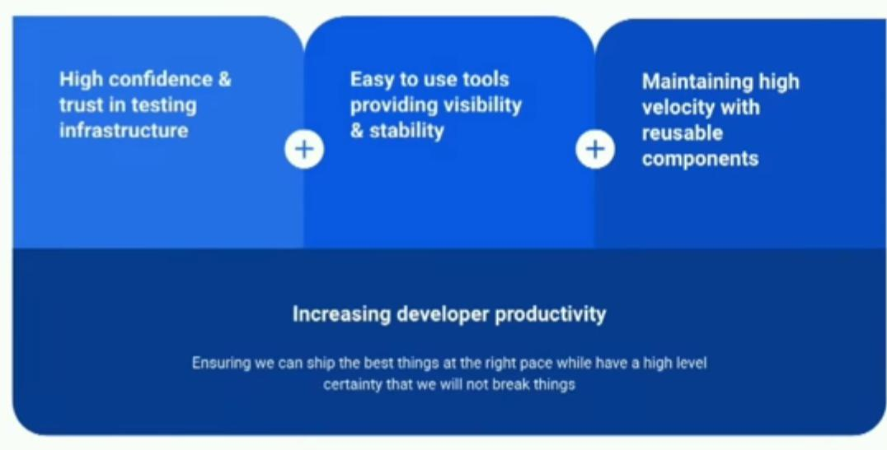

我们发现，当人们对我们的测试基础设施有这种信任和信心时，他们通常能够更快地提交PR。同时，我们希望提供易于使用的工具，提供可见性和稳定性。明白吗，你可以看到你的signal，通常可以得到更好的结果。归根结底，我们还希望以可重用的组件保持高速度。所以，如果你有一个可以在许多不同地方重用的组件，可能是通用的，我们也希望能够做到这一点。最重要的是，所有这些都有助于提高开发人员的生产力。因此，确保我们能够以高度的信心保持高速度。

接下来是有趣的部分，我们将介绍一些我们建立的工具。并且我要注意的是，所有这些工具都是开源的。Sergei在他关于TorchFix的讲话中提到的测试信息仓库包含了所有这些工具的代码。所以如果你对将这些投入使用感兴趣，可以去查阅该仓库。

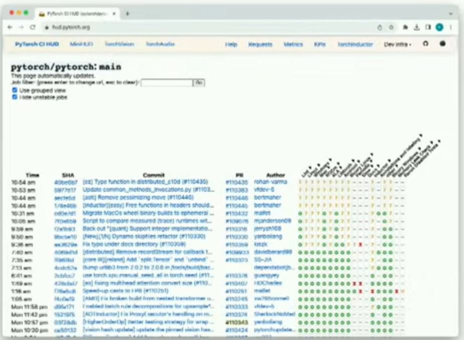

我们的codebase，你们也可以自己写代码，同样可以这样做。hud.pytorch.org是我们的旗舰工具。这是大多数开发人员与此信号进行交互的工具。通常来说，历史上它被用作一种当出现故障时可以查看的报警工具。

这是我们的时间轴视图，显示了所有提交到PyTorch主分支的提交。我们可以看到所有的信号随着它们的推出而出现。通过这个工具，我们还可以控制PyTorch开发人员可能拥有的开发者体验。即使我们过渡到不同的CI系统，无论是CircleCI还是GitHub Actions，我们始终有HUD来告诉人们他们的信号实际是什么。

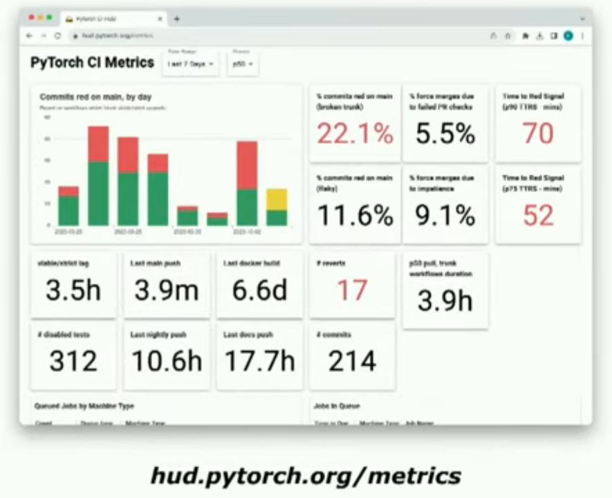

我们还收集了大量的指标。我对这个说法非常有信心，我们可能收集了有关任何现有开源项目的RCI最多的指标。实际上，我们为您在PyTorch组织中在GitHub上的每一次交互收集了大量的指标。我们使用这些指标来指导我们的决策，并向用户展示CI上正在发生的情况。

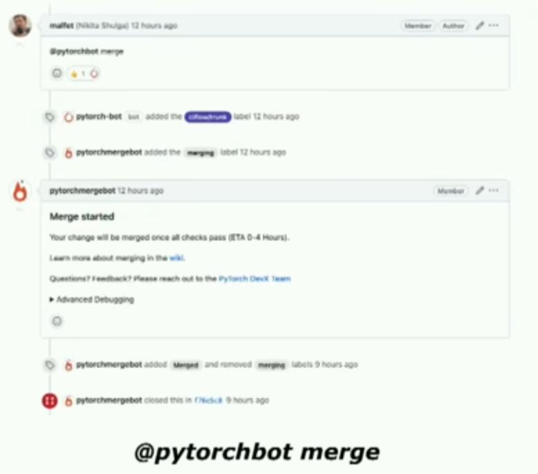

另一个重要变化是PyTorch bot merge。如果您曾经为PyTorch做出过贡献，我相信您一定见过这个。在历史背景下，PyTorch组织的工作方式是，您提交了一个PR，这个PR会合并到Facebook的monorepo中，然后再发布到github。但现在我们可以直接在github上合并，这是一个很好的创新。其中一个更好的方面是，我们实际上实现了一些GitHub还没有引入的特性，如merge on green。此外，我们还可以选择性地禁用或忽略一些不稳定的测试，这将是我接下来要谈论的内容。*片状测试* Flaky Tests检测与禁用。在过去的一年中，我们做了一些非常棒的工作，特别关注这个系统。

所以它的工作原理是，每当一个PyTorch CI测试运行时，如果测试失败，它会运行多次。如果它通过了几次测试然后又失败了几次，那显然这是一个不稳定的测试，我们将全局禁用它。

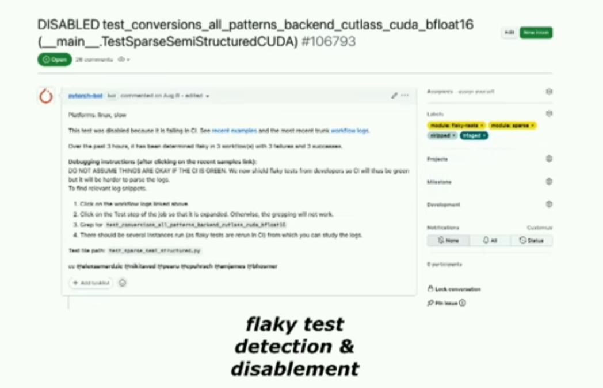

这个系统的好处是，你实际上不需要修改代码来禁用测试。一旦发布了GitHub问题，这个测试就会被禁用，所有后续运行将自动禁用该测试。还有一个很酷的功能是，我们每天有一个测试运行，测试所有可能不稳定的测试，以确定它们是否还不稳定，一旦它们达到稳定状态，将自动重新启用它们。

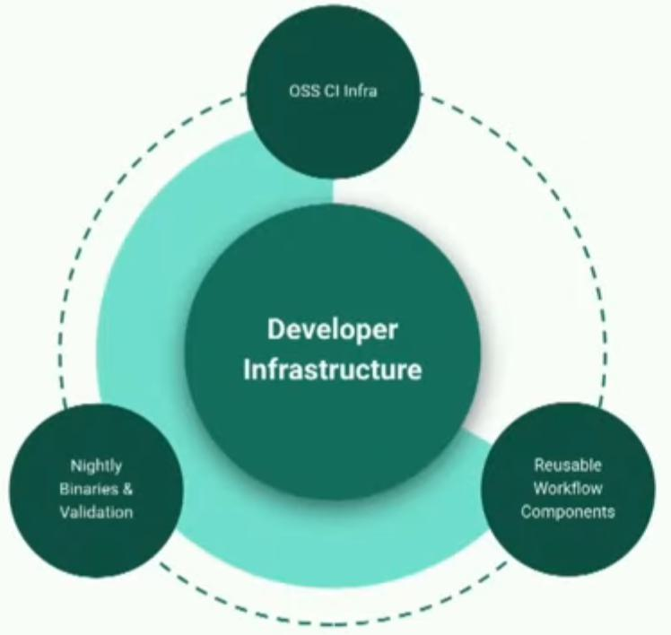

还有三个对于开发者基础设施非常重要且我想重点关注的方面。OSS CI Infra基本上是所有CI作业运行的地方。这是一个大约有3500台机器的集群，每天都会达到最高峰，测试每一个进入PyTorch的代码更改。

由于PyTorch具有如此广泛的硬件需求和操作系统需求，显然运行所有这些任务的基础设施将非常多样化。我们付出了很多工作来构建OSSCI基础设施。我们需要满足不断增长的AI社区的需求，因此我们努力做到这一点。我们有可重用的工作流组件。我们明白编写机器学习框架的人不一定是写最好持续集成（CI）的人。因此，我们希望能够确保我们拥有一组可重用的工作流组件，这组件可以做很多事情，比如设置GPU、设置CPU，设置Python环境，并允许他们以最简单的方式为他们的CI编写脚本。我们还有一组夜间二进制文件和验证工作。在自动化这部分上我们投入了很多工作。现在我将把话题交给Omkar

谢谢Eli。大家好，我是Omkar，是Meta的软件工程师，负责PyTorch DevInfra团队。

Eli刚刚谈到了我们为了改善PyTorch开发者体验而建立的一些工具。除此之外，开发者基础设施还包括将正确、健康且高性能的PyTorch版本交到用户手中。实际上，我们的发布规模相当大。


每天晚上，我们大约有500个构建、测试和上传工作流在运行，这个数字非常庞大，因为我们要支持跨不同Python版本、不同CUDA版本、Rockham用于AMD GPU支持、不同操作系统和CPU架构等各种矩阵的构建。我们并不仅仅发布PyTorch，而是发布整个生态系统，其中还包括约10个其他生态系统项目。因此，按照整年来的推算，我们发布大约20万个二进制文件。之前我们做这个时，逻辑分散在不同的生态系统库中，我们在平台方面也没有任何标准化措施。

需要支持，所以这使得发布变得非常困难。因此，我们着手改变这一点。我们所做的是，在GitHub Actions的基础上创建了这些模块化可重复使用的工作流。

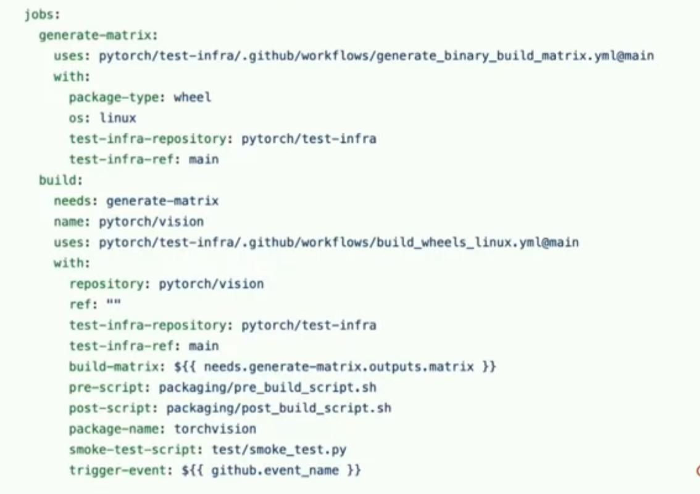

这样做的动机是让PyTorch生态系统中的任何现有或新项目，在大约20行代码中即可开始使用CI/CD，就像这里的工作流一样。因此，这对您来说有什么作用呢？它使您可以选择您想要构建的特定平台。它为您设置了一个干净的构建环境，以及其他类型的二进制文件。它支持自定义预构建或后构建步骤的钩子，以及您可能希望运行的任何任意烟雾测试以验证二进制的有效性。然后将其上传到所选的渠道。通过这种方式，任何库都可以相对快速地开始使用其CI/CD，与整个PyTorch生态系统保持一致，并且基本上具有无需操作的过程，用于运行其夜间发布和正式发布。这只是一个新项目所有者的界面提示。但实际上是怎么运作的？

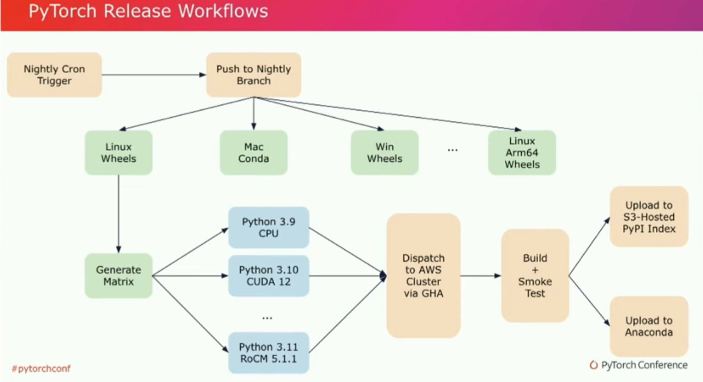

我们有一个每晚定时触发器，它的作用是将前一天在特定项目中进行的所有提交压缩为一个提交，并将该提交推送到每晚的分支上。这样就会触发在上一张幻灯片中定义的一系列工作流程。配置文件允许您选择各种不同的平台，特别是操作系统和软件包类型。因此，我们支持Linux、Mac M1和Windows的wheels和conda构建，以及对Linux ARM64 wheels、iOS和Android二进制文件的新支持。每个作业都会触发矩阵生成。矩阵生成实际上指定了该平台需要支持的Python版本、CUDA和Rackham版本，并为每个子作业创建子作业。这些子作业通过GitHub Actions启动到我们的自托管AWS集群上。

每个子作业还有自己独特的硬件要求。例如，为了构建GPU二进制文件，Linux的构建作业将需要一个带有GPU的实例。Windows机器的构建作业将需要Windows实例，依此类推。因此，我们的自建集群支持所有这些不同的SKU。我们维护的逻辑集群将运行整个生态系统的CI作业和基准测试作业。一旦这些作业启动，它们将进入集群。这些机器已经预先配置了适当的自定义AMI。对于Linux作业，我们还构建了自定义的Docker镜像，并且所有的构建和测试都在这些容器中进行。二进制文件被构建和验证。对于conda二进制文件，它们被上传到我们的Anaconda PyTorch每夜频道。对于wheels二进制文件，它们被上传到我们的自建PyPy索引，该索引由同一AWS集群上的S3支持。这是download.pytorch.org网站的后端，您们可以使用。

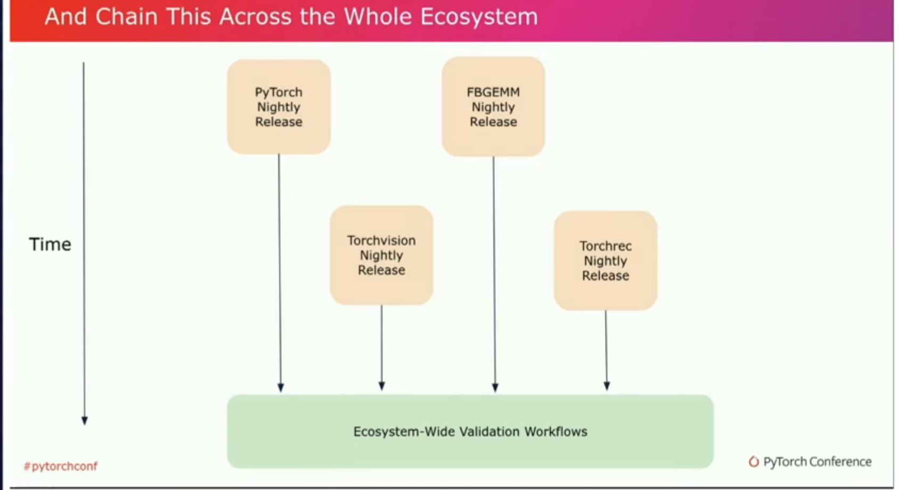

所有这全部是针对一个存储库的，我们必须在PyTorch生态系统的每个仓库中进行这些操作。我们还需要以依赖感知的方式来进行这些操作。例如，针对某一天的torch vision夜间版本将依赖于PyTorch夜间版本。因此，我们需要确保在开始进行torch vision构建之前，已经构建、测试和上传了nightly版本。因此，所有这些构建都是以依赖感知的方式交错进行的。一旦它们都被构建、测试和上传，我们会将它们获取到生态系统范围的验证工作流中，运行元数据检查并确保所有这些二进制文件能够正常工作。

这就是PyTorch二进制文件是如何构建和发布给我们的用户的故事。通常情况下，成功率非常高，如果出现任何问题，我们相信您会提出GitHub问题并让我们知道。所以，这一切都很好，对吧？我们有工具可以让在这个大型复杂项目上进行的开发更加容易。我们有明确定义的持续集成和持续部署系统。我们基本上有一个相当自动化的过程，将PyTorch提供给我们的用户，无论是夜间版本还是官方发布版本。在关于大型语言模型在软件工程应用中的活动和研究也非常多。

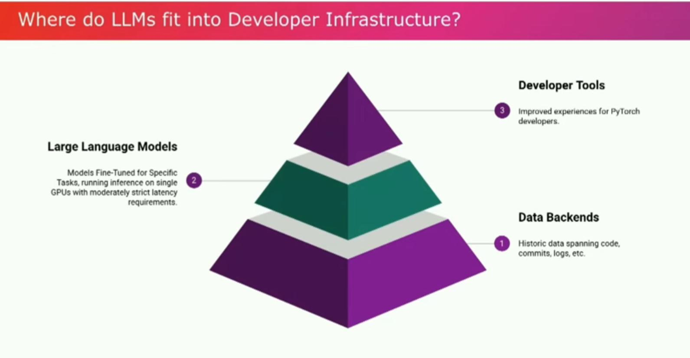

在会议的其余部分，你将了解到PyTorch正在推动许多创新。我们正在思考如何闭环运用LLMs来改进PyTorch，特别是PyTorch的开发体验。我们有很多有趣的数据需要依赖，包括日志、元数据等等。有很多模型，比如Code Llama，在代码上表现出色，经过代码微调后，在代码补全和多行填充等方面也非常好。它们相对较小，因此可以在单个GPU上进行推导，并满足严格的延迟要求。

我们的想法是使用这些数据以及针对特定任务进行微调的模型，为PyTorch开发人员提供更好的开发体验。所以让我提供一些问题来激发，一些数据来激励我们所面临的一个具体问题。每次对PyTorch PR进行推送时，我们运行约230万个测试。现在这是一个非常大的数字，对吧？在我们拥有的支持矩阵中，有很多测试都是重复的。


因为这个原因，任何开发人员要想要得到有关他们的PR的任何更改信号的话，大约需要四个小时的时间。这导致了在你的代码迭代过程中体验相对较差。我看到大家都在点头，所以我猜大家都遇到了这个问题。所以这就是开发人员的体验角度。如果我们将这个数字推算到整个年度，我们在PyTorch CI上运行了大约一万亿次测试。直觉上，并不是所有的更改都需要进行测试。所以很明显我们运行了过多的测试。那么我们如何能够从所更改的代码中获取一些信息，并用它来确定哪些测试是相关的呢？这种做法被称为目标确定，对吧？我们是否可以根据所更改的代码来确定哪些测试是相关的？PyTorch架构对于开发者使用非常有帮助，对于构建新功能也是非常有帮助的，但对于传统的目标确定来说却相对较差。这涉及到了很多生成的代码，模块之间复杂的相互依赖，以及跨越不同模块的代码Python和PyBinding到C ++，CUDA等等。

```Plain Text
- PyTorcharchitecture is good for developer usage,
but bad for traditional target determination
- PastAttemptsdidnotworkwellforPyTorch's
codebase
Hard-CodedRules
Explicit Dependency Graph
PastFailureRates
```

传统的目标确定一直非常困难。关于是否对一个特定模块进行更改不应该运行另一个模块的测试的硬编码规则，或者使用类似Buck或Bazel构建系统的显式依赖图，甚至使用过去的故障率，但它们都存在一些问题，我们不得不撤销这些变化。

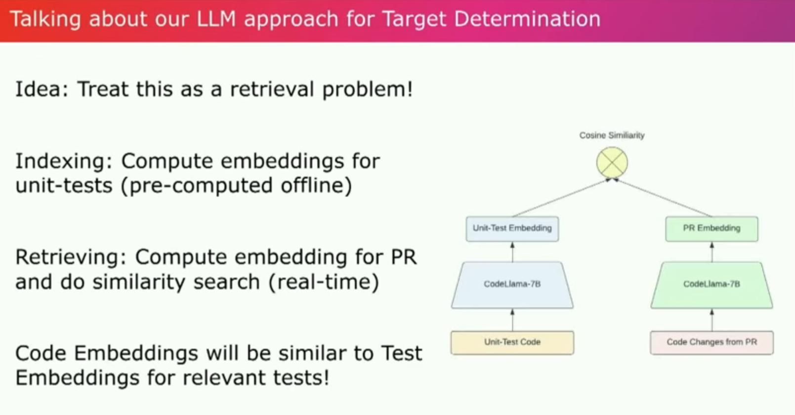

我们可以把这个看作是一个信息检索的问题吗？我们看一下通常用于搜索应用的传统两塔模型方法。而不是试图使用用户提供的查询来搜索相关文档。我们获取PR中的代码更改并用它来搜索...因此，我们使用了Code Llama 7B并解析PyTorch代码库的AST以识别所有单元测试函数和它们传递调用的所有函数。然后使用Code Llama为每个单元测试函数生成嵌入式代码。因此，我们拥有了所有单元测试嵌入的索引。当有新的PR提交时，我们运行相同的AST解析。

我们解析了PR中所有被更改的函数。使用同样的模型为这些函数生成嵌入，然后可以使用余弦相似度等方法将它们与单元测试嵌入的索引进行比较。将最相关的测试与得分最低的最不相关的测试进行排序。最终，我们可以建立一个系统，在这个系统中，我们开始过滤掉最不相关的测试，并随着时间的推移，可能只运行最相关的测试。这既减少了持续集成的负荷，也减少了开发的信号时间。而且，这项工作的初步结果非常有希望。不过，它在检测测试方面表现得很好。

它标记的那些在多个样本PR中被认为是最不相关的测试，实际上与实际的更改无关。索引和检索都在非常合理的时间范围内完成。我们在一次改动上进行了测试。

```Plain Text
ChangedFunction:torch/distributed/fsdp/fully_sharded_data_parallel.py:FullyShardedDataParallel._init
Top5MostRelevantTests
Score:0.83203125;Test:test/distributed/fsdp/test_fsdp_use_orig_params.py:TestFSDPUseOrigParamsNoSync
Score:0.8359375;Test:test/distributed/fsdp/test_fsdp_use_orig_params.py:TestFSDPUseOrigParamsMultipleParamGroups
Score:0.8359375;Test:test/distributed/_composable/fully_shard/test_fully_shard_compile.py:TestCompile
Score:0.83984375;Test:distributed/fsdp/test_fsdp_hybrid_shard.py:TestFSDPHybridShard
Score:0.85i5625;Test:test/distributed/fsdp/test_fsdp_fine_tune.py:TestFSDPFineTune
```

这是一个改变了Torch.distributed完全分片数据并行或FSdP的PR。实际上，它改变了该模块的init函数。我们发现被标记为最相关的所有测试都是FSdP测试。而所有被标记为最不相关的测试都来自ONNX、JIT、Functorch、NameTensor。事实上，它们与这个改变无关。我们正在继续迭代，剪枝出不相关的函数，并为生成嵌入提供关于调用栈和依赖关系的上下文，可能还会对嵌入进行降维处理。我们计划将其应用于一小部分用户选择加入的PR上，以收集关于模型的性能好坏的数据。

因此，将其与我们对LM的整体愿景联系起来，快速索引和检索时间是在对整个系统进行广泛优化后实现的。我们正在努力向上游推进一些改进，例如在使用Code Llama作为嵌入模型时禁用KV缓存，在模型中高效地检索任意层的中间激活。

```Plain Text
Optimizee2e system to run fast inference per-PR

LLMs are apart of the solution but not theonly
solution
- Many more use-cases in the pipeline
- Identifying exact error line in large logs
- Flakiness detection and error suppression
```

因此，目标不仅是改善PyTorch开发者的体验，但也是找到改进pytorch及其相关代码库的机会。我们也看到LLM是整个系统的一部分。但不一定是整个答案。它们可以与像过去的失败这样的启发式方法相结合。有一些研究关于使用测试相关性的内容，可以确定哪些测试经常一起通过或一起失败，这可以与我们从LLM驱动的方法得到的分数相结合。

我们还有一些潜在的使用场景，llm可以提供体验的改善。比如，在一个大的日志中识别出确切的错误行，尤其是在运行那么多单元测试的PyTorch中，你可能会得到千字节、兆字节的日志。因此，这是一个具体的体验改善，或者找出一个作业是不稳定的还是稳定的，对吗？通常情况下，在您的PR上会有一个完全无关的失败或者阻止发布，这会阻碍您的快速迭代。但是，您知道，我们过去尝试过使用其他方法来解决这些问题，比如各种单纯拒绝，重试、相似性搜素等；我们结合llm和过去方法加入一些上下文信息，我们希望这些产品可以为大家提供更本质上的开发者体验改进，谢谢。
