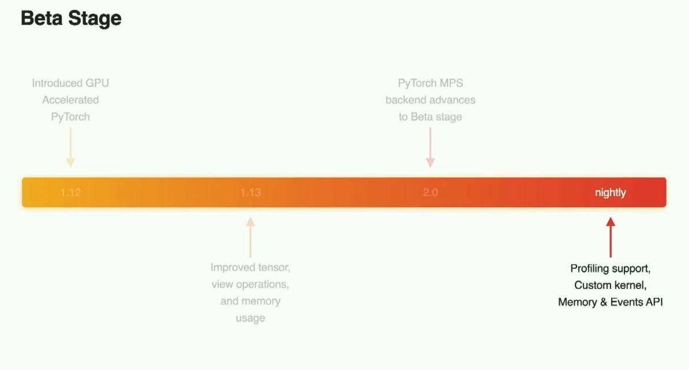
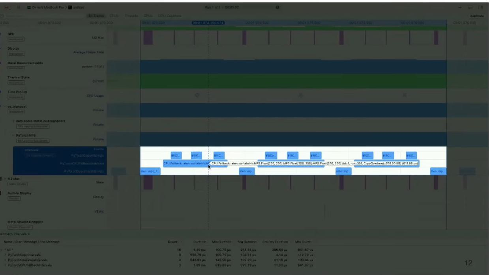
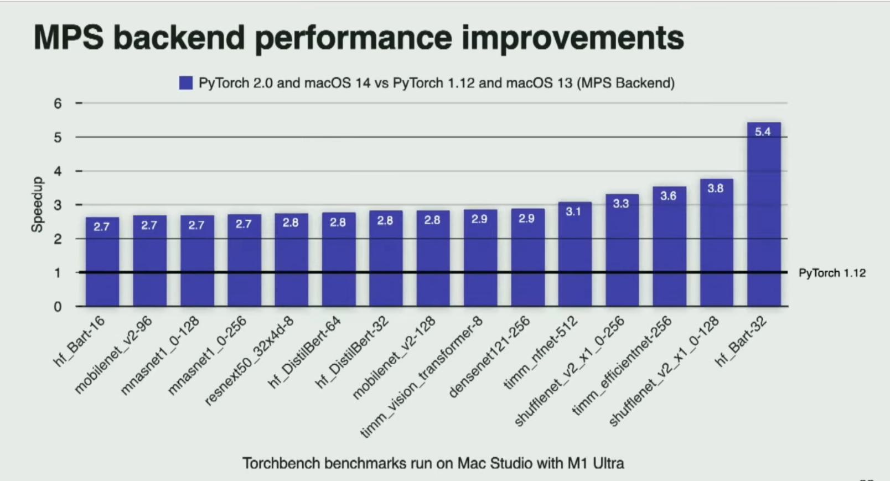

## 大纲

1. MPS后端升级到beta版本

2. MPS后端新功能

3. MPS后端性能提升

4. 自定义操作支持

## 详细要点

### 1. MPS后端升级到beta版本

- 支持60+算子

- 测试覆盖率和模型支持提高

### 2. MPS后端新功能

- 性能分析支持

- 自定义算子支持

- 开发者API

### 3. 自定义操作支持

- Objective-C实现

- Python封装

- 在模型中使用

### 4. 性能提升

- 典型模型速度提升

- 内存管理API

- 自定义操作避免CPUfallback

### 5. MPS后端性能提升

- 多数算子速度提升2-3倍

- 内存管理优化

大家好，我叫Kulinseth，我在苹果的MPS团队工作，今天我将讨论PyTorch中MPS后端的改进。接下来，我将介绍MPS后端进入Beta Stage的新功能。我们添加了一些新功能，如支持分析器、自定义内核和MPS开发者API，这些都是MPS后端的新特性。

```Plain Text
Beta Stage
New features:
-Profiler
-Custom Kernel
-Events & MemoryAPI
Performance
```

之后我们还会介绍自去年发布以来MPS后端的一些性能改进。现在，让我们从beta stage开始。回顾一下，MPS后端是在去年的PyTorch 1.12中开始的旅程，当时我们在Mac平台上推出了支持GPU加速的PyTorch。我们对内存使用和新张量进行了多次优化。在PyTorch 2.0中，MPS backend对于beta stage来说已经合格。这意味着我们支持了前60个最常用的运算符，测试覆盖面大大提高；随着多个常用模型采用了这个后端作为macOS的默认后端，network覆盖面也得到了扩展。但这些并不是我们所做的全部改进。



在最新的PyTorch构建中，支持了一些新功能，并且我们在持续不断地进行改进，例如支持分析功能、自定义内核以及一些开发者API。

```Plain Text
Community engagement:
index_fill /histogram/ copysign/log_sigmoid / xlogy/ pixel_shuffle / hypot/
fmax / fmin / roll / hardsigmoid / logit / nansum / remainder/group_norm/mean_var/median/
repeat_interleave/cumsum/signbit/nansum/frac/masked_select
```

开发者们不仅在extend网络中采用了PyTorch MPS后端，还贡献了代码，将许多新的操作符添加到我们的代码库中，例如group_norm、histogram、pixel_shuffle等等。

```Plain Text
os signposts
- Operation executions
- Copies between CPU and GPU
- Fallbacks to the CPU
Metal System Trace
Command line tool
```

现在让我们来讨论一些添加到MPS后端的新功能。首先是profiler支持，这是通过使用IOS中的OS signposts功能实现的。它可以突出显示在MPS后端上执行的操作，以及在CPU和GPU之间切换的情况以及一些回退到CPU的操作。要使用profiler，我们有一个简单的示例，我会进行演示并介绍一些需要启用该功能的API。它已经整合到了 Metal System Trace 中，并且还有一个命令行工具供开发者使用。

```Python
import torch
from torch import nn

model = nn.Sequential(
    nn.Linear(784, 256),
    nn.Softshrink(),
    nn.Linear(256, 256),
    nn.Softshrink(),
    nn.Linear(256, 256),
    nn.Softshrink(),
    nn.Linear(256, 10)
).to("mps")

torch.mps.profiler.start(mode="interval", wait_until_completed=True)
# Your model code goes here
torch.mps.profiler.stop()
```

现在让我们来看一个使用Linear和Softshrink的Sequential模型组成的简单样本网络。这只是一个简单的例子。你可以直接在PyTorch中将其实现，但我将使用它来说明我们可以如何做。我们可以使用MPS分析工具中启用的开始和停止API，并采用不同的模式来捕获标识信息。



结果是，您可以获得一个使用所有系统标识信息的系统跟踪，可以使用一个称为Metal System Trace的工具进行可视化。它除了包含其他大量的信息之外，还包括我们作为PyTorch的一部分启用的标识，以及在时间线上显示的其他内容。

在这里它突出显示了Blitcall，您可以看到回退到CPU的情况，以及实际在MPS上执行的操作。这使得您可以开始检查您的网络。正如您在这里所看到的，Softshrink在我们捕获的时候，正回退到CPU。


此外，对于希望快速查看应用程序花费最多时间的操作的开发人员，我们还提供了一个命令行工具的功能。如图所示，通过使用环境变量，您可以输出有关每个层的信息，例如数据类型。并且它允许您快速审查他们的应用程序。现在，继续我们之前的示例，我们看到Softshrink操作在回退到CPU，这在GPU时间线上留下了一个很大的间隙。为了改善性能，其中一种方法是添加一些自定义内核支持。


编写自定义操作有三个步骤。首先在Object2C中实现操作以便在metal中查看。然后创建Python绑定并构建您的扩展。在构建扩展之后，您可以将该操作导入到您的应用程序中并开始使用它。所以让我们从操作实现开始。代码很多，但我会从头开始解释。

```Plain Text
#include <torch/extension.h>

torch::Tensor mps_softshrink(const torch::Tensor& input, float lambda = 0.5) {
    // Get a reference of the MPSStreamMTLCommandBuffer and dispatch_queue_t
    id<MTLCommandBuffer> commandBuffer = torch::mps::get_command_buffer();
    dispatch_queue_t serialQueue = torch::mps::get_dispatch_queue();
    
    dispatch_sync(serialQueue, ^{
        // Create the encoder
        id<MTLComputeCommandEncoder> computeEncoder = [commandBuffer computeCommandEncoder];
        
        // Encode the pipeline state object and its parameters
        [computeEncoder setComputePipelineState:softShrinkPsO];
        
        torch::mps::synchronize();
    });
}
```

首先导入torch扩展头文件，这其中包含撰写C++扩展所需的所有PyTorch部分。这里有一些我们已经公开的API，以实现自定义功能。这个"get command buffer MPS backend API"是用来获得对MPS流命令缓冲区的引用的。这个命令缓冲区与我们在后端用来编码工作的命令缓冲区是相同的。您所做的工作与我们正在进行的工作是相同的。它的优先级很高，这使得您可以使用像"commit and continue"这样的优化来减少CPU方面的开销，这个在去年的演讲中讨论过。我们有这个"getDispatchQueue API"来获取对串行队列的引用。使用获取到的命令缓冲区创建一个编码器，它允许您定义自定义GPU内核。您使用调度队列来对内核进行编码，以确保来自多个线程的提交被序列化。在编码完成所有工作后，使用"synchronize API"直到命令缓冲区完成。或者，如果您不需要序列化，可以使用"commit API" `torch::mps::commit`。这允许您在内部继续进行操作。

```Plain Text
#include <torch/extension.h>

torch::Tensor mps_softshrink(const torch::Tensor& input, float lambda = 0.5) {
    // Function implementation goes here
    // ...
}

PYBIND11_MODULE(TORCH_EXTENSION_NAME, m) {
    m.def("mps_softshrink", &mps_softshrink, "Apply MPS Softshrink operation");
}

// Compiling the extension
import torch.utils.cpp_extension

compiled_lib = torch.utils.cpp_extension.load(
    name='CustomSoftshrink',
    sources=['CustomSoftshrink.mm'],
    extra_cflags=['-std=c++17']
)
```

在自定义内核支持的第二步中，您可以使用"Pybind11"来绑定Objective-C。以类似的方式将函数集成到Python中。通过使用CPP扩展，您可以构建自定义软共享库，该库可以包含在您的应用程序中。

```Plain Text

from my_build import compiled_lib
from torch import nn

class MPSSoftshrink(nn.Module):
    def __init__(self, lambda_=0.5):
        super(MPSSoftshrink, self).__init__()
        self.lambda_ = lambda_

    def forward(self, input):
        return compiled_lib.mps_softshrink(input, self.lambda_)

model = nn.Sequential(
    nn.Linear(784, 256),
    MPSSoftshrink(),
    nn.Linear(256, 256),
    MPSSoftshrink(),
    nn.Linear(256, 256),
    MPSSoftshrink(),
    nn.Linear(256, 10)
).to("mps")
```

最后一步，自定义构建库已经准备好在您的应用程序中使用。我们已经取代了之前速度较慢且降级到CPU的Softshrink。这是您定制的MPS收缩库。现在，在新增的自定义内核支持下效率更高。所有通过回退到CPU创建的副本和中间张量都已经消失，模型运行速度更快。

```Plain Text
import torch.mps

# 创建开始事件并记录
start_event = torch.mps.Event(enable_timing=True)
start_event.record()

# 在GPU上进行一些训练操作
# ...

# 创建结束事件并记录
end_event = torch.mps.Event(enable_timing=True)
end_event.record()

# 计算持续时间
duration = start_event.elapsed_time(end_event)

# 设置内存分配的比例，限制进程在 MPS 设备上的内存分配
torch.mps.set_per_process_memory_fraction(0)
```

还有一些附加的API，可以在记录、等待和流逝时间等事件上进行事件管理和创建自定义计时操作。对于MPS分配器的API，如设置每个进程的内存分数，使开发人员能够更加细粒度地控制后端内存操作。最后，总结一下这次演讲。让我们来看一些性能结果。如您所见，MPS后端已经得到了显著优化。


