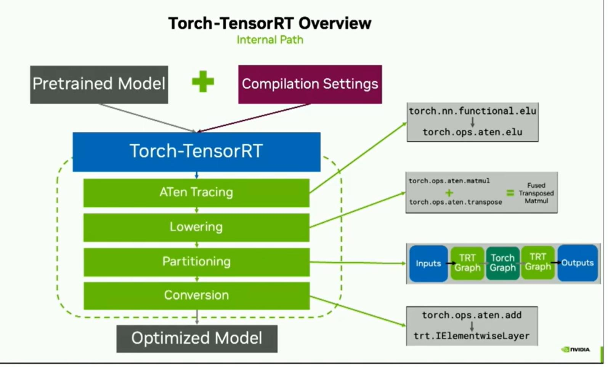
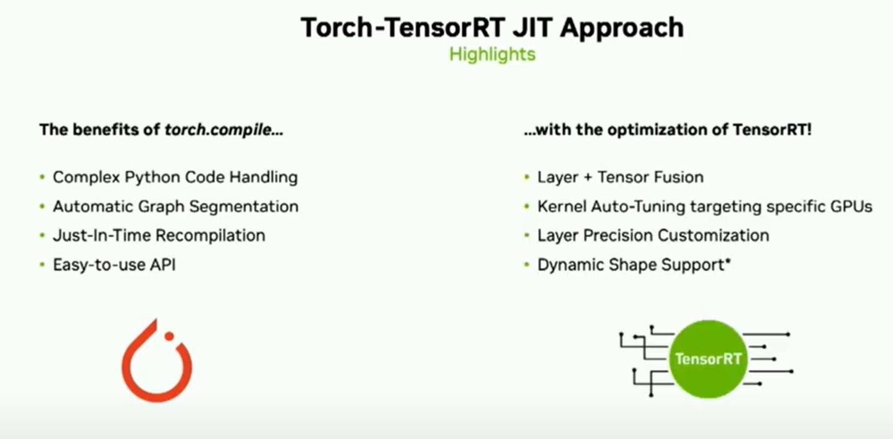
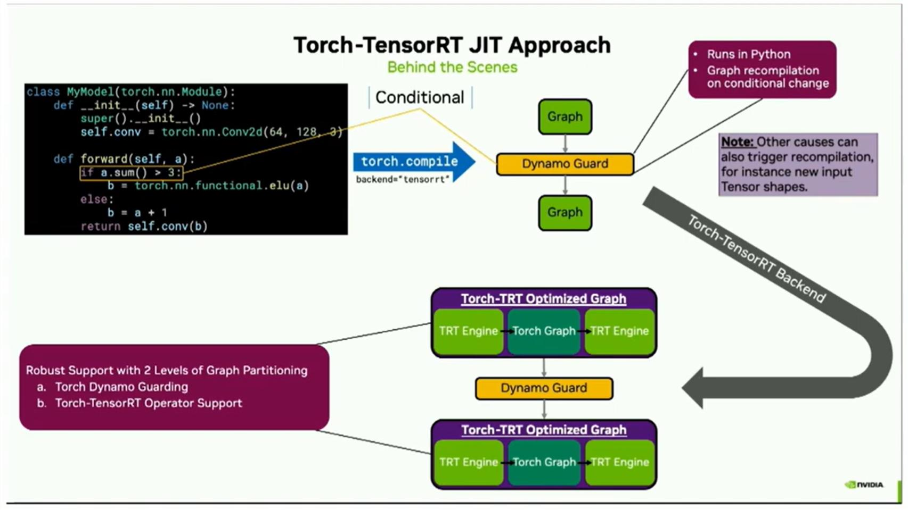
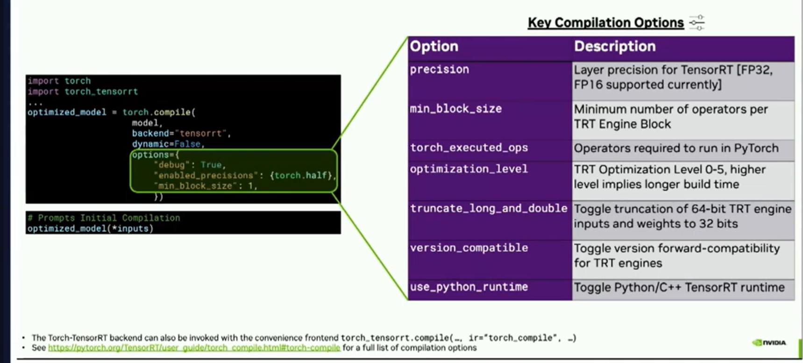
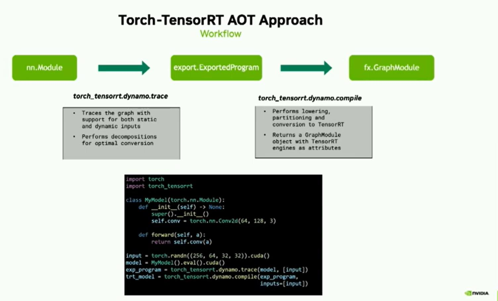
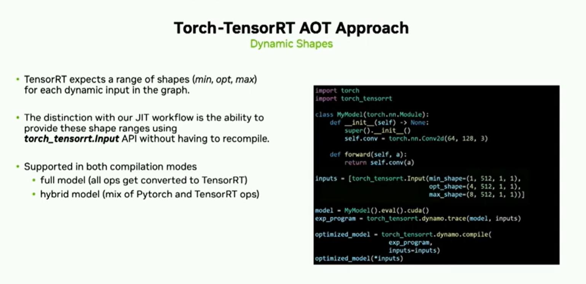
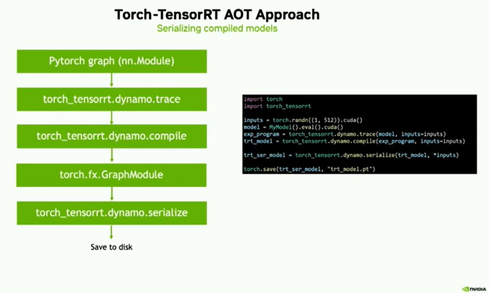
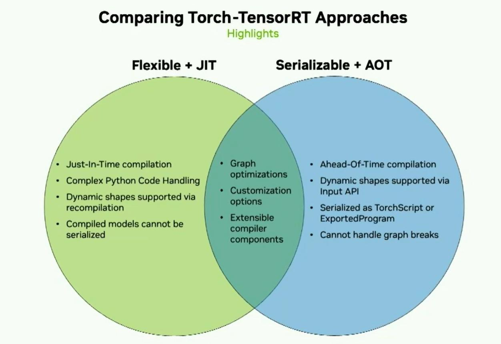

---

title: 9-使用 Torch tensorrt 加速 Pytorch 2.x 推理
keywords: ['pytorch']
---

## 大纲

1. Torch TensorRT介绍
2. JIT编译与AOT编译方法
3. 两种方法的异同点

## 详细要点

### 1. Torch TensorRT介绍

- Torch TensorRT是一个优化PyTorch模型推理性能的工具
- 它结合了PyTorch和NVIDIA的TensorRT

### 2. 两种编译方法

- JIT编译:灵活,支持动态图和Python代码
- AOT编译:支持序列化,固定输入shape

### 3. 编译流程

- 图转换、优化、划分、TensorRT转换
- 获得高性能优化模型

### 4. JIT编译细节

- 通过torch.compile调用
- 支持动态输入和条件判断

### 5. AOT编译细节

- 通过trace和compile API实现
- 使用inputAPI支持动态shape
- 支持序列化模型

### 6. 两种方法的异同

- 核心是基于同一图优化机制
- JIT支持动态,AOT支持序列化

大家好，我叫乔治。嗨，我是迪拉杰，我们都是NVIDIA的深度学习软件工程师。今天我们在这里讨论使用Torch TensorRT加速PyTorch推断。首先，我们会给大家简短介绍一下Torch TensorRT是什么，然后乔治将深入介绍我们优化PyTorch模型的用户工作流程。最后，我们将比较这两种方法，并讨论一些正在进行的未来工作。现在我将把话筒交给乔治。

那么，什么是Torch TensorRT呢？Torch是我们大家聚在一起的原因，它是一个端到端的机器学习框架。而TensorRT则是NVIDIA的高性能深度学习推理软件工具包。Torch TensorRT就是这两者的结合。我们所做的是以一种有效且易于使用的方式将这两个框架结合起来，可以适用于各种用例和模型。Torch TensorRT是优化PyTorch模型的一种路径。

我将在今天的用例中分享一些方法，包括Model performance和core implementation。这意味着，如果你有一个单一的模型，并且你用我们的两种方法之一进行优化，你可以得到相似的性能和核心软件实现。现在你可能会问，为什么我要选择其中之一？因为不同的部署场景需要不同的方法。

今天我们将介绍的两种方法是Flexible JIT方法和Serializable AOT方法。如果您的模型具有复杂逻辑，需要即时编译，并且可能需要Python严格部署，那么灵活的JIT方法可能对您来说是最好的选择。如果您需要整个图形捕获，需要对模型进行一些序列化，或者进行C++部署，那么AOT方法可能更适合您的用例。所以考虑到这一点，让我们走一遍这两个用户流程共享的内部路径。

为了优化PyTorch模型，从模型创建开始一直到优化，所以我们只需要用户提供一个预训练模型和一些编译设置。这些传递给编译器，即Torch TensorRT。现在，在这个绿色虚线框中的所有操作都是在幕后完成的，由编译器来处理。但是这有助于理解我们如何获得性能提升。

以下是一般的内部构造：

我们使用ATEN  trace将graph转换过来。实际上，这意味着我们将torch操作符转换成ATEN表示，这只是以一种稍微容易处理的方式来表示相同的操作符。之后，我们进行lowering处理，包括常数折叠和融合以提高性能。然后我们进入划分阶段partitioning。Torch TensorRT会选择运行哪些操作，哪些操作在Torch中运行，从而生成您在右侧看到的分段图形。最后是转换阶段，对于在右侧看到的每个TensorRT图形，他们从其ATEN操作转换为等效的TensorRT layer，最后得到优化后的模型。

所以在谈到这个一般方法后，即针对两种用例的一般路径,我们将稍微深入了解JIT工作流程.,Dheeraj将讨论提前工作流程.,JIT方法使您享受到了Torch.compile的好处.,其中包括复杂的Python代码处理、自动图形分割.,.,NVIDIA的TensorRT的优化能力.,层张量融合、内核自动调优，以及您选择层精度的能力.,

在该方法的浏览版中，我们能够在不到一秒钟的时间内对稳定扩散的文本到图像进行基准测试.（4090 16fp 50epoch),那么，JIT方法背后的真正原理是什么?,嗯，从一开始就开始吧.,然后用户只需要在该模型上调用torch.compile,并指定TensorRT作为后端.,现在从这里开始的一切都是在幕后进行的,.,但有助于解释正在发生的事情.

因此，在这之后，Torch.compile将会将您的模型代码进行拆分，然后是一个dynamo guard（什么是 dynamo guard？ 请参考： TorchDynamo 源码剖析 04 - Guard, Cache, Execution&#x20;
[https://zhuanlan.zhihu.com/p/630722214](https://zhuanlan.zhihu.com/p/630722214 "https://zhuanlan.zhihu.com/p/630722214")  ，可以简单理解为dynamo后到python代码的中间层），再然后是另一个graph。之所以会出现这个guard，**是因为在代码中有一个条件语句。实际上，大多数机器学习模型的跟踪器都无法处理这样的条件语句，因为这个条件取决于输入的值**。但是Torch Compile能够处理它，因为这个guard在Python中运行，并且会在条件的值发生变化时触发自动图形重新编译。

此外，还需注意其他因素也可能导致重新编译，例如如果您传入了不同形状的张量或者改变了其他参数。因此，这个graph / guard / graph构造现在进入了Torch Tensorrt后端，它将按照之前幻灯片中展示的相同过程进行处理。右上角的每个图形都会被转换为右下角您看到的Torch TensorRT优化版本。有效地将其分成TensorRT组件和Torch组件。需要注意的关键是Dynamo Guard保持完好。因为他提供了图分区的强大支持。第一级是在复杂Python代码的Python级别上。第二级是运算符级别上分区，在TensorRT中可以进一步加速的运算符以及可以在Torch中加速的其他运算符。

总结用法，用户只需对模型调用torch compile，指定后端tensorRT，并可选择一些选项，然后传递一些输入，它将实时进行编译。这种编译方法对用户来说非常可定制。您可以通过精度关键字参数选择层精度。您可以指定在TensorRT引擎块中所需的最小运算符数量，等等。

就这些，接下来就交给Dheeraj讨论AOT方法。现在让我们来看看Torch TensorRT的AOT方法。

给定一个nn module的PyTorch图形，我们首先将其转换为Exported program。Exported program是在PyTorch 2.1中引入的一种新表示形式，它包含了Torch FX图形和状态字典两部分。其中，Torch FX图形包含了模型的张量计算，状态字典用于存储参数和缓冲区。这个转换是通过使用Dynamo.trace API来完成的。此API是对Torch.export的封装，并且除此之外，它还支持静态和动态输入。我们的追踪器API还执行一些附加的分解操作，以便将您的模型优化转换为TensorRT格式。

一旦我们获得了Exported program，我们AOT方法的主要API就是Dynamo.compile。这个API将这些Exported program转换为优化的TensorRT图形模块。在幕后，这个API执行lowering、分区和转换为TensorRT的操作，这些都是我们编译器的核心组件，正如您在演示的开头所看到的。一旦编译完成，输出的结果是一个包含TensorRT图形模块的TorchFX模块。

下面的代码段列出了该API的简单用法。一旦您声明了您的模型，只需将其传递给dynamo.trace，然后是dynamo.compile，该函数将返回优化后的TensorRT图模块。

TensorRT期望图中每个动态输入都有一系列形状。

在右边的图中，您可以看到我们可以使用torch\_tensorrt.input API提供这些形状范围。与刚刚看到的jit流程的区别是您可以提供这个形状范围。这样做的好处是，如果输入形状在提供的范围内发生更改，您无需重新编译即可进行推理。静态是序列化的主要好处之一。

为了总结我们到目前为止所见到的内容，根据您的PyTorch图形，我们使用我们的trace API生成导出的程序，然后使用Dynamo.compile API进行编译。最后，您将获得一个TorchFX图模块，其中包含TensorRT优化的引擎。现在，您可以使用Dynamo.Serialize API，将这些图形模块对象转换为编程脚本或导出程序的表示形式，并随后保存到磁盘上。同样，右侧的代码片段非常易于使用。一旦您从Dynamo.compile中获得了TensorRT模型，只需使用模型及其输入调用serialize API即可。

以下是我们目前所见的内容的概述。我们能够处理复杂的Python代码。通过重新编译支持动态形状，将已编译的模块序列化。此外，我们还能够通过我们的输入API支持动态形状，并且将它们序列化为.script或导出的程序，但它无法处理任何图形断点。

然而，这两者之间存在一些重要的相似之处。它们都经历类似的图形优化以进行高性能推断。Torch TensorRT在PyTorch框架中以两个关键路径提供了优化的推理方式。

结论和未来工作 &#x20;
Torch-TensorRT通过两个关键路径在PyTorch中提供了优化的推理：

- 对于JIT工作流和复杂模型，采用基于torch.compile的方法
- 对于AoT工作流和序列化，采用强大的基于Exported program的方法

未来的工作：

- 在两个路径上提供对动态形状的全面支持
- 改进对编译Exported program的序列化支持
- 通过支持额外的精度和优化，提高模型性能
