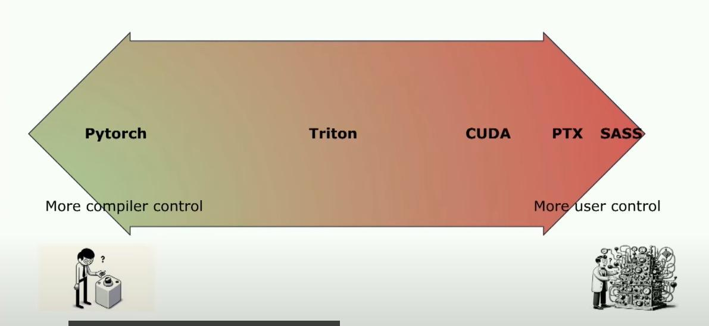
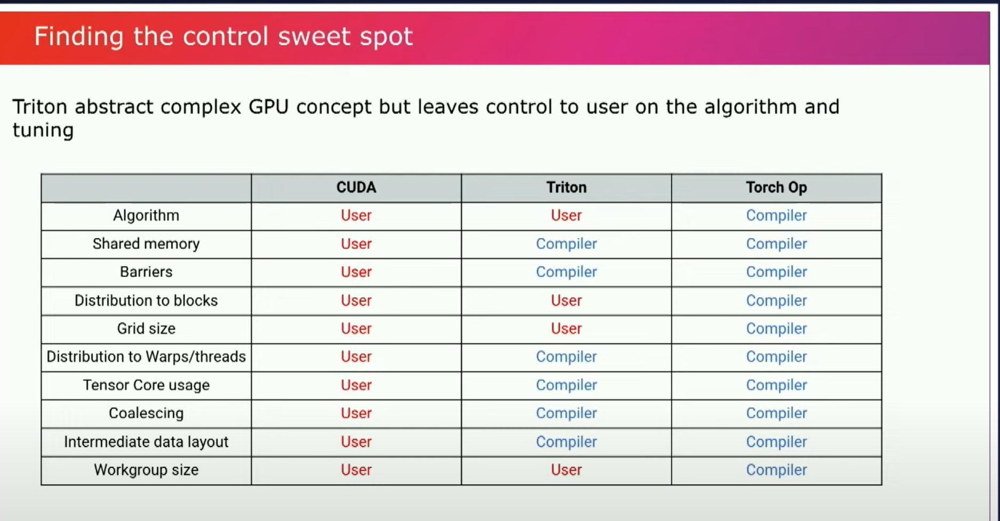
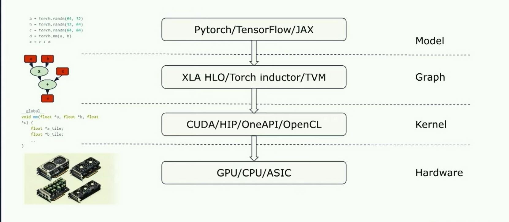
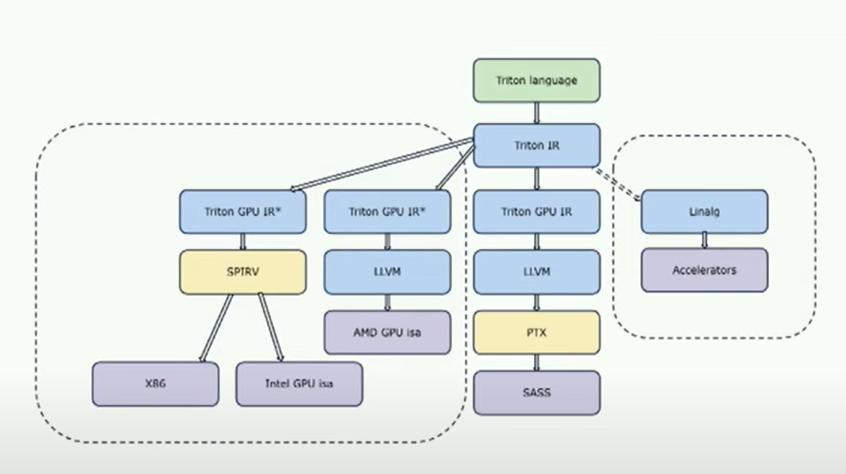
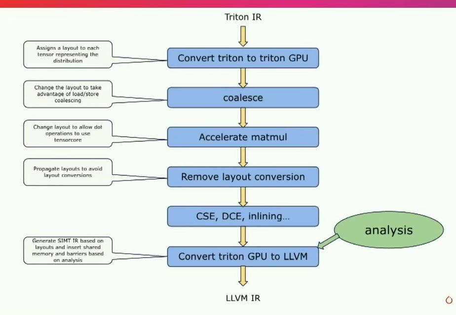

Triton编译器 Thomas Raoux，OpenAI

​[https://youtu.be/AtbnRIzpwho?si=-lB1VI-SE3hEbVT4](https://youtu.be/AtbnRIzpwho?si=-lB1VI-SE3hEbVT4)

Triton是一种用于编写高效自定义深度学习原语的语言和编译器。Triton的目的是提供一个开源环境，以比CUDA更高的生产力编写快速代码，但也比其他现有DSL具有更大的灵活性。Triton已被采用为Torch inductor的基本组件，以合成针对GPU的高效内核。与传统库使用相比，这具有多种优势。它允许创建各种各样的融合，它可以独立调整，并且它的内存占用更小。本次演讲将介绍Triton编译器，并描述使其能够以最少的用户努力生成闪电般快速内核的过程。

## 大纲

1. Triton背景介绍

    - 研究人员编写高性能GPU代码的难点

1. Triton的目标和意义

    - 帮助研究人员轻松编写高性能ML内核

1. Triton技术实现

    - 编译器架构:前端、中端、后端

    - 中间表示Triton IR的作用

1. Triton性能

    - 和其他方式(CUDA、汇编等)相比接近底层语言性能

1. Triton使用

    - 如何集成到ML编译器堆栈

    - 作为自定义OP语言

1. 未来方向

    - 更通用、可重用

## 全文

今天我要和大家谈谈的是Triton。那么，我将要讨论的大致内容是Triton是什么？我们为什么要创建这个工具？它可以用来做什么？然后，我将讨论如何将其集成在ML编译器堆栈中。最后，我将简要介绍其背后的原理以及编译器是如何简化管理的。

**Triton是一个Python DSL（领域特定语言），旨在用于编写机器学习内核。**最初，它严格用于GPU内核，但慢慢地扩展以支持用于机器学习的任何硬件，包括CPU、ASIC等。Triton的目标是让那些没有GPU经验的研究人员能够编写高性能代码。如果你看到幻灯片底部的图表，那真的是Triton想要达到的地方。通过少量的开发工作，你可以非常接近峰值性能。


简而言之，Triton是一个帮助研究人员轻松编写高性能机器学习内核的工具，无论他们是否有GPU经验。

​当然，总是会有像CUDA或汇编语言这样的其他语言，它们能让你获得同样或更高的性能，但通常你需要对硬件有更多的了解，并花费更多的时间。为什么我们需要这种新的语言呢？如果你看看现有的选择，例如在不同的硬件上编程机器学习，有PyTorch这样的工具，它允许你轻松地将不同类型的操作映射到硬件上，并且非常容易从中获得高性能。

但问题在于你对它的控制非常有限。如果现有的操作集中没有你需要的东西，你就只能束手无策，唯一的解决办法是走向另一个极端，**例如编写CUDA或编写PTX，甚至直接编写汇编代码。但问题在于，要编写这些语言，你需要真正成为硬件方面的专家，并且用这些语言编写高效的内核可能非常棘手**。所以Triton实际上是尝试在这里找到一个中间地带，它允许用户编写高效的内核，并有大量的控制权，但又不必关心那些微小的细节。



是的，硬件的细节以及如何在特定硬件上获得性能。实际上，**设计的难点在于找到这个最佳平衡点。Triton的设计方式就是找到这个抽象的平衡点，即你想向用户暴露什么，以及你想让编译器做什么？**



编译器是生产力工具，真的……在这方面，Triton的目标是让编译器为你完成你不想做的工作，但仍然让你能够控制算法、你想要用来进行调整的任何tuning。Triton介于Cuda和Torch之间，因为你仍然可以编写自己的算法，你仍然可以控制自己的类型，你仍然需要决定是否需要以某种类型来保存中间值，你控制所有的精度。**你不必关心如何处理共享内存、在目标有张量核时使用张量核、如何很好地处理负载聚合，以便你有良好的内存访问模式。**这些人们在编写GPU内核时经常要考虑的事情。你总是要担心这些问题，或者弄清楚我的中间数据的布局是什么等等。编译器会为你完成这些工作。

让我们来看一个例子。这是一个softmax内核的示例。这是一个工作解决方案的复制品，它是有效的。

```Python
# https://github.com/openai/triton/blob/main/python/tutorials/02-fused-softmax.py
@triton.jit
def softmax_kernel(output_ptr, input_ptr, input_row_stride, output_row_stride, n_cols, BLOCK_SIZE: tl.constexpr):
    # The rows of the softmax are independent, so we parallelize across those
    row_idx = tl.program_id(0)
    # The stride represents how much we need to increase the pointer to advance 1 row
    row_start_ptr = input_ptr + row_idx * input_row_stride
    # The block size is the next power of two greater than n_cols, so we can fit each
    # row in a single block
    col_offsets = tl.arange(0, BLOCK_SIZE)
    input_ptrs = row_start_ptr + col_offsets
    # Load the row into SRAM, using a mask since BLOCK_SIZE may be > than n_cols
    row = tl.load(input_ptrs, mask=col_offsets < n_cols, other=-float('inf'))
    # Subtract maximum for numerical stability
    row_minus_max = row - tl.max(row, axis=0)
    # Note that exponentiation in Triton is fast but approximate (i.e., think __expf in CUDA)
    numerator = tl.exp(row_minus_max)
    denominator = tl.sum(numerator, axis=0)
    softmax_output = numerator / denominator
    # Write back output to DRAM
    output_row_start_ptr = output_ptr + row_idx * output_row_stride
    output_ptrs = output_row_start_ptr + col_offsets
    tl.store(output_ptrs, softmax_output, mask=col_offsets < n_cols)
```

第一个有趣的事情是这段代码相对较短。如果你用CUDA编写同样的内核，它实际需要更多的努力。我们可以注意到一些有趣的事情。例如，你可以控制如何在计算机上分配工作。多亏了这些编程思想。你可以看到，你仍然可以控制你的内存访问，因为你可以访问指针。你可以基于一些原始指针加载一大块数据。然后编译器将在后台决定将其映射到硬件的最佳方式，以及如何进行聚合，如何处理所有事情，以便这个加载将是有效的，并将分布到你的GPU的不同线程和warp上。但你不必担心这些。在底部，我们可以看到有一个归约操作，通常它会隐式地使用共享内存，但你不必担心它。编译器将确保你为其选择最佳实现，并为你使用共享内存。

之后我将讨论，如何在典型的设备上使用triton，除了内核他还可以集成到完整的graph编译器堆栈中：



Triton为你提供了一个非常容易、非常自然的从graph表示直接到实现的lowering过程，**并且它实际上允许更简单的graph表示实现**，因为你不必一次性生成一个完美的内核。你可以只生成Triton部分，然后Triton编译器将完成繁重的工作，找出如何有效地将其映射到硬件上。

**Triton可以被用作的另一个地方是它可以被用作自定义操作语言**。像PyTorch这样的工具，因为如果你陷入困境，而PyTorch中没有实现某些功能，添加自定义操作是你能够完成你想要做的事情的唯一解决方案。

让我们稍微看一下编译器架构。这是一个非常高层次的查看Triton架构的方式。



Triton被构建为一个老式编译器，包括前端、中端和后端。这里有趣的部分是这两个块，Triton IR和Triton GPU IR，它们是Triton的中间IR，这里有很多魔法发生。你可以在这里看到的另一件有趣的事情是，Triton IR真的允许你针对不同的硬件进行定位，因为Triton IR本身对于这硬件是完全无关的。如果我们放大这个有趣的部分，即基本上发生在Triton IR和最终的LLVM IR之间的事情，LLVM IR是最终的目标。



基本上，编译器首先接收Triton IR，Triton IR与语言本身非常相似。然后，编译器要做的第一件事是为描述张量如何分布到线程上的布局进行关联。这真的是编译器的核心机制，因为基于这些布局，有多种路径可以改变这些布局，并能够生成一些能够有效地映射到硬件上的东西。因此，我们会像进行coalesce一样，尝试选择一个布局，以便加载存储聚合能够高效进行。

如果机器有tensorcore，我们会尝试使用非常适合tensorcore的布局。然后，我们会尝试避免任何布局转换，应用一系列典型的编译器传递，然后在此基础上进行转换，基于分析转到llvm ir。

这是非常高层次的，但这就是编译器的工作原理。嗯，这就是我想告诉你的全部内容。Triton正在完全开源的情况下进行开发，非常欢迎贡献者。我们每个月都会举行社区会议。

Triton IR本身对硬件无关。但是，如果你把一个在目标上运行良好的内核拿过来，你可能需要重新调整它，以便在另一个目标上运行良好。
