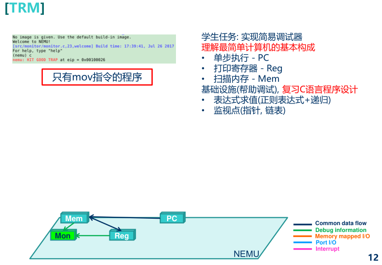

PA0比较简单，就不再重复说明。



从图上可以知道，我们的关键是要从Mon读取Mem和Reg的信息

<!--truncate-->

## PA1.RTFSC

```
apt-get install ccache
```

```
which gcc
```

可以把gcc编译结果缓存，可跳过重复的编译过程

`make -nB`, 它会让 `make`程序以"只输出命令但不执行"的方式强制构建目标

llvm推荐用PA里面说到的11先试试看，实在不行想要升级可参考：<https://blog.csdn.net/weixin_44200757/article/details/122725577>

最简单的计算机称为"图灵机"(Turing Machine, TRM)

* 结构上, TRM有存储器, 有PC, 有寄存器, 有加法器
* 工作方式上, TRM不断地重复以下过程: 从PC指示的存储器位置取出指令, 执行指令, 然后更新PC

BIOS是固化在ROM/Flash中的, 它们都是非易失性的存储介质, BIOS中的内容不会因为断电而丢失.

因此在真实的计算机系统中, 计算机启动后首先会把控制权交给BIOS, BIOS经过一系列初始化工作之后, 再从磁盘中将有意义的程序读入内存中执行. 对这个过程的模拟需要了解很多超出本课程范围的细节, 我们在PA中做了简化: 采取约定的方式让CPU直接从约定的内存位置开始执行.

在GNU/Linux中, 你可以很容易得知操作系统在背后做了些什么. 键入 `sudo dmesg`, 就可以输出操作系统的启动日志, 操作系统的行为一览无余.

你需要结合PA1 RTFSC内容来NEMU的框架代码.

如果你不知道"怎么才算是看懂了框架代码", 你可以先尝试进行后面的任务. 如果发现不知道如何下手, 再回来仔细阅读这一节

### cpu

先驱为CPU创造了一个特殊的计数器, 叫"程序计数器"(Program Counter, PC). 在x86中, 它有一个特殊的名字, 叫 `EIP`(Extended Instruction Pointer).

```c
while (1) {
  从PC指示的存储器位置取出指令;
  执行指令;
  更新PC;
}
```

### 第一项工作就是将一个内置的客户程序读入到内存中

先打开：`nemu/src/isa/$ISA/init.c`

monitor会调用 `init_isa()`函数(在 `nemu/src/isa/$ISA/init.c`中定义), 来进行一些ISA相关的初始化工作.

第一项工作就是将一个内置的客户程序读入到内存中.

1. 内存是什么？C语言中我们就很自然地使用一个 `uint8_t`类型的数组来对内存进行模拟. NEMU默认为客户计算机提供128MB的物理内存(见 `nemu/src/memory/paddr.c`中定义的 `pmem`(如果找不到看看.h内有128*1024\*1024)
2. 需要将客户程序读入到内存的什么位置？我们需要一种方式让客户计算机的CPU知道客户程序的位置. 我们采取一种最简单的方式: 约定. 具体地, 我们让monitor直接把客户程序读入到一个固定的内存位置

### `init_isa()`的第二项任务是初始化寄存器

CPU中, 寄存器是一个结构化特征较强的存储部件, 在C语言中我们就很自然地使用相应的结构体来描述CPU的寄存器结构. 不同ISA的寄存器结构也各不相同, 为此我们把寄存器结构体 `CPU_state`的定义放在 `nemu/src/isa/$ISA/include/isa-def.h`

初始化寄存器的一个重要工作就是设置 `cpu.pc`的初值, 我们需要将它设置成刚才加载客户程序的内存位置, 这样就可以让CPU从我们约定的内存位置开始执行客户程序了. 对于mips32和riscv32, 它们的0号寄存器总是存放 `0`, 因此我们也需要对其进行初始化.

CONFIG_MBASE：物理内存起始地址    RESET_VECTOR：客户程序读入的固定位置

### 物理内存的起始地址

x86的物理内存是从0开始编址的, 但对于一些ISA来说却不是这样, 例如mips32和riscv32的物理地址均从 `0x80000000`开始. 因此对于mips32和riscv32, 其 `CONFIG_MBASE`将会被定义成 `0x80000000`. 将来CPU访问内存时, 我们会将CPU将要访问的内存地址映射到 `pmem`中的相应偏移位置, 这是通过 `nemu/src/memory/paddr.c`中的 `guest_to_host()`函数实现的. 例如如果mips32的CPU打算访问内存地址 `0x80000000`, 我们会让它最终访问 `pmem[0]`, 从而可以正确访问客户程序的第一条指令. 这种机制有一个专门的名字, 叫地址映射, 在后续的PA中我们还会再遇到它.x86的物理内存是从0开始编址的, 但对于一些ISA来说却不是这样, 例如mips32和riscv32的物理地址均从0x80000000开始. 因此对于mips32和riscv32, 其CONFIG_MBASE将会被定义成0x8000000

Monitor读入客户程序并对寄存器进行初始化后, 这时内存的布局如下:

```markdown
pmem:

CONFIG_MBASE      RESET_VECTOR
      |                 |
      v                 v
      -----------------------------------------------
      |                 |                  |
      |                 |    guest prog    |
      |                 |                  |
      -----------------------------------------------
                        ^
                        |
                       pc
```

NEMU返回到 `init_monitor()`函数中, 继续调用 `load_img()`函数 (在 `nemu/src/monitor/monitor.c`中定义). 这个函数会将一个有意义的客户程序从[镜像文件](https://en.wikipedia.org/wiki/Disk_image)读入到内存, 覆盖刚才的内置客户程序.

如果运行NEMU的时候没有给出这个参数, NEMU将会运行内置客户程序.

#### 思考题1：-1参数

在 `cmd_c()`函数中, 调用 `cpu_exec()`的时候传入了参数 `-1`, 你知道这是什么意思吗?

答:参数为uint64,无符号64位整型，-1表示取最大值（整数用补码表示，负数的补码为=反码+1，正数的补码就是其原码；负数的反码为符号位不变，数值位按位[取反](https://so.csdn.net/so/search?q=%E5%8F%96%E5%8F%8D&spm=1001.2101.3001.7020)。-1的原码：1,000...0001，因此，-1的补码为1,111...111。）

#### 思考题2：谁来指示程序的结束?

在程序设计课上老师告诉你, 当程序执行到 `main()`函数返回处的时候, 程序就退出了, 你对此深信不疑. 但你是否怀疑过, 凭什么程序执行到 `main()`函数的返回处就结束了?

**main()函数结束，如何再执行代码？**

* 使用 **atexit()** 函数，来执行相关的“ 清理 ”工作The function pointed by func is automatically called without arguments when the program terminates normally.A zero value is returned if the function was successfully registered.
  If it failed, a non-zero value is returned.

几种退出函数：<https://blog.csdn.net/jinchaoh/article/details/50340743>

exit()函数用于在程序运行的过程中随时结束程序，其原型为：
    void exit(int state);
exit的参数state是返回给操作系统或当前程序的调用程序，返回0表示程序正常结束，非0表示程序非正常结束。main函数结束时也会隐式地调用exit()函数。exit()函数运行时首先会执行由atexit()函数登记的函数，然后会做一些自身的清理工作，同时刷新所有输出流、关闭所有打开的流并且关闭通过标准I/O函数tmpfile()创建的临时文件。

atexit() 用于注册终止函数(即main执行结束后调用的函数)，其原型为：
    int atexit(void (*function)(void));
很多时候我们需要在程序退出的时候做一些诸如释放资源的操作，但程序退出的方式有很多种，比如main()函数运行结束、在程序的某个地方用exit()结束程序、用户通过Ctrl+C或Ctrl+break操作来终止程序等等，因此需要有一种与程序退出方式无关的方法来进行程序退出时的必要处理。方法就是用atexit()函数来注册程序正常终止时要被调用的函数。

#### 额外思考：main是怎么开始的?

<http://wen00072.github.io/blog/2015/02/14/main-linux-whos-going-to-call-in-c-language/>

### 三个对调试有用的宏(在 `nemu/include/debug.h`中定义)

* `Log()`是 `printf()`的升级版, 专门用来输出调试信息, 同时还会输出使用 `Log()`所在的源文件, 行号和函数. 当输出的调试信息过多的时候, 可以很方便地定位到代码中的相关位置（非常好用！！！！非常推荐）
* `Assert()`是 `assert()`的升级版, 当测试条件为假时, 在assertion fail之前可以输出一些信息
* `panic()`用于输出信息并结束程序, 相当于无条件的assertion fail

内存通过在 `nemu/src/memory/paddr.c`中定义的大数组 `pmem`来模拟.

在客户程序运行的过程中, 总是使用 `vaddr_read()`和 `vaddr_write()` (在 `nemu/src/memory/vaddr.c`中定义)来访问模拟的内存.（这里已经告诉了你下面涉及问题的答案！）

vaddr, paddr分别代表虚拟地址和物理地址.

## PA1.简易调试器

简易调试器(Simple Debugger, sdb)是NEMU中一项非常重要的基础设施.

我们知道NEMU是一个用来执行其它客户程序的程序, 这意味着, NEMU可以随时了解客户程序执行的所有信息. 然而这些信息对外面的调试器(例如GDB)来说, 是不容易获取的. 例如在通过GDB调试NEMU的时候, 你将很难在NEMU中运行的客户程序中设置断点, 但对于NEMU来说, 这是一件不太困难的事情.

为了提高调试的效率, 同时也作为熟悉框架代码的练习, 我们需要在monitor中实现一个具有如下功能的简易调试器:

* (1) 命令已实现
* (2) 与GDB相比, 我们在这里做了简化, 更改了命令的格式

| 命令         | 格式          | 使用举例       | 说明                                                                                                                                 |
| -------------- | --------------- | ---------------- | -------------------------------------------------------------------------------------------------------------------------------------- |
| 帮助(1)      | `help`        | `help`         | 打印命令的帮助信息                                                                                                                   |
| 继续运行(1)  | `c`           | `c`            | 继续运行被暂停的程序                                                                                                                 |
| 退出(1)      | `q`           | `q`            | 退出NEMU                                                                                                                             |
| 单步执行     | `si [N]`      | `si 10`        | 让程序单步执行`N`条指令后暂停执行,``当 `N`没有给出时, 缺省为 `1`                                                                     |
| 打印程序状态 | `info SUBCMD` | `info rinfo w` | 打印寄存器状态``打印监视点信息                                                                                                       |
| 扫描内存(2)  | `x N EXPR`    | `x 10 $esp`    | 求出表达式`EXPR`的值, 将结果作为起始内存``地址, 以十六进制形式输出连续的 `N`个4字节                                                  |
| 表达式求值   | `p EXPR`      | `p $eax + 1`   | 求出表达式`EXPR`的值, `EXPR`支持的``运算请见[调试中的表达式求值](https://nju-projectn.github.io/ics-pa-gitbook/ics2021/1.6.html)小节 |
| 设置监视点   | `w EXPR`      | `w *0x2000`    | 当表达式`EXPR`的值发生变化时, 暂停程序执行                                                                                           |
| 删除监视点   | `d N`         | `d 2`          | 删除序号为`N`的监视点                                                                                                                |

你需要在实现一个功能之后对它进行充分的测试. 随着时间的推移, 发现同一个bug所需要的代价会越来越大.

实现步骤：

从键盘上读入命令后, NEMU需要解析该命令——利用框架代码调用单步执行——打印寄存器——扫描内存

（NEMU默认会把单步执行的指令打印出来(这里面埋了一些坑, 你需要RTFSC看看指令是在哪里被打印的), 这样你就可以验证单步执行的效果了.）

### 读入并解析

NEMU通过 `readline`库与用户交互

解析命令的工作是通过一系列的字符串处理函数来完成的, 例如框架代码中的 `strtok()`、`strlen()`, `strcpy()`、sscanf()等

readline：（使用了系统库要记得-lreadline链接）

strtok:要注意两个参数，第二个参数会被他替换成\0，第一个字符串读出后接下来的第一个参数就要用NULL替换

strtok不能保证字符串的完整，要保持字符串的完整可以用strchr和sscanf的组合。

### 表达式的实现

关键：

1. 常见的operator需要匹配
2. 留下两个冗余给指针解引用

这里我花了几天重构了（相当于重写）了一遍求解表达式的逻辑。大概消耗了一周。

第一个难点在于如何优雅的把字符串保留到token[].str中，你需要搞明白什么是结构体数组与指针（之后的静态链表也会用到！

第二个难点在于op匹配的过程中，需要如何给出op（优先级排列），这里参考了一下别人的算法（我自己的bug很多）采用了一个设计大到小覆盖的方法，能保证保留“最大”标识的符号作为op，（你从尾部开始扫描也行，换个方向覆盖符号罢了）。

第三个难点在于如何优雅的检查括号，如果你只在p和q边界检查，容易出现(1+1)+(1+1)的错误，我尝试了很多很多办法，最后用了一个i+-并且判断会不会“还没读完i就变0了”来避免这个错误。

第四个难点在于负数和指针的拦截，你需要在别的地方进行拦截，检查之前的符号。

### 监视点的实现

监视点：实际上这个是一个“能改大小”的静态链表，不需要malloc，熟悉了链表操作实际上不难（我花时间手写了一下动态链表再看这儿结构体数组一开始还有点诧异）

另一个关键是要理解static的奥义所在，实际上都是为了将这个链表隔离在该作用范围内不要被其他文件访问，所以所有的操作都要在sdb和watchpoint里进行，不要对外暴露变量，只需要暴露函数能够使得他被调用即可。这也是程序隔离的重要性所在（一开始我觉得麻烦，但减小耦合的角度来说这非常重要，要做到职责分离），所有的数据结构访问和操作都在链表的C文件中执行，也不要对外暴露；而CPU每次执行完后的检查也是通过调用链表C的头文件进行函数执行（直接执行），做到职责分离和隔离。至于包一个宏，这个通过RTFC多多尝试即可得到结果。

## Reference 【重点】

ps:最好可以掌握一些常用的C字符串标准库，如strcpy  strnpy

### gdb layout窗口

(其实也可以直接gdb xxx -tui)

layout：用于分割窗口，可以一边查看代码，一边测试。主要有以下几种用法：
layout src：显示源代码窗口
layout asm：显示汇编窗口
layout regs：显示源代码/汇编和寄存器窗口
layout split：显示源代码和汇编窗口
layout next：显示下一个layout
layout prev：显示上一个layout
Ctrl + L：刷新窗口
Ctrl + x，再按1：单窗口模式，显示一个窗口
Ctrl + x，再按2：双窗口模式，显示两个窗口
Ctrl + x，再按a：回到传统模式，即退出layout，回到执行layout之前的调试窗口。

### GDB快捷键

[100个gdb](https://wizardforcel.gitbooks.io/100-gdb-tips/content/step-and-next-function.html)

常见的命令：

记住run和start的区别！

如何打印变量的值？(print var)

如何打印变量的地址？(print &var)
如何打印地址的数据值？(print *address)
如何查看当前运行的文件和行？(backtrace)
如何查看指定文件的代码？(list file:N)
如果程序是多文件的，怎样定位到指定文件的指定行或者函数？(list file:N)
如果循环次数很多，如何执行完当前的循环？(until)

如何跳过不感兴趣的函数（n）

gdb中跳入函数的命令是step，相当于Visual Studio中的快捷键F11，
gdb中跳出函数的命令是finish，相当于Visual Studio中的快捷键Shift+F11，函数完整执行后返回

gdb中还有一个直接返回的命令是return，它会跳过当前函数后面的语句直接返回，返回值可以自定义，紧跟在return命令后面即可

进阶命令：

* 如何打印内存？

gdb中使用“`x`”命令来打印内存的值，格式为“`x/nfu addr`”。含义为以 `f`格式打印从 `addr`开始的 `n`个长度单元为 `u`的内存值。参数具体含义如下：
a）n：输出单元的个数。
b）f：是输出格式。比如 `x`是以16进制形式输出，`o`是以8进制形式输出,等等。
c）u：标明一个单元的长度。`b`是一个 `byte`，`h`是两个 `byte`（halfword），`w`是四个 `byte`（word），`g`是八个 `byte`（giant word）

比如：以16进制格式打印数组前 `a`16个byte的值： x/16xb a

* 如何打印堆栈信息？

使用gdb调试程序时，可以使用“`i frame`”命令（`i`是 `info`命令缩写）显示函数堆栈帧信息。

### 参考文档

1. 余子濠  从mov指令到仙剑：通过NEMU构建简单完整的计算机系统
