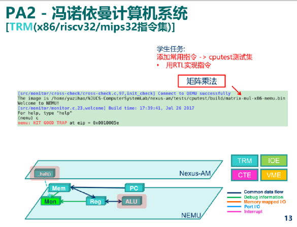
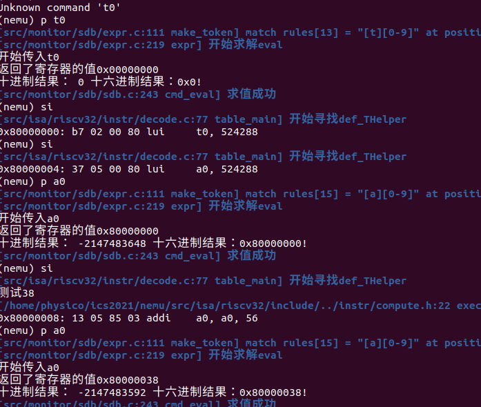
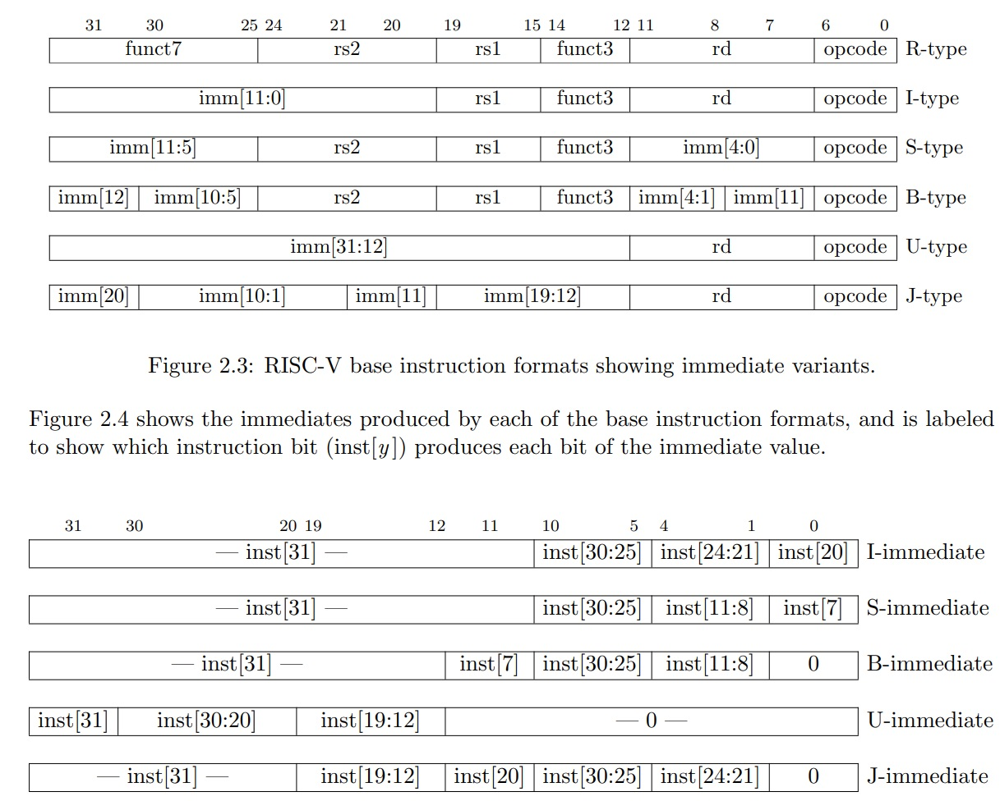
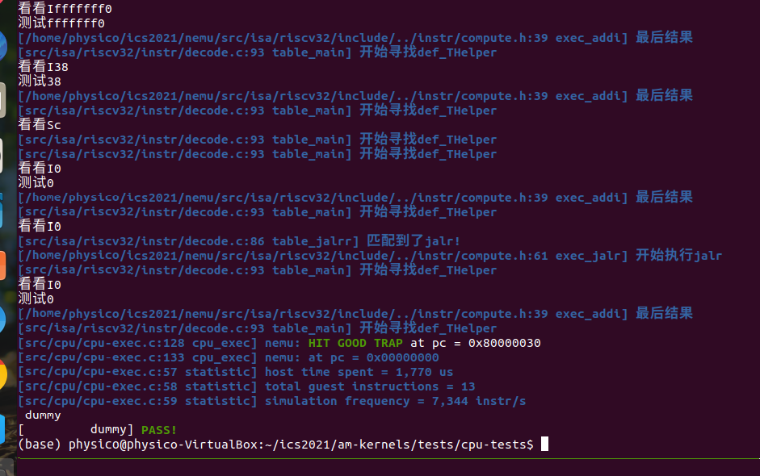
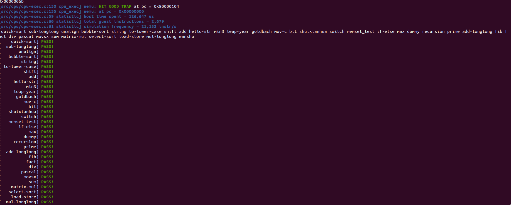
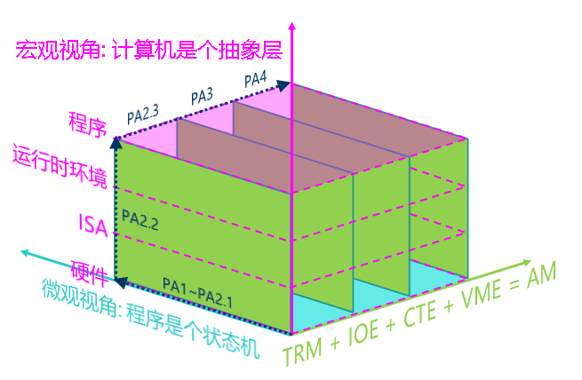

冯诺依曼计算机，从riscv32指令集开始的魔法

## PA2.1 冯诺依曼计算机

写在前面：

首先要感谢jyy群一直帮助我的pony小哥、17号小哥、YSYX论坛（还有很多帮助我的人，没写出来但我都很感谢！）

没有你们我是不可能能这么快理解（甚至完全做不出）这一部分的。

我的基础很薄弱，对于ISA真的一无所知，感谢无私的帮助

注意，包老师的中文版手册有些地方是有错的，建议只看概念，具体的编码参考英文的资料，比如：[https://msyksphinz-self.github.io/riscv-isadoc/html/rvi.html#fence-i](https://msyksphinz-self.github.io/riscv-isadoc/html/rvi.html#fence-i "https://msyksphinz-self.github.io/riscv-isadoc/html/rvi.html#fence-i")

具体还是要以英文手册的译码为准。

【前半部分都是纯粹的抄讲义阶段。。但是抄了后真的能比较好理解】

PA2一开始的任务是实现译码的流程，补充辅助译码函数（注意一下伪指令不用实现，函数体可以留空）



## RTFSC(2)

### fetch\_decode\_exec\_updatepc()： 取指, 译码, 执行, 更新PC

在cpu\_exec——fetch\_decode\_exec\_updatepc——fetch\_decode

> `fetch_decode_exec_updatepc()`接受一个`Decode`类型的结构体指针`s`, 这个结构体用于存放在执行一条指令过程中的译码和执行信息, 包括指令的PC, 执行方式, 以及操作数的信息. 还有一些信息是ISA相关的, NEMU用一个结构类型`ISADecodeInfo`来对这些信息进行抽象, 具体的定义在`nemu/src/isa/$ISA/include/isa-def.h`中. `fetch_decode_exec_updatepc()`首先会调用`fetch_decode()`进行取指和译码, `fetch_decode()`会先把当前的PC保存到`s`的成员`pc`和`snpc`中, 其中`s->pc`就是当前指令的PC, 而`s->snpc`则是下一条指令的PC, 这里的`snpc`是 **"static next PC"的意思.**
>
> 然后代码会调用`isa_fetch_decode()`函数(在`nemu/src/isa/$ISA/instr/decode.c`中定义), 它会随着取指的过程修改`s->snpc`的值, 使得从`isa_fetch_decode()`返回后`s->snpc`正好为下一条指令的PC.  这里的`dnpc`\*\*是"dynamic next PC"的意思. \*\*
>
> 此外, `isa_fetch_decode()`还会返回一个编号`idx`, 用于对`g_exec_table`这一数组进行索引. `g_exec_table`是一个函数指针的数组, 数组中的每个元素都会指向一个用于模拟指令执行的函数, 我们把这样的函数称为"执行辅助函数"(execution helper function). 通过`idx`索引这个数组, 可以找到与一条指令相匹配的执行辅助函数, 并把它记录到`s->EHelper`中.
>
> 忽略`fetch_decode()`中剩下与trace相关的代码, 我们就返回到`fetch_decode_exec_updatepc()`中. ******将会调用刚才记录到****的执行辅助函数, 来模拟指令执行的真正操作. 最后会更新PC, 让PC指向下一条指令.**
>
> 显然, `fetch_decode_exec_updatepc()`函数覆盖了指令周期的所有阶段: **取指, 译码, 执行, 更新PC.** 在这些阶段中, 代码都可以对`s`进行记录和访问.&#x20;

### 取指(instruction fetch, IF)

> `isa_fetch_decode()`做的第一件事情就是取指令. 在NEMU中, 有一个函数`instr_fetch()`(在`nemu/include/cpu/ifetch.h`中定义)专门负责取指令的工作. `instr_fetch()`最终会根据参数`len`来调用`vaddr_ifetch()`(在`nemu/src/memory/vaddr.c`中定义), 而目前`vaddr_ifetch()`又会通过`paddr_read()`来访问物理内存中的内容. 因此, 取指操作的本质只不过就是一次内存的访问而已.
>
> `isa_fetch_decode()`在调用`instr_fetch()`的时候传入了`s->snpc`的地址, 因此`instr_fetch()`最后还会根据`len`来更新`s->snpc`, 从而让`s->snpc`指向下一条指令.

> Motorola 68k系列的处理器都是大端架构的. 现在问题来了, 考虑以下两种情况:
>
> * 假设我们需要将NEMU运行在Motorola 68k的机器上(把NEMU的源代码编译成Motorola 68k的机器码)
>
>   * 假设我们需要把Motorola 68k作为一个新的ISA加入到NEMU中
>
> 在这两种情况下, 你需要注意些什么问题? 为什么会产生这些问题? 怎么解决它们?

答：我猜想可以在memory的host.h处以及map.c的地方通过位置调整（改变addr指针的偏移）解决问题。有朋友提出可以固定len然后再拼起来，也有朋友建议可以了解一下ntohl和ntohs的现有转换库

### 译码(instruction decode, ID)

> 译码的目的是得到指令的操作和操作对象, 这主要是通过查看指令的opcode来决定的. 不同ISA的opcode会出现在指令的不同位置, 我们只需要根据指令的编码格式, 从取出的指令中识别出相应的opcode即可.
>
> 和YEMU相比, NEMU使用一种抽象层次更高的译码方式: 模式匹配, NEMU可以通过一个模式字符串来指定指令中opcode:(def\_INSTR\_IDTAB 在 decode.c)
>
> nemu/include/cpu/decode.h 定义了这些各种各样的宏，包括模式匹配规则。

宏展开def的定义宏后是这样的：（根据def\_INSTR\_raw）

```c
do {

uint32_t key, mask, shift;

pattern_decode("??????? ????? ????? ??? ????? 01101 11", 37, &key, &mask, &shift);

if (((s->isa.instr.val >> shift) & mask) == key) {

  decode_U(s, 0);

  return table_lui(s);

}

} while (0);
```

> 操作对象(比如立即数是多少, 读入到哪个寄存器). 为了解决这个问题, 代码需要进行进一步的译码工作, 这是通过调用相应的`译码辅助函数`(decode helper function)来完成的. 译码辅助函数统一通过宏`def_DHelper`(在`nemu/include/cpu/decode.h`中定义)来定义
>
> 每个译码辅助函数负责进行一种类型的操作数译码, 把指令中的操作数信息分别记录在译码信息`s`的`dest`成员, `src1`成员和`src2`成员中, 它们分别代表**目的操作数和两个源操作数**. `nemu/include/cpu/decode.h`中还定义了三个宏`id_dest`, `id_src1`和`id_src2`, 用于方便地访问它们.【注意，这里的关键是原操作数和目的操作数的是否可写入权限】
>
> 寄存器和立即数这些操作数, 其实是非常常见的操作数类型. 为了进一步实现操作数译码和指令译码的解耦, 框架代码对这些操作数的译码进行了抽象封装, 指令译码过程由若干`译码操作数辅助函数`(decode operand helper function)组成. 译码操作数辅助函数统一通过宏`def_DopHelper`来定义
>
> DopHelper带有一个`flag`参数, 不同的DopHelper可以用它来进行不同的处理. 例如寄存器的DopHelper可以通过`flag`来指示是否写入（可以参考def\_DopHelper(r)实现中的）
>
> `void concat(decode_op_, name) (Decode *s, Operand *op, word_t val, bool flag)`可以匹配decode\_op\_r和decode\_op\_i(`def_DopHelper(r)`, `def_DopHelper(i)` )
>
> DopHelper带有一个`flag`参数, 不同的DopHelper可以用它来进行不同的处理. 例如寄存器的DopHelper可以通过`flag`来指示是否写入（可参考`def_DopHelper(r)`中的实现）
>
> 有了这些译码操作数辅助函数, 我们就可以用它们来编写译码辅助函数:`def_DHelper(I)`、
>
> `def_DHelper(U)`、 `def_DHelper(S)`

> **由于CISC指令变长的特性, x86指令长度和指令形式需要一边取指一边译码来确定, 而不像RISC指令集那样可以泾渭分明地处理取指和译码阶段, 因此你会在x86的译码操作数辅助函数中看到**​**的操作.**

Q：mips32和riscv32的指令长度只有32位, 因此它们不能像x86那样, 把C代码中的32位常数直接编码到一条指令中. 思考一下, mips32和riscv32应该如何解决这个问题?

A：指令和储存分开，而且可以用两个拼成一个，把数据存在32位寄存器，或者变成几个寄存器加减结果。或者有朋友说的可以高位低位分开储存(实际上你在手册中能看到部指令这样的实现之类的）。

回到`def_INSTR_IDTAB`的宏展开结果,：

```c
do {

uint32_t key, mask, shift;

pattern_decode("??????? ????? ????? ??? ????? 01101 11", 37, &key, &mask, &shift);

if (((s->isa.instr.val >> shift) & mask) == key) {

  decode_U(s, 0);

  return table_lui(s);

}

} while (0);
```

对于`lui`指令, 在译码辅助函数`decode_U()`执行结束后, 代码将会执行`table_lui()`. `table_lui()`的定义方式比较特殊, 部分宏展开后的定义:

```c
def_THelper(lui) {
  return EXEC_ID_lui;
}
```

> 其中宏`def_THelper`(在`nemu/include/cpu/decode.h`中定义) 用于\*\*统一定义"表格辅助函数"(table helper function). \*\*`table_lui()`做的事情很简单, 它直接返回一个标识`lui`指令的唯一ID. 这个ID会作为译码结果的返回值, 在`fetch_decode()`中索引`g_exec_table`数组.
>
> 事实上, 译码的过程可以看成是若干查表的操作, 每一条模式匹配的规则都可以看成是表格中的一个表项, 因此我们可以使用表格辅助函数来描述这些译码的规则. 以riscv为例:
>
> 这一模式字符串只能通过`opcode`匹配到load类型的指令, 为了进一步确定是哪一条load指令, 我们还需要匹配`funct3`字段（具体查看riscv手册就直到为什么要匹配那三个了。）, 因此我们引入一个新的表格辅助函数`table_load()`, 匹配到load类型指令的时候, 会进一步调用`table_load()`, 然后在其中通过额外的模式字符串来匹配`funct3`字段, 例如: 以riscv为例:
>
> ```c
> def_THelper(load) {
>   def_INSTR_TAB("??????? ????? ????? 010 ????? ????? ??", lw);
>   return EXEC_ID_inv;
> }
> ```
>
> `def_INSTR_TAB`也是一条字符串匹配规则, 但它**并不需要调用译码辅助函数**.&#x20;
>
> 这条规则描述了"在load类型指令中, 如果`funct3`为`010`, 则为`lw`指令".
>
> \*\* NEMU把译码时的如下情况都看作是查表过程:\*\* ​
>
> * 在`isa_fetch_decode()`中查主表(main decode table)
>
> * 在译码过程中分别匹配指令中的每一个域(如上文介绍的`table_load()`
>
> * 译码出最终的指令时认为是一种特殊的查表操作, 直接返回标识该指令的唯一ID
>
> 如果所有模式匹配规则都无法成功匹配, 代码将会返回一个标识非法指令的ID.

## 执行(execute, EX)

> 之前的关键是**译码辅助函数**（decode\_U）——译码辅助函数统一通过宏`def_DHelper`(在`nemu/include/cpu/decode.h`)来定义；以及"**表格辅助函数**"`def_THelper`(也在`nemu/include/cpu/decode.h`)，他返回一个标识`lui`指令的唯一ID. 这个ID会作为译码结果的返回值, 在`fetch_decode()`中索引`g_exec_table`数组。
>
> 一种好的做法是把译码, 执行和操作数宽度的相关代码分离来, 实现解耦. 在框架代码中, 实现译码和执行之间的解耦的是`isa_fetch_decode()`返回的编号, 这样我们就可以分别编写译码和执行的辅助函数, 然后进行组合:这很容易实现执行行为相同但译码方式不同的多条指令.

现在我们需要注意的是**执行辅助函数**`def_EHelper`（在g\_exec\_table）。

> 译码过程结束之后, 接下来会返回到`fetch_decode()`中, 并通过返回的ID来从`g_exec_table`数组中选择相应的执行辅助函数(execution helper function), 然后记录到`s->EHelper`中. 返回到`fetch_decode_exec_updatepc()`后, 代码将会调用刚才记录的执行辅助函数. 执行辅助函数统一通过宏`def_EHelper`(在`nemu/include/cpu/exec.h`中定义)来定义
>
> （对x86来说, 大部分计算指令都可以访问内存, 来根据目的操作数类型的不同, 决定是写入寄存器还是写入内存; 对于mips32和riscv32, 访问内存只能通过特定的访存指令进行, 因此每条指令的目的操作数类型都是唯一的.）
>
> 每个执行辅助函数都需要有一个标识该指令的ID以及一个表格辅助函数与之相对应, 通过一系列宏定义实现的. 在`nemu/src/isa/$ISA/include/isa-all-instr.h`**中定义用于表示指令列表的宏**`INSTR_LIST`, 它定义了NEMU支持的所有指令. 然后代码通过一种类似函数式编程的方式来定义如下相关的内容:
>
> * 在`nemu/include/cpu/decode.h`中为所有的执行辅助函数定义相应的ID. 以riscv32为例, 对`def_all_EXEC_ID()`进行宏展开后, 结果如下:
>
> \#define def\_all\_EXEC\_ID() enum { MAP(INSTR\_LIST, def\_EXEC\_ID) TOTAL\_INSTR }
>
> 变为enum { EXEC\_ID\_lui, EXEC\_ID\_lw, EXEC\_ID\_sw, EXEC\_ID\_inv, EXEC\_ID\_nemu\_trap, TOTAL\_INSTR }
>
> 其中`TOTAL_INSTR`的值正好为目前所有指令的总数
>
> **只需要维护**​**中的指令列表, 就可以正确维护执行辅助函数和译码之间的关系了.**

## 更新PC

> 更新PC的操作非常简单, 在fetch\_decode\_exec\_updatepc把`s->dnpc`赋值给`cpu.pc`即可.&#x20;
>
> 之前提到了`snpc`和`dnpc`, 它们的区别如下：
>
> 在程序分析领域中, 静态指令是指程序代码中的指令, 动态指令是指程序运行过程中的指令
>
> `snpc`是指代码中的下一条指令, 而`dnpc`是指程序运行过程中的下一条指令.&#x20;
>
> `dnpc`应该指向跳转目标的指令. 显然, 我们应该使用`s->dnpc`来更新PC, 并且在执行辅助函数中正确维护`s->dnpc`.

## 用RTL表示指令行为

**这个很重要！大部分译码函数都通过这个实现（具体有些行为在op\_c中可以找到）**

**需要详细查看**

> 在NEMU中,使用[RTL(寄存器传输语言)](https://en.wikipedia.org/wiki/Register_transfer_language "RTL(寄存器传输语言)")来描述（先实现这些简单操作, 然后再用它们来实现指令）.&#x20;
>
> RTL寄存器的定义. 在NEMU中, RTL寄存器统一使用`rtlreg_t`来定义, 而`rtlreg_t`(在`nemu/include/common.h`中定义)其实只是一个`word_t`类型:
>
> ```c
> typedef word_t rtlreg_t;
> ```
>
> 在NEMU中的RTL寄存器：
>
> * 不同ISA的通用寄存器(在`nemu/src/isa/$ISA/include/isa-def.h`中定义)
>
> * 临时寄存器`s0, s1, s2`和`t0`(在`nemu/include/rtl/rtl.h`中定义)
>
> * 零寄存器`rz`(在`nemu/include/rtl/rtl.h`中定义), 它的值总是0

（其实不需要使用 临时寄存器就可以完成大部分指令

## 实现新指令

> **对译码, 执行和操作数宽度的解耦实现以及RTL的引入, 对在NEMU中实现客户指令提供了很大的便利, 为了实现一条新指令, 只需要**
>
> 1. 在`nemu/src/isa/$ISA/instr/decode.c`中添加正确的模式匹配规则
>
> 2. 用RTL实现正确的执行辅助函数, **需要注意使用RTL伪指令时要遵守上文提到的小型调用约定**
>
> 3. 在`nemu/src/isa/$ISA/include/isa-all-instr.h`中把指令添加到`INSTR_LIST`中
>
> 4. 必要时在`nemu/src/isa/$ISA/include/isa-exec.h`中添加相应的头文件

### 请整理一条指令在NEMU中的执行过程

* 指令集相关文件：

    1. 各类指令RTL调用函数实现部分：/home/physico/ics2021/nemu/src/isa/riscv32/instr/ \*.h

    2. 译码函数部分：/home/physico/ics2021/nemu/src/isa/riscv32/instr/decode.c

    3. 函数名-宏展开需要部分：/home/physico/ics2021/nemu/src/isa/riscv32/include/isa-all-instr.h（旁边的isa-exec可以包括1提到的）

    4. ISADecodeInfo：/home/physico/ics2021/nemu/src/isa/riscv32/include/isa-def.h

    5. RTL实现相关：

        1. /home/physico/ics2021/nemu/src/engine/interpreter/rtl-basic.h （def\_rtl\_compute\_reg\_imm）

        2. /home/physico/ics2021/nemu/src/engine/interpreter/c\_op.h（c\_add(a, b) ((a) + (b)) 以及 interpret\_relop类似RELOP\_NE）

### 踩坑心得

**关键：理解立即数的符号位是怎么确定的，什么时候用无符号数有符号数，怎么样正确移位置，怎么样设置好src与dest的是否可读写权限。友情建议先实现diff（具体在哪请看讲义）。**

(注意，接下来的叙述是有问题的，之后会说问题在哪)

一开始实现li，最后才知道li原来是伪指令，所以关键是先实现R、S、U的基础指令（RTSM有关中文部分）。一开始怎么样都无法编译，原来是忘记了computer相关头文件的函数实现，顺带修改了一下isa-def当中的结构体，终于编译通过（后来改成了先实现addi也就是R型指令）

编译通过后，si还是会报错，在确定def\_DHelper(R)初始化后反复检查发现是def\_THelper(main)模式匹配就没匹配到（还好Log大法好一个个检查。。）直接看前面的指令是不正确的（不太清楚原因，就是手册开头有整理好基础类型，我对照结尾填写），通过直接搜addi（决定看英文的手册）改正后能搜到了不会报错。

解决了编译和报错问题，写了一段a0相关的相加代码，发现还是有问题；最后排查是自己不够理解RTL的实现，要深入pseudo.h理解相关函数作用，然后再理解功能的实现套用即可得到正确的结果（一开始还把src2的立即数写成了src1.imm闹了笑话）



这时候发现前面写的基础设施还是派上用场了

一顿操作猛如虎，一样在做pa的朋友告诉我addi和lw一样都是I型，我一开始还不信（我以为相同低位表示一个类型）然后发现他们的低位不同也是I型（所以直接新增一个I类型的主表再同样的初始化后执行对应函数即可）.....只能重新阅读手册理解类型是怎么区别的：

当然前面虽然不小心“造了轮子”，但也不是坏事，还是能派上用场的。

最困难的部分——怎么了解立即数？

<https://blog.csdn.net/qq_39507748/article/details/120150936>

<https://www.cnblogs.com/mikewolf2002/p/11196680.html>

有朋友建议我看cs61b，于是我去翻了一下

[https://inst.eecs.berkeley.edu/\~cs61c/su20/pdfs/lectures/lec08.pdf](https://inst.eecs.berkeley.edu/\~cs61c/su20/pdfs/lectures/lec08.pdf "https://inst.eecs.berkeley.edu/\~cs61c/su20/pdfs/lectures/lec08.pdf")

理解这张图的含义（看不懂就多读几遍，2.4是下面一张图）【关键是指令给了组成imm的部分，imm图展示了要从指令的哪儿拿】

猜测：拿inst\[31]是不是就是00000000000或者1111111111111，也是一种拓展



Q:为什么要左移？

A:我的看法是，我们的立即数一开始都要移位才能组装成真正的编码好的立即数（都是从0开始，为了让他到拼接的地方 我们必须移位）然后拼好后的立即数都要是这样的（2.4中都是组装好的立即数）也就是符号位扩展的。为什么说符号位扩展了？比如有inst31 的就是都000000 或者111111

注意：伪函数是不需要实现的，编译器会帮你选择实现它真正的执行的函数，甚至都不用写。



完成最简单的开始后\~接下来就需要运行除了dummy各种各样的C文件了，确保指令都实现（比如基础的add和ifelse）

Q：如果不知道哪个指令没实现怎么办？

A：想想有了内存地址后在什么情况下能让他显示指令

当然，更优雅的你可以在修改nemu.mk 中取消-b后缀即可让他完美停下来可以一步步看（在test中make的阶段），或者你也可以用这样的操作：（测试这个命令函参数找的我有点抑郁，注意-d后面的-，你也可以写-1）

```bash
./riscv32-nemu-interpreter -d - 
--diff=/xxxxxx/ics2021/nemu/tools/spike-diff/build/riscv32-spike-so  
/xxxxxxx/ics2021/am-kernels/tests/cpu-tests/build/add-riscv32-nemu.bin  

```

提前加了diff后，发现一直卡在add.c无法实现的痛苦（bne一直有问题）查了非常久的compute和decode译码都无法找到错误，最后发现是isa-def立即数环节出错。。。。。。只有最高位int其他uint我却把B指令的其他立即数也写成了int......所以旧报错了，改完后成功通过add测试，感觉人生到了一种大和谐\~\~\~\~

这里引发了一个思考：为什么中间不能用int？有个老哥说这是因为有符号数字在bitfield中会自动补1，这是不行的，我们可以做实验来验证是不是位域都会有这个性质（其实就是有符号数的扩展性质，如果无符号数直接零拓展）。

后面在实现R型指令的时候又遇到了bug，也是同样的寄存器问题，后面排查发现是译码阶段寄存器写入开关我写成了true，但得是false....原因是：

另外，对于RTL你需要有更深入的理解，R和I其实都在32位寄存器-寄存器类型和寄存器-立即数类型的基本算术/逻辑运算里了。包括`rtl_(add|sub|and|or|xor|sll|srl|sra|setrelop)i?`, 它们的定义用到了`nemu/src/engine/interpreter/c_op.h`中的C语言运算。当想不出来的时候思考一下add和addi的区别，他们是怎么得到的。有关寄存器和imm的操作都有了，可以直接用。

这里还涉及到mul，当我们看到op\_c会发现都是64位，为什么呢？因为32乘法的话是错误的（不是溢出而是就是错，涉及到符号位的问题），具体原因可以看：

<https://pages.cs.wisc.edu/~markhill/cs354/Fall2008/beyond354/int.mult.html>

## 程序, 运行时环境与AM

应用程序的运行需要[运行时环境](http://en.wikipedia.org/wiki/Runtime_system "运行时环境")的支持, 包括加载, 销毁程序, 以及提供程序运行时的各种动态链接库(你经常使用的库函数就是运行时环境提供的)等. 为了让客户程序在NEMU中运行, 现在需要相应的运行时环境的支持了.

计算机可以永不停止地执行指令, 但一般的程序都是会结束的, 所以运行时环境需要向程序提供一种结束运行的方法. PA1中提到的那条人工添加的`nemu_trap`指令, 就是让程序来结束运行的.

&#x20;只要有内存, 有结束运行的方式, 加上实现正确的指令, 就可以支撑最简单程序的运行了. 而这, 也可以算是最简单的运行时环境了.

### 将运行时环境封装成库函数

**通过库, 运行程序所需要的公共要素被抽象成API, 不同的架构只需要实现这些API, 也就相当于实现了支撑程序运行的运行时环境, 这提升了程序开发的效率: 需要的时候只要调用这些API, 就能使用运行时环境提供的相应功能.**

### AM - 裸机(bare-metal)运行时环境

应用程序的运行都需要运行时环境的支持; 只进行纯粹计算任务的程序在TRM上就可以运行

更高级的游戏需要运行时环境提供输入输出等的支持，我们需要收集这些需求，统一成一个API给程序，这样就可以支撑不同程序在各种架构上运行的库。

**每个架构都按照它们的特性实现这组API; 应用程序只需要直接调用这组API即可, 无需关心自己将来运行在哪个架构上. 由于这组统一抽象的API代表了程序运行对计算机的需求, 所以我们把这组API称为抽象计算机**

> **AM(Abstract machine)项目就是这样诞生的. 作为一个向程序提供运行时环境的库, AM根据程序的需求把库划分成以下模块**
>
> AM = TRM + IOE + CTE + VME + MPE
>
> * TRM(Turing Machine) - 图灵机, 最简单的运行时环境, 为程序提供基本的计算能力
>
> * IOE(I/O Extension) - 输入输出扩展, 为程序提供输出输入的能力
>
> * CTE(Context Extension) - 上下文扩展, 为程序提供上下文管理的能力
>
> * VME(Virtual Memory Extension) - 虚存扩展, 为程序提供虚存管理的能力
>
> * MPE(Multi-Processor Extension) - 多处理器扩展, 为程序提供多处理器通信的能力 (MPE超出了ICS课程的范围, 在PA中不会涉及)

解耦和分层的艺术！

(在NEMU中)实现硬件功能 -> (在AM中)提供运行时环境 -> (在APP层)运行程序

(在NEMU中)实现更强大的硬件功能 -> (在AM中)提供更丰富的运行时环境 -> (在APP层)运行更复杂的程序

整个AM项目分为两大部分:

* `abstract-machine/am/` - 不同架构的AM API实现, 目前我们只需要关注NEMU相关的内容即可. 此外, `abstract-machine/am/include/am.h`列出了AM中的所有API, 我们会在后续逐一介绍它们.

* `abstract-machine/klib/` - 一些架构无关的库函数, 方便应用程序的开发

阅读`abstract-machine/am/src/platform/nemu/trm.c`中的代码, 你会发现只需要实现很少的API就可以支撑起程序在TRM上运行了:

* `Area heap`结构用于指示堆区的起始和末尾

* `void putch(char ch)`用于输出一个字符

* `void halt(int code)`用于结束程序的运行

* `void _trm_init()`用于进行TRM相关的初始化工作

```c
#include <am.h>
#include <nemu.h>

extern char _heap_start;
int main(const char *args);

Area heap = RANGE(&_heap_start, PMEM_END);
#ifndef MAINARGS
#define MAINARGS ""
#endif
static const char mainargs[] = MAINARGS;

void putch(char ch) {
  outb(SERIAL_PORT, ch);
}

void halt(int code) {
  nemu_trap(code);

  // should not reach here
  while (1);
}

void _trm_init() {
  int ret = main(mainargs);
  halt(ret);
}
```

最后来看看`halt()`. `halt()`里面调用了`nemu_trap()`宏 (在`abstract-machine/am/src/platform/nemu/include/nemu.h`中定义), 这个宏展开之后是一条[内联汇编](http://www.ibiblio.org/gferg/ldp/GCC-Inline-Assembly-HOWTO.html "内联汇编")语句, 内联汇编语句允许我们在C代码中嵌入汇编语句, 显然, 这个宏的定义是和ISA相关的.

这条特殊的指令是人为添加的, 标准的汇编器并不能识别它, objdump的反汇编结果也无法按照我们的想法将其反汇编为`nemu_trap`. `nemu_trap()`宏还会把一个标识结束的结束码移动到通用寄存器中, 这样, 这段汇编代码的功能就和`nemu/src/isa/$ISA/instr/special.h` 中的执行辅助函数`def_EHelper(nemu_trap)`对应起来了: 通用寄存器中的值将会作为参数传给`rtl_hostcall`, `rtl_hostcall`将会根据传入的`id`(此处为`HOSTCALL_EXIT`)来调用`set_nemu_state()`, 将`halt()`中的结束码设置到NEMU的monitor中, monitor将会根据结束码来报告程序结束的原因.

（在哪结束，为什么结束）

**编译生成一个可以在NEMU的运行时环境上运行的程序的过程大致如下:**

（这部分看得我头痛）

* gcc将`$ISA-nemu`的AM实现源文件编译成目标文件, 然后通过ar将这些目标文件作为一个库, 打包成一个归档文件`abstract-machine/am/build/am-$ISA-nemu.a`

* gcc把应用程序源文件(如`am-kernels/tests/cpu-tests/tests/dummy.c`)编译成目标文件

* 通过gcc和ar把程序依赖的运行库(如`abstract-machine/klib/`)也编译并打包成归档文件

* 根据Makefile文件`abstract-machine/scripts/$ISA-nemu.mk`中的指示, 让ld根据链接脚本`abstract-machine/scripts/linker.ld`, 将上述目标文件和归档文件链接成可执行文件

根据上述链接脚本的指示, 可执行程序重定位后的节从`0x100000`或`0x80000000`开始 (取决于`_pmem_start`和`_entry_offset`的值), 首先是`.text`节, 其中又以`abstract-machine/am/src/$ISA/nemu/start.S`中自定义的`entry`节开始, 然后接下来是其它目标文件的`.text`节. 这样, 可执行程序起始处总是放置`start.S`的代码, 而不是其它代码, 保证客户程序总能从`start.S`开始正确执行. 链接脚本也定义了其它节(包括`.rodata`, `.data`, `.bss`)的链接顺序, 还定义了一些关于位置信息的符号, 包括每个节的末尾, 栈顶位置, 堆区的起始和末尾.

我们对编译得到的可执行文件的行为进行简单的梳理:

1. 第一条指令从`abstract-machine/am/src/$ISA/nemu/start.S`开始, 设置好栈顶之后就跳转到`abstract-machine/am/src/platform/nemu/trm.c`的`_trm_init()`函数处执行.

2. 在`_trm_init()`中调用`main()`函数执行程序的主体功能, `main()`函数还带一个参数, 目前我们暂时不会用到, 后面我们再介绍它.

3. 从`main()`函数返回后, 调用`halt()`结束运行.

有了TRM这个简单的运行时环境, 我们就可以很容易地在上面运行各种"简单"的程序了. 当然, 我们也可以运行"不简单"的程序: 我们可以实现任意复杂的算法, 甚至是各种理论上可计算的问题, 都可以在TRM上解决.

### 实现更多库函数

经过哭天喊地的实现终于。。。。。（sprintf实在是难度太大，我从网上找了好久找到一个最小实现printf魔改了一下，等更强了再来理解，实际上是要理解可变参数管理之类的才能解答。）

批量测试通过 做个纪念:)  （做ISA的时候真的感觉人要没了，但是就这样慢慢前进还是看到了曙光） ：



### 重新认识计算机: 计算机是个抽象层

微观视角: 程序是个状态机
宏观视角: 计算机是个抽象层

大家在做实验的时候也可以多多思考: 我现在写的代码究竟位于哪一个抽象层? 代码的具体行为究竟是什么?



状态机视角可以从指令层次精确地描述程序运行的每一处细节, 但丢失了程序的语义. 为了更好地理解复杂程序, 我们需要从一个新的视角来切入.

先来讨论在TRM上运行的程序, 看计算机系统是如何支撑这些需求的.

| TRM    | 计算          | 内存申请            | 结束运行         | 打印信息                  |
| ------ | ----------- | --------------- | ------------ | --------------------- |
| 运行环境   | -           | malloc()/free() | -            | printf()              |
| AM API | -           | heap            | halt()       | putch()               |
| ISA接口  | 指令          | 物理内存地址空间        | nemu\_trap指令 | I/O方式                 |
| 硬件模块   | 处理器         | 物理内存            | Monitor      | 串口                    |
| 电路实现   | cpu\_exec() | pmem\[]         | nemu\_state  | serial\_io\_handler() |

* 计算. 这是程序最基本的需求, 以至于它甚至不属于运行时环境和AM的范畴. 所有计算相关的代码(顺序语句, 分支, 循环, 函数调用等), 都会被编译器编译成功能等价的指令序列, 最终在CPU上执行. 在NEMU中, 我们通过`cpu_exec()`函数来实现"CPU执行指令"的功能.

* 内存申请. 有的程序需要在运行时刻动态地申请内存来使用. 和libc类似, klib提供了`malloc()`和`free()`来实现内存的动态管理(你将来会实现它们), 它们又会使用TRM中提供的API `heap`来获得堆区的起始和末尾. 而`heap`**的区间又是由ISA-平台这个二元组对应的物理内存地址空间来决定的**. 这一地址空间对应着物理内存的大小, 在NEMU中, 它就是大数组`pmem[]`的大小.

* 结束运行. 一般程序都会有结束运行的时候, TRM提供了一个`halt()`的API来实现这一功能. 由于这个需求过于简单, 因此无需运行时环境提供更复杂的接口. `halt()`的具体实现和ISA有关, 我们使用了人为添加的`nemu_trap`指令来实现这一点. 执行`nemu_trap`指令会让NEMU从CPU执行指令的循环中跳出, 返回到Monitor中, 这是通过设置Monitor中的一个状态变量`nemu_state`来实现的.

* 打印信息. 输出是程序的另一个基本需求. 程序可以调用klib中的`printf()`来输出, 它会通过TRM的API `putch()`来输出字符. 不同的ISA-平台有不同的字符输出方式, 在\$ISA-nemu中, `putch()`通过I/O相关的指令把字符写入到串口, 最终在NEMU中通过`serial_io_handler()`将字符打印到终端. 关于输入输出的更多细节会在PA2的最后部分进行介绍.

每一层抽象都有它存在的理由:

* 概念相同的一个硬件模块有着不同的实现方式, 比如处理器既可以通过NEMU中简单的解释方式来实现, 也可以通过类似QEMU中高性能的二进制翻译方式来实现, 甚至可以通过verilog等硬件描述语言来实现一个真实的处理器.

* ISA是硬件向软件提供的可以操作硬件的接口

* AM的API对不同ISA(如x86/mips32/riscv32)的接口进行了抽象, 为上层的程序屏蔽ISA相关的细节

* 运行时环境可以通过对AM的API进行进一步的封装, 向程序提供更方便的功能

## 对AM的进一步理解（待完成

暂时待填坑。。。
