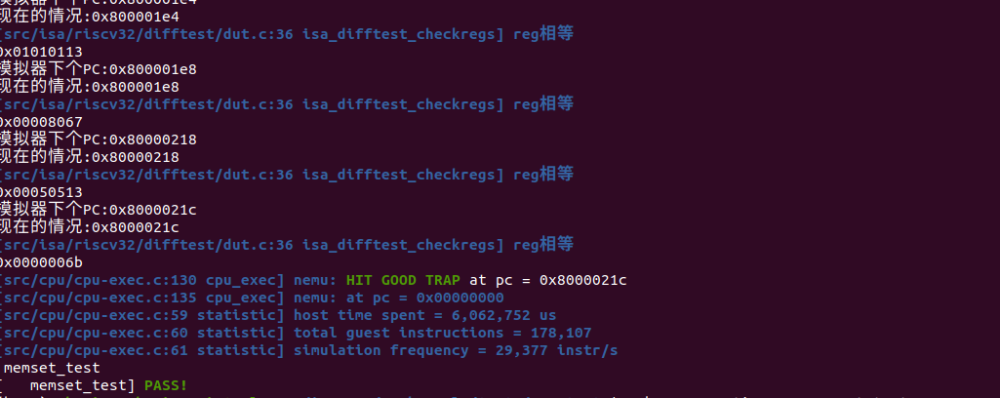
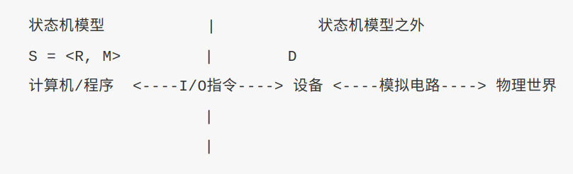
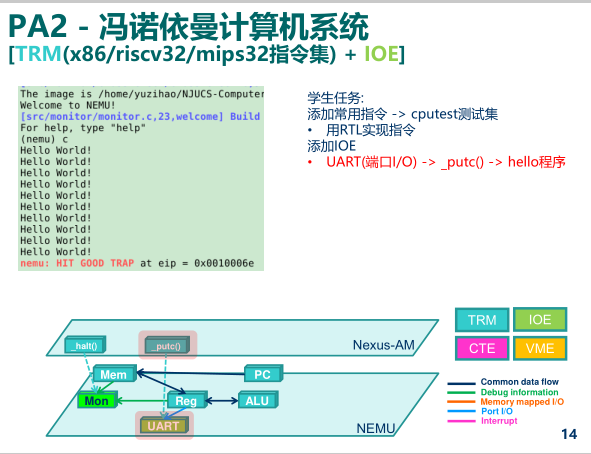
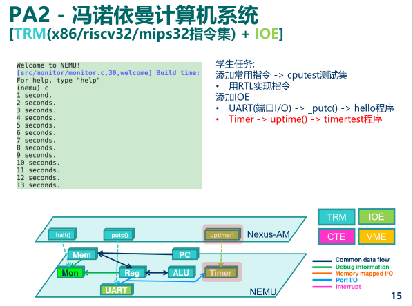
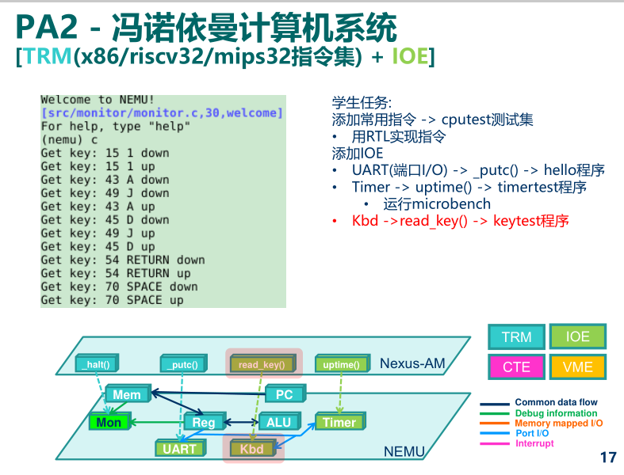
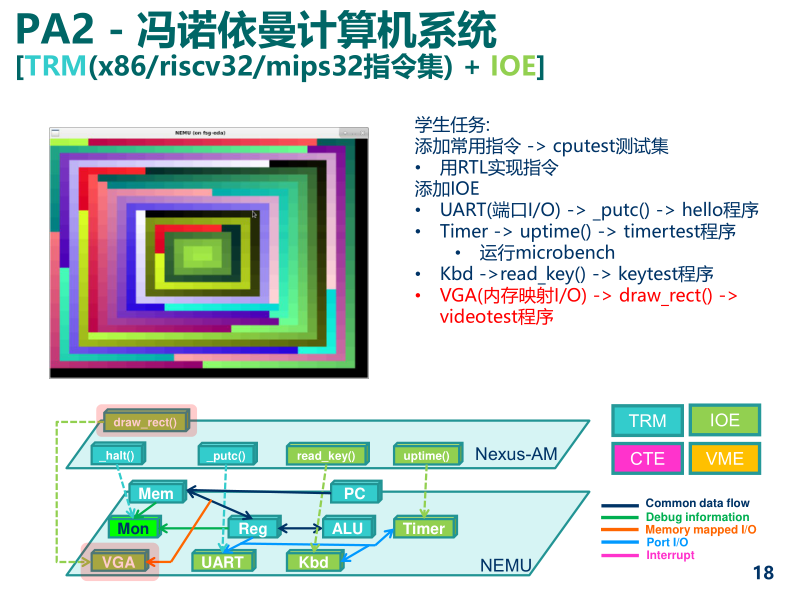

C标准库函数的实现，设备读写下的超级玛丽

## 基础设施(2)

NEMU是一个用来执行其它程序的程序. 在可计算理论中, 这种程序有一个专门的名词, 叫通用程序(Universal Program),

NEMU和各种模拟器只不过是通用程序的实例化, 我们也可以毫不夸张地说, 计算机就是一个通用程序的实体化. 通用程序的存在性为计算机的出现奠定了理论基础, 是可计算理论中一个极其重要的结论,

memset通过测试

### 推荐阅读 计算的极限

<https://zhuanlan.zhihu.com/p/270155475>

### 阅读相关Makefile, 尝试理解abstract-machine是如何生成native的可执行文件的

待补充

### 奇怪的错误码

为什么错误码是`1`呢? 你知道`make`程序是如何得到这个错误码的吗?

别高兴太早了, 框架代码编译到`native`的时候默认链接到glibc, 我们需要把这些库函数的调用链接到我们编写的klib来进行测试. 我们可以通过在`abstract-machine/klib/include/klib.h` 中通过定义宏`__NATIVE_USE_KLIB__`来把库函数链接到klib. 如果不定义这个宏, 库函数将会链接到glibc, 可以作为正确的参考实现来进行对比.

待补充

### 这是如何实现的?

为什么定义宏`__NATIVE_USE_KLIB__`之后就可以把`native`上的这些库函数链接到klib? 这具体是如何发生的? 尝试根据你在课堂上学习的链接相关的知识解释这一现象.

待补充

## 输入输出

### 设备与CPU

> 要向设备发送一些有意义的数字信号, 设备就会按照这些信号的含义来工作. 让一些信号来指导设备如何工作, 这不就像"程序的指令指导CPU如何工作"一样吗? **恰恰就是这样!** 设备也有自己的状态寄存器(相当于CPU的寄存器), 也有自己的功能部件(相当于CPU的运算器). 当然不同的设备有不同的功能部件, 例如**键盘有一个把按键的模拟信号转换成扫描码的部件, 而VGA则有一个把像素颜色信息转换成显示器模拟信号的部件. 控制设备工作的信号称为"命令字", 可以理解成**【设备的指令】, 设备的工作就是负责接收命令字, 并进行译码和执行... 你已经知道CPU的工作方式, 这一切对你来说都太熟悉了.
>
> 所谓的访问设备, 说白了就是从设备获取数据(输入), 比如从键盘控制器获取按键扫描码, 或者是向设备发送数据(输出), 比如向显存写入图像的颜色信息. 但是, 如果万一用户没有敲键盘, 或者是用户想调整屏幕的分辨率, 怎么办呢? 这说明, 除**了纯粹的数据读写之外, 我们还需要对设备进行控制**: 比如需要**获取键盘控制器的状态**, 查看当前是否有按键被按下; 或者是需要有方式可以**查询或设置VGA控制器的分辨率**.&#x20;
>
> 所以, 在程序看来,访问设备 = 读出数据 + 写入数据 + 控制状态.
>
> 既然设备也有寄存器, 一种最简单的方法就是把设备的寄存器作为接口, 让CPU来访问这些寄存器.&#x20;
>
> CPU要如何访问设备寄存器呢? 我们先来回顾一下CPU是如何访问CPU自己的寄存器的: 首先给这些寄存器编个号, 比如`eax`是`0`, `ecx`是`1`... 然后在指令中引用这些编号, 电路上会有相应的选择器, 来选择相应的寄存器并进行读写. 对设备寄存器的访问也是类似的: 我们也可以给设备中允许CPU访问的寄存器逐一编号, 然后通过指令来引用这些编号. 设备中可能会有一些私有寄存器, 它们是由设备自己维护的, 它们没有这样的编号, CPU不能直接访问它们.
>
> 这些编号也称为设备的地址. 常用的编址方式有两种：**端口I/O、內存映射I/O**

#### 端口I/O

> 端口映射I/O(port-mapped I/O), CPU**使用专门的I/O指令对设备进行访问, 并把设备的地址称作端口号**. **有了端口号以后, 在I/O指令中给出端口号, 就知道要访问哪一个设备寄存器了**. 市场上的计算机绝大多数都是IBM PC兼容机, IBM PC兼容机对常见设备端口号的分配有[专门的规定](http://en.wikipedia.org/wiki/Input/output_base_address "专门的规定").
>
> x86提供了`in`和`out`指令用于访问设备, 其中`in`指令用于将设备寄存器中的数据传输到CPU寄存器中, `out`指令用于将CPU寄存器中的数据传送到设备寄存器中.
>
> movl \$0x41, %al
>
> movl \$0x3f8, %edx
>
> outb %al, (%dx)
>
> 上述代码把数据0x41传送到0x3f8号端口所对应的设备寄存器中. CPU执行上述代码后, 会将0x41这个数据传送到串口的一个寄存器中, 串口接收之后, 发现是要输出一个字符`A`; 但对CPU来说, 它并不关心设备会怎么处理0x41这个数据, 只会老老实实地把0x41传送到0x3f8号端口. 事实上, 设备的API及其行为都会在相应的文档里面有清晰的定义, 在PA中我们无需了解这些细节, 只需要知道, 驱动开发者可以通过RTFM, 来编写相应程序来访问设备即可.
>
> **API, 行为, RTFM... 没错, 我们又再次看到了计算机系统设计的一个例子: 设备向CPU暴露设备寄存器的接口, 把设备内部的复杂行为(甚至一些模拟电路的特性)进行抽象, CPU只需要使用这一接口访问设备, 就可以实现期望的功能.** 计算机系统处处蕴含抽象的思想, 只要理解其中的原理, 再加上RTFM的技能, 你就能掌握计算机系统的全部!

#### 內存映射I/O

> 端口映射I/O把端口号作为I/O指令的一部分, 这种方法很简单, 但同时也是它最大的缺点. 指令集为了兼容已经开发的程序, 是只能添加但不能修改的.这意味着, **端口映射I/O所能访问的I/O地址空间的大小, 在设计I/O指令的那一刻就已经决定下来了.** 所谓I/O地址空间, 其实就是所有能访问的设备的地址的集合. 随着设备越来越多, 功能也越来越复杂, I/O地址空间有限的端口映射I/O已经逐渐不能满足需求了. 有的设备需要让CPU访问一段较大的连续存储空间, 如VGA的显存, 24色加上Alpha通道的1024x768分辨率的显存就需要3MB的编址范围. 于是内存映射I/O(memory-mapped I/O, MMIO)应运而生.
>
> 编址方式将一部分物理内存的访问"重定向"到I/O地址空间中, CPU尝试访问这部分物理内存的时候, 实际上最终是访问了相应的I/O设备,
>
> 现代计算机都已经是64位计算机, 物理地址线都有48根,

（注意64位并不需要2的64次方，而是48就够了，因为过大空间导致了资源浪费。32位的时候寻址是32次方。每个地址总线可以对两个存储单元寻址，确定两种状态（0或1）1GB是2的30次方Byte，1TB是2的40次方B，再乘上256即2的8次方即是）

> 这意味着物理地址空间有256TB这么大, 从里面划出3MB的地址空间给显存, 根本就是不痛不痒. 正因为如此, 内存映射I/O成为了现代计算机主流的I/O编址方式: RISC架构只提供内存映射I/O的编址方式, 而PCI-e, 网卡, x86的APIC等主流设备, 都支持通过内存映射I/O来访问.
>
> 作为RISC架构, mips32和riscv32都是采用内存映射I/O的编址方式. 对x86来说, 内存映射I/O的一个例子是NEMU中的物理地址区间`[0xa1000000, 0xa1800000)`. 这段物理地址区间被映射到VGA内部的显存, 读写这段物理地址区间就相当于对读写VGA显存的数据. 例如
>
> **memset((void \*)0xa1000000, 0, SCR\_SIZE);** &#x20;
>
> 会将显存中一个屏幕大小的数据清零, 即往整个屏幕写入黑色像素, 作用相当于清屏. 可以看到, 内存映射I/O的编程模型和普通的编程完全一样: 程序员可以直接把I/O设备当做内存来访问. 这一特性也是深受驱动开发者的喜爱.

### 状态机视角下的输入输出

我们可以把设备分成两部分, **一部分是数字电路. **我们刚才粗略地介绍了一些设备控制器的功能, 例如我们CPU可以从键盘控制器中读出按键信息. 既然是**数字电路, 我们就可以把其中的时序逻辑电路看成是设备数字电路部分的状态D.**

**但D比较特殊, 计算机只能通过端口I/O指令或者内存映射I/O的访存指令来访问和修改**.​

有意思的是**设备的另一部分: 模拟电路, 它也可以改变D. 例如键盘通过检查按键位置的电容变化来判断是否有按键被按下,** 若有, 则会将按键信息写入到键盘控制器的寄存器中. 而按键位置的电容是否发生变化, 又是由物理世界中的用户是否按下按键决定的. 所以我们会说, 设备是连接计算机和物理世界的桥梁.

要对设备的状态和行为进行建模是一件很困难的事情, 除了设备本身的行为五花八门之外, 设备的状态还时时刻刻受到物理世界的影响. 于是, **我们在对状态机模型的行为进行扩展的时候, 并不考虑将D加入到S中, 而是仅仅对输入输出相关指令的行为进行建模:** ​

#### 通过内存进行数据交互的输入输出

> 我们知道`S = <R, M>`, 上文介绍的端口I/O和内存映射I/O都是通过寄存器`R`来进行数据交互的. 很自然地, 我们可以考虑, **有没有通过内存**​**来进行数据交互的输入输出方式呢?**
>
> 其实是有的, 这种方式叫[DMA](http://en.wikipedia.org/wiki/Direct_memory_access "DMA"). 为了提高性能, 一些复杂的设备一般都会带有DMA的功能. 不过在NEMU中的设备都比较简单, 关于DMA的细节我们就不展开介绍了.

## NEMU中的输入输出

终于进入紧张刺激的正式话题！

NEMU的框架代码已经在`nemu/src/device/`目录下提供了设备相关的代码,

### 映射和I/O方式

这部分蛮重要的，多读读原文把，可以在之后回头读。

### 设备

> NEMU使用SDL库来实现设备的模拟, `nemu/src/device/device.c`含有和SDL库相关的代码. `init_device()`函数主要进行以下工作:
>
> * 调用`init_map()`进行初始化.
>
> &#x20;`cpu_exec()`在执行每条指令之后就会调用`device_update()`函数, **这个函数首先会检查距离上次设备更新是否已经超过一定时间, 若是, 则会尝试刷新屏幕, 并进一步检查是否有按键按下/释放, 以及是否点击了窗口的**​**按钮; 否则则直接返回, 避免检查过于频繁, 因为上述事件发生的频率是很低的.**

## 将输入输出抽象成IOE

> 设备访问的具体实现是架构相关的, 比如NEMU的VGA显存位于物理地址区间\[0xa1000000, 0xa1080000), 但对native的程序来说, 这是一个不可访问的非法区间, 因此**native程序需要通过别的方式来实现类似的功能. 自然地, 设备访问这一架构相关的功能, 应该归入AM中**. 与TRM不同, **设备访问是为计算机提供输入输出的功能, 因此我们把它们划入一类新的API, 名字叫IOE(I/O Extension).**
>
> 访问设备其实想做什么: 访问设备 = 读出数据 + 写入数据 + 控制状态. **进一步的, 控制状态本质上也是读/写设备寄存器的操作, 所以访问设备 = 读/写操作.**
>
> bool ioe\_init();
>
> void ioe\_read(int reg, void \*buf);
>
> void ioe\_write(int reg, void \*buf);
>
> 第一个API用于进行IOE相关的初始化操作. 后两个API分别用于从编号为`reg`的寄存器中读出内容到缓冲区`buf`中, 以及往编号为`reg`寄存器中写入缓冲区`buf`中的内容.
>
> 【这里的`reg`寄存器并不是上文讨论的设备寄存器, 因为设备寄存器的编号是架构相关的.】
>
> > `abstract-machine/am/include/amdev.h`中定义了常见设备的"抽象寄存器"编号和相应的结构. 这些定义是架构无关的, 每个架构在实现各自的IOE API时, 都需要遵循这些定义(约定).&#x20;
> >
> > **NEMU作为一个平台, 设备的行为是与ISA无关的**, 只需要在`abstract-machine/am/src/platform/nemu/ioe/`目录下**实现一份IOE, 来供NEMU平台的架构共享**. 其中, `abstract-machine/am/src/platform/nemu/ioe/ioe.c`中实现了上述的三个IOE API, `ioe_read()`和`ioe_write()`都是**通过抽象寄存器的编号索引到一个处理函数, 然后调用它. 处理函数的具体功能和寄存器编号相关, 下面我们来逐一介绍NEMU中每个设备的功能.**

## 一些重要的文件、函数记录

代码框架可参考：[https://ysyx.oscc.cc/forum/topic/16/pa2-3-nemu-am-am-kernels共同构建的虚拟世界概念图](https://ysyx.oscc.cc/forum/topic/16/pa2-3-nemu-am-am-kernels共同构建的虚拟世界概念图 "https://ysyx.oscc.cc/forum/topic/16/pa2-3-nemu-am-am-kernels共同构建的虚拟世界概念图")

随着代码复杂度越来越高，对框架的熟悉度要求指数上涨，必须开始记录每个框架的功能及其使用方式：

### 基础文件

* 指令集相关文件：

    1. 各类指令RTL调用函数实现部分：/home/physico/ics2021/nemu/src/isa/riscv32/instr/ \*.h

    2. 译码函数部分：/home/physico/ics2021/nemu/src/isa/riscv32/instr/decode.c

    3. 函数名-宏展开需要部分：/home/physico/ics2021/nemu/src/isa/riscv32/include/isa-all-instr.h（旁边的isa-exec可以包括1提到的）

    4. ISADecodeInfo：/home/physico/ics2021/nemu/src/isa/riscv32/include/isa-def.h

    5. RTL实现相关：

        1. /home/physico/ics2021/nemu/src/engine/interpreter/rtl-basic.h （def\_rtl\_compute\_reg\_imm）

        2. /home/physico/ics2021/nemu/src/engine/interpreter/c\_op.h（c\_add(a, b) ((a) + (b)) 以及 interpret\_relop类似RELOP\_NE）

### 调试测试用指令与文件（我以自己的路径为准）

* **IOE（包括时间等）：**

    地址：/home/physico/ics2021/am-kernels/tests/am-tests

    测试方式：make ARCH=riscv32-nemu run mainargs=t  （其他测试方式自行读代码）

* **benchmark测试：**

    地址：/home/physico/ics2021/am-kernels/benchmarks/microbench

    测试方式：make ARCH=riscv32-nemu run （其他benchmark同样方法可测）

* **马里奥测试：**

    地址：home/physico/ics2021/fceux-am

    测试方式： make ARCH=riscv32-nemu run mainargs=mario

### 设备相关文件

* 时钟：

  * AM的相关实现：

        1. /home/physico/ics2021/abstract-machine/am/src/platform/nemu/ioe/timer.c （需要实现）

  * native的相关实现

        1. /home/physico/ics2021/abstract-machine/am/src/native/ioe/timer.c

  * nemu的相关实现：

        1. /home/physico/ics2021/nemu/src/device/timer.c

        2. /home/physico/ics2021/nemu/src/utils/timer.c

### 串口

> `nemu/src/device/serial.c`模拟了串口的功能. 其大部分功能也被简化, **只保留了数据寄存器.** 串口初始化时会分别注册`0x3F8`处长度为8个字节的端口, 以及`0xa00003F8`处长度为8字节的MMIO空间, 它们都会映射到串口的数据寄存器.&#x20;
>
> 由于NEMU串行模拟计算机系统的工作, 串口的状态寄存器可以一直处于空闲状态; 每当CPU往数据寄存器中写入数据时, 串口会将数据传送到主机的标准错误流进行输出.
>
> `abstract-machine/am/src/platform/nemu/trm.c`中的`putch()`会将字符输出到串口.

可以配合vsprintf做成Printf。

#### 理解mainargs

请你通过RTFSC理解这个参数是如何从`make`命令中传递到`hello`程序中的, `$ISA-nemu`和`native`采用了不同的传递方法, 都值得你去了解一下.

答：

ISA-NEMU通过ics2021/abstract-machine/scripts/platform/nemu.mk中的宏定义：-D

CFLAGS += -DMAINARGS=\\"\$(mainargs)\\"然后就在main（mainargs）

### 时钟【埋了大坑】

有了时钟, 程序才可以提供时间相关的体验, 例如游戏的帧率, 程序的快慢等. `nemu/src/device/timer.c`模拟了i8253计时器的功能. 计时器的大部分功能都被简化, 只保留了"发起时钟中断"的功能(目前我们不会用到). 同时添加了一个自定义的时钟. i8253计时器初始化时会分别注册`0x48`处长度为8个字节的端口, 以及`0xa0000048`处长度为8字节的MMIO空间, 它们都会映射到RTC寄存器. CPU可以访问这两个寄存器来获得当前时间.

`abstract-machine/am/include/amdev.h`中为时钟的功能定义了两个抽象寄存器:

* `AM_TIMER_RTC`, AM实时时钟(RTC, Real Time Clock), 可读出当前的年月日时分秒. PA中暂不使用.

* `AM_TIMER_UPTIME`, AM系统启动时间, 可读出系统启动后的微秒数.

> 实现IOE
>
> 在`abstract-machine/am/src/platform/nemu/ioe/timer.c`中实现`AM_TIMER_UPTIME`的功能. 在`abstract-machine/am/src/platform/nemu/include/nemu.h`和 `abstract-machine/am/src/$ISA/$ISA.h`中有一些输入输出相关的代码供你使用.
>
> 实现后, 在`$ISA-nemu`中运行`am-kernel/tests/am-tests`中的`real-time clock test`测试. 如果你的实现正确, 你将会看到程序每隔1秒往终端输出一行信息. 由于我们没有实现`AM_TIMER_RTC`, 测试总是输出1900年0月0日0时0分0秒, 这属于正常行为, 可以忽略.
>
> > `native`的IOE是基于SDL库实现的, 它们假设常用库函数的行为会符合glibc标准, 但我们自己实现的klib通常不能满足这一要求. 因此`__NATIVE_USE_KLIB__`仅供测试klib实现的时候使用, 我们不要求在定义`__NATIVE_USE_KLIB__`的情况下正确运行所有程序.

这里我卡了一段时间（主要是跑分过高甚至有些跑不了。），我参考了一生一芯论坛某个大佬的思路：

[https://ysyx.oscc.cc/forum/topic/56/pa2-3实现时钟为例的一些rtsc思路](https://ysyx.oscc.cc/forum/topic/56/pa2-3实现时钟为例的一些rtsc思路 "https://ysyx.oscc.cc/forum/topic/56/pa2-3实现时钟为例的一些rtsc思路")

### 解决时钟问题的钥匙——理解更新过程

我们需要思考，内存映射的逻辑是什么，为什么我们通过学习类似abstract-machine/am/src/platform/nemu/ioe/timer.c 的方法能够读出数据？或者使用文档里让我们看文件中的读写方式能够读出时间数据？（具体可以看上面那个大佬的思路）关键在于——时间是被更新到地址上的，那么什么造成了地址对应数据的更新？讲义给出了答案，让我们反复阅读**映射和IO方式**：&#x20;

> 框架代码为映射定义了一个结构体类型`IOMap`(在`nemu/include/device/map.h`中定义), 包括名字, 映射的起始地址和结束地址, 映射的目标空间, 以及一个回调函数.
>
> `nemu/src/device/io/map.c`实现了映射的管理, 包括I/O空间的分配及其映射, 还有映射的访问接口.
>
> 其中`map_read()`和`map_write()`用于将地址`addr`**映射到**​**所指示的目标空间**, 并进行访问. **访问时, 可能会触发相应的回调函数, 对设备和目标空间的状态进行更新.**

> `nemu/src/device/io/port-io.c`是对端口映射I/O的模拟. `add_pio_map()`函数**用于为设备的初始化注册一个端口映射I/O的映射关系.** `pio_read()`和`pio_write()`是面向CPU的端口I/O读写接口, 它们最终会调用`map_read()`和`map_write()`, **对通过**​**注册的I/O空间进行访问.**

这时候我们就会想到，这个对设备和目标空间状态更新的函数，对时钟来说，是什么呢？

注意到———— nemu/src/device/timer.c模拟了i8253计时器的功能

此时进入后会发现熟悉的add\_pio\_map，还有一个rtc\_io\_handler这里出现了gettime! 感觉是我们想要的答案，但此时会发现一个offset，那么这个offset到底是什么呢，让我们继续打开add\_pio\_map，继续一路寻找用到callback的地方会发现回到了map，其中的map\_read的write告诉了我们原来在这里传入callback,其中offset也就不言而喻了。

得知offset = addr - map->low后，我们再倒回去看某个函数就显得可疑了， addr 可以就是 map->low，也可以是low+4。那么哪个才是对的呢？让我们再复习这句话：

> 其中`map_read()`和`map_write()`用于将地址`addr`**映射到**​**所指示的目标空间**, 并进行访问. **访问时, 可能会触发相应的回调函数, 对设备和目标空间的状态进行更新.**

这时候问题就变成addr到底是等于什么的时候更新才是对的呢？我们怎么访问地址更新数据才是正确的？

这个访问会对我们读取时钟数据有什么影响？我们读取地址上的时钟数据的时候是怎么做的？

在反复阅读一下前面大佬分享的RTFC的过程，相信你能得到答案。

### 键盘

这部分只要弄懂了时钟，非常简单。

### VGA

现代的显示器一般都支持24位的颜色(R, G, B各占8个bit, 共有`2^8*2^8*2^8`约1600万种颜色)

为了让屏幕显示不同的颜色成为可能, 在8位颜色深度时会使用调色板的概念. 调色板是一个颜色信息的数组, 每一个元素占4个字节, 分别代表R(red), G(green), B(blue), A(alpha)的值

一个像素存储的就不再是颜色的信息, 而是一个调色板的索引

要得到一个像素的颜色信息, 就要把它的值当作下标, 在调色板这个数组中做下标运算, 取出相应的颜色信息. 因此, 只要使用不同的调色板, 就可以在不同的时刻使用不同的256种颜色了.

Q：在一些90年代的游戏中(比如仙剑奇侠传), 很多渐出渐入效果都是通过调色板实现的, 聪明的你知道其中的玄机吗?

A:通过线性改变索引？

> 在NEMU中, GPU仅仅保留绘制像素的基本功能.
>
> `abstract-machine/am/include/amdev.h`中为GPU定义了五个抽象寄存器, 在NEMU中只会用到其中的两个:
>
> * `AM_GPU_CONFIG`, AM显示控制器信息, 可读出屏幕大小信息`width`和`height`. 另外AM假设系统在运行过程中, 屏幕大小不会发生变化.
>
> * `AM_GPU_FBDRAW`, AM帧缓冲控制器, 可写入绘图信息, 向屏幕`(x, y)`坐标处绘制`w*h`的矩形图像. **图像像素按行优先方式**存储在`pixels`中, 每个像素**用32位整数**以`00RRGGBB`的方式描述颜色.&#x20;
>
> * **若**`sync`**为**`true`**, 则马上将帧缓冲中的内容同步到屏幕上.**
>
> &#x20;VGA设备还有两个寄存器: 屏幕大小寄存器和同步寄存器.
>
> &#x20;屏幕大小寄存器的硬件(NEMU)功能已经实现, 但软件(AM)还没有去使用它;
>
> &#x20;同步寄存器软件(AM)已经实现了同步屏幕的功能, 但硬件(NEMU)尚未添加相应的支持.

这里我卡的最久的是1、如何理解隐藏的同步信息  2、如何绘制像素。

**针对第一个问题，** 其实关键是不理解抽象寄存器是如何与实际硬件寄存器联系起来的。经过RTFSC我们能知道形如“\_port\_base”（在内存读取中参数为space）才是真正的寄存器位置，而且也在地址空间中开辟了对应的内存。(当然你不仅可以通过开辟的空间去猜测只有两个寄存器，因为你会找到一个newplace（8）；同时也可以找到SYNC\_ADDR的地址，那里是同步的地址，再配合VGA本体映射的地址猜猜看即可；或者你也可以参考有一个叫做pixel \*render的地方，那里也可以参考）

（同时这里我也还不知道指针也可以直接取下标运算，我一直记着指针不等同数组，直到查阅知道了其实编译器中这是一个东西：

> 除了优先级不同之外，下标表达式 array\[ value ] 和间接访问表达式 \*（array + ( value )） 是一样的。因此，下标不仅可以用作数组名，也可以用于指针表达式中。不过这样一来，编译器就很难检查下标的有效性。（斟酌）（意思是如果用指针加下标的方式来表达数组的元素，编译器无法检测到是否越界！）
>
> [https://blog.51cto.com/u\_15338162/5206658](https://blog.51cto.com/u_15338162/5206658 "https://blog.51cto.com/u_15338162/5206658")
>
> [https://zhuanlan.zhihu.com/p/399327901](https://zhuanlan.zhihu.com/p/399327901 "https://zhuanlan.zhihu.com/p/399327901")

让我们回来继续思考问题，抽象寄存器的编号又是如何与实际寄存器的编号（比如5、6、7和具体的\[0] \[1]）联系起来的呢？

所以，如果实现了AM的同步寄存器但没有硬件支持，说明硬件部分实际上缺少了一个对同步寄存器的读取，那么哪一个才是硬件同步寄存器呢？他在哪呢？这就需要RTFSC了。

**针对第二个问题，** 实际上pa2021的框架比2020的难，因为2021的native没有办法参考，而2020的native代码给出了绘制实现。这里我是参考了2020的native才做出来的。实际上要理解这一句话：

> &#x20;向屏幕`(x, y)`坐标处绘制`w*h`的矩形图像. 图像像素按行优先方式存储在`pixels`中

&#x20;这个x y w h的含义，实际上是从绘制理解的。我们图像的绘制从左上角开始，也就是多维数组展平成一维数据一直画下去（你可以更改fb(i)=\[i]的值和for范围查看），而一个好的理解方式是把x,y当做开始绘制的点。也就是说如果你要绘制一个小矩形框，本质是一个点“拖出来的”，因为本质是从一维数组从左到右画。那么我们知道了此时的x,y是基础偏移坐标（也就是绘制小矩形框的基础坐标），而我们绘制需要for循环表达的是i和j坐标也就是小矩形框的坐标，其中pixels是我们将要画的小矩形的像素信息。

我们的目的是把小矩形的像素信息从行开始遍历一个个i和j,再通过fb绘制到大矩形框（gpu内存映射地址）上，所以你应该思考这个映射是怎么做的，如何表达“从某一行开始，一列列的画过去？”，具体的坐标信息该如何转换？这就是你应该思考的了。实在不行，你可以参考2020naitive有关gpu的相关实现。

实现完后你就可以跑马里奥等程序了，我的fps大概是25左右，好好享受自己的作品！

### 声卡部分

暂时坑了

## 【做完PA2应该熟悉的代码】（待完成

* NEMU中除了`fixdep`, `kconfig`, 以及没有选择的ISA之外的全部已有代码(包括Makefile)

* `abstract-machine/am/`下与\$ISA-nemu相关的, 除去CTE和VME之外的代码

* `abstract-machine/klib/`中的所有代码

* `abstract-machine/Makefile`和`abstract-machine/scripts/`中的所有代码

* `am-kernels/tests/cpu-tests/`中的所有代码

* `am-kernels/tests/am-tests/`中运行过的测试代码

* `am-kernels/benchmarks/microbench/bench.c`

* `am-kernels/kernels/`中的`hello`, `slider`和`typing-game`的所有代码

如果你发现自己不能理解这些代码的行为, 就赶紧看看吧. 多看一个文件, bug少调几天, 到了PA3你就会领教到了. （这句话我还是非常相信的，所以宁愿慢一点一个个去看，慢就是快。）

## 【你应该知道并理解的知识】（待完成

* 程序是个状态机 理解YEMU的执行过程, 具体请参考[这里](https://nju-projectn.github.io/ics-pa-gitbook/ics2021/2.1.html#理解yemu如何执行程序 "这里").

* RTFSC 请整理一条指令在NEMU中的执行过程, 具体请参考[这里](https://nju-projectn.github.io/ics-pa-gitbook/ics2021/2.2.html#rtfsc理解指令执行的过程 "这里").

* 程序如何运行 理解打字小游戏如何运行, 具体请参考[这里](https://nju-projectn.github.io/ics-pa-gitbook/ics2021/2.5.html#游戏是如何运行的 "这里").

* 编译与链接 在`nemu/src/engine/interpreter/rtl-basic.h`中, 你会看到由`static inline`开头定义的各种RTL指令函数. 选择其中一个函数, 分别尝试去掉`static`, 去掉`inline`或去掉两者, 然后重新进行编译, 你可能会看到发生错误. 请分别解释为什么这些错误会发生/不发生? 你有办法证明你的想法吗?

* 编译与链接

    1. 在`nemu/include/common.h`中添加一行`volatile static int dummy;` 然后重新编译NEMU. 请问重新编译后的NEMU含有多少个`dummy`变量的实体? 你是如何得到这个结果的?

    2. 添加上题中的代码后, 再在`nemu/include/debug.h`中添加一行`volatile static int dummy;` 然后重新编译NEMU. 请问此时的NEMU含有多少个`dummy`变量的实体? 与上题中`dummy`变量实体数目进行比较, 并解释本题的结果.

    3. 修改添加的代码, 为两处`dummy`变量进行初始化:`volatile static int dummy = 0;` 然后重新编译NEMU. 你发现了什么问题? 为什么之前没有出现这样的问题? (回答完本题后可以删除添加的代码.)

* 了解Makefile 请描述你在`am-kernels/kernels/hello/`目录下敲入`make ARCH=$ISA-nemu` 后, `make`程序如何组织.c和.h文件, 最终生成可执行文件`am-kernels/kernels/hello/build/hello-$ISA-nemu.elf`. (这个问题包括两个方面:`Makefile`的工作方式和编译链接的过程.) 关于`Makefile`工作方式的提示:

  * `Makefile`中使用了变量, 包含文件等特性

  * `Makefile`运用并重写了一些implicit rules

  * 在`man make`中搜索`-n`选项, 也许会对你有帮助

# Reference

* [https://nju-projectn.github.io/ics-pa-gitbook/ics2021](https://nju-projectn.github.io/ics-pa-gitbook/ics2021 "https://nju-projectn.github.io/ics-pa-gitbook/ics2021")

* 网络上搜到的一些细节，但由于学术诚信不予放出。
