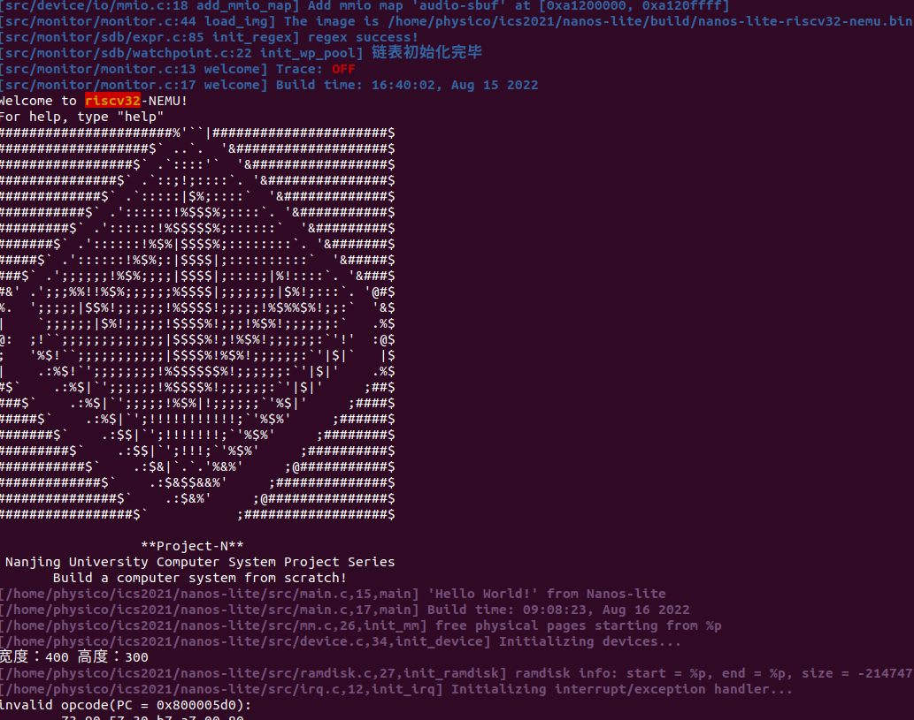

穿越时空的旅程，批处理系统，基本的异常与syscall实现


写在前面：感谢pony、杨婆婆等群友的讨论和帮助，让我对PA有了更深入的理解。

关于问题部分：请遵守学术诚信，有关提问都要自己思考（笔记也不会涉及到任何直接给出代码的部分，有关自己的心得体会很可能是错的，请自己思考。遵守以下协议：


## 1、最简单的操作系统

Nanos-lite是运行在AM之上, AM的API在Nanos-lite中都是可用的. 虽然操作系统对我们来说是一个特殊的概念, 但在AM看来, 它只是一个调用AM API的普通C程序而已,&#x20;

> Nanos-lite目前的行为:
>
> 1. 打印Project-N的logo, 并通过`Log()`输出hello信息和编译时间. 在Nanos-lite中, `Log()`宏通过你在`klib`中编写的`printf()`输出, 最终会调用TRM的`putch()`.
>
> 2. 调用`init_device()`对设备进行一些初始化操作. 目前`init_device()`会直接调用`ioe_init()`.
>
> 3. 在NEMU中对磁盘进行模拟是一个略显复杂工作, 先让Nanos-lite把其中的一段内存作为磁盘来使用. 这样的磁盘有一个专门的名字, 叫ramdisk.
>
> 4. `init_fs()`和`init_proc()`, 分别用于初始化文件系统和创建进程, 目前它们均未进行有意义的操作, 可以忽略它们.
>
> 5. 调用`panic()`结束Nanos-lite的运行.

回顾历史, 要实现一个最简单的操作系统, 就要实现以下两点功能:

* 用户程序执行结束之后, 可以跳转到操作系统的代码继续执行

* 操作系统可以加载一个新的用户程序来执行

（没错，就是fork与execve）

> 为了操作系统的稳定性，我们所希望是一种可以限制入口的执行流切换方式,而不像用户程序那样可以随意切换PC跳转：
>
> i386：保护模式(protected mode)和特权级(privilege level)
>
> mips32处理器：内核模式和用户模式
>
> riscv32：机器模式(M-mode), 监控者模式(S-mode)和用户模式(U-mode)
>
> 最厉害的是硬件检查：如mips32都是通过硬件检查，只要软件运行在硬件上面, 都无法逃出这一天网. 硬件保护机制使得恶意程序永远无法全身而退,
>
> 在硬件中加入一些与特权级检查相关的门电路(例如比较器电路), 如果发现了非法操作, 就会抛出一个异常信号, 让CPU跳转到一个约定好的目标位置, 并进行后续处理.

直接看看效果：



此时会出现异常，因为我们还没实现csrw伪指令，但要注意的是这里中文文档有个错误，从csrwi的可以推测这里应该是csrrw，也可以直接看英文文档的说明


这里我们发现了一个名词“控制状态寄存器”，应该如何理解呢？我们看看下文中对控制状态寄存器的解释。

## 2、穿越时空的旅程

硬件需要提供一种可以限制入口的执行流切换方式. 这种方式就是自陷指令,&#x20;

程序执行自陷指令之后, 就会陷入到操作系统预先设置好的跳转目标. 这个跳转目标也称为异常入口地址.

非法指令可以定义成"不属于ISA手册描述范围的指令", 而自陷指令可以认为是一种特殊的无条件失败.&#x20;

> riscv32提供`ecall`指令作为自陷指令, 并提供一个mtvec寄存器来存放异常入口地址. 为了保存程序当前的状态, **riscv32提供了一些特殊的系统寄存器, 叫控制状态寄存器(CSR寄存器). 在PA中, 我们只使用如下3个CSR寄存器:**
>
> * \*\*mepc寄存器 \*\*- 存放触发异常的PC
>
> * **mstatus寄存器** - 存放处理器的状态
>
> * **mcause寄存器** - 存放触发异常的原因
>
> riscv32触发异常后硬件的响应过程如下:
>
> 1. 将当前PC值保存到mepc寄存器
>
> 2. 在mcause寄存器中设置异常号
>
> 3. 从mtvec寄存器中取出异常入口地址
>
> 4. 跳转到异常入口地址
>
>     上述保存程序状态以及跳转到异常入口地址的工作, 都是硬件自动完成的

所以我们知道，如果要补全csrw指令，首先要能区分不同的控制状态寄存器，具体怎么区分呢，

首先修复一下对应的指令，此时要注意的是CSR寄存器的实现方法。

注意到：The standard RISC-V ISA sets aside a 12-bit encoding space (csr\[11:0]) for up to 4,096 CSRs.

此时需要查阅的是新手大礼包（具体是哪个需要自己RTFM）之Control and Status Registers——CSR Listing的Currently allocated RISC-V machine-level CSR addresses

因为此时立即数位置对应的就是CSR地址，打印出来后发现是0x305查手册后发现也确实是mtvec——Machine trap-handler base address.


根据手册的地址进行匹配并存入寄存器。

### 状态机视角下的异常响应机制

> SR\[mepc] <- PC       （发生异常的pc）
>
> SR\[mcause] <- 一个描述失败原因的号码  &#x20;
>
> PC <- SR\[mtvec]     （异常入口地址）
>
> `fex: S -> {0, 1}`, 给定状态机的任意状态`S`, `fex(S)`都可以唯一表示当前PC指向的指令是否可以成功执行


## 将上下文管理抽象成CTE

> 程序的状态, 在操作系统中有一个等价的术语, 叫"上下文".AM的一类新的API中名字叫CTE(ConText Extension).
>
> 与IOE一样, 上下文管理的具体实现也是架构相关的: 例如上文提到, x86/mips32/riscv32中分别通过`int`/`syscall`/`ecall`指令来进行自陷, `native`中甚至可以通过一些神奇的库函数来模拟相应的功能
>
> 操作系统的处理过程其实需要哪些信息：
>
> * 引发这次执行流切换的原因, 是程序除0, 非法指令, 还是触发断点, 又或者是程序自愿陷入操作系统?&#x20;
>
> * 程序的上下文了（寄存器）
>
> 把这两点信息抽象成一种统一的表示方式, 就可以定义出CTE的API.
>
> &#x20;对于切换原因, 我们只需要定义一种统一的描述方式即可. CTE定义了名为"事件"的数据结构(见`abstract-machine/am/include/am.h`)
>
> 其中`event`表示事件编号, `cause`和`ref`是一些描述事件的补充信息, `msg`是事件信息字符串, 我们在PA中只会用到`event`. 然后, 我们只要定义一些统一的事件编号(上述枚举常量), 让每个架构在实现各自的CTE API时, 都统一通过上述结构体来描述执行流切换的原因,
>
> 对于上下文, 我们只能将描述上下文的结构体类型名统一成`Context`至于其中的具体内容, 就无法进一步进行抽象了. 这主要是因为不同架构之间上下文信息的差异过大（比如各种寄存器）,在AM中, `Context`的具体成员也是由不同的架构自己定义的, 比如`x86-nemu`的`Context`结构体在`abstract-machine/am/include/arch/x86-nemu.h`
>
> 不过大多数情况下, 操作系统并不需要单独访问`Context`结构中的成员. CTE也提供了一些的接口, 来让操作系统在必要的时候访问它们, 从而保证操作系统的相关代码与架构无关.
>
> 最后还有另外两个统一的API:
>
> * `bool cte_init(Context* (*handler)(Event ev, Context *ctx))`用于进行CTE相关的初始化操作. 其中它还**接受一个来自操作系统的事件处理回调函数的指针,** 当发生事件时,\*\* CTE将会把事件和相关的上下文作为参数, 来调用这个回调函数, 交由操作系统进行后续处理\*\*.
>
> * `void yield()`用于进行自陷操作, 会触发一个编号为`EVENT_YIELD`事件.\*\* 不同的ISA会使用不同的自陷指令来触发自陷操作\*\*,

Q：AM究竟给**程序**提供了多大的栈空间呢? 事实上, 如果你在PA2的时候尝试努力了解每一处细节, 你已经知道这个问题的答案了;

A：

\_stack\_top = ALIGN(0x1000);

. = \_stack\_top + 0x8000;

\_stack\_pointer = .;

end = .;

\_end = .;

\_heap\_start = ALIGN(0x1000);

注意区别：

/\* Minimum stack size for a signal handler. \*/

\#define MINSIGSTKSZ 2048

/\* System default stack size. \*/

\#define SIGSTKSZ 8192

### 插播一个潜在大坑

【发现者为jyyos群的杨婆婆，也是一位超神的大佬】：

涉及到ra寄存器相关跳转的顺序问题，要严格按照这个顺序操作


为什么呢？原因是如果我们的源操作数和目的操作数寄存器刚好是同一个的时候（比如ra），重复写入会直接覆盖值，如果我们先用pc+4赋值，很可能再次使用的时候就会出大问题，值被提前覆盖了！！！

### 尝试在Nanos-lite中触发一次自陷操作

#### 设置异常入口地址

> 按照ISA的约定来设置异常入口地址, 将来切换执行流时才能跳转到正确的异常入口. 这显然是架构相关的行为, 因此我们把这一行为放入CTE中, 而不是让Nanos-lite直接来设置异常入口地址.&#x20;
>
> 你需要在`nanos-lite/include/common.h`中定义宏`HAS_CTE`, 这样以后, Nanos-lite会多进行一项初始化工作: 调用`init_irq()`函数, 这最终会调用位于`abstract-machine/am/src/nemu/isa/$ISA/cte.c`中的`cte_init()`函数. `cte_init()`函数会做两件事情, 第一件就是设置异常入口地址
>
> `cte_init()`函数做的第二件事是注册一个事件处理回调函数, 这个回调函数由Nanos-lite提供,

* 对于riscv32来说, 直接将异常入口地址设置到mtvec寄存器中即可.

实现完各种指令框架后我们能看到


这时还没完全实现ecall，进入实现过程：

> 你需要实现上文提到的新指令, 并实现`isa_raise_intr()`函数. 然后阅读`cte_init()`的代码, 找出相应的异常入口地址.
>
> 实现后, 重新运行Nanos-lite, 如果你发现NEMU确实跳转到你找到的异常入口地址, 说明你的实现正确
>
> 你需要在自陷指令的辅助函数中调用`isa_raise_intr()`

此时先实现`isa_raise_intr`，模拟上文提到的异常响应机制：


会发现我们需要找到一个NO，而这个异常NO可以在yield的代码中“领略到怎么获取”，我们直接看他的汇编代码`asm volatile("li a7, -1; ecall")`; 可以猜想是不是和a7有关呢？这时候可以拿出a7看看。至于怎么拿出，这个就是基础操作了。（注意：这里其实是错误的，之后会说为什么）

同时我们再看到`asm volatile("csrw mtvec, %0" :  : "r"(__am_asm_trap));`

这是什么意思呢，首先我们能知道应该是把寄存器的值写入控制状态寄存器（有理由猜测这就是异常地址），那后面的"r"是什么意思呢？


我们可以对照一下知道了那是输入操作数，我们有理由猜测这就是为了把trap相关的地址存到mtvec，在另外一个文件可以看到类似的东西


此时大胆猜测这就是异常相关入口。

一顿操作猛如虎实现了ecall调用，找了个地方加入了异常处理的寄存器：


开diff检查发现了问题：


为啥是b呢？我们发现这其实是mcause的返回值，难道不是前面的li a7 -1吗？？？

经过搜索手册可以查到那其实表示一种environment call。

经过查阅资料：

> RISC-V中系统调用通过（environment call）来实现。在U-mode、S-mode、M-mode下执行 `ecall`分别会触发environment-call-from-U-mode异常、environment-call-from-S-mode异常、environment-call-from-M-mode异常。在系统调用的实现中，我们通过在U-mode下执行 `ecall`触发environment-call-from-U-mode异常，并由S-mode中运行的内核处理这个异常。
>
> 在head.S中内核boot阶段时，设置 medeleg 寄存器为用户模式系统调用添加异常委托。 在没有设置异常委托的情况下，`ecall`指令产生的异常由M-mode来处理，而不是交由内核所在的S-mode进行处理。通过 medeleg 中设置相应的位，可以将environment-call-from-U-mode异常直接交由S-mode处理。
>
> 链接：[https://www.zhihu.com/question/24960401/answer/2308952497](https://www.zhihu.com/question/24960401/answer/2308952497 "https://www.zhihu.com/question/24960401/answer/2308952497") &#x20;
>
> 来源：知乎 &#x20;

那么里面的U,S,M是什么意思呢？以支持现代操作系统的RISC-V处理器为例, 它们存在M, S, U三个特权模式, 分别代表机器模式, 监管者模式和用户模式. M模式特权级最高, U模式特权级最低。所以我们知道了到底是什么调用。

> 华中科技大学操作系统团队：[https://gitee.com/hustos/pke-doc/blob/master/chapter1\_riscv.md](https://gitee.com/hustos/pke-doc/blob/master/chapter1_riscv.md "https://gitee.com/hustos/pke-doc/blob/master/chapter1_riscv.md")
>
> 系统发生中断（我们用中文的“中断”这个名词来指代广义的中断，并非以上的interrupt）时执行的这段程序，往往被称为**中断例程**（interrupt routine）。因为事件的多样性，系统可能有多个这样的中断例程，通常的做法是把这些例程的入口放在一张表中，而这张表一般称为**中断向量表**（interrupt table）。RV64G处理器在发生中断后，会将发生的中断类型、编号自动记录（硬件完成）到目标模式的CSR中。**假设发生中断的目标模式为M模式，则中断的这些信息会记录到mcause寄存器。** 表1.7列出了mcause的可能取值以及对应的中断信息

那么a7到底是什么呢，从man syscall可以查到，原来只是用于存放syscall调用号的地方，并不是真正的mcause，只是为了触发自陷操作,不同ISA的实现不同的(可以全局搜索yield)

（至于为什么是-1，和小伙伴讨论还是个迷）


接下来目的就是找到正确的mcause，什么才是正确的呢？这里就需要你查手册理解PA有几种模式了，以及理解为什么说在后面我们会再次用到`isa_raise_intr()`函数。（想想`isa_raise_intr()`的翻译是什么？并不是异常指令）

你可以用diff检查自己实现的对不对。

通过diff检查：


## 保存上下文

> 现在的通用寄存器, 里面存放的都是执行流切换之前的内容. 这些内容也是上下文的一部分, 如果不保存就覆盖它们, 将来就无法恢复这一上下文了. 但通常硬件并不负责保存它们, 因此需要通过软件代码来保存它们的值. riscv32则通过`sw`指令将各个通用寄存器依次压栈.
>
> 除了通用寄存器之外, 上下文还包括:
>
> * \*\*触发异常时的PC和处理器状态. \*\*epc/mepc和status/mstatus寄存器, 异常响应机制把它们保存在相应的系统寄存器中, 我们还需要将它们从系统寄存器中读出, 然后保存在堆栈上.
>
> * \*\*异常号. \*\*异常号已经由硬件保存在cause/mcause寄存器中, 我们还需要将其保存在堆栈上.
>
> * **地址空间.** 这是为PA4准备的,将地址空间信息与0号寄存器共用存储空间, 反正0号寄存器的值总是0, 也不需要保存和恢复. 我们暂时不使用地址空间信息, 你目前可以忽略它们的含义.

#### 问：异常号的保存

Q:x86通过软件来保存异常号, 没有类似cause的寄存器. mips32和riscv32也可以这样吗? 为什么?

A：我认为可以，因为异常地址之类的都能保存到上下文信息，那么riscv也可以有。

#### 重新组织Context结构体

> 你的任务如下:
>
> * 实现这一过程中的新指令, 详情请RTFM.
>
> * 理解上下文形成的过程并RTFSC, 然后重新组织`abstract-machine/am/include/arch/$ISA-nemu.h` 中定义的`Context`结构体的成员, 使得这些成员的定义顺序和 `abstract-machine/am/src/$ISA/nemu/trap.S`中构造的上下文保持一致.
>
> 需要注意的是, 虽然我们目前暂时不使用上文提到的地址空间信息, 但你在重新组织`Context`结构体时仍**然需要正确地处理地址空间信息的位置,** 否则你可能会在PA4中遇到难以理解的错误.
>
> 实现之后, 你可以在`__am_irq_handle()`中通过`printf`输出上下文`c`的内容, 然后通过简易调试器观察触发自陷时的寄存器状态, 从而检查你的`Context`实现是否正确.

这部分关键是理解结构体和汇编语言的关系，让我们看一段示例代码：

```c
struct test
{
        char ch;
        short s;
        int i;
        long l;
};


int fun(void)
{
        int ret;
        struct test tmp;

        ret=0;

        tmp.ch='a';
        tmp.s=123;
        tmp.i=1234;
        tmp.l=12345;

        return ret;
}
```

汇编代码：

```6502&#x20;assembly
  pushl   %ebp
  movl    %esp, %ebp
  subl    $16, %esp
  //ret=0;
  movl    $0, -16(%ebp)
  //tmp.ch='a';
  movb    $97, -12(%ebp)
  //tmp.s=123;
  movw    $123, -10(%ebp)
  //tmp.i=1234;
  movl    $1234, -8(%ebp)
  //tmp.l=12345;
  movl    $12345, -4(%ebp)
  //返回值
  movl    -16(%ebp), %eax
  leave
  ret
```

从顺序上我们就知道根据压入栈该如何组织结构体了，同时我们也可以在handler处理后看到结果。

#### 问：必答题(需要在实验报告中回答) - 理解上下文结构体的前世今生

> 你会在`__am_irq_handle()`中看到有一个上下文结构指针`c`, `c`指向的上下文结构究竟在哪里? 这个上下文结构又是怎么来的? 具体地, 这个上下文结构有很多成员, 每一个成员究竟在哪里赋值的? `$ISA-nemu.h`, `trap.S`, 上述讲义文字, 以及你刚刚在NEMU中实现的新指令, 这四部分内容又有什么联系?

答：本质是Context\* (*user\_handler)(Event, Context*)的结构体指针。其中定义在am.h，赋值在cte\_init阶段初始化

（怀疑就是为了软件存储上下文信息。所谓的保存到堆栈（S的过程））

具体的Context是怎么被加载的？

首先我们能在S中找到.globl \_\_am\_asm\_trap，其中.globl关键字作用是


能被链接后，就会和extern相对应，所以我们确定\_\_am\_irq\_trap 是可以在链接过程打包到可执行文件的

7`_}]WQ9IQ\)\)VWNP\(CD\~DM_Drh4r0nTcu.png)


再回顾S代码，我们发现这确实就是结构体的push过程。最开始是寄存器，最后是mepc。（我们可以通过打印结构体指针的讯息来看看是不是对应的位置（比如mepc）。）同时我们可以注意到jal \_\_am\_irq\_handle，这里就真正跳转到了框架代码。但这个明明是Context *，哪来的Context*？

可以合理猜测应该是mv a0,sp 中传入sp得到了context的指针信息Context \*c，而结构体指针的第一个成员的地址也即是结构体指针的地址。

### 事件分发

> `__am_irq_handle()`的代码会把执行流切换的原因打包成事件, 然后调用在`cte_init()`中注册的事件处理回调函数（*user\_handler*）, 将事件交给Nanos-lite来处理


实现完成后发现卡在自现异常的死循环,之后会解决这个问题


## 恢复上下文

> 代码将会一路返回到`trap.S`的`__am_asm_trap()`中, 接下来的事情就是恢复程序的上下文. `__am_asm_trap()`将根据之前保存的上下文内容, 恢复程序的状态, 最后执行"异常返回指令"返回到程序触发异常之前的状态.
>
> 需要注意之前自陷指令保存的PCr。iscv32的`ecall`, 保存的是自陷指令的PC, 因此需要在适当的地方对保存的PC加上4, 使得将来返回到自陷指令的下一条指令.

什么叫做合适的地方？我们该想想什么叫做恢复上下文——用什么恢复？

所以我们应该在恢复的地方将pc+4。

#### 问：从加4操作看CISC和RISC

> 事实上, 自陷只是其中一种异常类型. 有一种故障类异常, 它们返回的PC和触发异常的PC是同一个, 例如缺页异常, 在系统将故障排除后, 将会重新执行相同的指令进行重试, 因此异常返回的PC无需加4. 所以根据异常类型的不同, 有时候需要加4, 有时候则不需要加.
>
> 这时候, 我们就可以考虑这样的一个问题了: 决定要不要加4的, 是硬件还是软件呢? CISC和RISC的做法正好相反, CISC都交给硬件来做, 而RISC则交给软件来做. 思考一下, 这两种方案各有什么取舍? 你认为哪种更合理呢? 为什么?

答：riscv不支持用硬件，只有一个，是因为pc要存在mepc里，mepc只有1个，x86执行到int指令后会直接把flags,cs,ip压栈。x86是硬件做的 (by pony)

而且我倾向于x86放在硬件主要是指令太多，放在软件会拖慢速度而且可能会导致奇奇怪怪的问题。

#### 问：必答题(需要在实验报告中回答) - 理解穿越时空的旅程

> 从Nanos-lite调用`yield()`开始, 到从`yield()`返回的期间, 这一趟旅程具体经历了什么? 软(AM, Nanos-lite)硬(NEMU)件是如何相互协助来完成这趟旅程的? 你需要解释这一过程中的每一处细节, 包括涉及的每一行汇编代码/C代码的行为, 尤其是一些比较关键的指令/变量. 事实上, 上文的必答题"理解上下文结构体的前世今生"已经涵盖了这趟旅程中的一部分, 你可以把它的回答包含进来.
>
> 别被"每一行代码"吓到了, 这个过程也就大约50行代码, 要完全理解透彻并不是不可能的. 我们之所以设置这道必答题, 是为了强迫你理解清楚这个过程中的每一处细节. 这一理解是如此重要, 以至于如果你缺少它, 接下来你面对bug几乎是束手无策

答：暂时参考理解上下文结构体的前世今生

## 3、用户程序和系统调用


这部分强烈推荐先看袁妈妈有关链接和可执行文件的讲解

简直是手把手喂给你：

[https://www.bilibili.com/video/BV1kE411X7S5](https://www.bilibili.com/video/BV1kE411X7S5 "https://www.bilibili.com/video/BV1kE411X7S5")


### 加载第一个用户程序

> 加载的过程就是把可执行文件中的代码和数据放置在正确的内存位置,
>
> 然后跳转到程序入口, 程序就开始执行了.&#x20;
>
> 更具体的, 为了实现`loader()`函数, 我们需要解决以下问题:
>
> * 可执行文件在哪里?
>
> * 代码和数据在可执行文件的哪个位置?
>
> * 代码和数据有多少?
>
> * "正确的内存位置"在哪里?
>
> 其中, `navy-apps/libs/libc`中是一个名为[Newlib](https://sourceware.org/newlib/ "Newlib")的项目, 它是一个专门为嵌入式系统提供的C库, 库中的函数对运行时环境的要求极低.&#x20;
>
> **用户程序的入口位于**`navy-apps/libs/libos/src/crt0/start/$ISA.S`中的`_start()`函数, 这里的`crt`是`C RunTime`的缩写, `0`的含义表示最开始. `_start()`函数会调用`navy-apps/libs/libos/src/crt0/crt0.c`中的`call_main()`函数, 然后调用用户程序的`main()`函数, 从`main()`函数返回后会调用`exit()`结束运行.
>
> 我们约定目前用户程序需要被链接到内存位置`0x83000000`附近, Navy已经设置好了相应的选项(见`navy-apps/scripts/$ISA.mk`中的`LDFLAGS`变量).

注：这里我的电脑在make ISA=riscv32的时候出现了问题，我怀疑是交叉汇编环境冲突。。不明白(assert.h相关说undefined reference to \`\_\_assert\_fail'）于是从另外一个电脑弄来了编译通过的文件。

> 可执行文件位于ramdisk偏移为0处, 访问它就可以得到用户程序的第一个字节.

#### 问：堆和栈在哪里?

> 我们提到了代码和数据都在可执行文件里面, 但却没有提到堆(heap)和栈(stack). 为什么堆和栈的内容没有放入可执行文件里面? 那程序运行时刻用到的堆和栈又是怎么来的? AM的代码是否能给你带来一些启发?

答：这些代码和数据本身都是静态的。程序要想运行，首先要OS负责为其创建进程，并在进程的虚拟地址空间中为其代码段和数据段建立映射。光有代码段和数据段是不够的，进程在运行过程中还要有其动态环境，其中最重要的就是堆栈。

内核在创建进程的时候，在创建task\_struct的同时，会为进程创建相应的堆栈。每个进程会有两个栈，一个用户栈，存在于用户空间，一个内核栈，存在于内核空间。

#### 问：如何识别不同格式的可执行文件?

> 如果你在GNU/Linux下执行一个从Windows拷过来的可执行文件, 将会报告"格式错误". 思考一下, GNU/Linux是如何知道"格式错误"的?

答：

&#x20;不同组织形式形成了不同格式的可执行文件, 例如Windows主流的可执行文件是[PE(Portable Executable)](http://en.wikipedia.org/wiki/Portable_Executable "PE(Portable Executable)")格式, 而GNU/Linux主要使用[ELF(Executable and Linkable Format)](http://en.wikipedia.org/wiki/Executable_and_Linkable_Format "ELF(Executable and Linkable Format)")格式. 因此一般情况下, 你不能在Windows下把一个可执行文件拷贝到GNU/Linux下执行, 反之亦然. ELF是GNU/Linux可执行文件的标准格式, 这是因为GNU/Linux遵循System V ABI([Application Binary Interface](http://stackoverflow.com/questions/2171177/what-is-application-binary-interface-abi "Application Binary Interface")).


E:可执行 L：链接


通过解析数据结构可以得到信息。比如ELF头。

> ELF文件提供了两个视角来组织一个可执行文件,
>
> 一个是面向链接过程的section视角, 这个视角提供了用于链接与重定位的信息(例如符号表);&#x20;
>
> 另一个是面向执行的segment视角, 这个视角提供了用于加载可执行文件的信息.&#x20;
>
> 可以参考这篇文章：[https://blog.csdn.net/GoolyOh/article/details/119801160](https://blog.csdn.net/GoolyOh/article/details/119801160 "https://blog.csdn.net/GoolyOh/article/details/119801160")
>
> 
>
> &#x20;一个segment可能由0个或多个section组成, 但一个section可能不被包含于任何segment中.
>
> **program header table的一个表项**描述了一个segment的所有属性, 包括类型, **虚拟地址**, 标志, 对齐方式, 以及**文件内偏移量和segment大小.**
>
> 加载一个可执行文件并不是加载它所包含的所有内容, 只要加载那些与运行时刻相关的内容就可以了, 例如调试信息和符号表就不必加载.&#x20;
>
> **我们可以通过判断segment的**`Type`属性是否为`PT_LOAD`来判断一个segment是否需要加载.

#### 问：冗余的属性?

> 使用`readelf`查看一个ELF文件的信息, 你会看到一个segment包含两个大小的属性, 分别是`FileSiz`和`MemSiz`, 这是为什么? 再仔细观察一下, 你会发现`FileSiz`通常不会大于相应的`MemSiz`, 这又是为什么?

答： 相对文件偏移`Offset`指出**相应segment的内容从ELF文件**的第`Offset`字节开始,**在文件中的大小**为`FileSiz`, 它需要被分配到以`VirtAddr`为首地址的虚拟内存位置, **在内存中它占用大小**为`MemSiz`.

这个segment使用的内存就是`[VirtAddr, VirtAddr + MemSiz)`这一连续区间, 然后将segment的内容从ELF文件中读入到这一内存区间,&#x20;

想想为什么要预留nobits的空间——本质是.bss相关。

你需要找出每一个需要加载的segment的`Offset`, `VirtAddr`, `FileSiz`和`MemSiz`这些参数. 其中相对文件偏移`Offset`指出相应segment的内容从ELF文件的第`Offset`字节开始, 在文件中的大小为`FileSiz`, 它需要被分配到以`VirtAddr`为首地址的虚拟内存位置, 在内存中它占用大小为`MemSiz`. 也就是说, 这个segment使用的内存就是`[VirtAddr, VirtAddr + MemSiz)`这一连续区间, 然后将segment的内容从ELF文件中读入到这一内存区间, 并将`[VirtAddr + FileSiz, VirtAddr + MemSiz)`对应的物理区间清零.

#### 问：为什么要清零?

为什么需要将 `[VirtAddr + FileSiz, VirtAddr + MemSiz)` 对应的物理区间清零?

.bss清零的原因:(注意初始化为0的全局变量也在bss）


> 转载自：[http://www.zhihu.com/question/23147702/answer/23738366](http://www.zhihu.com/question/23147702/answer/23738366 "http://www.zhihu.com/question/23147702/answer/23738366")
>
> BSS段清零的原因是因为这个段是BSS &#x20;
>
> 要说为什么要有BSS的话，历史就比较久远了。 &#x20;
>
> BSS段我所知道的起源是Unix最初的时候（当然，不排除可能有更早的情况）。变量分两种：局部变量、全局变量。根据C语法的规定，局部变量不设置初始值的时候，其初始值是不确定的，局部变量（不含静态局部变量）的存储位置位于栈上，具体位置不固定。全局变量（和静态局部变量）有专门数据段存储，初始值是0，具体位置是固定的。其实说到底，就两种，一种是位置固定（数据段里），一种是位置不固定的（栈上）。 &#x20;
>
> 要知道，早期的计算机存储设备是很贵的，而很多时候，数据段里的全局变量都是0（或者没有初始值），那么存储这么多的0到目标文件里其实是没有必要的。所以为了节约空间，在生成目标文件的时候，就把没有初始值（实际就是0）的数据段里的变量都放到BSS段里，这样目标文件就不需要那么大的体积里（节约磁盘空间）。只有当目标文件被载入的时候，加载器负责把BSS段清零（一个循环就可以搞定）。 &#x20;
>
> 之后，这个规则慢慢的成为一个标准配置，大多数编译器也就都支持了BSS段。
>
> Q:如果BSS不清零可不可以？ &#x20;
>
> A:可以，如果编译器规定BSS段不清零，也是可以的，但这样的话C语言语法就要改了：未初始化的全局变量和静态局部变量，其值是未知的。甚至其它语言也要跟着改语法。 &#x20;
>
> 所以，BSS段清零的原因是因为这个段是BSS

#### 插播ld过程

[http://learn.lianglianglee.com/专栏/深入浅出计算机组成原理/08  ELF和静态链接：为什么程序无法同时在Linux和Windows下运行？.md](<http://learn.lianglianglee.com/专栏/深入浅出计算机组成原理/08  ELF和静态链接：为什么程序无法同时在Linux和Windows下运行？.md> "http://learn.lianglianglee.com/专栏/深入浅出计算机组成原理/08  ELF和静态链接：为什么程序无法同时在Linux和Windows下运行？.md")


#### 自己的补充：C语言的标准对于未初始化的数据是UB还是0

[https://stackoverflow.com/questions/1597405/what-happens-to-a-declared-uninitialized-variable-in-c-does-it-have-a-value](https://stackoverflow.com/questions/1597405/what-happens-to-a-declared-uninitialized-variable-in-c-does-it-have-a-value "https://stackoverflow.com/questions/1597405/what-happens-to-a-declared-uninitialized-variable-in-c-does-it-have-a-value")


#### 自己的补充：Why are global and static variables initialized to their default values

> [https://stackoverflow.com/questions/2091499/why-are-global-and-static-variables-initialized-to-their-default-values/2091505#2091505](https://stackoverflow.com/questions/2091499/why-are-global-and-static-variables-initialized-to-their-default-values/2091505#2091505 "https://stackoverflow.com/questions/2091499/why-are-global-and-static-variables-initialized-to-their-default-values/2091505#2091505")
>
> 1. ***Security***: leaving memory alone would leak information from other processes or the kernel.
>
> 2. ***Efficiency***: the values are useless until initialized to something, and it's more efficient to zero them in a block with unrolled loops. The OS can even zero freelist pages when the system is otherwise idle, rather than when some client or user is waiting for the program to start.
>
> 3. ***Reproducibility***: leaving the values alone would make program behavior non-repeatable, making bugs really hard to find.
>
> 4. ***Elegance***: it's cleaner if programs can start from 0 without having to clutter the code with default initializers.
>
> One might then wonder why the `auto` storage class *does* start as garbage. The answer is two-fold:
>
> 1. **It doesn't,** in a sense. The very first stack frame page at each level (i.e., every new page added to the stack) does receive zero values. The "garbage", or "uninitialized" values that subsequent function instances at the same stack level see are really the previous values left by other method instances of your own program and its library.
>
> 2. There might be a quadratic (or whatever) **runtime performance penalty** associated with initializing `auto` (function locals) to anything. A function might not use any or all of a large array, say, on any given call, and it could be invoked thousands or millions of times. The initialization of statics and globals, OTOH, only needs to happen once.

> 当操作系统将控制权交给它的时候, 计算机把它解释成指令并逐条执行. loader让计算机的生命周期突破程序的边界: 一个程序结束并不意味着计算机停止工作, 计算机将终其一生履行执行程序的使命.

#### 实现loader

> 你需要在Nanos-lite中实现loader的功能, 来把用户程序加载到正确的内存位置, 然后执行用户程序. `loader()`函数在`nanos-lite/src/loader.c`中定义, 其中的`pcb`参数目前暂不使用, 可以忽略, 而因为ramdisk中目前只有一个文件, `filename`参数也可以忽略. 在下一个阶段实现文件系统之后, `filename`就派上用场了.
>
> 实现后, 在`init_proc()`中调用`naive_uload(NULL, NULL)`, 它会调用你实现的loader来加载第一个用户程序, 然后跳转到用户程序中执行. 如果你的实现正确, 你会看到执行`dummy`程序时在Nanos-lite中触发了一个未处理的4号事件. 这说明loader已经成功加载dummy, 并且成功地跳转到dummy中执行了. 关于未处理的事件, 我们会在下文进行说明.

这里我犯傻了一下。。。实际上读取的都是整数类型，我在那一直打印字符串数据格式就说一直怎么不对- -。。。习惯了char \* arr\[]直接打印arr而不习惯普通int arr\[]需要取数值了233333...

直接调用函数可以打印出魔数

]5XFRXIIKBD186XDEI8G_aplRYGibwG.png)

和我们dump出来的结果是一致的：

OPB2_Zd7NRHA0bl.png)

把用户程序加载到正确的内存位置,这意味着我们要获取程序开始地址以及程序头表（段头表），具体是什么需要自己RTFM，看了袁妈的视频就会觉得这并不难。

返回开始地址和读取elf头很简单，段头的处理有一点点操作，主要是注意我们只需要读取LOAD相关段，需要做一个拦截（最好有个数组），然后根据讲义说的：


然后注意一下我们要写入到virtaddr的位置要用指针（也就是这个地址本身指针）

此时发现进入死循环（别紧张，其实是对的。。。。可以接下去看讲义，我们发现调用了两次ecall。


### DIFF大坑的解说【memcpy】

(本问题有不少群友都遇到了，提出解决方法的是pony哥）

在loader实现阶段，你可能会用diff遇到pc漂移diff出错很离谱的神奇状况，甚至在之后也会遇到（但仍然有结果不会陷入奇怪的循环等等）也许你需要考虑这个问题：

### 操作系统的运行时环境

> &#x20;程序的运行需要运行时环境的支撑. 而操作系统希望加载并运行程序, 自然有责任来提供运行时环境的功能.
>
> 需要有一个角色来对系统中的资源进行统一的管理: 程序不能擅自使用资源了, 使用的时候需要向资源管理者提出申请. 既然操作系统位于高特权级, 享受着至高无上的权利, 自然地它也需要履行相应的义务: 作为资源管理者管理着系统中的所有资源, 操作系统还需要为用户程序提供相应的服务. 这些服务需要以一种统一的接口来呈现, 用户程序也只能通过这一接口来请求服务.
>
> 这一接口就是系统调用. 这是操作系统从诞生那一刻就被赋予的使命:&#x20;
>
> 我们之前提到GM-NAA I/O的一个主要任务就是加载新程序, 而它的另一个主要功能, 就是为程序提供输入输出的公共接口. GM-NAA I/O所提供的公共接口, 可以认为是系统调用的初原形态.

#### 问：系统调用的必要性

对于批处理系统来说, 系统调用是必须的吗? 如果直接把AM的API暴露给批处理系统中的程序, 会不会有问题呢?

答：可能会有各种奇怪的并发资源竞争问题，而且会被恶意程序利用

> 系统调用把整个运行时环境分成两部分, 一部分是操作系统内核区, 另一部分是用户区. 那些会访问系统资源的功能会放到内核区中实现, 而用户区则保留一些无需使用系统资源的功能(比如strcpy()), 以及用于请求系统资源相关服务的系统调用接口.
>
> 在这个模型之下, 用户程序只能在用户区安分守己地"计算", 任何超越纯粹计算能力之外的任务, 都需要通过系统调用向操作系统请求服务. 如果用户程序尝试进行任何非法操作, CPU就会向操作系统抛出一个异常信号, 让非法操作的指令执行"失败", 并交由操作系统进行处理. 对, 这就是之前介绍的硬件保护机制, 操作系统需要借助这一天然屏障来阻挡程序的恶意行为.
>
> 虽然操作系统需要为用户程序服务, 但这并不意味着操作系统需要把所有信息都暴露给用户程序. 有些信息是用户进程没有必要知道的, 也永远不应该知道, 例如一些与内存管理相关的数据结构. 如果一个恶意程序获得了这些信息, 可能会为恶意攻击提供了信息基础. 因此, 通常不存在一个系统调用来获取这些操作系统的私有数据.

### 系统调用


> 系统调用的过程：用户程序通过一种方法描述自己的需求, 然后告诉操作系统。
>
> "告诉操作系统", 这是通过自陷指令来实现的。
>
> 在GNU/Linux中, 用户程序通过自陷指令来触发系统调用, Nanos-lite也沿用这个约定. CTE中的`yield()`也是通过自陷指令来实现,
>
> 对用户程序来说, 用来向操作系统描述需求的最方便手段就是使用通用寄存器了, 因为执行自陷指令之后, 执行流就会马上切换到事先设置好的入口, 通用寄存器也会作为上下文的一部分被保存起来. 系**统调用处理函数只需要从上下文中获取必要的信息, 就能知道用户程序发出的服务请求是什么了.**
>
> 目前`dummy`已经通过`_syscall_()`直接触发系统调用, 你需要让Nanos-lite识别出系统调用事件`EVENT_SYSCALL`.
>
> 1. 在`abstract-machine/am/include/arch/$ISA-nemu.h`中实现正确的`GPR?`宏, 让它们从上下文`c`中获得正确的系统调用参数寄存器.
>
> 2. 添加`SYS_yield`系统调用.
>
> 3. 设置系统调用的返回值.
>
> 处理系统调用的最后一件事就是设置系统调用的返回值. 对于不同的ISA, 系统调用的返回值存放在不同的寄存器中, 宏`GPRx`用于实现这一抽象, 所以我们通过`GPRx`来进行设置系统调用返回值即可.
>
> 经过CTE, 执行流会从`do_syscall()`一路返回到用户程序的`_syscall_()`函数中. 代码最后会从相应寄存器中取出系统调用的返回值, 并返回给`_syscall_()`的调用者,
>
> 重新运行dummy程序, 如果你的实现正确, 你会看到dummy程序又触发了一个号码为`0`的系统调用. 查看`nanos-lite/src/syscall.h`, 你会发现它是一个`SYS_exit`系统调用. 这说明之前的`SYS_yield`已经成功返回, 触发`SYS_exit`是因为dummy已经执行完毕, 准备退出了.
>
> 你需要实现`SYS_exit`系统调用, 它会接收一个退出状态的参数. 为了方便测试, 我们目前先直接使用这个参数调用`halt()`. 实现成功后, 再次运行dummy程序, 你会看到`HIT GOOD TRAP`的信息.

【你需要阅读上面提到的所有函数，这样就能完成所需内容。】

#### 问：RISC-V系统调用号的传递

如果你选择的是RISC-V, 你会发现它并不是通过`a0`来传递系统调用号. 事实上, 我们参考了RISC-V Linux的系统调用参数传递的约定: 即在RISC-V Linux上也是通过这个寄存器来传递系统调用号的. 你觉得RISC-V Linux为什么没有使用`a0`来传递系统调用号呢?

答：

经过一顿操作猛如虎补充好了对应内容。（认真看讲义即可）


### 操作系统之上的TRM

我们需要构造os的运行时环境

> 用户程序还可以做什么呢? 最基本的,  为了满足程序的基本计算能力, 需要有这些条件:
>
> * 机器提供基本的运算指令  （机器提供了）
>
> * 能输出字符&#x20;
>
> * 有堆区可以动态申请内存
>
> * 可以结束运行 （sys\_exit）
>
> &#x20;为了向用户程序提供输出字符和内存动态申请的功能, 我们需要实现更多的系统调用.

#### write实现

简单实现一下write： 发现打印不全


其实这是后面提到的：


#### 堆区管理

> 调整堆区大小是通过`sbrk()`库函数来实现的,用于将用户程序的program break增长**increment**字节, 其中`increment`可为负数.
>
> `malloc()`被第一次调用的时候, 会通过`sbrk(0)`来查询用户程序当前program break的位置, 之后就可以通过后续的`sbrk()`调用来动态调整用户程序program break的位置了
>
> 在Navy的Newlib中, `sbrk()`最终会调用`_sbrk()`, 它在`navy-apps/libs/libos/src/syscall.c`中定义. 框架代码让`_sbrk()`总是返回`-1`, 表示堆区调整失败,&#x20;
>
> 事实上,\*\* 用户程序在第一次调用\*\*`printf()`的时候会尝试通过`malloc()`**申请一片缓冲区, 来存放格式化的内容.** **若申请失败, 就会逐个字符进行输出**.
>
> 我们还需要提供一个用于设置堆区大小的系统调用. 在GNU/Linux中, 这个系统调用是`SYS_brk`, 它接收一个参数`addr`, 用于**指示新的program break的位置**. `_sbrk()`通过记录的方式来对用户程序的program break位置进行管理, 其工作方式如下:
>
> 1. program break一开始的位置位于`_end`
>
> 2. 被调用时, 根据记录的**program break位置**和参数`increment`, 计算出新program break
>
> 3. 通过`SYS_brk`系统调用来让操作系统设置新program break
>
> 4. 若`SYS_brk`系统调用成功, 该系统调用会返回`0`, 此时更新之前记录的program break的位置, 并将旧program break的位置作为`_sbrk()`的返回值返回
>
> 5. 若该系统调用失败, `_sbrk()`会返回`-1`
>
> 上述代码是在用户层的库函数中实现的, 我们还需要在Nanos-lite中实现`SYS_brk`的功能. 由于目前Nanos-lite还是一个单任务操作系统, 空闲的内存都可以让用户程序自由使用, 因此我们只需要让`SYS_brk`系统调用总是返回`0`即可, 表示堆区大小的调整总是成功. 在PA4中, 我们会对这一系统调用进行修改, 实现真正的内存分配.
>
> > 根据上述内容在Nanos-lite中实现`SYS_brk`系统调用, 然后在用户层实现`_sbrk()`. 你可以通过`man 2 sbrk`来查阅libc中`brk()`和`sbrk()`的行为, 另外通过`man 3 end`来查阅如何使用`_end`符号.
> >
> > 需要注意的是, 调试的时候不要在`_sbrk()`中通过`printf()`进行输出, 这是因为`printf()`还是会尝试通过`malloc()`来申请缓冲区, 最终会再次调用`_sbrk()`, 造成死递归. 你可以通过`sprintf()`先把调试信息输出到一个字符串缓冲区中, 然后通过`_write()`进行输出.

这里按照一步步操作就好，其实就是pa2的malloc的稍微改写。至于end怎么拿看man就懂了。

（这里其实有个坑，要注意堆分配的作用域。不然多次堆分配就没有意义了）

这里其实我不太理解一个问题，那就是“malloc的系统调用失败”，怎么算失败呢？访问到不可访问的内存应该会直接panic，或者出界也会直接panic。也许应该有机制会在pa自己panic的情况前拦截（比如再次提前检查地址是否出界）

然后我发现了一个乱码问题（检查了很多次应该不是堆的问题）

后面突然想到是不是缓冲区的问题（没有遇到\n就暂停），修改了write逻辑后恢复正常：


> 如果通过系统调用千辛万苦地陷入操作系统只是为了输出区区一个字符, 那就太不划算了. 于是有了批处理(batching)的技术: 将一些简单的任务累积起来, 然后再一次性进行处理. 缓冲区是批处理技术的核心, libc中的`fread()`和`fwrite()`正是通过缓冲区来将数据累积起来, 然后再通过一次系统调用进行处理. 例如通过一个1024字节的缓冲区, 就可以通过一次系统调用直接输出1024个字符, 而不需要通过1024次系统调用来逐个字符地输出. 显然, 后者的开销比前者大得多.
>
> 有兴趣的同学可以在GNU/Linux上编写相应的程序, 来粗略测试一下一次`write()`系统调用的开销, 然后和[这篇文章](http://arkanis.de/weblog/2017-01-05-measurements-of-system-call-performance-and-overhead "这篇文章")对比一下
>
> &#x20;`printf()`打印的字符不一定会马上通过`write()`系统调用输出, 但遇到`\n`时可以强行将缓冲区中的内容进行输出. 有兴趣的同学可以阅读`navy-apps/libs/libc/src/stdio/wbuf.c`, 这个文件实现了缓冲区的功能.

#### 必答题 - hello程序是什么, 它从而何来, 要到哪里去

到此为止, PA中的所有组件已经全部亮相, 整个计算机系统也开始趋于完整. 你也已经在这个自己创造的计算机系统上跑起了hello这个第一个还说得过去的用户程序 (dummy是给大家热身用的, 不算), 好消息是, 我们已经距离运行仙剑奇侠传不远了(下一个阶段就是啦).

不过按照PA的传统, 光是跑起来还是不够的, 你还要明白它究竟怎么跑起来才行. 于是来回答这道必答题吧:

> 我们知道`navy-apps/tests/hello/hello.c`只是一个C源文件, 它会被编译链接成一个ELF文件. 那么,&#x20;
>
> > hello程序一开始在哪里?
> >
> > 它是怎么出现内存中的?&#x20;
> >
> > 为什么会出现在目前的内存位置?&#x20;
> >
> > 它的第一条指令在哪里?&#x20;
> >
> > 究竟是怎么执行到它的第一条指令的?
> >
> > &#x20;hello程序在不断地打印字符串, 每一个字符又是经历了什么才会最终出现在终端上?
