简易文件系统 SDL库的完善——仙剑奇侠传

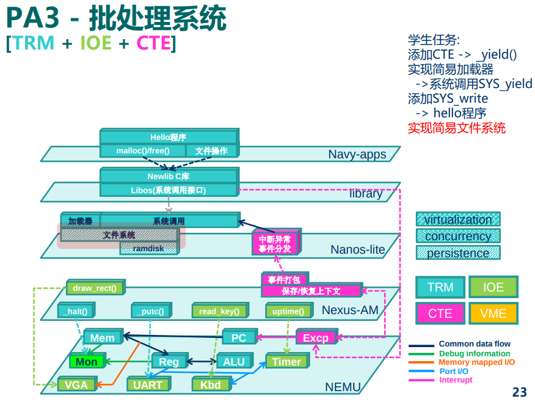

## 4、简易文件系统

> **对用户程序来说, 它怎么知道文件位于ramdisk的哪一个位置呢? 更何况文件会动态地增删, 用户程序并不知情**. 这说明, 把ramdisk的读写接口直接提供给用户程序来使用是不可行的. 操作系统还需要**在存储介质的驱动程序之上为用户程序提供一种更高级的抽象**, 那就是文件.
>
> > 定义一个简易文件系统sfs(Simple File System):
> >
> > * 每个文件的**大小是固定的**
> >
> > * 写文件时**不允许超过原有文件的大小**
> >
> > * 文件的**数量是固定的, 不能创建新文件**
> >
> > * 没有目录(/a/b/c）
>
> 既然文件的数量和大小都是固定的, 我们自然可以把每一个文件分别固定在ramdisk中的某一个位置.&#x20;
>
> **为了记录ramdisk中各个文件的名字和大小, 我们还需要一张"文件记录表**
>
> nanos-lite/Makefile修改后然后运行`make ARCH=riscv32-nemu update`
>
> 就会自动编译Navy中的程序, 并把`navy-apps/fsimg/`目录下的所有内容整合成ramdisk镜像`navy-apps/build/ramdisk.img`, 同时生成这个ramdisk镜像的文件记录表`navy-apps/build/ramdisk.h`, Nanos-lite的`Makefile`会通过软连接把它们链接到项目中.
>
> **如果你修改了Navy中的内容, 请记得通过上述命令来更新镜像文件.**
>
> "文件记录表"其实是一个数组, 数组的每个元素都是一个结构体:
>
> typedef struct {
>
> char \*name;         // 文件名
>
> size\_t size;        // 文件大小
>
> size\_t disk\_offset;  // 文件在ramdisk中的偏移
>
> } Finfo;
>
> 最基本的文件读写操作:
>
> size\_t read(const char \*filename, void \*buf, size\_t len);
>
> size\_t write(const char \*filename, void \*buf, size\_t len);
>
> 操作系统中存在不少"没有名字"的文件（比如管道传输给另一个工具的标准输入，less等）. 为了统一管理它们, \*\*通过一个编号来表示文件, 文件描述符(file descriptor). \*\*
>
> 一个文件描述符对应一个正在打开的文件, **由操作系统来维护文件描述符到具体文件的映射**. 于是我们很自然地通过`open()`系统调用来打开一个文件, 并返回相应的文件描述符
>
> int open(const char \*pathname, int flags, int mode);
>
> 由于sfs的文件数目是固定的, 我们可以简单地把**文件记录表的下标作为相应文件的文件描述符**返回给用户程序. **在这以后, 所有文件操作都通过文件描述符来标识文件**:
>
> size\_t read(int fd, void \*buf, size\_t len);
>
> size\_t write(int fd, const void \*buf, size\_t len);
>
> int close(int fd);
>
> 我们为**每一个已经打开的文件引入偏移量属性**`open_offset`, 来**记录目前文件操作的位置.** 每次对文件读写了多少个字节, 偏移量就前进多少.
>
> 偏移量可以通过`lseek()`系统调用来调整, 从而可以对文件中的任意位置进行读写:
>
> size\_t lseek(int fd, size\_t offset, int whence);
>
> 为了方便用户程序进行标准输入输出, 操作系统准备了三个默认的文件描述符:
>
> \#define FD\_STDIN 0
>
> \#define FD\_STDOUT 1
>
> \#define FD\_STDERR 2
>
> 它们分别对应标准输入`stdin`, 标准输出`stdout`和标准错误`stderr`. 我们经常使用的printf, 最终会调用`write(FD_STDOUT, buf, len)`进行输出;&#x20;
>
> 而scanf将会通过调用`read(FD_STDIN, buf, len)`进行读入.
>
> `nanos-lite/src/fs.c`中定义的`file_table`会包含`nanos-lite/src/files.h`, 其中前面还有3个特殊的文件: `stdin`, `stdout`和`stderr`的占位表项, 它们只是为了保证sfs和约定的标准输入输出的文件描述符保持一致, 例如根据约定`stdout`的文件描述符是`1`, 而我们添加了三个占位表项之后, 文件记录表中的`1`号下标也就不会分配给其它的普通文件了.
>
> 根据以上信息, 我们就可以在文件系统中实现以下的文件操作了:
>
> int fs\_open(const char \*pathname, int flags, int mode);
>
> size\_t fs\_read(int fd, void \*buf, size\_t len);
>
> size\_t fs\_write(int fd, const void \*buf, size\_t len);
>
> size\_t fs\_lseek(int fd, size\_t offset, int whence);
>
> int fs\_close(int fd);
>
> 这些文件操作实际上是**相应的系统调用在内核中的实现**.&#x20;
>
> * 由于sfs中每一个文件都是固定的, 不会产生新文件, 因此"`fs_open()`没有找到`pathname`所指示的文件"属于异常情况, 你需要使用assertion终止程序运行.
>
> * 为了简化实现, 我们**允许所有用户程序都可以对所有已存在的文件进行读写,** 这样以后, 我们在实现`fs_open()`的时候就可以忽略`flags`和`mode`了.
>
> * 使用`ramdisk_read()`和`ramdisk_write()`来进行文件的真正读写.
>
> * 由于文件的大小是固定的, 在实现`fs_read()`, `fs_write()`和`fs_lseek()`的时候, 注意偏移量不要越过文件的边界.
>
> * 除了写入`stdout`和`stderr`之外(用`putch()`输出到串口), 其余对于`stdin`, `stdout`和`stderr`这**三个特殊文件的操作可以直接忽略.**
>
> * 由于sfs**没有维护文件打开的状态**, `fs_close()`可以直接返回`0`, 表示总是关闭成功.
>
> 最后你还需要在**Nanos-lite和Navy的libos中添加相应的系统调用,** 来调用相应的文件操作.

一开始看不懂表达的意思是啥。。。看着看着打算先写了再说。一顿操作猛如虎成功：（自由切换文件，拦截了奇怪的情况）

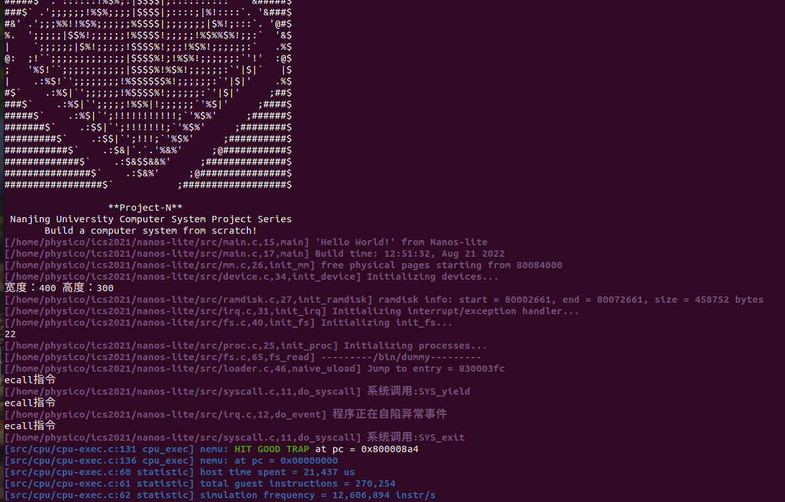

一开始一直想不到怎么在loader对段头表处理部分可以隔离对ramdisk\_read的依赖，因为参数数目不匹配。随后突然想到可以用lseek设置偏移再读写操作，而且我们可以利用结构体偏移量，那么这个抽象就是可以被完成的了。一顿操作猛如虎解除了loader的耦合。

(这里要注意navy系统调用的返回值，请按照man填写否则吃大亏！手册！手册！手册！）

我这里还遇到一个很坑的问题：边界拦截，自己把自己坑了，因为实际上失败返回-1即可，我自己给自己panic了- -。。。。这件事情告诉我们，好好按照man的规定不要自己花里胡哨QAQ

为了更好的调试，学习pony哥方法给log换了个皮肤：

[https://cloud.tencent.com/developer/article/1142372](https://cloud.tencent.com/developer/article/1142372 "https://cloud.tencent.com/developer/article/1142372")

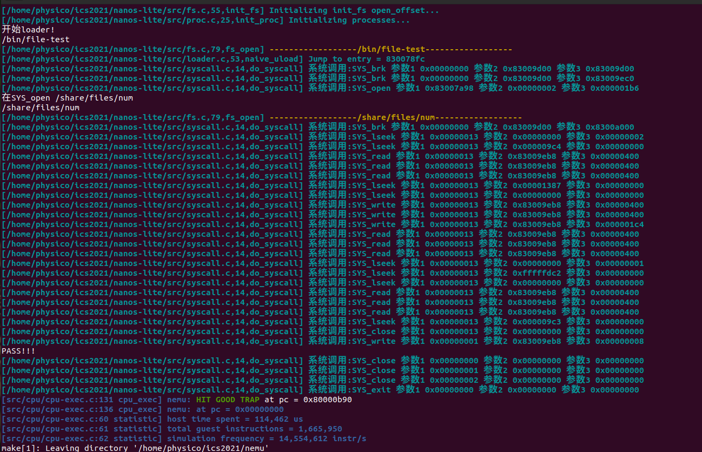

### 一切皆文件

> 我们需要有一种方式对设备的功能进行抽象, 向用户程序提供统一的接口.
>
> * 内存是以字节编址的, 天然就是一个字节序列, 因而我们之前使用的ramdisk作为字节序列也更加显而易见了
>
> * 管道(shell命令中的`|`)是一种先进先出的字节序列, 本质上它是内存中的一个队列缓冲区
>
> * 磁盘也可以看成一个字节序列: 我们可以为磁盘上的每一个字节进行编号, 例如第x柱面第y磁头第z扇区中的第n字节, 把磁盘上的所有字节按照编号的大小进行排列, 便得到了一个字节序列
>
> * socket(网络套接字)也是一种字节序列, 它有一个缓冲区,\*\* 负责存放接收到的网络数据包\*\*,上层应用将socket中的内容看做是字节序列, 并通过一些特殊的文件操作来处理它们. 我们在PA2中介绍了DiffTest, 如果你RTFSC, 就会发现其中的`qemu-diff`就是**通过socket与QEMU进行通信**的, 而操作socket的方式就是`fgetc()`和`fputc()`
>
> * 操作系统提供的一些特殊的功能, 如随机数生成器, 也可以看成一个**无穷长的字节序列**
>
> 文件就是字节序列, 那很自然地, 上面这些五花八门的字节序列应该都可以看成文件.&#x20;
>
> 我们可以使用文件的接口来操作计算机上的一切, 而不必对它们进行详细的区分: 例如 `navy-apps/Makefile`的`ramdisk`规则通过管道**把各个shell工具的输入输出连起来, 生成文件记录表**

### 虚拟文件系统

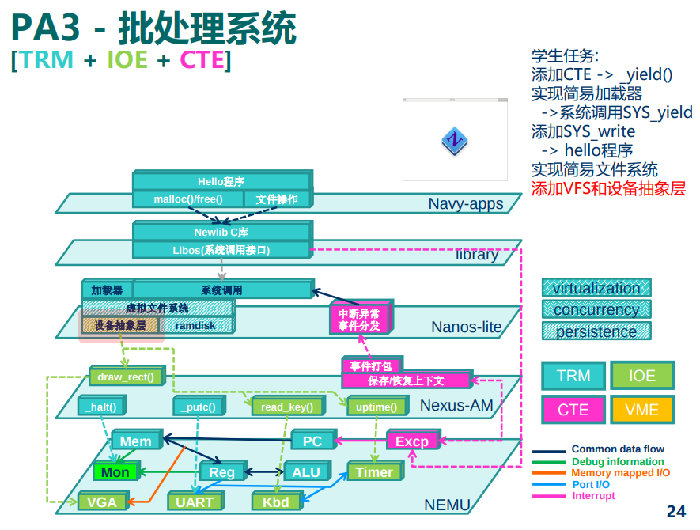

> 真实文件系统, 其实是指**具体如何操作**某一类文件。
>
> VFS其实是对不同种类的真实文件系统的抽象,\*\* 它用一组API来描述了这些真实文件系统的抽象行为, 屏蔽了真实文件系统之间的差异,\*\* 上层模块(比如系统调用处理函数)不必关心当前操作的文件具体是什么类型, 只要调用这一组API即可完成相应的文件操作
>
> 只要把真实文件系统的访问方式包装成VFS的API, 上层模块无需修改任何代码, 就能支持一个新的真实文件系统了
>
> 其中`ReadFn`和`WriteFn`分别是两种函数指针, 它们用于指向真正进行读写的函数, 并返回成功读写的字节数. 有了这两个函数指针, 我们只需要在文件记录表中对不同的文件设置不同的读写函数, 就可以通过`f->read()`和`f->write()`的方式来调用具体的读写函数了.
>
> 由于特殊文件的数量很少, 我们约定, 当上述的函数指针为`NULL`时, 表示相应文件是一个普通文件, 通过ramdisk的API来进行文件的读写, 这样我们就不需要为大多数的普通文件显式指定ramdisk的读写函数了.
>
> 我们把文件看成字节序列, 大部分字节序列都是"静止"的, 例如对于ramdisk和磁盘上的文件, 如果我们不对它们进行修改, 它们就会一直位于同一个地方, 这样的字节序列具有"位置"的概念; 但有一些特殊的字节序列并不是这样, 例如键入按键的字节序列是"流动"的, 被读出之后就不存在了, 这样的字节序列中的字节之间只有顺序关系, 但无法编号, 因此它们没有"位置"的概念.&#x20;
>
> 属于前者的文件支持`lseek`操作, 存储这些文件的设备称为"块设备"; 而属于后者的文件则不支持`lseek`操作, 相应的设备称为"字符设备". 真实的操作系统还会对`lseek`操作进行抽象, 我们在Nanos-lite中进行了简化, 就不实现这一抽象了.

### 操作系统之上的IOE

> 有了VFS, 要把IOE抽象成文件就非常简单了.
>
> 串口. 在Nanos-lite中, `stdout`和`stderr`都会输出到串口. 之前你可能会通过判断`fd`是否为`1`或`2`, 来决定`sys_write()`是否写入到串口. 现在有了VFS, 我们就不需要让系统调用处理函数关心这些特殊文件的情况了: 我们只需要在`nanos-lite/src/device.c`中实现`serial_write()`, 然后在文件记录表中设置相应的写函数, 就可以实现上述功能了. 由于串口是一个字符设备, 对应的字节序列没有"位置"的概念, 因此`serial_write()`中的`offset`参数可以忽略. 另外Nanos-lite也不打算支持`stdin`的读入, 因此在文件记录表中设置相应的报错函数即可.

这一步比较简单，就按照描述加入即可，把fswrite进行一下抽象

> 在Nanos-lite中, 我们也提供一个`SYS_gettimeofday`系统调用, 用户程序可以通过它读出当前的系统时间.

根据以前的am依葫芦画瓢（实际上我们能知道am就是为了这时候做准备）

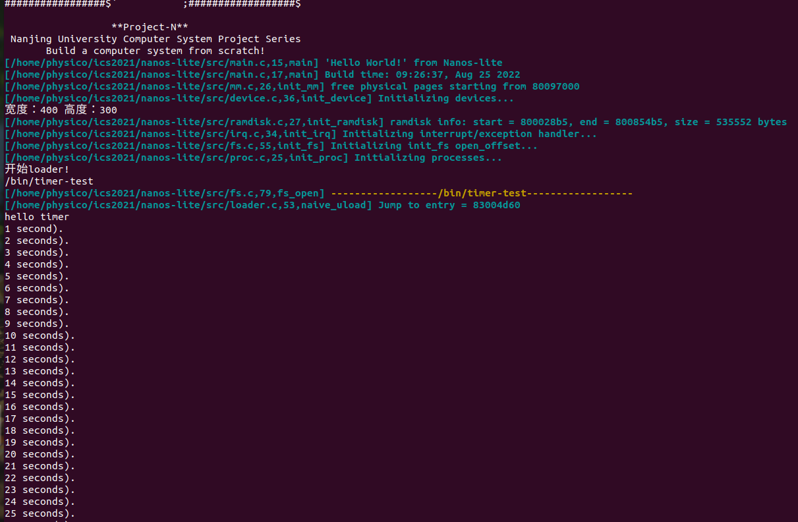

替换成NDL库的过程中，注意NDL的导入（想想make的时候怎么搜索库）

> 另一个输入设备是键盘, 按键信息对系统来说本质上就是到来了一个事件. 一种简单的方式是把事件以文本的形式表现出来, 我们定义以下两种事件,
>
> * 按下按键事件, 如`kd RETURN`表示按下回车键
>
> * 松开按键事件, 如`ku A`表示松开`A`键
>
>     按键名称与AM中的定义的按键名相同, 均为大写. 此外, 一个事件以换行符`\n`结束.
>
>     我们采用文本形式来描述事件有两个好处, 首先文本显然是一种字节序列, 这使得事件很容易抽象成文件; 此外文本方式使得用户程序可以容易可读地解析事件的内容. Nanos-lite和Navy约定, 上述事件抽象成一个特殊文件`/dev/events`, 它需要支持读操作, 用户程序可以从中读出按键事件, 但它不必支持`lseek`, 因为它是一个字符设备.

这里关键问题要理解：**键入按键的字节序列是"流动"的, 被读出之后就不存在了**, **它们没有"位置"的概念**. 属于后者的文件则不支持`lseek`操作, **相应的设备称为"字符设备"**，说明我们需要让数据直接被“读出”，也就是读函数中交互过程能直接把数据传送到我们需要的地方。

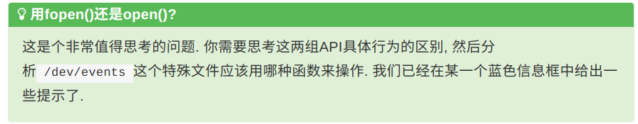

答：实际上fopen得到的FILE也是可以通过转换得到最后的fd的，但是之所以不用是因为可能错误使用了fread，因为这系列的读写操作实际上是对FILE里面的缓冲区进行操作的，而我们的设备文件需要直接把我们需要的buf打印。

注意对好各类接口（返回值 0和1以及对应的buf传输链即可得到结果）

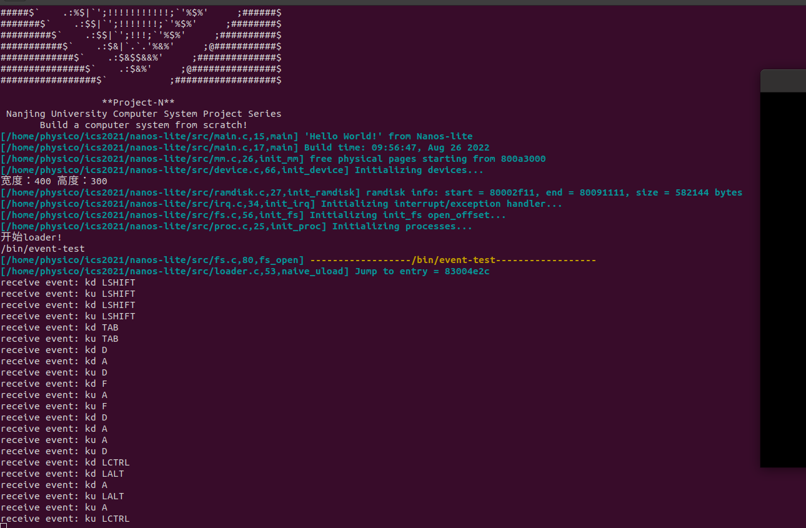

> Nanos-lite需要做的, 便是把显存抽象成文件. **显存本身也是一段存储空间**, 它以行优先的方式存储了将要在屏幕上显示的像素. Nanos-lite和Navy约定, 把显存抽象成文件`/dev/fb`(fb为frame buffer之意), 它需要**支持写操作和**`lseek`, 以**便于把像素更新到屏幕的指定位置上.**
>
> 其中"**画布"是一个面向程序的概念,** 程序绘图时的坐标都是针对画布来设定的, 这样程序就无需关心系统屏幕的大小, 以及需要将图像绘制到系统屏幕的哪一个位置. **NDL可以根据系统屏幕大小以及画布大小, 来决定将画布"贴"到哪里**, 例如贴到屏幕左上角或者居中, 从而将画布的内容写入到frame buffer中正确的位置.
>
> NDL\_DrawRect()的功能和PA2中介绍的绘图接口是非常类似的. 但为了实现它, NDL还需要知道屏幕大小的信息. **Nanos-lite和Navy约定, 屏幕大小的信息通过/proc/dispinfo文件来获得, 它需要支持读操作. navy-apps/README.md中对这个文件内容的格式进行了约定, 你需要阅读它**. 至于具体的屏幕大小, 你需要通过IOE的相应API来获取.

#### 把VGA显存抽象成文件

> 实现`fb_write()`(在`nanos-lite/src/device.c`中定义),&#x20;
>
> 用于把`buf`中的`len`字节写到屏幕上`offset`处. 你需要先从`offset`计算出屏幕上的坐标, 然后调用IOE来进行绘图. 另外我们约定每次绘图后总是马上将frame buffer中的内容同步到屏幕上.
>
> 在NDL中实现`NDL_DrawRect()`, 通过往`/dev/fb`中的正确位置写入像素信息来绘制图像. 你需要梳理清楚系统屏幕(即frame buffer), `NDL_OpenCanvas()`打开的画布, 以及`NDL_DrawRect()`指示的绘制区域之间的位置关系.
>
> 让Nanos-lite运行`navy-apps/tests/bmp-test`, 如果实现正确, 你将会看到屏幕上显示Project-N的logo.

这里我一直卡着没做出来，主要是不理解fb\_write和NDL\_DrawRect到底要做什么。实际上要理解的是，绘制工作已经被am完成了，所以我们只需要吧数据全部丢过去即可。而重要的是在fs的特别write中根据am的接口把我们的数据喂过去（需要w,h,x,y的信息），而NDL是为喂过去而准备的。

【其实就要注意一点，在navy中的读写其实都是依靠fs完成，所以对应的buff和len都是在navy才进行处理，因为那才是真正调用处理的函数，想想他们拿到的东西是什么，是不是一样】

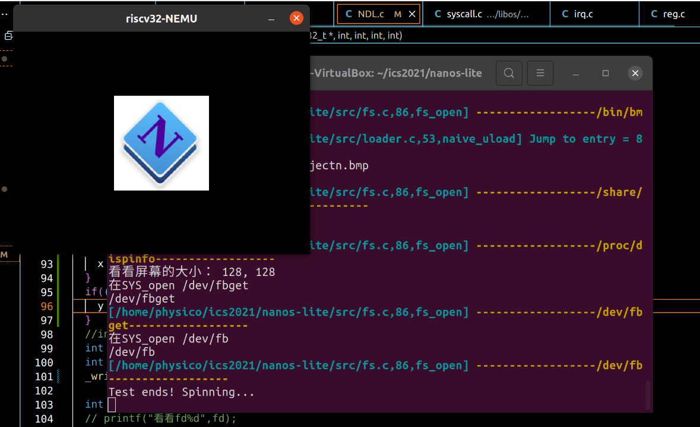

### 精彩纷呈的应用程序

> miniSDL的代码位于`navy-apps/libs/libminiSDL/`目录下, 它由6个模块组成:
>
> * `timer.c`: 时钟管理
>
> * `event.c`: 事件处理
>
> * `video.c`: 绘图接口
>
> * `file.c`: 文件抽象
>
> * `audio.c`: 音频播放
>
> * `general.c`: 常规功能, 包括初始化, 错误管理等
>
> 我们可以通过NDL来支撑miniSDL的底层实现, 让miniSDL向用户程序提供更丰富的功能, 这样我们就可以在Navy上运行更复杂的程序了. miniSDL中的API和SDL同名, 你可以通过[RTFM](https://www.libsdl.org/release/SDL-1.2.15/docs/ "RTFM")来查阅这些API的具体行为. 另外miniSDL中的大部分API都没有实现, 你最好想个办法让程序用到某个未实现API的时候提醒你, 否则你可能难以理解由此导致的复杂程序非预期行为.
>
> 虽然Navy的`native`和AM中的`native`同名, 但它们的机制是不同的:&#x20;
>
> 在AM native上运行的系统, 需要AM, Nanos-lite, libos, libc这些抽象层来支撑上述的运行时环境,&#x20;
>
> 在AM中的`ARCH=native`, 在Navy中对应的是`ISA=am_native`; 而在**Navy native中, 上述运行时环境是直接由Linux native实现的.**

#### 问：神奇的LD\_PRELOAD

`bmp-test`需要打开一个路径为`/share/pictures/projectn.bmp`的文件, 但在Linux native中, 这个路径对应的文件并不存在. 但我们还是把`bmp-test`成功运行起来了, 你知道这是如何实现的吗? 如果你感兴趣, 可以在互联网上搜索`LD_PRELOAD`相关的内容.

答：LD\_PRELOAD是Linux系统的一个环境变量，它可以影响程序的运行时的链接（Runtime linker），它允许你定义在程序运行前优先加载的动态链接库。这个功能主要就是用来有选择性的载入不同动态链接库中的相同函数。通过这个环境变量，我们可以在主程序和其动态链接库的中间加载别的动态链接库，甚至覆盖正常的函数库。一方面，我们可以以此功能来使用自己的或是更好的函数（无需别人的源码），而另一方面，我们也可以以向别人的程序注入程序，从而达到特定的目的。

SDL2常用函数&结构分析:SDL\_Surface\&SDL\_GetWindowSurface\&SDL\_LoadBMP

[https://blog.csdn.net/qq\_25333681/article/details/89789479](https://blog.csdn.net/qq_25333681/article/details/89789479 "https://blog.csdn.net/qq_25333681/article/details/89789479")

幻灯片显示：

这里的pdf转换一开始我还以为只能转换开头那张pdf。。。经过查资料后成功转了其他页面\~

有可能会出现数字键爆炸的问题，请注意是否清除缓存以及键盘type。

接下来实现menu，有点痛不欲生。。。

其实SDL\_FillRect的关键是要理解什么是像素。。。其实像素是一个“数组”里面根据00rrrggbb00rrrggbb这样的方式排列下去（4byte的情况），理解了这点就好办了。理解画布并不是要画上去，只是准备画布。

**接下来最难的就是SDL\_BlitSurface的实现：**

实现后能看到这样的画面：开始菜单（还没有execve的功能）

#### NTerm (NJU Terminal)

#### Flappy Bird

这里我首当其冲遇到了爆炸问题：fe\_read出边界，但实际上是手册没读好的问题。。。。（被pony哥拯救系列）

然后又遇到了- -神奇的按键没反应的情况。。。。后面发现是对“事件”不够理解。。。如果你也遇到了请仔细阅读事件的定义然后反思下某个函数是否返回正确。。。。

#### 仙剑奇侠传

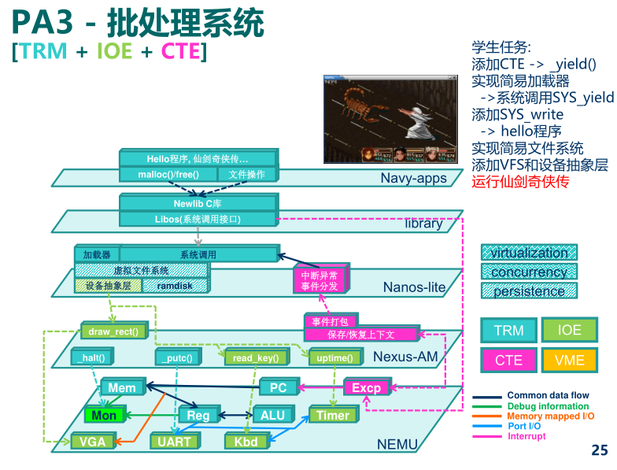

首先很快就找到了data（就是data，其他花里胡哨的不算）然后你可能会看到一坨大写文件发现段错误。。。。这里是个坑

**【具体查找过程开gdb，你会发现出错的地方。。。。。建议不要放过这个过程。】**

首先在pal下运行`make ISA=native gdb` 查找段错误的原因，此时你会看到一个io错误，fp=NULL（0x0），那么是什么文件打开错误呢？

**注意到讲义**：此外, 你还需要创建配置文件`sdlpal.cfg`, 具体请阅读`repo/docs/README.md`和`repo/docs/sdlpal.cfg.example`.

一顿操作找到了cfg文件，那么这个要放在那呢？

先在makefile中加入-g 方便调试（具体什么地方自己找apps），然后在pal下继续gdb，r结束后**bt打印堆栈信息**，这时候你就会发现访问某个文件出错了，找到对应的文件即可（或者把cfg放进去。）。如果你发现他需要访问某个share/games之类的文件信息，检查下有没有，然后想想在之前的小鸟下做了什么操作。

反复测试直到make ISA=native run不报错，此时你就发现make run 可以运行了！

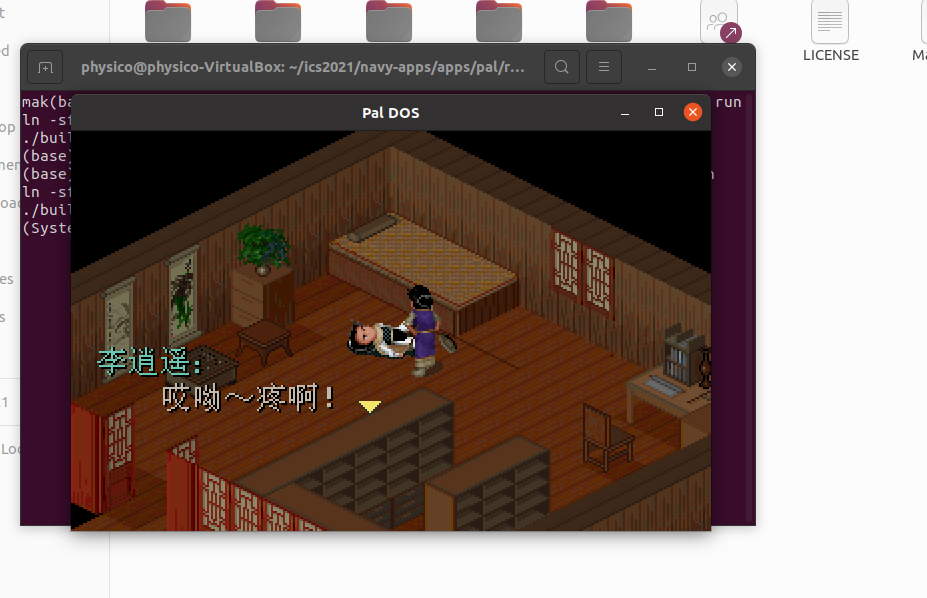

但是在这里native还不能运行，这是因为我们还没有处理调色盘（这里关键的是理解调色盘）

注意到此时的pixels只是索引，那么我们要做的就是取出真正的像素做成真正的pixels喂给NDL即可。

如果遇到有些update还是没有去除的奇怪情况，建议在pal重新install后再update run看看。

处理完成后成功跑native\~:

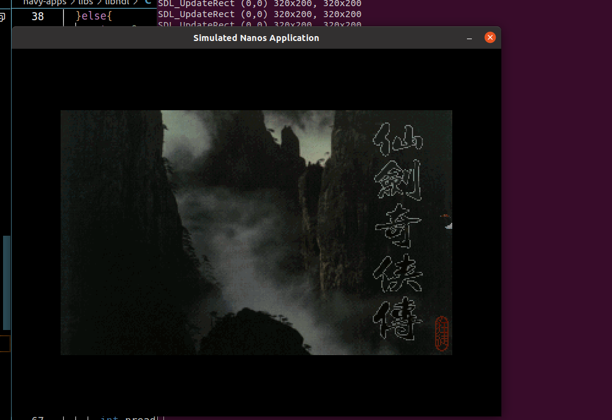

接下来发现跑nemu还是有点问题，主要是update实现不对，又要返工一下ndl。。。。。（注意到这里的src→w和w其实是有区别的。我们需要理解以下几点：【我在这卡了特别久。。】

**NDL\_DrawRect的xywh对pixels做什么，为什么**

**SDL\_UpdateRect的xywh要对surface做什么为什么？**

实际上这是一个抠图的过程。wh是我们在运行中需要扣出的范围，而实际上的s是画布，我们要把x,y偏移处的东西从surface抠出来然后更新到NDL中，让他更新到屏幕。

然后这里我有个问题，就是我的x,y居中逻辑是错误的，因为没有旧xy的信息只是强制更新，容易出问题，换了一版新的逻辑正常了。

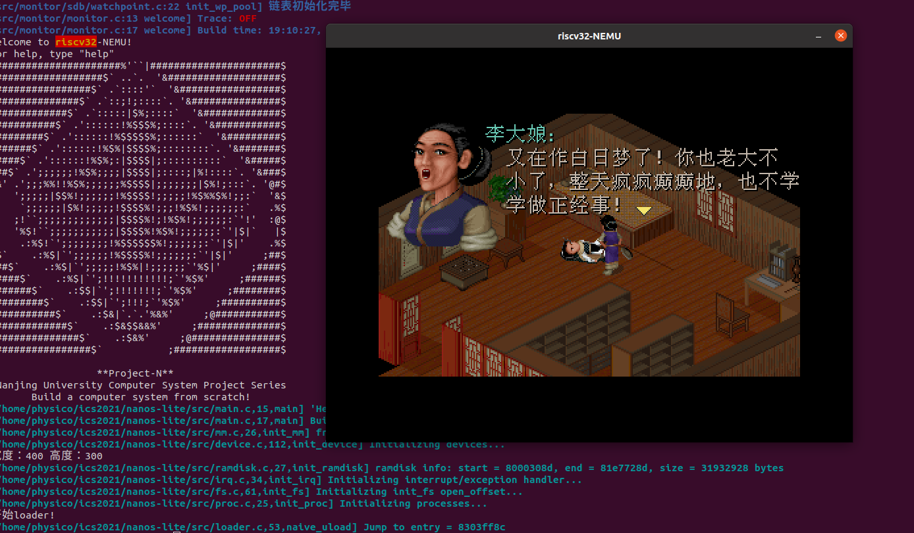

我的fps只有6左右，有小伙伴最高11，不过还是感觉很流畅的\~

刚跑出来的时候我是特别开心的，高兴了一晚上睡不着。

显卡读写是我的一生之敌，真的花了很久去理解像素的绘制，这个还是需要动手会比较直观。

#### 问：仙剑奇侠传的框架是如何工作的?

> 我们在PA2中讨论过一个游戏的基本框架, 尝试阅读仙剑奇侠传的代码, 找出基本框架是通过哪些函数实现的. 找到之后, 可能会对你调试仙剑奇侠传带来一定的帮助. 虽然仙剑奇侠传的代码很多, 但为了回答这个问题, 你并不需要阅读大量的代码.

#### 问：仙剑奇侠传的脚本引擎

在`navy-apps/apps/pal/repo/src/game/script.c`中有一个`PAL_InterpretInstruction()`的函数, 尝试大致了解这个函数的作用和行为. 然后大胆猜测一下, 仙剑奇侠传的开发者是如何开发这款游戏的? 你对"游戏引擎"是否有新的认识?

#### am-kernels

开局一条狗内容全靠偷后实现（基本上native能跑就胜利）

这里如果出现找不到文件错误，可以尝试一下子文件

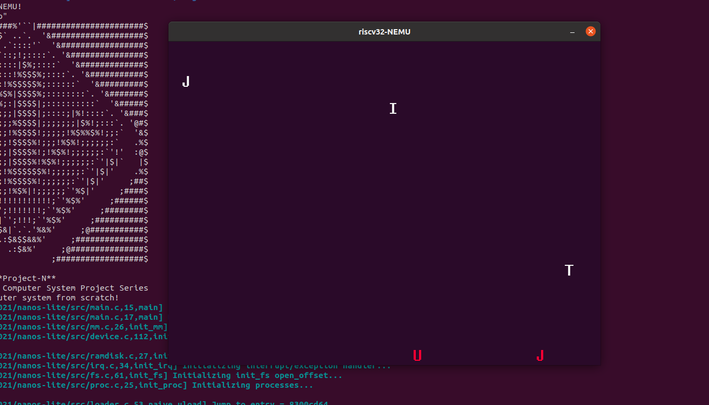

#### FCEUX

一开始卡着段错误。。。然后打印后发现其实是rom没有东西 是个NULL 。。

翻了一下源码后恍然大悟，成功调出\~

快乐卡比

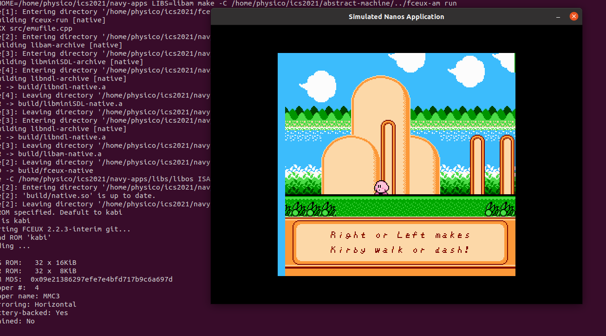

### 展示你的批处理系统

这里我实现execve后遇到了魔数爆炸的情况。。。。最后发现是有个地方偏移没有清零- -。。。。。难怪读取不正确（总感觉是读写的问题）修改后一切正常\~

然后菜单menu一直有不显示的情况。。。感到非常伤心

然后pony哥教我gdb调试后发现一个窗口创建的问题- -，不知道原因是什么,最后排查源码发现原来又是一个api没认真看手册漏的坑（之前被自己删掉了一句）。。。。open窗口，难怪一直不显示。

修改后正常：（给不同游戏加个退出，就非常帅气了！）

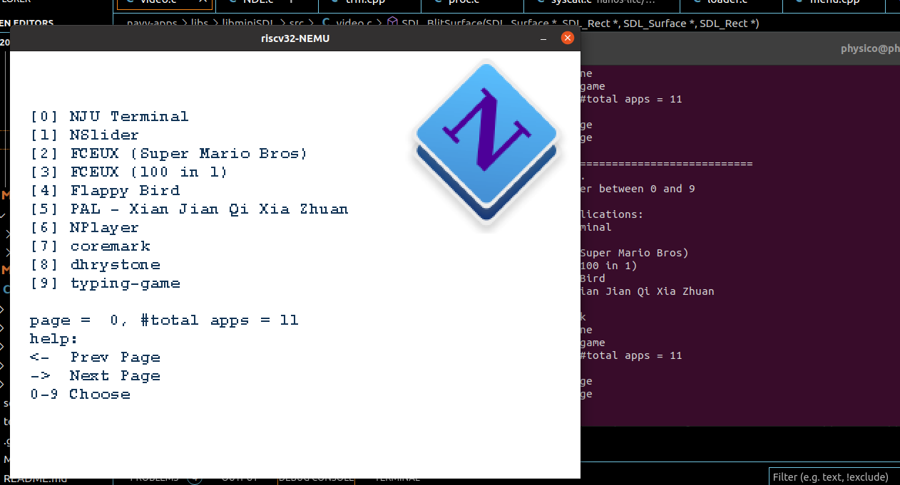

最后处理了一下execvp相关内容 顺利完成 \~\~(原来不需要自己实现。。。害我之前还以为要自己设定env

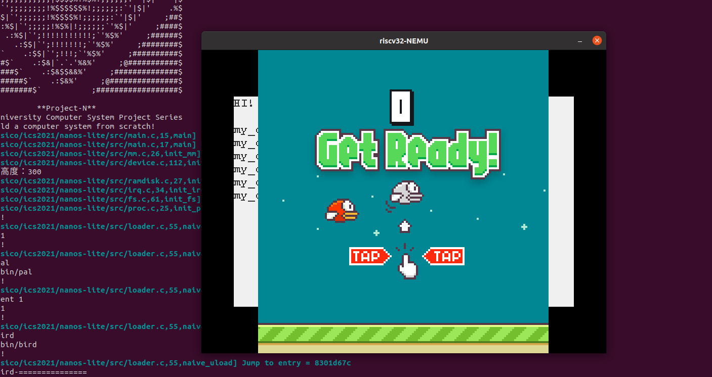

（不太完美的地方就是不会清屏\~）

接下来开始接受pa4的折磨。。。
