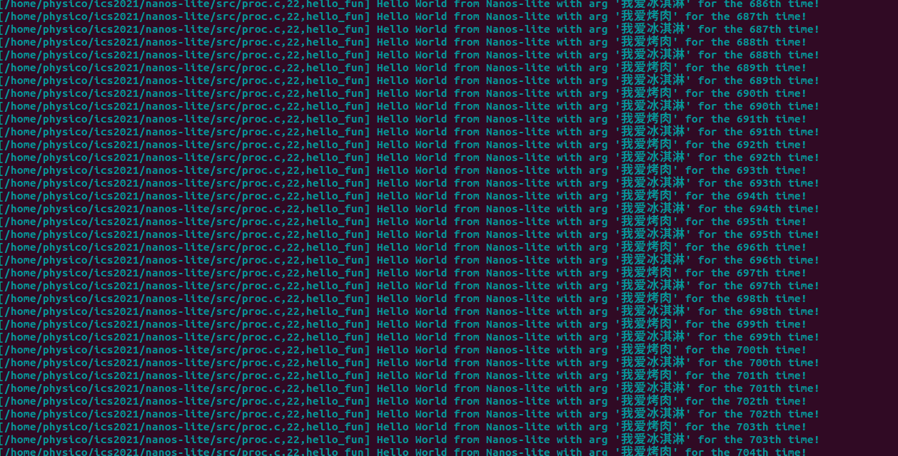

虚实交错的魔法: 分时多任务

从这我越来越感受到系统复杂度上升带来的挑战，也明白了抽象的根本目的。

抽象是为了降低复杂度，为了系统能够更好的做大以及稳健和排错。

而且抽象能让你切换不同的“后续程序”进行测试，甚至在大概率正确的载体上进行diff查看到底是哪一层出现了问题（参考各种native）

如何相信抽象是对的？——对每一个抽象层完成后的充分测试。

善用assert是魔法！

（个人能力受限，挂在了2阶的最后pal阶段。。。其实基本也算是做完了.也许有机会能请教大佬解决一下，这样就可以做第三阶段了，很可惜，但也只能这样了。）

2022年9月16日记

## 上下文切换

**自从有了上下文切换后，程序也就有了进程的概念。（从静止到运动的飞跃 \~\~·）**

> 假设进程A运行的过程中触发了系统调用, 陷入到内核. 根据`__am_asm_trap()`的代码, A的上下文结构(`Context`)将会被保存到A的栈上. 在PA3中, 系统调用处理完毕之后, `__am_asm_trap()`会根据栈上保存的上下文结构来恢复A的上下文.

> 如果我们先不着急恢复A的上下文, 而是先将栈顶指针切换到另一个进程B的栈上, 那会发生什么呢? 由于B的栈上存放了之前B保存的上下文结构, 接下来的操作就会根据这一结构来恢复B的上下文.&#x20;
> 上下文切换其实就是不同进程之间的栈切换!

### 进程控制块

> 有不少信息都是进程相关的, 除了刚才提到的上下文指针`cp`之外, 上文提到的栈空间也是如此.&#x20;
> 为了方便对这些进程相关的信息进行管理, 操作系统使用一种叫进程控制块(PCB, process control block)的数据结构, 为每一个进程维护一个PCB.
> Nanos-lite使用一个联合体来把其它信息放置在进程堆栈的底部. 代码为每一个进程分配了一个32KB的堆栈, 已经足够使用了, 不会出现栈溢出导致UB.&#x20;
> 在进行上下文切换的时候, **只需要把PCB中的**`cp`指针返回给CTE的`__am_irq_handle()`函数即可, 剩余部分的代码会根据上下文结构恢复上下文.

### 内核线程

> 对于刚刚加载完的进程, 我们要怎么切换到它来让它运行起来呢??
> 答案很简单, 我们只需要在**进程的栈上人工创建一个上下文结构, 使得将来切换的时候可以根据这个结构来正确地恢复上下文即可.**
> 我们先把Nanos-lite中直接定义的一些测试函数作为程序. Nanos-lite提供了一个测试函数`hello_fun()`(在`nanos-lite/src/proc.c`中定义),&#x20;
> 我们接下来的任务就是**为它创建一个上下文, 然后切换到它来执行. 这样的执行流有一个专门的名称, 叫"内核线程"(kernel thread).**
>
> 创建内核线程的上下文是通过CTE提供的`kcontext()`函数 (在`abstract-machine/am/src/$ISA/nemu/cte.c`中定义)来实现的,
> 在Nanos-lite中, 我们可以通过一个`context_kload()`函数来进行进一步的封装: 它会调用`kcontext()`来创建上下文, 并把返回的指针记录到PCB的`cp`中
>
> 上下文的创建和切换是CTE的工作, 而具体切换到哪个上下文, 则是由操作系统来决定的, 这项任务叫做进程调度
> 进程调度是由`schedule()`函数(在`nanos-lite/src/proc.c`中定义)来完成的, 它用于返回将要调度的进程上下文. 因此, 我们需要一种方式来记录当前正在运行哪一个进程, 这样我们才能在`schedule()`中返回另一个进程的上下文
>
> 我们让`schedule()`总是切换到`pcb[0]`. 注意它的上下文是通过`kcontext()`创建的, 在`schedule()`中才决定要切换到它, 然后在CTE的`__am_asm_trap()`中才真正地恢复这一上下文.

努力理解了一下，然后写了个汇编，成功点亮\~（主要卡在kcontex如何传送area）

这里还要思考一下area到底怎么才是对的。开头地址kstack.start应该拿谁？那段空间应该从哪边开始界定（这也是需要理解的坑）

### 内核线程的参数

> &#x20;我们来创建两个内核线程, 给它们传递不同的参数, 然后在输出的信息中把参数也一同输出, 这样我们就能看到执行流在两个内核线程之间来回切换了!
> &#x20;我们只需要让`kcontext()`按照调用约定将`arg`放置在正确的位置, 将来`hello_fun()`执行的时候就可以获取正确的参数了.

感叹这个设计真聪明\~

#### 实现上下文切换(2)

> 根据讲义的上述内容, 实现以下功能:
>
> * 修改CTE的`kcontext()`函数, 使其支持参数`arg`的传递
>
> * 通过`kcontext()`创建第二个以`hello_fun()`为入口的内核线程, 并传递不同的参数
>
> * 修改Nanos-lite的`schedule()`函数, 使其轮流返回两个上下文
>
> 你可以自行约定用何种类型来解析参数`arg`(整数, 字符, 字符串, 指针等皆可), 然后修改`hello_fun()`中的输出代码, 来按照你约定的方式解析`arg`. 如果你的实现正确, 你将会看到`hello_fun()`会轮流输出不同参数的信息.

这里要想想，riscv用什么方法传参呢？然后思考一下会不会和我们之前的操作有没有冲突（本质是执行顺序的问题，实际上没任何问题）

为什么这里叫做内核线程？我的想法是因为他在nanos内部调用实现，并且可以达到快速的执行流切换的效果。

> 在真实的操作系统中, 内核中的很多后台任务, 守护服务和驱动程序都是以内核线程的形式存在的. 如果你执行`ps aux`, 你就会看到系统中有很多COMMAND中带有中括号的内核线程(例如`[kthreadd]`). 而创建和执行它们的原理, 也是和上面的实验内容非常相似(当然具体实现肯定会有所不同).

有关一些调用约定：

## 用户进程

#### 创建用户进程上下文

> 在PA3的批处理系统中, 我们在`naive_uload()`中直接通过函数调用转移到用户进程的代码, **那时候使用的还是内核区的栈**

怎么知道的？因为naive\_uload跳转的entry本质是在nanos的时候调用函数，出入栈都在内部完成。

> **如果内核线程发生了栈溢出, 怎么办?**
>
> 如果能检测出来, 最好的方法就是触发kernel panic, 因为这时候内核的数据已经不再可信, 如果将一个被破坏的数据写回磁盘, 将会造成无法恢复的毁灭性损坏.
>
> 好消息是, 内核线程的正确性可以由内核开发人员来保证, 这至少要比保证那些来路不明的用户进程的正确性要简单多了. 而坏消息则是, 大部分的内核bug都是第三方驱动程序导致的: 栈溢出算是少见的了, 更多的是use-after-free, double-free, 还有难以捉摸的并发bug. 而面对海量的第三方驱动程序, 内核开发人员也难以逐一保证其正确性. 如果你想到一个可以提升驱动程序代码质量的方法, 那就是为计算机系统领域作出贡献了.

> **Nanos-lite和Navy作了一项约定: Nanos-lite把栈顶位置设置到GPRx中**, 然后由Navy里面的`_start`来**把栈顶位置真正设置到栈指针寄存器中**.

这里我实现后一直出不来。。（首先记得不能在init加载程序了）

最后发现原来是局部变量和全局的问题（我把参数设置在init，init结束后在stack上的参数自动没了。。。所以就找不到了），最好的方法是直接传入或者是全局变量

此时有点“一起卡”的感觉，本质是因为pal 的屏幕io的时候就切换去跑hello了。（yield）

#### 问：如何验证仙剑奇侠传确实在使用用户栈而不是内核栈?

只要获取pal内部的地址信息在什么范围即可。

还好检查了一下这个，一看发现我的pal还是在内核，直接翻车- -

后面思考了一下发现应该是stack分配的问题。。这点上讲义确实不骗人 老老实实实现就行了。

认真注意这句话：“目前我们让Nanos-lite把`heap.end`作为用户进程的栈顶, 然后把这个栈顶赋给用户进程的栈指针寄存器就可以了.”

### 用户进程的参数

> 最适合存放参数和环境变量的地方就是用户栈了, 因为在**首次切换到用户进程的时候, 用户栈上的内容就已经可以被用户进程访问. 于是操作系统在加载用户进程的时候**, 还需要负责把`argc/argv/envp`以及相应的字符串放在用户栈中,
> 把它们的存放方式和位置作为和用户进程的约定之一, 这样用户进程在`_start`中就可以根据约定访问它们了.
>
> [https://github.com/riscv-non-isa/riscv-elf-psabi-doc](https://github.com/riscv-non-isa/riscv-elf-psabi-doc "https://github.com/riscv-non-isa/riscv-elf-psabi-doc")
> ABI手册有一节Process Initialization的内容, \*\*里面详细约定了操作系统需要为用户进程的初始化提供哪些信息. \*\*不过在我们的Project-N系统里面, 我们只需要一个简化版的Process Initialization就够了: 操作系统将`argc/argv/envp`及其相关内容放置到用户栈上, 然后将GPRx设置为`argc`所在的地址.

这里遇到了一个问题，数组一旦作为参数传入后就退化成了指针，我们怎么才能求得正确的大小呢？一个机智的方式是在末尾留个NULL（很多东西都参考了这个设计），这样就可以随意遍历求得数组大小了。

每次操作差点忘记操作栈顶导致翻车，一顿操作猛如虎安排好了用户栈的空间状况，成功跳过开头。（pal的代码写的确实比较通俗）

### 实现带参数的SYS\_execve

> 用户进程的参数还是应该由用户来指定的.最好能有一个方法能把用户指定的参数告诉操作系统,&#x20;
>
> 让操作系统来把指定的参数放到新进程的用户栈里面.&#x20;
>
> 为了实现带参数的`SYS_execve`, 我们可以在`sys_execve()`中直接调用`context_uload()`. 但我们还需要考虑如下的一些细节, 为了方便描述, 我们假设用户进程A将要通过`SYS_execve`来执行另一个新程序B.
>
> * 如何在A的执行流中创建用户进程B?
>
> * 如何结束A的执行流?
>
> 我们可以从栈底(`heap.end`)到栈顶(栈指针`sp`当前的位置)列出用户栈中的内容:
>
> * Nanos-lite之前为A传递的用户进程参数(`argc/argv/envp`)
>
> * A从`_start`开始进行函数调用的栈帧, 这个栈帧会一直生长, 直到调用了libos中的`execve()`
>
> * **CTE保存的上下文结构,** 这是由于A在`execve()`中执行了系统调用自陷指令导致的
>
> * Nanos-lite从`__am_irq_handle()`开始进行函数调用的栈帧, 这个栈帧会一直生长, 直到调用了`SYS_execve`的系统调用处理函数
>
> 通过上述分析, 我们得出一个重要的结论: **在加载B时, Nanos-lite使用的是A的用户栈! 这意味着在A的执行流结束之前, A的用户栈是不能被破坏的.** 因此`heap.end`附近的用户栈是不能被B复用的, 我们应该申请一段新的内存作为B的用户栈
>
> 可以让`context_uload()`统一通过调用`new_page()`函数来获得用户栈的内存空间. `new_page()`函数在`nanos-lite/src/mm.c`中定义, 它会通过一个`pf`指针来管理堆区, 用于分配一段大小为`nr_page * 4KB`的连续内存区域, 并返回这段区域的首地址. 我们让`context_uload()`通过`new_page()`来分配32KB的内存作为用户栈, 这对PA中的用户程序来说已经足够使用了.
>
> 操作系统作为一个特殊的AM应用, 很多时候对动态内存申请却有更严格的要求, 例如申请一段起始地址是4KB整数倍的内存区域, `malloc()`通常不能满足这样的要求. 因此操作系统一般都会自己来管理堆区, 而不会调用klib中的`malloc()`. 在操作系统中管理堆区是MM(Memory Manager)模块的工作

一开始理解错了什么是A还以为hello是A。。。。。然后被提醒后看了好几遍发现原来是这个意思= = （联系一下PA的上文，搞清楚到底是什么进程，这个进程在当下是什么，要换成什么进程）

一顿操作猛如虎成功：

这里运行nterm又挂了（其他都可以）我哭了- - 又开始排查问题，发现传入argc就会挂。。。具体原因不明，又要继续排查。最后发现是argv飞掉的问题（没有参数的时候如果传入指针拦不住）

总结：你必须搞清楚上下文是怎么从创建到调度的全过程，这样才能理解关键的每一个细节。

### 运行Busybox

我的不知道为啥遇到了致命的ld错误。。。。没办法跑

只能放弃了（很神奇的ld符号缺失）

虽然我后面暴力调整了源码可以编译通过了- -但是只能cat之类的基础功能。。。

然后不知道为什么让虚拟机走了几次快照，就可以用了- -只能说计算机真神奇呀。。。

WC也完美运行\~

—skip也同理完结\~ 这阶段最主要的就是麻烦。。很多时候可能一不小心argv就会爆炸。

第一阶段结束,这一阶段的关键就是1：上下文执行流是怎么保存和切换的 2：有关参数的指针小练习

以下几个问题：

* 终端如何读取用户的按键?

各种等待键盘事件。。。

* Shell如何进行命令的解析?

可以类似eval,然后要注意argv的维护

* 库函数如何根据命令解析出的字符串搜索到可执行文件?

execvp，维护了一个PATH

* 操作系统如何加载执行一个可执行文件?

维护参数表进入一个\_start，处理后才进行真正的main（上下文切换和跳转）

## 程序和内存位置（很感人的阅读环节）

### 绝对代码

> 一般来说, 程序的内存位置是在[链接时刻(link time)](https://en.wikipedia.org/wiki/Link_time "链接时刻(link time)")确定的(Navy-apps中的程序就是这样), 以前的程序员甚至在程序中使用绝对地址来进行内存访问, 这两种代码称为绝对代码(absolute code).&#x20;
>
> 绝对代码会假设程序中的对象(函数和数据)位于某个固定的位置, 绝对代码只能在固定的内存位置才能正确运行.
>
> 操作系统在加载时刻分配的空闲内存位置, 并不总是能让这种程序正确运行.&#x20;
>
> 因此, 这个问题的一个解决方案, 就是让操作系统记录程序的加载位置, 当一个程序试图加载到一个已经被使用的内存位置时, 加载将会失败, 操作系统将返回一个错误. 为了避免加载失败, 一个方法是**为每个程序维护多个不同加载地址的版本**, 期望其中有一个版本可以被成功加载.

### 可重定位代码

> 为什么一定要提前确定一个程序的加载位置呢? 如果我们把链接时的重定位阶段往后推迟, 不就可以打破绝对代码的限制了吗?
>
> 于是有程序员开发了一类"[自重定位(self-relocation)](https://en.wikipedia.org/wiki/Self-relocation "自重定位(self-relocation)")"的特殊程序, 这种程序可以\*\*在开始运行的时候, 先把自己重定位到其它内存位置, \*\*然后再开始真正的运行. 这种重定位类型称为"[运行时(run time)](https://en.wikipedia.org/wiki/Run_time_\(program_lifecycle_phase\) "运行时(run time)")重定位".
>
> 但对多任务操作系统来说, 这并没有真正解决问题, 因为程序在运行时刻并不知道重定位的**目标内存位置是否空闲**.
>
> 既然只有操作系统才知道内存是否空闲, 那就干脆让加载器来进行重定位吧, 于是有了"[加载时(load time)](https://en.wikipedia.org/wiki/Loader_\(computing\) "加载时(load time)")重定位"的说法.&#x20;
>
> 具体地, **加载器会申请一个空闲的内存位置, 然后将程序加载到这个内存位置, 并把程序重定位到这个内存位置, 之后才会执行这个程序**. 今天的GNU/Linux就是通过这种方式来插入[内核模块](https://en.wikipedia.org/wiki/Loadable_kernel_module "内核模块")的.

### 位置无关代码 PIC

> 有没有方法可以节省重定位的开销, 甚至不进行重定位呢? 但链接时的重定位又可能会产生绝对代码, 这并不是我们所希望的 **. 如果程序中的所有寻址, 都是针对程序位置来进行相对寻址操作, 这样的程序就可以被加载到任意位置执行, 而不会出现绝对代码的问题**
>
> 这就是[PIC(position-independent code, 位置无关代码)](https://en.wikipedia.org/wiki/Position-independent_code "PIC(position-independent code, 位置无关代码)")的基本思想. 今天的动态库都是PIC, 这样它们就可以被加载到任意的内存位置了. 此外, 如果一个可执行文件全部由PIC组成, 那么它有一个新名字, 叫[PIE(position-independent executable, 位置无关可执行文件)](https://en.wikipedia.org/wiki/Position-independent_code#PIE "PIE(position-independent executable, 位置无关可执行文件)"). 编译器可以通过特定的选项编译出PIE.
>
> PIE之所以能做到位置无关, 其实是要依赖于程序中一个叫[GOT(global offset table, 全局偏移量表)](https://www.technovelty.org/linux/plt-and-got-the-key-to-code-sharing-and-dynamic-libraries.html "GOT(global offset table, 全局偏移量表)")的数据结构
>
> &#x20;但总有一些包含绝对代码的程序, 考虑到兼容问题, 还需要想办法运行它们. 有没有更好的, 一劳永逸的方案呢?

### 虚实交错的魔法

> 绝对代码经过编译链接之后, 程序看到的内存地址就会确定下来了, 加载运行的时候就会让程序使用这一内存地址, 来保证程序可以正确运行.&#x20;
> 一种尝试是**把程序看到的内存和它运行时候真正使用的内存解耦开来**. 这就是虚拟内存的思想.
>
> 有了虚拟内存之后, 进程只需要认为自己运行在虚拟地址上就可以了, 真正运行的时候, 才把虚拟地址映射到物理地址.&#x20;
>
> 我们只要\*\*把程序链接到一个固定的虚拟地址, 加载的时候把它们加载到不同的物理地址, 并维护好虚拟地址到物理地址的映射关系, \*\*

关键：**硬件把物理地址映射成虚拟地址，维护地址映射功能。操作系统决定具体要把虚拟地址映射到哪些物理地址**。

虚拟内存机制是一个**软硬协同**才能工作的机制: &#x20;

1. 操作系统加载进程的时候决定要**把进程的虚拟地址映射到哪些物理地址**;

2. 等到进程真正运行之前, 还需要**配置MMU, 把之前决定好的映射落实到硬件**上,&#x20;

3. 进程运行的时候, **MMU就会进行地址转换, 把进程的虚拟地址映射**到操作系统希望的物理地址.&#x20;

（注意到这个映射是进程相关的: 不同的进程有不同的映射,）

### 分段

> MMU地址映射最简单的方法就是, 物理地址=虚拟地址+偏移量。即段式虚拟内存管理机制, 简称分段机制.&#x20;
>
> 把物理内存划分成若干个段, 不同的进程就放到不同的段中运行, 进程不需要关心自己具体在哪一个段里面, **操作系统只要让不同的进程使用不同的偏移，进程之间就不会相互干扰**
>
> Minix就是这样工作的, 一些简单的嵌入式系统和实时系统, 也是通过分段机制来进行虚存管理.
>
> 但是很复杂+性能不高，实际上现在没什么人用这个了。。。。。

## 超越容量的界限

这部分我看的有点吃力，参考了一些其他资料：

[https://blog.csdn.net/jinking01/article/details/107098437](https://blog.csdn.net/jinking01/article/details/107098437 "https://blog.csdn.net/jinking01/article/details/107098437")

[<https://blog.csdn.net/starter>\_\_\_\_ \_/article/details/100998087](https://blog.csdn.net/starter_____/article/details/100998087 "https://blog.csdn.net/starter_____/article/details/100998087")

[https://www.cnblogs.com/wkfvawl/p/11700301.html](https://www.cnblogs.com/wkfvawl/p/11700301.html "https://www.cnblogs.com/wkfvawl/p/11700301.html")

为什么 Linux 默认页大小是 4KB

[https://draveness.me/whys-the-design-linux-default-page/](https://draveness.me/whys-the-design-linux-default-page/ "https://draveness.me/whys-the-design-linux-default-page/")

其中页目录项和页表项的结构是

* present位表示物理页是否可用, 不可用的时候又分两种情况:

    1. 物理页面由于交换技术被交换到磁盘中了, Page fault

    2. 图访问一个未映射的线性地址, 并没有实际的物理页与之相对应, 就是一个非法操作

* R/W位表示物理页是否可写

* U/S位表示访问物理页所需要的权限, 如果一个ring 3的进程尝试访问一个ring 0的页面, 当然也会被判定为非法操作

### 分页

> 事实上, 我们需要一种**按需分配的虚存管理机制**. 之所以分段机制不好实现按需分配, 就是因为段的粒度太大了, 为了实现这一目标, 我们需要反其道而行之: **把连续的存储空间分割成小片段, 以这些小片段为单位进行组织, 分配和管理. 这正是分页机制的核心思想**
>
> 分页机制引入了一个叫"页表"的结构, **页表中的每一个表项**记录了一个**虚拟页到物理页的映射关系,** 来\*\*把不必连续的物理页面重新组织成连续的虚拟地址空间. \*\*
>
> 操作系统首先需要以物理页为单位对内存进行管理. \*\*每当加载程序的时候, 就给程序分配相应的物理页(注意这些物理页之间不必连续), 并为程序准备一个新的页表, 在页表中填写程序用到的虚拟页到这些物理页的映射关系. \*\*
>
> 等到程序运行的时候, 操作系统就\*\*把之前为这个程序填写好的页表设置到MMU中, MMU就会根据页表的内容进行地址转换, \*\*把程序的虚拟地址空间映射到操作系统所希望的物理地址空间上.
>
> **每一张页目录和页表都有1024个表项, 每个表项的大小都是4字节**, （4k）
>
> 除了包含页表(或者物理页)的基地址, 还包含一些标志位信息. 要放在寄存器中是不可能的, **因此它们要放在内存中. 为了找到页目录, i386提供了一个CR3(control register 3)寄存器, 专门用于存放页目录的基地址**.&#x20;
>
> 这样,\*\* 页级地址转换就从CR3开始一步一步地进行, 最终将虚拟地址转换成真正的物理地址, 这个过程称为一次page table walk.\*\*

总结：操作系统负责写好小纸条和分配关系，MMU负责执行小纸条。

#### 问：虚存管理中PIC的好处

我们之前提到, PIC的其中一个好处是可以将代码加载到任意内存位置执行. 如果配合虚存管理, PIC还有什么新的好处呢? (Hint: 动态库已经在享受这些好处了)

#### 问：理解分页细节

* i386不是一个32位的处理器吗, 为什么表项中的基地址信息只有20位, 而不是32位?

答：页表信息表示本身需要2^12的空间，即4kb

* 手册上提到表项(包括CR3)中的基地址都是物理地址, 物理地址是必须的吗? 能否使用虚拟地址?

整个页表的基址存放在 CR3 [寄存器](https://www.zhihu.com/search?q=寄存器\&search_source=Entity\&hybrid_search_source=Entity\&hybrid_search_extra={"sourceType":"answer","sourceId":1951840374} "寄存器")里。CR3 存放的是**物理地址**，这是整个地址转换最根本的基础。在系统初始化时，**CR3 必须填入物理地址**，否则没办法进行地址转换了。这个东西是要让 MMU "看"的，它是个硬件，只能看得懂物理地址。

每个**页表项（PML4E, PDPTE, PDE，PTE）里的**[**基址**](https://www.zhihu.com/search?q=基址\&search_source=Entity\&hybrid_search_source=Entity\&hybrid_search_extra={"sourceType":"answer","sourceId":1951840374} "基址")**，都是物理地址**。

但是，整个**页转换表结构**是存放内存里，属于虚拟地址。也就是：**页转换表结构需要进行内存映射。**

* 为什么不采用一级页表? 或者说采用一级页表会有什么缺点?

当虚拟空间巨大的时候，页表项增多，页表本身占据的空间也会非常庞大。

对于32位虚拟地址空间，假设页面大小为4K，页表项大小为4字节：

一个进程有4G/4k = 2^20个页面
因为一个页面需要一个页表项来对应，所以，进程的页表项个数也为2^20个
不难得出该进程的页表占用了 2^20 \* 4 / 4096(4k) = 1024个页面的大小

没有必要让整个页表常驻内存，因为进程在一段时间内可能只需要访问某几个特定的页面。

#### 问：空指针真的是"空"的吗?

> 程序设计课上老师告诉你, 当一个指针变量的值等于NULL时, 代表空, 不指向任何东西. 仔细想想, 真的是这样吗? 当程序对空指针解引用的时候, 计算机内部具体都做了些什么? 你对空指针的本质有什么新的认识?

* 进程试图访问一个未映射的线性地址, 并没有实际的物理页与之相对应，出现错误。

* 或者访问没有权限的地址页，导致直接出错。

1. Linux 中，每个进程空间的 0x0 虚拟地址开始的线性区(memory region)都会被映射到一个用户态没有访问权限的页上。通过这样的映射，内核可以保证没有别的页会映射到这个区域。

2. 编译器把空指针当做 0 对待，开心地让你去访问空指针。

3. 缺页异常处理程序被调用，因为在 0x0 的页没有在物理内存里面。

4. 缺页异常处理程序发现你没有访问的权限。

5. 内核发送 SIGSEGV 信号给进程，该信号默认是让进程自杀。

出自[https://www.quora.com/What-actually-happens-when-dereferencing-a-NULL-pointer-Usually-the-process-terminates-Does-the-reaction-depend-on-the-operating-system-or-is-it-controlled-by-the-compiler-Is-it-mandatory-that-NULL-always-be-defined-as-“0”-with-proper-casting](https://www.quora.com/What-actually-happens-when-dereferencing-a-NULL-pointer-Usually-the-process-terminates-Does-the-reaction-depend-on-the-operating-system-or-is-it-controlled-by-the-compiler-Is-it-mandatory-that-NULL-always-be-defined-as-“0”-with-proper-casting "https://www.quora.com/What-actually-happens-when-dereferencing-a-NULL-pointer-Usually-the-process-terminates-Does-the-reaction-depend-on-the-operating-system-or-is-it-controlled-by-the-compiler-Is-it-mandatory-that-NULL-always-be-defined-as-“0”-with-proper-casting")

这个文章不错，Linux C程序真的不能访问NULL指针吗：

[https://cloud.tencent.com/developer/article/1536302](https://cloud.tencent.com/developer/article/1536302 "https://cloud.tencent.com/developer/article/1536302")

### 状态机视角下的虚存管理机制

`fvm()`函数可以认为是系统寄存器`SR`的一部分, 操作系统通过修改`SR`来对虚存进行管理

### 在分页机制上运行Nanos-lite

> 为了让`map()`填写的映射生效, 我们还需要在NEMU中实现分页机制. 具体地, 我们需要实现以下两点:
>
> * 如何**判断CPU当前是否处于分页模式**?
>
> * **分页地址转换的具体过程**应该如何实现?
>
> 但这两点都是ISA相关的, 于是NEMU将它们抽象成相应的API:
>
> // 检查当前系统状态下对内存区间为\[vaddr, vaddr + len), 类型为type的访问是否需要经过地址转换.
>
> int isa\_mmu\_check(vaddr\_t vaddr, int len, int type);
>
> // 对内存区间为\[vaddr, vaddr + len), 类型为type的内存访问进行地址转换
>
> paddr\_t isa\_mmu\_translate(vaddr\_t vaddr, int len, int type);
>
> riscv32的Sv32分页机制和x86非常类似, 只不过寄存器的名字和页表项结构有所不同: **在riscv32中, 页目录基地址和分页使能位都是位于satp寄存器中**. 至于页表项结构的差异, 这里就不详细说明了, 还是RTFM吧.
>
> 你需要理解分页地址转换的过程, 然后实现`isa_mmu_check()`(在`nemu/src/isa/$ISA/include/isa-def.h`中定义) 和`isa_mmu_translate()`(在`nemu/src/isa/$ISA/system/mmu.c`中定义),&#x20;
>
> 你可以查阅NEMU的ISA相关API说明文档来了解它们的行为. 另外由于我们不打算实现保护机制, 在`isa_mmu_translate()`的实现中,&#x20;
>
> **你务必使用assertion检查页目录项和页表项的present/valid位, 如果发现了一个无效的表项, 及时终止NEMU的运行, 否则调试将会非常困难. 这通常是由于你的实现错误引起的, 请检查实现的正确性.**

我参考了一些其他的关于页表叙述：

[https://xy-plus.gitbook.io/rcore-step-by-step/ye-biao-jian-jie](https://xy-plus.gitbook.io/rcore-step-by-step/ye-biao-jian-jie "https://xy-plus.gitbook.io/rcore-step-by-step/ye-biao-jian-jie")

csr寄存器：

地址和页表项的构成：

此时一种最简单的解决方案是：**将全部物理内存区域映射到虚拟地址空间**。此时虚拟地址和物理地址之间会有一种简单的对应关系，称为 **线性映射** ，具体关系式如下：

virtual address = physical address + offset

具体的页表转换过程：

注意到riscv32 中所有页面都是 4k 对齐，因此任何页表基地址的低 12 位一定是 0 。这使得我们在保存页表基址的时候只需要保存其高 22 位（PPN）。

我思考了很久页目录项的每一项怎么实现………然后小伙伴提醒不需要那么复杂，只要最简单的地址索引就好… 顿时泪流满面。

然后我们还要知道一点就是，map只需要实现填写一级和二级页表，然后一级就是用VA，二级是用VA+PA（图上都有，一个是正向思考一个是反向思考！）

如果你感到很困难，把这个过程的每一步写下来（第一步做什么，第二部做什么，都要细化！写得出来才是懂了，没写出来就没真的懂。）

而且还要注意看看map的循环，具体的源码是怎么样走的，要注意是顺序映射，所以不需要考虑很多花里胡哨的问题。（什么时候才要创造新页表？看循环其实就知道了。）

此时还要注意一个点：

IC6-7NK6{NEV\~L4Z1\)\)\[EK_MGtEixiOTm.png)

对于不同isa的映射，我们跑的算是客户程序（所有的都是am上的客户程序），然后真正的转换到物理 还要guest到host（这个问题很坑）。其实就是一个问题：

> **硬件层你怎么解引用？？怎么获取软件的信息？？？要用什么才能读取到软件的信息？？怎么read**？ **这是非常关键且重要的问题，怎么在nemu实现“解引用”**

调不出来，想哭，发现是我的页表项加法有点问题（感觉是指针之类的运算问题），然后一个个仔细修改，发现问题出在最后的页表项，一顿尝试后终于调出来了 哭瞎QWQ 太好哭了

实在绷不住了，借用了阿尼亚的mmu进行diff各种神奇的段错误。

还要注意的是，在页表相关计算的时候要记得转换一下指针。。。别用指针做加法运算。。

这东西让我怀疑了自己100次是不是不适合做PA

### 在分页机制上运行用户进程

> 目前这个地址空间除了内核映射之外就没有其它内容了, 具体可以参考`abstract-machine/am/src/$ISA/nemu/vme.c`.
>
> 不过, 此时`loader()`**不能直接把用户进程加载**到内存位置`0x40000000`附近了, 因为这个地址**并不在内核的虚拟地址空间中, 内核不能直接访问它**. `loader()`要做的事情是, 获取程序的大小之后, **以页为单位进行加载**:
>
> * 申请一页空闲的物理页
>
> * 通过`map()`把这一物理页映射到用户进程的虚拟地址空间中. 由于AM native实现了权限检查, 为了让程序可以在AM native上正确运行, 你调用`map()`的时候需要将`prot`设置成可读可写可执行
>
> * **从文件中读入一页的内容到这一物理页中**
>
> 这一切都是为了让用户进程在将来可以正确地运行:\*\* 用户进程在将来使用虚拟地址访问内存, 在loader为用户进程维护的映射下, 虚拟地址被转换成物理地址, 通过这一物理地址访问到的物理内存, 恰好就是用户进程想要访问的数据.\*\*
>
> 另一个**需要考虑的问题是用户栈,** 和`loader()`类似, 我们需要把`new_page()`申请得到的物理页通过`map()`映射到用户进程的虚拟地址空间中. 我们**把用户栈的虚拟地址安排在用户进程虚拟地址空间的末尾**, 你可以通过`as.area.end`来得到末尾的位置, 然后把用户栈的物理页映射到`[as.area.end - 32KB, as.area.end)`这段虚拟地址空间.
>
> 最后, 为了让这一地址空间生效, 我们还需要将它落实到MMU中. 具体地, 我们希望在CTE恢复进程上下文的时候来切换地址空间. 为此, 我们需要将进程的地址空间描述符指针`as->ptr`加入到上下文中, 框架代码已经实现了这一功能(见`abstract-machine/am/include/arch/$ISA-nemu.h`), 在x86中这一成员为`cr3`, 而在mips32/riscv32中则为`pdir`. 你还需要
>
> * 修改`ucontext()`的实现, 在创建的用户进程上下文中设置地址空间描述符指针
>
> * 在`__am_irq_handle()`的开头调用`__am_get_cur_as()` (在`abstract-machine/am/src/$ISA/nemu/vme.c`中定义), 来将当前的地址空间描述符指针保存到上下文中
>
> * 在`__am_irq_handle()`返回前调用`__am_switch()` (在`abstract-machine/am/src/$ISA/nemu/vme.c`中定义)来切换地址空间, 将被调度进程的地址空间落实到MMU中

这里遇到的第一个大坑就是怎么优雅的改写loader（差点忘了具体程序头表的成分了，又去看书复习了一遍。。。）

然后又忘了as里面其实是有个ptr的。。。。

写loader实在蚌埠住了（浮躁了），开始抱大腿（卡在具体页读取思路上）

此时我又被vaddr\_ifetch没实现卡了一晚上 - -。。。。。（一直到不了mmu，直接说我要访问的地方飘了。。。。）出现了超边界提示。通过排查指令可以知道我们执行前会进行fetch\_decode——isa\_fetch\_decode——instr\_fetch——vaddr\_ifetch，就发现了问题源。。

然后发现神奇mepc之类都为0的问题。。。。开始怀疑上下文是不是有问题。。。一顿操作猛如虎调了一下用户栈相关，解决

这里要重新实现一下sbrk的映射

（笔者在这一阶段打出了GG）

#### 问：内核映射的作用

> 对于x86和riscv32, 在`protect()`中创建地址空间的时候, 有一处代码用于拷贝内核映射:
>
> // map kernel space
>
> memcpy(updir, kas.ptr, PGSIZE);
>
> 尝试注释这处代码, 重新编译并运行, 你会看到发生了错误. 请解释为什么会发生这个错误.
