## 前言

整个探索过程源于两句话：

1、计算机世界没有魔法，机器永远是对的，让自己舒服才会有动力（比如调试）——jyy

2、从今天开始, 不要偷懒了；RTFM + STFW ——yzh

stackoverflow真心救大命- -

> 你可以选择使用ubuntu20.04系统环境，**最好使用ubuntu22.04**（这个可以省去第四步），而且在20上不能显示csr寄存器，22上可以完美观察mepc等等。
>
> * **经过我的充分测试（包括测试了云服务器），最好的体验是22.04版本的ubuntu（wsl和虚拟机都可以）**。
>
> * 如果你想用ubuntu20完成**也可以**，只要在**想要看csr相关寄存器的时候关闭xml**（第四步提到的target xml）就可以用gdb命令打印出相关csr或设置监视点（监视点后面加上,x可以变成十六进制如\$mepc,x）。如果开启xml只能看到基础的32个寄存器，并且不能用监视点和打印出csr寄存器的相关内容，但这也足够陪伴你一段时间了。

> “Get out of your comfort zone.”      &#x20;
> 不要惧怕调试任何一部分     &#x20;
> 一定要相信是可以优雅地做到的       &#x20;

## 一、准备工作

> 💡为了能有一个流畅愉快的旅途，你应该拥有并安装以下依赖程序:
> 1、[https://pdos.csail.mit.edu/6.828/2021/tools.html](https://pdos.csail.mit.edu/6.828/2021/tools.html "https://pdos.csail.mit.edu/6.828/2021/tools.html")

接下来我们可能会反复使用“根目录”，他的意思是直接在xv6-labs-2021文件夹下进行操作。

💡注意：如果你想要用vscode远程调试服务器上的xv6，可以参考这个链接的教程

[http://hitsz-cslab.gitee.io/os-labs/remote\_env\_gdb/](http://hitsz-cslab.gitee.io/os-labs/remote_env_gdb/ "http://hitsz-cslab.gitee.io/os-labs/remote_env_gdb/")

## 二、第一次运行

> 💡
> 1、你需要根据lab0：[https://pdos.csail.mit.edu/6.828/2022/labs/util.html](https://pdos.csail.mit.edu/6.828/2022/labs/util.html "https://pdos.csail.mit.edu/6.828/2022/labs/util.html")  成功在命令行运行qemu
> 2、根据在根目录下创建.vscode文件夹，并创建如下内容的两个文件：launch.json、tasks.json
> 3、修改.gdbinit.tmpl-riscv文件内容
> 4、用虔诚的心态按下键盘上的F5


```json
//launch.json
{
    "version": "0.2.0",
    "configurations": [
        {
            "name": "debug xv6",
            "type": "cppdbg",
            "request": "launch",
            "program": "${workspaceFolder}/kernel/kernel",
            "args": [],
            "stopAtEntry": true,
            "cwd": "${workspaceFolder}",
            "miDebuggerServerAddress": "127.0.0.1:26000",
            //这里实际上可以用各种能调试的gdb，如果找不到你可以使用which gdb-multiarch
            //但要注意的是，为了能在ubuntu20.04调出寄存器，强烈建议使用riscv64的gdb
            "miDebuggerPath": "/usr/bin/gdb-multiarch",
            "environment": [],
            "externalConsole": false,
            "MIMode": "gdb",
            "preLaunchTask": "xv6build",
            "setupCommands": [
                {
                    "description": "pretty printing",
                    "text": "-enable-pretty-printing",
                    "ignoreFailures": true,
                },
            ],
            //用于gdb调试的工具，可以发现gdb出错的原因
            // "logging": {
            //     "engineLogging": true,
            //     "programOutput": true,
            // }
        }
    ]
}
```

```json
// tasks.json
{
    "version": "2.0.0",
    "tasks": [
        {
            "label": "xv6build",
            "type": "shell",
            "isBackground": true,
            "command": "make qemu-gdb",
            "problemMatcher": [
                {
                    "pattern": [
                        {
                            "regexp": ".",
                            "file": 1,
                            "location": 2,
                            "message": 3
                        }
                    ],
                    "background": {
                        "beginsPattern": ".*Now run 'gdb' in another window.",
                        // 要对应编译成功后,一句echo的内容. 此处对应 Makefile Line:170
                        "endsPattern": "."
                    }
                }
            ]
        }
    ]
}
```

都创建后我们发现直接F5会报错，原因是.gdbinit中的target remote问题，为了解决我们直接修改.gdbinit.tmpl-riscv文件内容（从makefile中我们能够知道是他创造了.gdbinit）

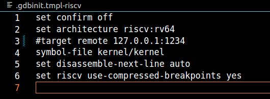

然后make clean再次f5后即可发现他安静的停在了main！

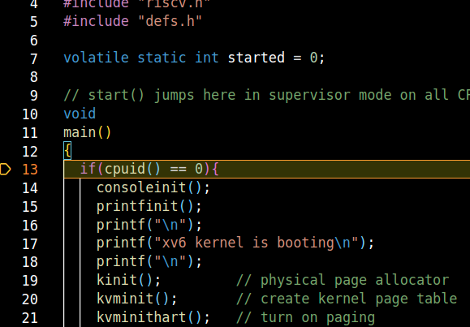

## 三、运行用户程序

> 💡
按照以下步骤即可得到结果，或者参考jyy的方法：[https://jyywiki.cn/OS/2022/slides/18.slides#/2/2](https://jyywiki.cn/OS/2022/slides/18.slides#/2/2 "https://jyywiki.cn/OS/2022/slides/18.slides#/2/2")

在参考“MIT 6.S081 xv6调试不完全指北”后成功找到了最简单的方法，当我们直接f5点亮后，先不要做任何操作，我们以ls程序为例，**首先进入ls.c的main处打下断点**（一定要在main有）

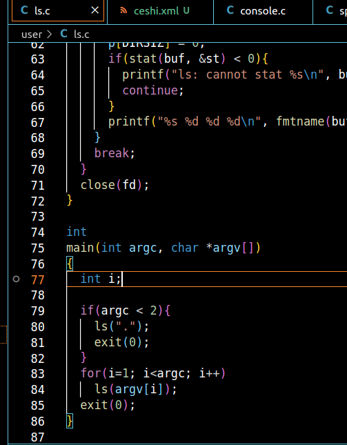

此时的断点是没有生效的，我们在左下角的断点也可以看到他是灰色的：

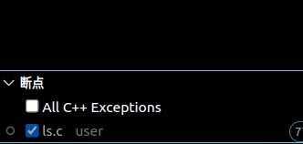

接下来我们在调试控制台输入`-exec file ./user/_ls` （他的相对地址），此时我们发现他读取到了符号表信息：

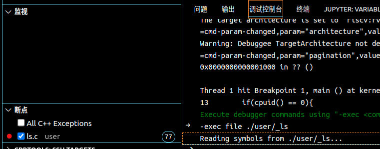

让我们按下“播放”让程序跑到输入处，然后在终端输入ls并回车，你会发现他已经停在了用户程序中，也可以进入汇编文件：

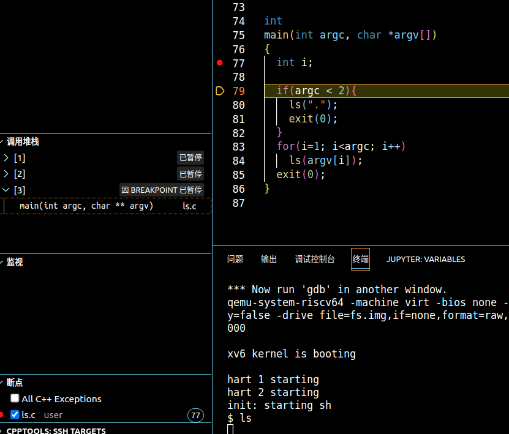

此时已经可以愉快的调试用户程序了\~你可以参考reference1中的不完全指北，用vscode尝试调试第一个用户程序。

如果你发现这ls停止还没有成功，请按照类似的步骤先停在init，再尝试停在ls（具体什么是init请RTSC）

## 四、恢复寄存器显示

通常来说，当我们打开了vscode，左边都应该显示出寄存器信息：

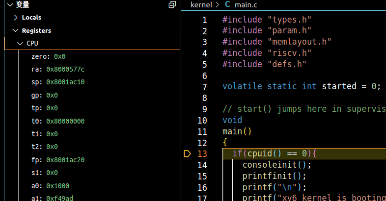

但如果我们在ubuntu20.04中打开调试后，会惊奇的发现，完全没有显示！


vscode没有寄存器，这完全不能忍！心态一开始就有点小崩了，不过别着急，让我们先打开位于launch的gdb日志看看发生了什么：

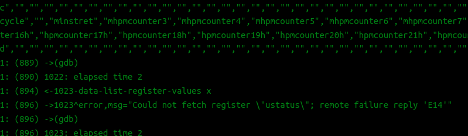

日志告诉我们有个叫做ustatus的寄存器无法显示，应该是gdb不支持（然而我们也确实只见过mstatus...）那么关键的问题就是我们该如何解决这个register问题。

（我还尝试修改了各种makefile等等。。。但并未奏效，实际上和问题无关故不再重复说明）

### 4.1有关gdb版本的坑问题（并非解决方法）

经过一顿搜索，我发现有人也遇到了类似的E14错误问题，他说要更新gdb，但我们仔细一想，在ubuntu20版本下的软件源只有9版本的gdb，哪来的12？（22上完美运行的gdb版本是12）

而且我们可以通过`-exec show version`发现此时运行的gdb确实是9版本，我们也有理由相信这确实是gdb的问题。

提前卸载了gdb及其gdb-multiarch并一顿操作猛如虎找到了gdb的源码：

[https://www.sourceware.org/gdb/](https://www.sourceware.org/gdb/ "https://www.sourceware.org/gdb/")

随便找了个教程编译后看了一下gdb -v以及gdb-multiarch -v都没有安装。。心态又不好了

好那咱们换个方法编译一下，一顿操作猛如虎找到了riscv64-unknown-elf-gdb：

[http://rcore-os.cn/rCore-Tutorial-deploy/docs/pre-lab/gdb.html](http://rcore-os.cn/rCore-Tutorial-deploy/docs/pre-lab/gdb.html "http://rcore-os.cn/rCore-Tutorial-deploy/docs/pre-lab/gdb.html")

一顿操作编译后（记得修改launch）还是不行.....开始怀疑人生了，老板你这rv是不是假的啊？

突然想到ustatus好像确实没有在rv出现过，那看来不能错怪他，也许是qemu之类的配置问题。

此时我再次按照这个帖子提到的问题进行编译`make CXXFLAGS="-static-libstdc++"`：（其实后面发现不需要静态编译也是可以的）

[https://stackoverflow.com/questions/32773255/how-to-update-gdb-to-most-current-stable-version](https://stackoverflow.com/questions/32773255/how-to-update-gdb-to-most-current-stable-version "https://stackoverflow.com/questions/32773255/how-to-update-gdb-to-most-current-stable-version")

此时可以发现gdb版本成功显示为gdb 12但是仍然没有gdb-multiarch，也无法直接吧这个版本的gdb加入到launch供vscode使用。于是我们需要再换一个缝合怪的gdb（我后面发现gdb其实可以包含各种架构也可以切换）

此时我打算将gdb更新到与22同步的版本，我们发现Ubuntu22版本中的gdb打印版本是不会出现—target=riscv之类字样的，只有gnu-linux。所以我再一次尝试编译完整的gdb，加上了`--enable-targets=all`，此时我们可以直接更换launch的gdb为gdb了（之前只能gdb-multiarch或者riscv64，现在的gdb是融合了各种框架的超级缝合怪），进去后再次观察寄存器........还是一片空白

又开始怀疑人生了，说好的gdb版本呢？痛定思痛后直接放弃了这个问题解决路线，让我们回到最开始的地方——到底那个奇怪的问题是怎么出现的？

### 4.2直接解决问题

> 💡太长不看版：
> 1、F5运行情况下在调试控制台中输入`-exec maintenance print xml-tdesc` ，完整复制输出的内容后存放在根目录下的myxml.xml文件夹下（名字也可以看你喜欢修改）
>
> 2、保存文件并结束调试，在根目录下运行`make clean`
> 3、修改launch.json为：
>
> ```json
> {
>     "version": "0.2.0",
>     "configurations": [
>         {
>             "name": "debug xv6",
>             "type": "cppdbg",
>             "request": "launch",
>             "program": "${workspaceFolder}/kernel/kernel",
>             "args": [],
>             "stopAtEntry": true,
>             "cwd": "${workspaceFolder}",
>             "miDebuggerServerAddress": "127.0.0.1:26000",
>             //看你喜欢可以修改成什么能用的gdb，为了防止奇怪现象我选择了rv
>             "miDebuggerPath": "/usr/local/bin/riscv64-unknown-elf-gdb",
>             "environment": [],
>             "externalConsole": false,
>             "MIMode": "gdb",
>             "preLaunchTask": "xv6build",
>             "setupCommands": [
>                 {
>                     "description": "pretty printing",
>                     "text": "-enable-pretty-printing",
>                     "ignoreFailures": true,
>                 },
>                 //在这里加载了寄存器信息表
>                 {
>                     "text": "set tdesc filename myxml.xml",
>                 }
>             ],
>             //用于gdb调试的工具，可以发现gdb出错的原因
>             // "logging": {
>             //     "engineLogging": true,
>             //     "programOutput": true,
>             // }
>         }
>     ]
> }
> ```
>
> 3、F5运行后发现已经安静的停在main，此时你会发现寄存器恢复了
> 4、为了定制化xml，你可以修改内部结构但要遵守regnum排序，具体请自行尝试

花了更多时间搜索log中提到的相关关键词，最后锁定了一个帖子：[https://stackoverflow.com/questions/72759791/why-does-gdb-do-not-show-all-risc-v-csrs-when-debugging-bare-metal-program-runni](https://stackoverflow.com/questions/72759791/why-does-gdb-do-not-show-all-risc-v-csrs-when-debugging-bare-metal-program-runni "https://stackoverflow.com/questions/72759791/why-does-gdb-do-not-show-all-risc-v-csrs-when-debugging-bare-metal-program-runni")（非常关键的帖子不然要花更多时间搞明白）

我一直在思考怎么才能"hack"gdb，也就是让他不去读取那个寄存器的信息（毕竟gdb只是一个程序！是程序就可以改），在这个帖子我找到了潜在的解决方法。我们通过`-exec maintenance print xml-tdesc`成功在vscode看到了xml信息，根据描述我们知道gdb是通过qemu给的xml得到寄存器信息的，那么我们就有了一个想法，我们能不能不利用他给的xml进行寄存器读取，而是使用自己的xml呢？（因为它能保存，能保存就一定可以读取）

一顿操作猛如虎我们找到了一个解决方法`set tdesc filename xxxxx`其中xxx是你保存的xml的相对地址（这里我直接复制保存为一个新的xml了）。在里面我们发现了罪魁祸首ustatus直接进行删去操作，然后搓搓小手开始进行设置工作。

一开始我很高兴他在运行中加载不会报错，但发现这样还是显示不了寄存器，也许他要在开头修改才有用？于是我修改了launch让他在开头加载...

成功点亮\~

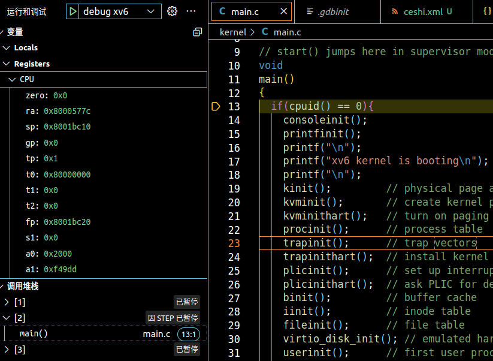

至此，我们能相对愉快的畅游vscode的调试世界了。

## 五、修复注释高亮

这里我们用到了bear（具体原理可看jyy18课：），bear make创造的compile\_commands.json 还需要让他生效

> 💡
> 你可以参考[https://zhangjk98.xyz/6.S081-VSCode-prepare-and-kernel-debugging/](https://zhangjk98.xyz/6.S081-VSCode-prepare-and-kernel-debugging/ "https://zhangjk98.xyz/6.S081-VSCode-prepare-and-kernel-debugging/")中提到的方法
> 也可以使用这个教程：[https://simplestupidcode.github.io/post/2022062501.html](https://simplestupidcode.github.io/post/2022062501.html "https://simplestupidcode.github.io/post/2022062501.html")
>
> * 你还可以配合使用ctrl+p输入文件跳转文件与ctrl+p输入#加上函数名查找函数相应部分来辅助查找

（这里笔者尝试了第一步clang没有完全运行，会提示typedef的问题，按照第一个博主的说法做了还是不行，但是很神奇的在加入第二个博主的cpp\_properties.json后就可以跑起来了也可以跳转....计算机真神奇啊，如果你不能用其中的一个成功跳转和兼容运行，可以尝试两个都加上，然后make clean后重新make 或者重启vscode与clang插件。）

## 六、调试控制台中省略exec

> 💡直接按照下列操作即可

偷懒要偷到底！此时我们发现每次都要输入-exec进行gdb操作，这未免有些太麻烦了（我观摩了vscode在github上被一群人锐kuang评pen，为了让vscode的调试控制台能更加接近gdb的原生体验，我们还需要进行进一步操作：

1、在vscode中搜索插件multi-command

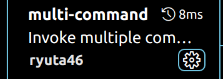

2、在.vscode中创建一个settings.json文件，内容为：

```json
{

    "multiCommand.commands": [
        {
            "command": "multiCommand.enterExec",
            "sequence": [
                "repl.action.acceptInput",
                {"command": "editor.action.insertSnippet", "args": {"snippet": "-exec "}}
            ]
        }
    ]
}
```

3、分别按下ctrl+k  ctrl+s 或者在首选项中打开键盘快捷方式设置，在右上角找到并点击：

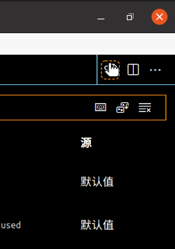

此时能看到keybindings.json，然后粘贴以下内容：

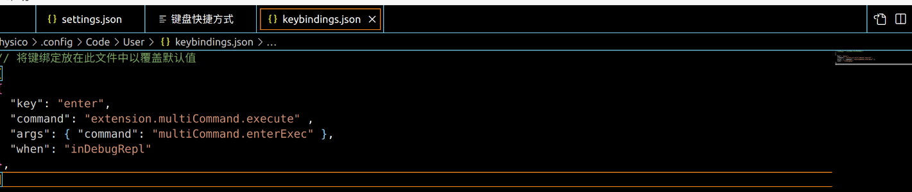

```json
[
{ 
  "key": "enter", 
  "command": "extension.multiCommand.execute" , 
  "args": { "command": "multiCommand.enterExec" },
  "when": "inDebugRepl"
},
]
```

接下来就重新开始调试，然后你会惊奇的发现回车的时候已经能够自动补全exec了，体验愉快使用原生gdb的快乐吧！

## 七、追踪函数调用的踪迹

> 💡
> 1、你需要下载[jyy29课中提到的trace](https://jyywiki.cn/OS/2022/slides/29.slides#/2/2 "jyy29课中提到的trace")，然后将它放在 根目录/mkfs 的文件夹下
> 2、如果你是ubuntu22.04系统，可以直接运行`gdb -ex 'source mkfs/trace.py' mkfs/mkfs`
> 如果你是ubuntu20.04系统，你可能会遇到一些问题，请参考下文提到的解决方法
> 3（可选）、如果你想看到更猛的状态机过程，你可以参考[这个github](https://github.com/Alan-Lee123/TOSView "这个github")的方法

在代码的海洋中，用肉眼看代码显然是会超载的，也极其耗费时间；进行调试一步步看容易跳过关键步骤不得返回，令人懊恼不已，有什么方法可以让我们获得更快乐的debug体验？——trace，想想看超级武器strace，itrace吧，他能让我们一窥内核用户态的调用奥秘。（俗话说得好，读代码不如读执行）

当然，如果想要更简单的方法，直接让gdb生成历史记录也是可以的，同样也可以类似pa中宏包裹的方式，自己做一个日志并保存输出到文本当中，这是所有程序都通用的一种方式。

按照提示的操作后我们很自然可以得到结果（其他代码其实逻辑好理解一些，主要是文件系统写的实在是太邪门了）

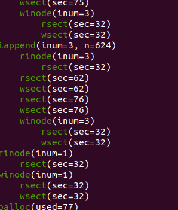

但你可能会想，我们能不能迁移到其他地方呢？我做了一些尝试（但也有一些问题，比如static的函数显示不了对应参数，内核调试没有尝试成功），如果你想体验或者魔改，可以参考改进我的方法看看能不能做的更好：

```python
TRACED = 'main ls'.split()
IGNORE = 'buf fd'.split()

class trace(gdb.Breakpoint):
    def stop(self):
        f, bt = gdb.selected_frame(), []
        while f and f.is_valid():
            if (name := f.name()) in TRACED:
                lvars = [f'{sym.name}={sym.value(f)}'
                    for sym in f.block()
                    if sym.is_argument and sym.name not in IGNORE]
                bt.append(f'\033[32m{name}\033[0m({", ".join(lvars)})')
            f = f.older()
        print('    ' * (len(bt) - 1) + bt[0])
        return False # won't stop at this breakpoint

gdb.execute('target remote localhost:26000')
gdb.execute('set prompt off')
gdb.execute('set pagination off')
gdb.execute('file ./user/_ls')

for fn in TRACED:
    trace(fn)
```

将代码保存为mytrace放在根目录后执行`gdb -ex 'source mytrace.py'`，然后在其他地方`make qemu-gdb` ，此时发现打开gdb的终端有反应了但没有开始，你需要输入c，回车后就发现xv6运行起来了，然后按下ls，你就可以看到他打印了对应的调用栈和参数了，但这个trace对于ls实在是杀鸡用牛刀（因为我们可以通过vscode调试就非常清楚流程了），我们可以在更复杂的情况（比如文件系统）下再使用它。但不管如何，我们的调试武器库又一次增加了。

### 7.1 Remote 'g' packet reply is too long

你可能会见到形如"Remote 'g' packet reply is too long"相关的问题，这很可能是因为gdb版本不支持或者太低，你可以更改gdb为gdb-multiarch或者riscv64-unknown-elf-gdb，如果都不行，你需要重新编译升级gdb版本，可以选择7.2的方式，或者参考这个方式重新编译gdb：[http://rcore-os.cn/rCore-Tutorial-deploy/docs/pre-lab/gdb.html](http://rcore-os.cn/rCore-Tutorial-deploy/docs/pre-lab/gdb.html "http://rcore-os.cn/rCore-Tutorial-deploy/docs/pre-lab/gdb.html")

如果还不能解决，你可以参考这里对这个问题的解决方法：[https://github.com/Alan-Lee123/TOSView](https://github.com/Alan-Lee123/TOSView "https://github.com/Alan-Lee123/TOSView")

### 7.2海象运算符等python不支持的问题

注意：你可能会在这里遇到:=运算符的问题，这是编译gdb选择的python太低的问题，你需要重新编译过gdb的版本让他能够支持：

首先参考4.1下载gdb源码，然后进入主页面后分别运行

(这个相当于选择菜单，我选择编译了支持全体系结构的gdb，同时内置python版本是3.8）

```bash
./configure --with-python=/usr/bin/python3.8  --enable-targets=all --enable-64-bit-bfd
make -j8
sudo make install
```

安装成功后再次运行即可成功！

### 7.3 参数显示<*optimized out*>

如标题所示，我们只需要降低优化等级就好，在makefile中找到-o2改成-o0，并且注意到有关编译选项中有-o需要改成-o2（比如调试内核中的），修改后重新编译就可以解决问题

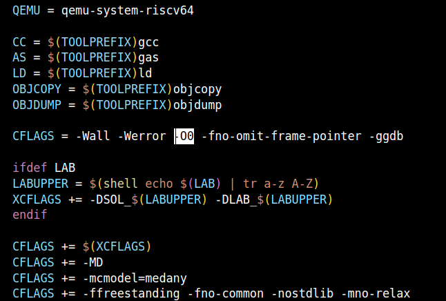

## 外传：vscode和gdb是如何工作的？

通过一波探索，我们对vscode的运行原理有了一点好奇心（当然对gdb调试也有，为什么要tcp？）

我找到了这些相关资料（有空再写个博客好了）：

[https://fed.taobao.org/blog/taofed/do71ct/vscode-debug-source-analyse/](https://fed.taobao.org/blog/taofed/do71ct/vscode-debug-source-analyse/ "https://fed.taobao.org/blog/taofed/do71ct/vscode-debug-source-analyse/")

[https://blog.csdn.net/m0\_37621078/article/details/113886458](https://blog.csdn.net/m0_37621078/article/details/113886458 "https://blog.csdn.net/m0_37621078/article/details/113886458")

有关断点的故事也有很多可以说...比如通过更换Int3中断指令使得断点可以生效，等到结束恢复为原来的指令。（这也是为什么优化等级高了有时候停不下来，因为没有对应的指令可以替换）

谢谢你看到最后，如果有问题或者有更优雅的方式欢迎提出或者发送邮件:

<physicoada@gmail.com>

也欢迎来我的github来找我玩：

[https://github.com/sanbuphy](https://github.com/sanbuphy "https://github.com/sanbuphy")

## Reference

### 基本环节的打通

MIT 6.S081 xv6调试不完全指北（包含了常见问题）

[https://www.cnblogs.com/KatyuMarisaBlog/p/13727565.html](https://www.cnblogs.com/KatyuMarisaBlog/p/13727565.html "https://www.cnblogs.com/KatyuMarisaBlog/p/13727565.html")

从零开始使用Vscode调试XV6（包含了task与launch）

[https://zhuanlan.zhihu.com/p/501901665](https://zhuanlan.zhihu.com/p/501901665 "https://zhuanlan.zhihu.com/p/501901665")

6.S081的调试和VSCode环境配置（代码提示和自动补全以及风格化）

[https://zhangjk98.xyz/6.S081-VSCode-prepare-and-kernel-debugging/](https://zhangjk98.xyz/6.S081-VSCode-prepare-and-kernel-debugging/ "https://zhangjk98.xyz/6.S081-VSCode-prepare-and-kernel-debugging/")

如果gdb调试报错Cannot access memory at address，也许需要在.gdbinit.tmpl-riscv加一条set riscv use-compressed-breakpoints yes

### 有关gdb问题的排查

编译gdb最新版

[https://stackoverflow.com/questions/32773255/how-to-update-gdb-to-most-current-stable-version](https://stackoverflow.com/questions/32773255/how-to-update-gdb-to-most-current-stable-version "https://stackoverflow.com/questions/32773255/how-to-update-gdb-to-most-current-stable-version")

打印寄存器相关xml文件

[https://stackoverflow.com/questions/72759791/why-does-gdb-do-not-show-all-risc-v-csrs-when-debugging-bare-metal-program-runni](https://stackoverflow.com/questions/72759791/why-does-gdb-do-not-show-all-risc-v-csrs-when-debugging-bare-metal-program-runni "https://stackoverflow.com/questions/72759791/why-does-gdb-do-not-show-all-risc-v-csrs-when-debugging-bare-metal-program-runni")

修改寄存器定义

[https://blog.csdn.net/abeldeng/article/details/80325364](https://blog.csdn.net/abeldeng/article/details/80325364 "https://blog.csdn.net/abeldeng/article/details/80325364")

### 有关vscode配置

launch的一些参数讲解

[https://blog.csdn.net/ZCShouCSDN/article/details/60466707](https://blog.csdn.net/ZCShouCSDN/article/details/60466707 "https://blog.csdn.net/ZCShouCSDN/article/details/60466707")

优雅的配置launch.json：

[https://www.barretlee.com/blog/2019/03/18/debugging-in-vscode-tutorial/](https://www.barretlee.com/blog/2019/03/18/debugging-in-vscode-tutorial/ "https://www.barretlee.com/blog/2019/03/18/debugging-in-vscode-tutorial/")

exec省略

[https://github.com/Microsoft/vscode-cpptools/issues/106#issuecomment-829008826](https://github.com/Microsoft/vscode-cpptools/issues/106#issuecomment-829008826 "https://github.com/Microsoft/vscode-cpptools/issues/106#issuecomment-829008826")

其他

[https://www.lagerdata.com/articles/vscode-and-gdb](https://www.lagerdata.com/articles/vscode-and-gdb "https://www.lagerdata.com/articles/vscode-and-gdb")
