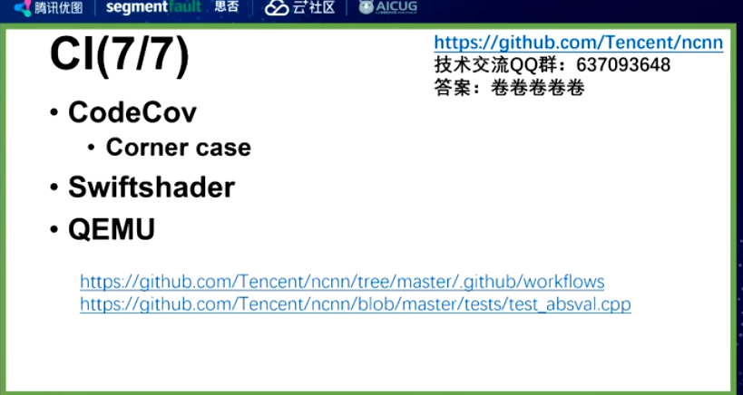

开头安利了一下各种有趣的库（nihui姐姐的知乎也可以看看

这里面有很多不错的ncnn项目实现。

关于ncnn的所有资料

[https://github.com/zchrissirhcz/awesome-ncnn](https://github.com/zchrissirhcz/awesome-ncnn "https://github.com/zchrissirhcz/awesome-ncnn")

ncnn源码解析相关资料推荐：

[https://blog.csdn.net/just\_sort/article/details/111403398](https://blog.csdn.net/just_sort/article/details/111403398 "https://blog.csdn.net/just_sort/article/details/111403398")

[https://www.zhihu.com/column/c\_1320446932913762304](https://www.zhihu.com/column/c_1320446932913762304 "https://www.zhihu.com/column/c_1320446932913762304")

## Zen（设计理念）

ncnn内针对arm的优化代码都是可选的——整个框架并不依赖优化代码，增加了可移植性和兼容性。

ncnn项目使用了Vulkan的API，让一套代码可以在诸如安卓、IOS等任意平台上实现。

**维护性也是ncnn项目的设计理念之一，** 为方便开发者阅读，降低阅读成本，ncnn中的优化代码都是可选的，这就相当于整个框架不依赖于优化代码，有利于分离。最后，ncnn作为底层推理框架要考虑兼容性，底层赋能后，开发者就算换代码，也能适用最新框架。

## THE MAT——**ncnn的数据结构**

ncnn不需要batchsize。自己加个for循环实现即可。（因为nihui觉得这个只有训练框架才需要拥有）

所以我只要focus于算子本身要实现的功能，代码少，维护性高。

最早ncnn用的是opencv的mat，可以支持任意维度batchsize。后来nihui自己写了一个mat，包括浅拷贝，whc基本的东西就固定了。（主要的考虑是性能，以及数据结构的连续性，有没有进行对齐。对于某些arm上没对齐性能差很多）

Mat中加了cstep属性，可以让每一个channel都做一个数据对齐，访问、储存等操作都可以在对齐内存上进行，效率更高。举例来说，如果不加cstep，像armV7就有很多对齐和不对齐的数据，访问速度会存在差异。

如果channel不对齐，多线程可能出问题，每个线程访问数据的时候cache会跳到别的上面。

此外，ncnn的数据结构还做了Type-less，起初Mat只能放float数据类型，但int8需要放其他类型的数据，出于兼容性的考虑，Mat在尽量不改变数据结构的基础上，通过层实现的自我约定来实现数据类型解读，降低复杂性，按软件工程中的一句话说就是“约定优于配置”。

**软件工程有一句话：约定优于配置。**

就是在开发中，如果有些值你没有配置的话，那程序会取一个默认值，换句话说，能取默认值的配置，就不需要配置了，这个默认值就是约定。
约定可以减少很多配置
比如说在maven的结构中:（java程序为例）

/src/main/java目录用来存放java源文件
src/main/resources目录用来存放资源文件，如application.yml文件，mybatis的\*mapper.xml文件
/src/test/java目录用来存放java测试文件
/src/test/resources目录用来存放测试资源文件
/target目录为项目的输出位置

## 权重相关——为什么分两个文件？

我们会有个问题：ncnn的模型为什么有两个文件？既然我的结构和权重是成套使用的，为什么两个文件？

原因是可用性的考虑。AI推理部署有一个很难的环节是模型转换（可能因为某个算子没实现，或者没写好或者参数配置出错or转换失败会导致整个模型都用不了）当遇到这种情况可能会出现 nonsupport layer....

主流遇到这个问题的方法：

手工用编辑器打开param删除对应的图（直接把我不要的层干掉），ncnn为了能支持这个操作所以留着了。如果其他转换后很难去处理对应的op。如果是人可以编辑的话就可以人工处理这个模型（纯纯二进制文件的话旧旧白给了）

但是有个设计的遗憾，在ncnn 的param如果要写个数组【 5 = \[0,2,3]】，必须写一个-23305(05是id) = 3,0,1,2 （3是个数，我有3个个数）&#x20;

最后说下bin，就是纯粹放权重的文件（存在的目的），没有任何结构化信息。不知道哪个权重对应xxx。这个bin不能知道任何权重相关信息。

它的好处是，我可以把其他的模型的bin都合成到一起（比如我you两个模型，我可以直接用concat把他们组合为一个bin）部署起来很方便。

## Dynamic——完全动态图

ncnn是非常动态图的推理框架，输入尺寸可以任意大小。ncnn天生适合动态尺寸，在2017年发布时就已具备三种dynamic。

**一是尺寸，** ncnn可以任意输入尺寸，一般其他推理加载模型时会需要指定最大尺寸，但ncnn不需要，开发者给它多少它就能算多少。

**二是维度，** 动态shape分为两种：知道输入维度和不确定维度，ncnn的算子是直接支持不确定维度操作的，比如BinaryOp运行时接受两维数据，也接受一维和三维数据。

**三是推理图，** 在ncnn中，可以在同一模型中实现任意节点到节点的推理路径，像条件判断和循环也可以通过不同子图，换来换去，在运行时判断和调度哪部分需要计算，哪部分不需要计算，这样的动态推理路径可以提升效率。

nihui怀疑很多框架是因为和训练框架对齐的，因为要考虑batchsize所以才要考虑到静态图。

举个例子：这里表达的就是c=a+b 但这里不需要考虑到channel，因为是动态的（支持动态的size和channel）。

ncnn的图也是可以动态改变的，比如有这么一个图：a——b——c

静态图必须固定比如a进，c出；而ncnn可以a进b出或者b进c出等等。。。

比如d表示是不是人脸，e负责人脸画框；如果d已经不是人脸了，那就可以跳过c到e的计算，相当于节省了计算速度。（动态子图推理）

对于普通的静态框架e每一次都会得到结果（不管d置信度高不高）

同样的道理，我们可以针对不同配置的手机设计不同的出口比如X和Y。比如b输出到X，c输出到Y，可以根据不同手机性能配置选择走X还是走Y。

## Is-A——ncnn的纯继承关系设计layer  Is-A v.s. Has-A

注意到这里的调用基类操作。我们走算子优化可能做特定参数、size下的优化（只改编部分参数）

**ncnn采用了一个纯粹的继承关系去做的架构设计，精心优化的架构代码，** 比如：x86、arm、vulkan等都是继承自cpu的一个最基础实践的，当遇到没有优化的参数组合时能方便的回退到cpu基础实现。

很多框架是在pooling里面加了个kernel，和op分开。这么设计的好处是kernel可以被很多算子用到（比如gemm的kernel可以被卷积、反卷积的算子等等用到）；ncnn不这么做的原因是：kernel和op分离需要两份代码， 这样复杂度就提升了也不方便让你自己写新的实现。方便凝聚算子自身的模块性，减少算子之间的耦合。

不过很多时候kernel共用性可能并不大，因为很多时候优化是对算子整体的优化，这个是结构特有不可复用。

## CI——代码健壮性检查

使用奇怪的不常见的参数组合进行暴力测试，消除了很多bug。

强迫症提高覆盖率。

codecov无法提供gpu的测试，所以用swiftshader做了gpu相关的测试。

对于一些奇葩的架构无法跑ci，用qemu直接模拟测试即可。

对于ncnn有些看上去很简单的单元测试语句，实际上背后包含了各种数据结构和硬件的测试。。。。。

## reference

讲座地址：

[https://cloud.tencent.com/developer/salon/live-1346](https://cloud.tencent.com/developer/salon/live-1346 "https://cloud.tencent.com/developer/salon/live-1346")

优图官方笔记

[https://zhuanlan.zhihu.com/p/348587668](https://zhuanlan.zhihu.com/p/348587668 "https://zhuanlan.zhihu.com/p/348587668")
