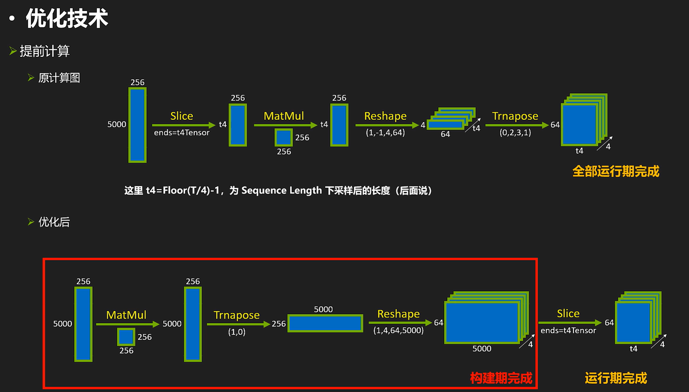
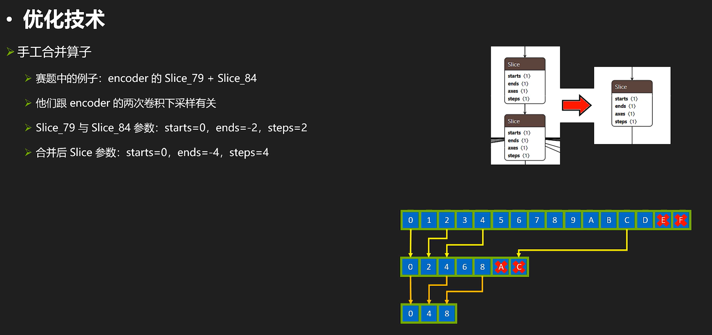
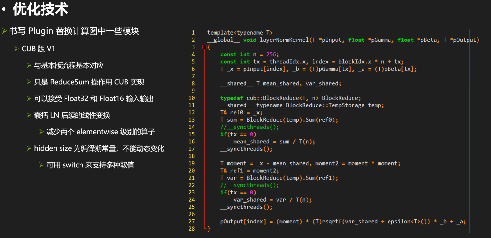

笔记摘录自2022年的某期nvidia-tensorrt优化黑客松活动：

<https://www.bilibili.com/video/BV1i3411G7vN/>

## 一些技术手段

- 使用 onnx-graphsurgeon 调整节点，解决.onnx 不能被 TensorRT 解析的问题
- 用一些现成的计算图优化库 (Polygraphy，onnx-optimizer，onnx-onnx simplifier)》优化计算图
- 优化计算图，将部分运行期计算提前到构建期完成
- 使用FP16和INT8 模式，并使用 strict type 显式控制某些 layer 计算精度以控制误差
- Layer Normalization Plugin
- Attention Plugin 以提高性能 (超越 Myelin 自动融合效果
- Mask Plugin + SkipSigmoid Plugin
- 尺寸对其

## 修改计算图的一般方法

强调一下，onnx-graphsurgeon读取的graph和model是两回事，api不同两个东西不能混用。

(注释，这里面的bNot就是开关)

来看一下调整节点的用处，比如：

（用trtexec转encoder经常出现这样的报错。。。。。

## 解决.onnx不能被trt解析的问题

以下是优化过程：

需要注意的是，张量的数据类型和形状因为tensorrt自带形状推理器，这些东西都能自动推理； 另外，cast的目标数据类型是枚举类型，可以使用右边代码的onnx.Tensorxxxxx来指定，也可以按照枚举数字来指定。

接下来再看看计算图优化库，实际效果要按照性能测试最终决定。

## 计算图优化库 polygraphy,onnx-optimizer,onnx-simplifier

（这里的ogs手工优化指的是onnxgraphsurgeon）

为什么没有显著改善最终性能？因为trt有形状推理器，构建期会仔细推理每个节点的数据类型和形状，可以一次性消除计算图中的形状操作等（所以做不做形状操作相关的优化对结果基本不会有影响的）在优化中我们不需要浪费时间在这些。

对于图1，左侧是poly的，右侧是onnxsim的结果，对于这个节点，我们发现里面包含一个常张量562号他的值是0，对于poly如果整个计算图有两百个节点都包含常张量0他就会生成200个常张量，但onnxsim会把他合成一个。另外，onnxsim干的工作是删除cast节点，比如对于圈3，左边是poly右边是sim，对于sim的话他会把输出的张量数据类型直接转为下一个的输入，就不需要cast了；所以sim会改变大量节点就会这样的（有时候删除了反而让他不能被tensorrt很好的应用）

## 3DMM 2DMM

再来看一个比较“取巧“的操作，我们来看看3D矩阵乘和2D矩阵乘的区别：

一般来说，有可能2DMM是比3DMM要快的。

## 再来看看squeeze和transpose节点相关的东西

一般来说，消除了这些操作（影响conv add relu融合）甚至可以提高100%性能（从左边优化到右边）

另外再来看一个可能相关的优化：

形象来看就是这样的效果：

实现这个技术的核心代码：

另外，我们来看一个手工优化的例子（比如这里看到两个slice，而我们知道rt对slice的效率是很低的，所以我们想要把两个slice合成一个slice。）

## 合并slice

## 把多个繁杂的shape+matmul操作变成少数conv+squeeze+transpose

还有一个手工调整的例子，把多个繁杂的shape+matmul操作变成少数conv+squeeze+transpose:

这项操作的技术代码如下：

## 显式控制某些层精度让其保持在32位进行

对于精度问题，我们可以显式控制某些层精度让其保持在32位进行：

PLUGIN：

除了前面比较“简单“的一些玩法，我们还可以自己手写plugin来替换一些模块以达到加速的目的。

## layernorm的plugin，用它替换计算图的layernorm模块

首先来看看layernorm的plugin，用它替换计算图的layernorm模块。

因为layer norm导出大多长得不一样。。。所以基本上rt不会自动融合，需要手动做。我们再来看看他的计算实现：

&#x20;接下来看个神奇，CUB包含了大量并行计算会用到的一些计算原语。

我们cub重写kernel后结果如下：

除此之外我们还可以有进阶版本的CUB & layernorm：

最后来看看oneflow的版本：<https://github.com/Oneflow-Inc/oneflow/blob/master/oneflow/core/cuda/layer_norm.cuh>

CUBV2为什么快那么多主要也是对reduce sum的两趟变成了一趟让他快速减少了时间。

## Attention plugin

接下来我们来看看attention plugin：

这个plugin的目标就是把右边那一大堆变成一个节点。由于trt会自动优化attention（mylin），所以需要随时对比自己的实现是不是更好，以免负优化。。。

这里直接看第一名的版本：

FasterTransformer是一个很好的GPU实现，针对流行的带有transformer的结构都有很好的性能优化。完整的代码去链接里面看就行。

接下来再看一点比较杂的优化，mask和skipSigmoid plugin，这两种plugin实际上优化空间小，很容易陷入访存瓶颈：（需要nsight system频繁查看最终效果是否变化。。。

## 一些其他的优化小知识

比如右边是19.。。也许我们把他处理成对齐的情况会更好算。（对齐到一定的倍数上）

### 尺寸对齐

尺寸对齐真的有用吗?——有用，可以看看例子：

我们可以看到，当k和n不对齐的时候，时间差很多。。。（这是因为rt对于这样情况选择了完全不同的kernel进行计算。）

### 模型尺寸和精度的问题

最后来看看模型尺寸和精度的问题：

除了上述的常见优化，最后看一些其他还可以优化的操作：（权重裁剪、输出张量裁剪、形状裁剪、打表法）

### 权重裁剪、输出张量裁剪、形状裁剪、打表法

我们可以把不需要的输出干掉，同时也可以减少时间。

另外，我们在rt优化中可能会遇到左上角那样的信息，那是因为模型有多个动态范围。也就是B,T 和 B，我们知道B是相等的，但是rt、myelin不知道他们是相等的，他们只能假设他们不相等的时候生成一套代码，并给出警告信息。Decoder也是，myelin只能选择兼容性最大的实现方法，这样的性能肯定会损失。针对这个的解决方法是增加形状裁剪，我们可以把speech这个张量先使用shape+squeeze+gather，把第一维B取出来当作第一个张量利用这个张量对speech\_lens做一个slice。这就像确实都做了真实计算，这样myelin就会认为这两个B是相等的东西了。减少这些警告一定程度上可以提高性能。&#x20;

最后一个是为了打比赛的。。。。我们可以读写npz（能够交互数据）

