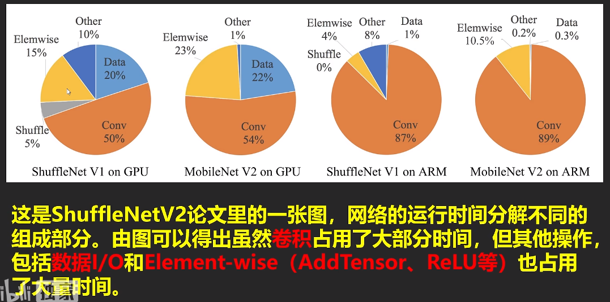
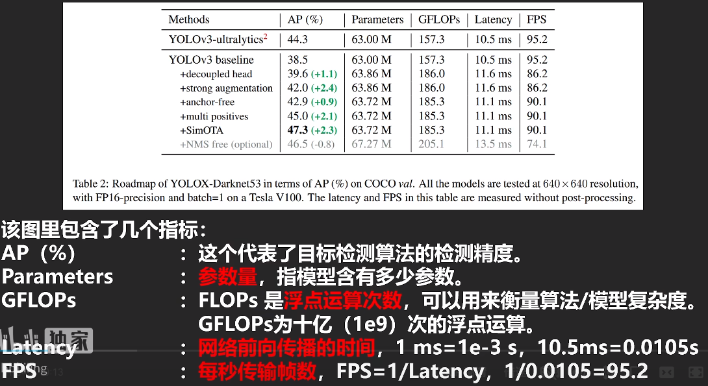
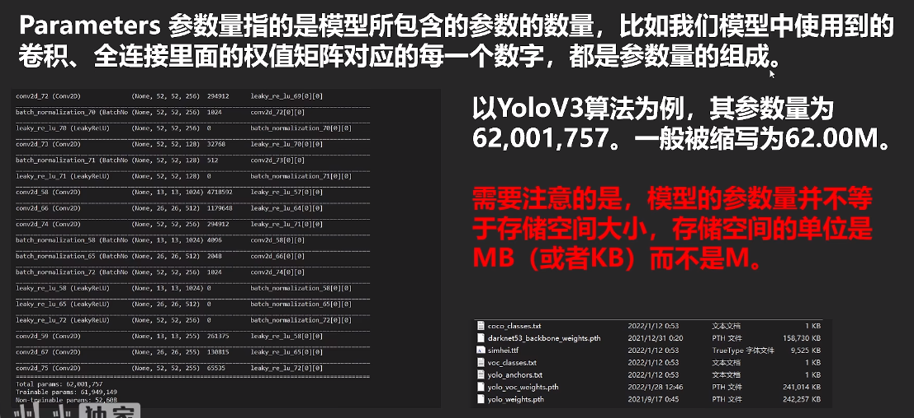
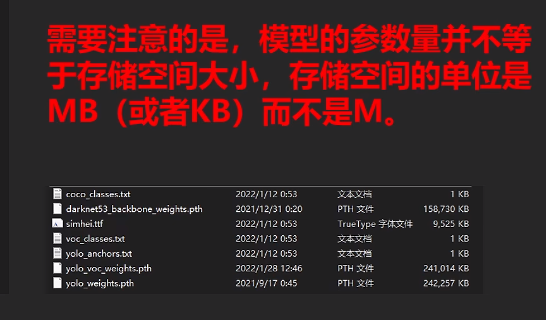
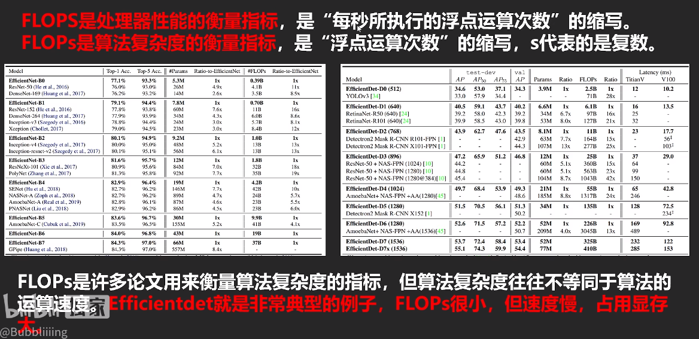
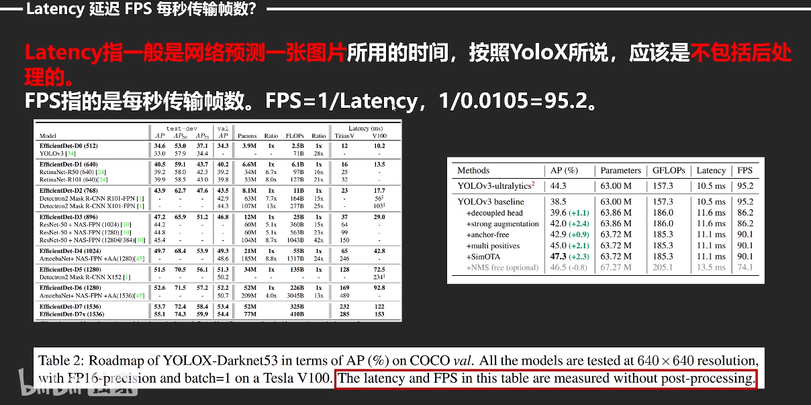

reference：[https://www.bilibili.com/video/BV1oR4y1X7xZ/](https://www.bilibili.com/video/BV1oR4y1X7xZ/ "https://www.bilibili.com/video/BV1oR4y1X7xZ/")

## 要注意FLOPSs的区别

大S（floating-point operations per second） 小s算法复杂度是复数。

FLOPs的单位B的意思大部分情况下都是GFLOPs

NMS应该还是要算的，虽然会降低FPS，但不经过nms结果根本不能用。

## 最终结论：(如果感兴趣可以去看下ShuffleNet V2的论文）

1\. Parameters低约等于FLOPs低。（FLOPs和输入进来的图片大小有关，等同图片大小下一般可这么认为，因为FLOPs运算一般和卷积相关。）

2.GFLOPs低 不等于Latency低（GFLOPs低不等于FPS高，有可能网络层多，网络设计不好 )

3.Parameters低 不等于Latency低（ Parameters低 不等于FPS高)

## 网络的运算速度（纯网络，不包含前处理后处理）和很多东西有关

1、**显卡**：大多数SOTA算法用的都是V100或者A100，

2、**网络结构**：不是参数量越低速度越快，不是加两个深度可分离卷积，网络的速度就越快

有一个MAC的概念（Memory Access Cost），在ShuffleNet V2的论文里提到了。深度可分离卷积便是一个高MAC，低参数量的操作。深度可分离卷积在CPU中表现更好。

3、**网络的并行度**：lnception是一个不断增加网络宽度的模型，它使用不同卷积核大小的卷积进行特征提取。但它的工作速度不是特别快。分支分多次就要算多次

4、**网络的层数**：额外的操作如Relu，ADD，都是没有参数量，但需要运算时间的操作。

5、**CUDA、cudnn、深度学习算法框架版本影响**。1660Ti的机子上，YOLOX-S的FPS在torch1.7里为50多，torch1.2里面为20多。

## ShuffleNet: An Extremely Efficient Convolutional Neural Network for Mobile Devices

reference: <https://www.jianshu.com/p/a54cf8147cfc?utm_campaign=maleskine&utm_content=note&utm_medium=seo_notes&utm_source=recommendation>

论文重点摘要

### Model Acceleration（模型加速）

这个方向旨在保留预先训练好的模型精确度的情况下加快速率。在之前训练好的模型中通过修剪网络连接以及减少通道冗余连接从而提升性能。在不改变参数的情况下，最优化卷积算法被应用在快速傅里叶变换以及减少实践生活中时间消耗的理论。提取大模型中的理论，有利于更加简单的训练小的模型。

模型加速的方法有：（其实都是常识）

1）  修剪网络，减少分支（pruningnetwork connections）。

2）  对于一个训练好的网络（pre-trainedmodel），在性能不下降的情况下减少冗余的分支。

3）  量化（quantization）和因式分解(factorization)加速。

4）  在不改变参数的情况下，使用FFT算法对卷积进行加速。

5）  提取网络的精华部分，减小网络模型。

具体实现: [ShuffleNetV2：轻量级CNN网络中的桂冠](https://zhuanlan.zhihu.com/p/48261931)
