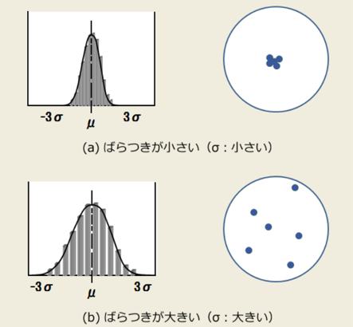
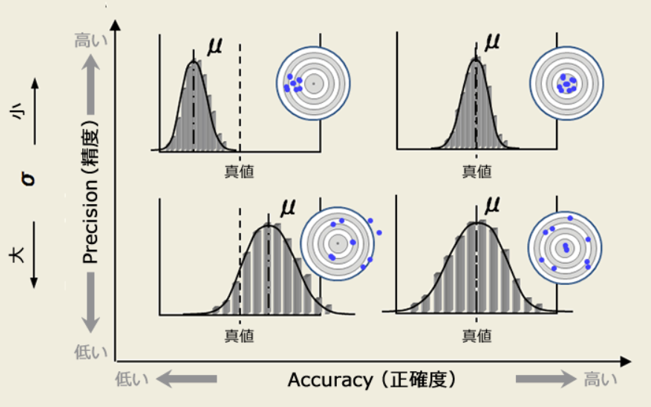

总共内容包含 Acc、Recall、F1、RC、Roc、AUC、IOU、AP、mAP

所有复杂问题都是简单问题的重复，
为了理解所有指标，首先需了解“四大天王”与“三大护法”

## 四大天王——TP|FP TN|FN

我们认为positive代表了阳性（或者说正样本），
而Negative代表了阴性（负样本)，那么在二分类中我们根据猜测的对错很容易排列出2x2种情况：

| | True | False |
|  ----  | ----  | ----  |
| Positive  | TP(猜对了阳) |FP(猜错了阳) |  
| Negative  | TN(猜对了阴) |FN(猜错了阴) |  

其中**左半边**表示真值和我的猜测一致（猜对了），**右半边**表示真值和我的猜测不一致（猜错了）；  
**上半边**表示猜测阳性的全体 $P$，**下半边**表示猜测阴性的全体$N$。  
**TP+FN**表示真值阳性的全体，**TN+FP**表示真值阴性的全体。

## 三大护法——Pre、ACC、Recall

根据四大金刚，我们容易得出常见模型中的三个评价指标，
(为什么不能只看一个呢？因为容易被“浮云遮望眼”)  

### Pre(Precision 精确率又称查准率)

精确和准确在中文上看起来是一个意思，但实际上有微小的区别；
我们可以通过投标的例子来理解什么是精确，什么是准确。

从上图可知，精确率高的数据其标准差较小，也就是“我投中了，投中的差别不大”;在二分类中或者说判断是否阳性中，我们关注的重点是在我对阳性的判断中，是否判断对了(存不存在错判阳性的偏差）；如果精确率高，就说明我预测阳性偏差小，阳性就是真的阳性，较少出差错。
总结来说，精确率高指的是“我对正例判断出差错（偏差）的情况怎么样？”，也就是：
$$
Precision = \frac{TP}{P} = \frac{TP}{TP+FP}
$$
精确率越高，说明我对正例/阳性判断的偏差越小，也就是TP占总判断阳性中的比例越大。
这时候可能会有聪明的同学问了，那为什么我们不考虑对负例判断的偏差呢，比如构建一个TN/TN+FN的指标？
其实是有的，一般的，Pre还有更深入的名字叫“positive predictive value (PPV)”，显然也有对应的“Negative predictive value (NPV) ” 只是因为负样本通常较少，正样本较多；所以把PPV作为一个更常用的指标，归为精确率。

**计算精确率的代码示例（使用PyTorch）：**

```python
import torch

def precision(preds, labels):
    TP = torch.sum((preds == 1) & (labels == 1)).item()
    FP = torch.sum((preds == 1) & (labels == 0)).item()
    precision = TP / (TP + FP) if (TP + FP) > 0 else 0
    return precision

# 示例
preds = torch.tensor([1, 0, 1, 1, 0])
labels = torch.tensor([1, 0, 0, 1, 0])
print("Precision:", precision(preds, labels))
```

### ACC(Accuracy 准确率)

为什么说精准但“精确不一定准确呢”？  
你可以这么想，精密仪器显然是为了误差小，那精密仪器一定能得到准确结果吗？————答案是不一定，比如你没有调零!(做过大物实验的朋友都知道~)
没有调零就好像y=kx+b中多了一个b，也就是投标图像中的“整体偏移真值” （下图的上半部分）
虽然很精确，但很不准确！！

准确率更容易理解，准确率考虑的是更“全局”的结果是否正确，
也就是在我所有预测的结果中，我到底预测的“好不好”，
即：
$$
Accuracy = \frac{TP+TN}{所有预测} = \frac{TP+TN}{TP+FP+TN+FN}
$$

**计算准确率的代码示例（使用PyTorch）：**

```python
import torch

def accuracy(preds, labels):
    correct = torch.sum(preds == labels).item()
    total = labels.size(0)
    accuracy = correct / total
    return accuracy

# 示例
preds = torch.tensor([1, 0, 1, 1, 0])
labels = torch.tensor([1, 0, 0, 1, 0])
print("Accuracy:", accuracy(preds, labels))
```

### Recall(召回率又称查全率)

顾名思义，查全的意思就是“我查的全不全”，我是否把所有的阳性覆盖到了（阳性全体为P），

$$
Recall =  \frac{TP}{阳性全体}=  \frac{TP}{TP+FN}
$$
**有时候查全率很高，但精确率很低。**
比如我有3个阳性，97个阴性。我预测100个全为阳性（此时P=100且TP=3，FP=97），0个阴性；此时查全率为：3/3=100% ！  
但此时精确率为：3%。。。。。这显然是没有意义的。
**有时候精确率很高，但查全率很低。**
比如我还是有3个阳性，97个阴性。我刚好预测对某1个为阳性（此时P=1且TP=1，FP=0），99个阴性；此时精确率为：100% ！
但此时查全率为：33.333%。。。。。这显然也是意义不大的。
**查全率与精确率存在互逆关系**  
我们能够隐约发现查全率和精确率的互逆关系，但究竟是为什么呢？
仔细观察可以发现，Recall和Pre只在分母有差别，其中Recall的分母是TP+FN【不变量】，而Pre的分母是TP+FP【可变量】。  
为了提高Recall，我们需要增大TP，而分母不变；
但Pre中如果TP增加了FP也会跟着增加（我需要判断的东西变多了，精确率会下降，错误的概率会变大），分子的TP增加小于分母的TP+FP总体的增加。所以查全率和精确率是互逆的。

**计算召回率的代码示例（使用PyTorch）：**

```python
import torch

def recall(preds, labels):
    TP = torch.sum((preds == 1) & (labels == 1)).item()
    FN = torch.sum((preds == 0) & (labels == 1)).item()
    recall = TP / (TP + FN) if (TP + FN) > 0 else 0
    return recall

# 示例
preds = torch.tensor([1, 0, 1, 1, 0])
labels = torch.tensor([1, 0, 0, 1, 0])
print("Recall:", recall(preds, labels))
```

## F1、RPC、Roc、AUC

在充分了解了四大金刚与三大护法后，我们进一步来研究他们的衍生变体：

### F1-score

F1-score 是精确率（Precision）和召回率（Recall）的调和平均数，用于综合衡量模型的精确性和完整性。其计算公式为：

$$
F1 = 2 \times \frac{Precision \times Recall}{Precision + Recall}
$$

F1-score 在精确率和召回率之间取得了平衡，尤其适用于类别不平衡的情况。当需要同时考虑精确率和召回率时，F1-score 是一个很好的指标。

**优势：**

- 综合考虑了精确率和召回率，避免了只关注其中一个指标带来的偏差。
- 在类别不平衡的情况下，能够更客观地反映模型性能。

**劣势：**

- 无法区分假阳性和假阴性对模型的不同影响。
- 当需要更细粒度地评估模型时，F1-score 可能不够全面。

**计算F1-score的代码示例（使用PyTorch）：**

```python
import torch

def f1_score(preds, labels):
    TP = torch.sum((preds == 1) & (labels == 1)).item()
    FP = torch.sum((preds == 1) & (labels == 0)).item()
    FN = torch.sum((preds == 0) & (labels == 1)).item()
    
    precision = TP / (TP + FP) if (TP + FP) > 0 else 0
    recall = TP / (TP + FN) if (TP + FN) > 0 else 0
    
    if (precision + recall) == 0:
        return 0
    f1 = 2 * (precision * recall) / (precision + recall)
    return f1

# 示例
preds = torch.tensor([1, 0, 1, 1, 0])
labels = torch.tensor([1, 0, 0, 1, 0])
print("F1 Score:", f1_score(preds, labels))
```

### RPC (Precision-Recall Curve) 查准率-召回率曲线

RPC 是通过绘制精确率（Precision）与召回率（Recall）之间的关系曲线，来可视化模型在不同阈值下的性能表现。曲线下的面积（一般称为 AUC-PR）也是评估模型性能���重要指标。

**绘制方法：**

1. 选择一组不同的阈值。
2. 对每个阈值，计算对应的精确率和召回率。
3. 将这些点连接起来，形成精确率-召回率曲线。

**应用场景：**

- 特别适用于类别不平衡的问题，如信息检索、推荐系统等。
- 当关心模型对少数类的表现时，RPC 提供了更直观的评估方式。

**特点：**

- 曲线越接近右上角，模型性能越好。
- 能够展示模型在不同权衡下的表现，帮助选择最合适的阈值。

**计算RPC的代码示例（使用sklearn库）：**

```python
import torch
import matplotlib.pyplot as plt
from sklearn.metrics import precision_recall_curve, auc

def plot_pr_curve(labels, scores):
    preds = scores.detach().cpu().numpy()
    true = labels.detach().cpu().numpy()
    precision, recall, thresholds = precision_recall_curve(true, preds)
    auc_pr = auc(recall, precision)
    
    plt.figure()
    plt.plot(recall, precision, label=f'AUC-PR = {auc_pr:.2f}')
    plt.xlabel('Recall')
    plt.ylabel('Precision')
    plt.title('Precision-Recall Curve')
    plt.legend()
    plt.show()

# 示例
labels = torch.tensor([1, 0, 1, 1, 0])
scores = torch.tensor([0.9, 0.2, 0.8, 0.7, 0.1])
plot_pr_curve(labels, scores)
```

### ROC (Receiver Operating Characteristic) 曲线

ROC曲线是一种评估二分类模型性能的工具，通过绘制真正率（TPR）与假正率（FPR）的关系，来展示模型在不同阈值下的表现。

**定义：**

- **真正率 (TPR) / 召回率 (Recall)：** $\frac{TP}{TP + FN}$
- **假正率 (FPR)：** $\frac{FP}{FP + TN}$

**绘制方法：**

1. 选择一组不同的阈值。
2. 对每个阈值，计算对应的 TPR 和 FPR。
3. 将这些点连接起来，形成 ROC 曲线。

**特点：**

- 曲线越接近左上角，模型性能越好。
- 曲线下的面积（AUC-ROC）越大，模型性能越优。

**应用场景：**

- 广泛应用于医学诊断、信用评分等领域。
- 适用于类别分布平衡或不平衡的情况。

**计算ROC的代码示例（使用sklearn库）：**

```python
import torch
import matplotlib.pyplot as plt
from sklearn.metrics import roc_curve, auc

def plot_roc_curve(labels, scores):
    preds = scores.detach().cpu().numpy()
    true = labels.detach().cpu().numpy()
    fpr, tpr, thresholds = roc_curve(true, preds)
    roc_auc = auc(fpr, tpr)
    
    plt.figure()
    plt.plot(fpr, tpr, label=f'AUC-ROC = {roc_auc:.2f}')
    plt.plot([0, 1], [0, 1], 'k--')  # 随机分类器的性能
    plt.xlabel('False Positive Rate')
    plt.ylabel('True Positive Rate')
    plt.title('ROC Curve')
    plt.legend()
    plt.show()

# 示例
labels = torch.tensor([1, 0, 1, 1, 0])
scores = torch.tensor([0.9, 0.2, 0.8, 0.7, 0.1])
plot_roc_curve(labels, scores)
```

### AUC (Area Under the Curve)

AUC 是 ROC 曲线下的面积，用于量化模型的整体性能。其取值范围为 [0.5, 1]，其中 0.5 表示模型没有预测能力，相当于随机猜测；1 表示模型具有完美的预测能力。

**计算方法：**

- 通过数值积分方法计算 ROC 曲线下的面积。
- 常用的方法包括梯形法则等。

**意义：**

- AUC 越接近 1，表示模型的区分能力越强。
- 当比较多个模型时，AUC 是一个比较直观且有效的指标。

**优势：**

- 对类别不平衡不敏感，能够全面评估模型。
- 独立于预测阈值，提供了模型的整体性能评估。

**劣势：**

- 对于某些具体应用场景，AUC 可能无法反映模型的实际需求。
- 需要了解模型的概率输出，才能正确计算 AUC。

**计算AUC的代码示例（使用sklearn库）：**

```python
import torch
from sklearn.metrics import roc_auc_score

def calculate_auc(labels, scores):
    preds = scores.detach().cpu().numpy()
    true = labels.detach().cpu().numpy()
    auc_score = roc_auc_score(true, preds)
    return auc_score

# 示例
labels = torch.tensor([1, 0, 1, 1, 0])
scores = torch.tensor([0.9, 0.2, 0.8, 0.7, 0.1])
print("AUC-ROC:", calculate_auc(labels, scores))
```

## IOU、AP、mAP

除了上述常见的评价指标，机器学习和深度学习中还常用以下指标来评估模型，特别是在目标检测任务中：

### IOU (Intersection Over Union)

IOU 是用于衡量预测框与真实框重叠程度的指标，其计算公式为：

$$
IOU = \frac{预测框 \cap 真实框}{预测框 \cup 真实框}
$$

**意义：**

- IOU 值越大，表示预测框与真实框的重叠程度越高，预测越准确。
- 常用于目标检测任务中，作为判断预测结果是否为真正例的标准。

**应用场景：**

- 目标检测、实例分割等任务中，用于评估边界框的准确性。

**计算IOU的代码示例（使用numpy）：**

```python
import numpy as np

def iou(box1, box2):
    # box = [x1, y1, x2, y2]
    x1 = max(box1[0], box2[0])
    y1 = max(box1[1], box2[1])
    x2 = min(box1[2], box2[2])
    y2 = min(box1[3], box2[3])

    inter_area = max(0, x2 - x1) * max(0, y2 - y1)
    area1 = (box1[2] - box1[0]) * (box1[3] - box1[1])
    area2 = (box2[2] - box2[0]) * (box2[3] - box2[1])
    union_area = area1 + area2 - inter_area

    return inter_area / union_area if union_area > 0 else 0

# 示例
box_pred = [50, 50, 150, 150]
box_true = [100, 100, 200, 200]
print("IOU:", iou(box_pred, box_true))
```

### AP (Average Precision)

AP 是在单个类别上的平均精度，通常通过计算 P-R 曲线下的面积来获得。

**计算方法：**

1. 对每个预测结果按照置信度进行排序。
2. 逐步增加阈值，计算对应的精确率和召回率。
3. 通过插值方法计算 P-R 曲线下的面积，即为 AP 值。

**意义：**

- AP 值越高，表示模型在该类别上的检测性能越好。

**计算AP的代码示例（使用sklearn库）：**

```python
import torch
from sklearn.metrics import average_precision_score

def calculate_ap(pred_boxes, pred_scores, gt_boxes, iou_threshold=0.5):
    """计算单个类别的AP值
    
    Args:
        pred_boxes: 预测框列表 shape=(N,4) [x1,y1,x2,y2]
        pred_scores: 预测分数列表 shape=(N,)
        gt_boxes: 真实框列表 shape=(M,4)
        iou_threshold: IOU阈值
    """
    # 按置信度降序排序
    order = np.argsort(-pred_scores)
    pred_boxes = pred_boxes[order]
    pred_scores = pred_scores[order]
    
    # 计算每个预测框与真实框的IOU
    ious = np.zeros((len(pred_boxes), len(gt_boxes)))
    for i, pred in enumerate(pred_boxes):
        for j, gt in enumerate(gt_boxes):
            ious[i,j] = calculate_iou(pred, gt)
            
    # 计算precision和recall
    tp = np.zeros(len(pred_boxes))
    fp = np.zeros(len(pred_boxes))
    gt_matched = np.zeros(len(gt_boxes))
    
    for i in range(len(pred_boxes)):
        # 找到最大IOU的真实框
        max_iou_idx = np.argmax(ious[i])
        max_iou = ious[i][max_iou_idx]
        
        if max_iou >= iou_threshold and not gt_matched[max_iou_idx]:
            tp[i] = 1
            gt_matched[max_iou_idx] = 1
        else:
            fp[i] = 1
            
    # 累积求和
    tp_cumsum = np.cumsum(tp)
    fp_cumsum = np.cumsum(fp)
    
    # 计算precision和recall
    precision = tp_cumsum / (tp_cumsum + fp_cumsum)
    recall = tp_cumsum / len(gt_boxes)
    
    # 计算AP(使用11点插值法)
    ap = 0
    for t in np.arange(0, 1.1, 0.1):
        if np.sum(recall >= t) == 0:
            p = 0
        else:
            p = np.max(precision[recall >= t])
        ap += p / 11
        
    return ap
```

### mAP (mean Average Precision)

mAP 是多个类别上 AP 值的平均数，用于评估多类别目标检测模型的整体性能。

**计算方法：**

1. 对每个类别计算 AP 值。
2. 将所有类别的 AP 值进行平均，得到 mAP。

**应用场景：**

- 常用于目标检测比赛，如 COCO、PASCAL VOC 等，作为主要的评估指标。

**特点：**

- 考虑了所有类别的检测性能，提供了模型整体的性能评估。
- 适用于多类别且类别分布不平衡的情况。

**计算mAP的代码示例（使用sklearn库）：**

```python
def calculate_map(pred_boxes_list, pred_scores_list, gt_boxes_list, num_classes, iou_threshold=0.5):
    """计算mAP
    
    Args:
        pred_boxes_list: 每个类别的预测框列表
        pred_scores_list: 每个类别的预测分数列表  
        gt_boxes_list: 每个类别的真实框列表
        num_classes: 类别数量
    """
    aps = []
    
    for cls in range(num_classes):
        ap = calculate_ap(
            pred_boxes_list[cls],
            pred_scores_list[cls], 
            gt_boxes_list[cls],
            iou_threshold
        )
        aps.append(ap)
        
    mAP = np.mean(aps)
    return mAP

```

# Reference

- [机器学习基础---分类与检测的评价指标---AP，mAP，PRC曲线](https://blog.csdn.net/xys430381_1/article/details/90770520)
- [分类问题中的一些指标概念-Roc|AUC|Pre|Recall|ACC|AP|mAP|F1总结](https://zhuanlan.zhihu.com/p/240435991)
- [分类器的ROC曲线及相关指标（ROC、AUC、ACC）详解](https://www.pianshen.com/article/4398957319/)
- [MCC — 机器学习中优于F1-score和accuracy的一个性能评价指标](https://mp.weixin.qq.com/s/DOwFP4Qk4A415N8t8ibhAw)
- [Data Science in Medicine — Precision & Recall or Specificity & Sensitivity?](https://towardsdatascience.com/should-i-look-at-precision-recall-or-specificity-sensitivity-3946158aace1)

```
