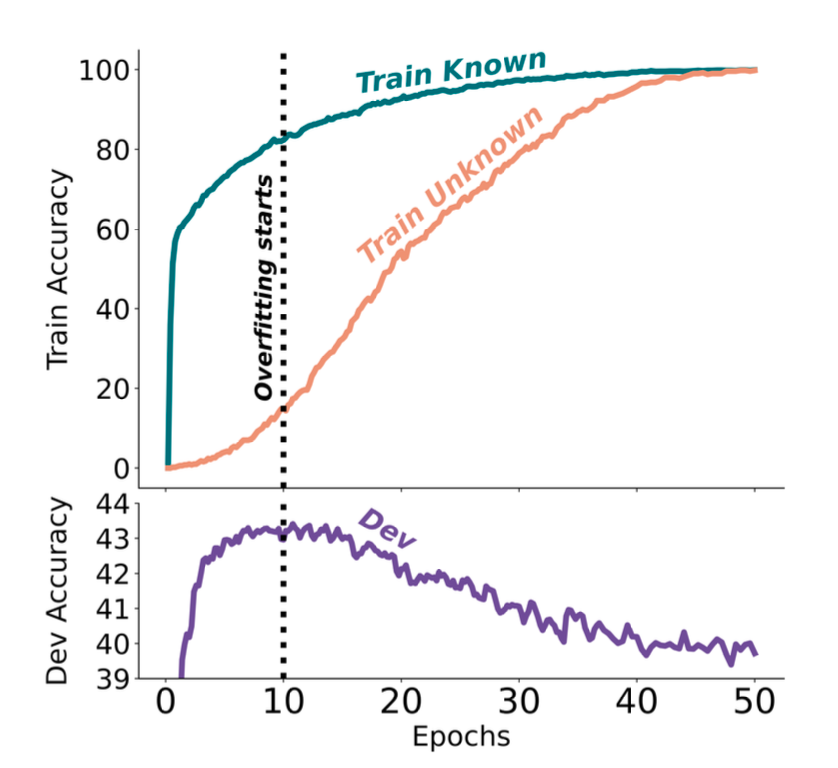

本文为 Lilian 文章的阅读笔记。Lilian 在 openai 工作，她的博客都非常推荐阅读：[https://lilianweng.github.io/](https://lilianweng.github.io/)

观后感：

- 可以看出很难避免有幻觉。。尤其是 sft 不靠谱的可能性很大除非数据很好，最容易的还是 RAG。
- 解决幻觉最好的方法建议从 RAG 的chunk制作入手
- 问问题的方式要具体，可以让模型多检查简单的事实
- 利用前面提到的一些方法可以用来作为幻觉的 benchmark检测

## **What Causes Hallucinations?**

- out-of-date, missing, or incorrect information in pre-training data
- Introducing new knowledge at the fine-tuning stage (making it debatable whether the model can reliably learn new knowledge via small-scale fine-tuning)
  - [Gekhman et al. 2024](https://arxiv.org/abs/2405.05904) studied the research question of whether fine-tuning LLMs on new knowledge encourages hallucinations.
    - LLMs learn fine-tuning examples with **new knowledge *slower* than** other examples with knowledge consistent with the pre-existing knowledge of the model
    - the examples with new knowledge i**ncrease the model’s tendency to hallucinate**.
    - 如何根据模型在闭卷问答数据集（如EntityQuestions）上生成正确答案的可能性，对模型的知识进行分类。给定一个问题𝑞和答案𝑎，定义𝑃Correct(𝑞,𝑎;𝑀,𝑇)来估计模型𝑀在温度𝑇下生成正确答案𝑎的可能性。

     | Type | Category | Definition | Explanation |
     | --- | --- | --- | --- |
     | Known | HighlyKnown | $$ P_{\text{Correct}}(q, a; M, T = 0) = 1 $$ | Greedy decoding always predicts the correct answer. |
     |  | MaybeKnown | $$ P_{\text{Correct}}(q, a; M, T = 0) \in (0, 1) $$ | Greedy decoding sometimes (but not always) predicts the correct answer. |
     |  | WeaklyKnown | $$ P_{\text{Correct}}(q, a; M, T = 0) = 0 $$ ∧ $$ P_{\text{Correct}}(q, a; M, T > 0) > 0 $$ | Greedy decoding never predicts the correct answer, whereas temperature sampling with $$ T > 0 $$ sometimes predicts the correct answer. |
     | Unknown | Unknown | $$ P_{\text{Correct}}(q, a; M, T \geq 0) = 0 $$ | The model never predicts the correct answer, thus it seems to lack the knowledge of the correct answer. |

The best dev performance is obtained when the LLM fits **the majority of the `Known` training examples but only a few of the `Unknown` ones**. The model starts to hallucinate when it learns most of the `Unknown` examples.



## **Hallucination Detection**

### **Retrieval-Augmented Evaluation**

[Lee et al. (2022)](https://arxiv.org/abs/2206.04624) introduced a new benchmark dataset, **FactualityPrompt**,consisting of both factual and nonfactual prompts.

This dataset uses Wikipedia documents or sentences as the knowledge base for factuality grounding.The Wikipedia documents are known ground-truth from the [FEVER](https://fever.ai/dataset/fever.html) dataset,


1. **Hallucination NE (Named Entity) errors**: 使用预训练的实体检测模型和文档级grounding知识，该指标测量未出现在grounding文档中的检测到的命名实体的比例。
2. **Entailment ratios**: 使用基于MNLI和句子级知识基础微调的RoBERTa模型，该指标计算生成句子的分数，这些句子被蕴涵模型标记为与配对的Wikipedia句子相关

```notion
文本蕴涵(Textual entailment)
entailment:
the relationship between two statements when for one to be true, 
the other must also be true

在自然语言处理(natural language processing)中，文本蕴涵(Textual entailment)是指两个文本片段有指向关系。当认为一个文本片段真实时，可以推断出另一个文本片断的真实性。也就是指，一个文本片段蕴涵了另一个文本片段的知识。可以分别称蕴涵的文本(entailing texts)为文本(text)，被蕴涵的文本(entailed texts)为假设(hypothesis)。

一个正面的文本蕴涵的例子(文本蕴涵了假设):

     文本：如果你帮助需要的人，上帝就会报答你。

     假设：拿钱给穷人可以得到好的结果。

一个负面的文本蕴涵的例子(文本推翻了假设):

     文本：如果你帮助需要的人，上帝就会报答你。

     假设：拿钱给穷人不会有结果。

一个不是文本蕴涵的例子(文本即不能蕴涵假设也不能推翻假设):

     文本：如果你帮助需要的人，上帝就会报答你。

     假设：拿钱给穷人会让你成为更好的人。

从中可以看出，文本蕴涵关系不是纯粹的逻辑推理，它的条件更为宽松，可以这样定义：如果一个人读了t能够推论h非常可能是真实的，那么t 蕴涵 h(t=>h)。
```

1. **FActScore**（原子性分数中的事实精度；[Minet al.2023](https://arxiv.org/abs/2305.14251)）将长形式生成分解为多个原子事实，并根据维基百科等知识库分别验证每个原子事实。然后我们可以测量每个模型生成的知识源支持的句子的比率（精度），FActScore是一组提示中模型生成的平均精度

关于模型幻觉行为的一些有趣观察：

- 传记生成任务中较罕见的实体的错误率较高。
- 对于生成中靠后提到的事实，错误率更高。
- 使用检索来建立模型生成显着有助于减少幻觉。

### **Sampling-Based Detection**

- **SelfCheckGPT**（[Manakul等人。2023](https://arxiv.org/abs/2303.08896)）简单来说就是采样多个样本，然后拿llm判断是否正确。

依赖于对来自黑盒LLM的多个样本的事实错误的一致性检查。考虑到灰盒事实检查测量需要访问LLM的令牌级logprob，SelfCheckGPT只需要不依赖外部知识库的样本，因此黑盒访问就足够了，不需要外部知识库。


### **Calibration of Unknown Knowledge 对于未知的幻觉**

- 提示模型对无法回答或未知的问题产生反应可能会引发幻觉。TruthfulQA（[Lin et al.2021](https://arxiv.org/abs/2109.07958)）和SelfAware（[尹et al.2023](https://arxiv.org/abs/2305.18153)）是衡量模型在这种情况下能在多大程度上产生真实反应的两个基准
- 在[TruthfulQA](https://github.com/sylinrl/TruthfulQA)（[Lin et al.2021](https://arxiv.org/abs/2109.07958)）中的测试问题是根据人类常见的误解或错误*对抗性地*制作的。该基准包括817个问题，涵盖38个主题，包括健康、法律、金融和政治。**最好的LLM在比较中的准确率为58%，人类可以达到94%。**
- [尹等（2023）](https://arxiv.org/abs/2305.18153)研究*自我认识的*概念，指的是语言模型是否知道自己知道什么或不知道什么。 **SelfAware**，包含五个类别的1032个无法回答的问题和2337个可回答的问题。（从结果来看基本上大模型gpt4最好都只能42%，其他都是更少。（2023年）

## **Anti-Hallucination Methods 阻止幻觉**

### **Indirect Query 通过间接查询判断**

*直接查询*要求模型判断生成的引用是否存在。**间接查询**改为询问生成的引用的辅助细节——作者是谁；例如，如果我们想检查`"Is the following paper real?"`，我们可以检查`"Who are the author of the paper?"`


### RAG

[RAG (Retrieval-augmented Generation)](https://lilianweng.github.io/posts/2020-10-29-odqa/#RAG) is a very common approach to provide 基础信息  grounding information, that is to retrieve relevant documents and then generate with related documents as extra context.

- **RARR** (“Retrofit Attribution using Research and Revision”; [Gao et al. 2022](https://arxiv.org/abs/2210.08726))
- 与使用搜索+编辑的RARR类似，**FAVA**（“使用增强知识进行事实验证”；Mishra等人。2024）也检索相关文档，然后编辑模型输出以避免幻觉错误。
- 重新思考检索（RR；He et al.2022）方法也依赖于检索相关的外部知识，但不需要额外的编辑。RR的检索不是利用搜索查询生成模型，而是基于分解的CoT提示
- Self-RAG（“自我反思检索-增强生成”；Asai et al.2024）通过输出任务输出和间歇性特殊反射令牌来训练LLM端到端学习反思自己的生成。他们通过提示GPT-4为批评家模型和生成器模型创建了监督数据集，然后将其提炼成内部模型以降低推理成本。

### **Chain of Actions**

Without grounding by external retrieved knowledge, we can design a process for using the model itself to do verification and revision to reduce hallucination.

- Dhuliawala 等人（2023）提出了一种名为“验证链”（Chain-of-Verification, CoVe）的方法，通过一系列的行动来规划和执行验证。CoVe 包含四个核心步骤：首先，模型生成一个初始草稿，称为“基线”。接着，模型基于这次生成设计非模板化的验证问题进行事实检查，这可以通过少量示例提示（response, verification questions）实现。第三步是独立回答这些问题，有几种变体设置：(1) 联合：与第二步结合，少量示例结构为（response, verification questions, verification answers）；缺点是原始响应在上下文中，模型可能会重复类似的幻觉。(2) 两步：将验证规划和执行步骤分开，避免原始响应的影响。(3) 分解：每个验证问题单独回答。如果长文本生成导致多个验证问题，我们会逐一回答每个问题。(4) 分解+修订：在分解验证执行后增加“交叉检查”步骤，基于基线响应和验证问题及答案来检测不一致。最后一步是生成最终、改进后的输出，如果发现不一致则进行修订。

    

    Here are some interesting observations from the CoVe experiments:

  - Instruction-tuning and [CoT](https://lilianweng.github.io/posts/2023-03-15-prompt-engineering/#chain-of-thought-cot) do not reduce hallucinations.
  - Factored and 2-step CoVe improve performance and further explicit reasoning on inconsistency detection also helps (“factor+revise” approach).
  - Short-form verification questions are more accurately answered than long-form queries.
  - Free-form LLM-generated verification questions are better than heuristics (e.g. `Does X answer the question?`) and questions that require open-ended generation work better than yes/no questions.

- **RECITE** (“Recitation-augmented generation”; [Sun et al. 2023](https://arxiv.org/abs/2210.01296)) relies on recitation as an intermediate step to improve factual correctness of model generation and reduce hallucination.

### Sampling Methods

[Lee, et al. (2022)](https://arxiv.org/abs/2206.04624) found that[nucleus sampling](https://lilianweng.github.io/posts/2021-01-02-controllable-text-generation/#nucleus)(top-𝑝sampling) is found to perform worse on [FactualityPrompt](https://github.com/nayeon7lee/FactualityPrompt) benchmark than greedy sampling, although it achieves better diversity and less repetition, since nucleus sampling added extra randomness.

### **Fine-tuning for Factuality**

[Lee, et al. (2022)](https://arxiv.org/abs/2206.04624) proposed two ideas for factuality-enhanced training:

- `TopicPrefix`  Append topic (i.e. wikipedia document title) in front of each sentence in this document.
- 更新训练损失以关注句子的后半部分，他们假设句子的后半部分包含更多的事实知识。 The implementation is quite simple, deciding a pivot , and all the tokens before the th token are all applied zero-masking. In their experiment, the best pivot  is selected as 0.5 x the sentence length.

## Appendix: Evaluation Benchmarks

Here is a list of datasets mentioned in this post.

[**TruthfulQA**](https://github.com/sylinrl/TruthfulQA) ([Lin et al. 2021](https://arxiv.org/abs/2109.07958)) is designed to measure how well a LLM can generate truthful responses. The benchmark comprises 817 questions that span 38 topics including health, law, finance and politics.

[**FactualityPrompt**](https://github.com/nayeon7lee/FactualityPrompt) ([Lee, et al. 2022](https://arxiv.org/abs/2206.04624)) is a benchmark consisting of both factual and nonfactual prompts. It relies on Wikipedia documents or sentences as the knowledge base for factuality grounding.

[**SelfAware**](https://github.com/yinzhangyue/SelfAware) ([Yin et al. 2023](https://arxiv.org/abs/2305.18153)) contains 1,032 unanswerable questions across five categories and 2,337 answerable questions. Unanswerable questions are sourced from online forums with human annotations while answerable questions are sourced from SQuAD, HotpotQA and TriviaQA based on text similarity with unanswerable questions.

[**LongFact**](https://github.com/google-deepmind/long-form-factuality/tree/main/longfact) ([Wei et al. 2024](https://arxiv.org/abs/2403.18802) ) is designed for checking long-form generation factuality. It consists of 2280 fact-seeking prompts that seek long-form responses on 38 manually curated topics

[**HaDes**](https://github.com/microsoft/HaDes) ([Liu et al. 2021](https://arxiv.org/abs/2104.08704)) is a benchmark for hallucination detection as a binary classification task. The dataset is created by perturbing Wikipedia text and human annotation.

[**FEVER**](https://fever.ai/dataset/fever.html) (Fact Extraction and VERification) dataset contains 185,445 claims generated by altering sentences extracted from Wikipedia and subsequently verified without knowledge of the sentence they were derived from. Each claim is classified as `Supported`, `Refuted` or `NotEnoughInfo`.

[**FAVABench**](https://huggingface.co/datasets/fava-uw/fava-data) ([Mishra et al. 2024](https://arxiv.org/abs/2401.06855)) is a benchmark for evaluating fine-grained hallucination. There are 200 information-seeking source prompts and 3 model responses per prompt, resulting in 600 responses in total. Each model response is manually labeled with fine-grained annotations on hallucination error types.
