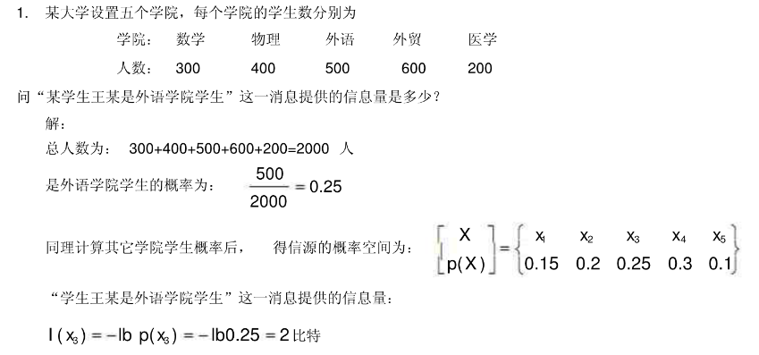
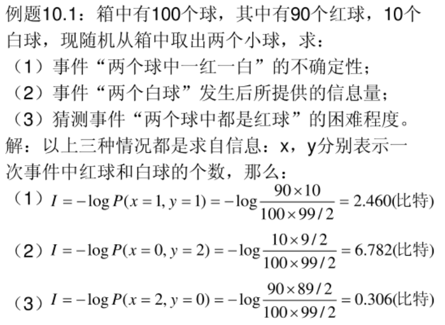
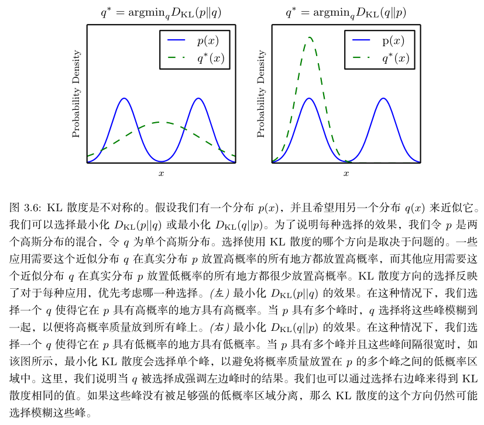

首先，我们需要认识什么是信息量与信息熵:

## 自信息量

通常自信息可以从两个方面来理解:

1. **自信息是事件发生前,事件发生的不确定性。**
2. **自信息表示事件发生后,事件所包含的信息量。**

(比如你看到这，会想问作者也许不是一只猫而是人类————那我当然不是猫，这就没有不确定性可言，没有什么信息量；如果有一天我真的是猫了，那便是大新闻了！！)
自然而然，我们会想到所谓信息量应当与概率有关，且应该可以加合（两个事件发生时带来的信息量应该是分别发生时的和），也就是满足以下特质：

- $f\left( P \right) >0 \\; \\; \\; \\; P\left( x \right) \in \left( 0,1 \right) $
- $f\left( P_A·P_B \right) =f\left( P_A \right) +f\left( P_B \right) $
- $f\left( 1 \right) =0$
- 事件发生概率越大，自信息量越小
  
此时我们可以才想到对数会满足这样的性质，于是可以给出：$I\left( x \right) =-\log \left( P\left( x \right) \right) $
因为在计算机领域中习惯用二进制，所以我们通常以2为底，这样自信息量的单位就为比特bit,——即二进制数的一位包含的信息或2个选项中特别指定1个的需要信息量。而机器学习中常选择以e为底，单位为奈特nats
你可以通过以下例题来更好的理解自信息量：

## 信息熵

接下来，我们将进一步研究什么是信息熵，在前面我们学会了如何衡量一个事件的不确定性，但一个随机变量可能包含的多个事件，我们该如何对这个 **随机变量的不确定性** 进行刻画呢？
我们会自然想到求出所有事件的信息量期望，且熵越大，事件的不确定性越强，当满足均匀分布时熵最大(有约束情况下要额外考虑，一阶矩二阶矩不同时的最大熵分布不同，详情可参考最大熵原理）；如果熵值小，证明某个事件发生的概率比较大，随机变量取某个值的概率大，不确定性就小了。(另外，信息熵也可以理解为解除信源不确定性所需要的信息量)
于是我们给出： (其中规定)$0\log 0=0$
$$
H\left( x \right) =-\sum_{i=1}^n{p\left( x_i \right) \log \left( p\left( x_i \right) \right)}
$$
我们可以验证，当n个事件满足等概率分布时其中当结果为logn（n为总数）信息熵达到最大值。
另外可以给出条件熵(你可以运用条件概率辅助理解)：
$$
H\left( Y|X \right) =-\sum_x{\sum_y{p\left( xy \right) \log P\left( y|x \right) =\sum_x{-\sum_y{P\left( y|x \right) \log P\left( x \right) =\sum_x{P\left( x \right) H\left( Y|x \right)}}}}}
$$

## 相对熵

如果我们对于同一个随机变量x有两个单独的概率分布P(x) 和 Q(x)，我们可以使用KL散度（Kullback-Leibler (KL) divergence）或者叫相对熵来衡量这**两个分布的差异情况**，其中p对q的相对熵写作(在机器学习中，我们可以把P(x)看作真实分布，而Q(x)作为预测的分布)：
$$
D_{KL}\left(p||q \right) =\sum_x{p\left( x \right) \log \frac{p\left( x \right)}{q\left( x \right)}=E_{p\left( x \right)}\log \frac{p\left( x \right)}{q\left( x \right)}}
$$
同时KL散度还满足以下条件：
$$
D_{KL}\left(p||q \right) \ne D_{KL}(q||p)
\\\
D_{KL}\left(
 p||q\right) \geqslant 0
$$
对于第一个式子，我们可以借助以下内容理解：

用比较通俗的话来说，让我们回到公式之中，且注意到P(x)作为真实分布，Q(x)作为预测的分布；

$$
D_{KL}\left( p||q \right) =E_{p\left( x \right)}\log \frac{p\left( x \right)}{q\left( x \right)}
$$

1. 当第一种情况，如果P(x)是较大的，那么q(x)也应该较大来保证相对熵最小化；如果P(x)是较小的，那实际上q(x)的大小对相对熵影响不大；所以我们只需要特别注意前者的情况。此时在看图你就可以更加理解了。

$$
D_{KL}\left( q||p \right) =E_{q\left( x \right)}\log \frac{q\left( x \right)}{p\left( x \right)}
$$

2. 当第二种情况，很显然会与第一种情况相反，如果P(x)是较小的，那么q(x)也应该较小来保证相对熵最小化————这就是为什么说图中提到概率小的地方比较重要，而q(x)较大的时候就影响不大了。

## 交叉熵

接下来我们要了解常用的一种更常用的熵————交叉熵，由前面学到的相对熵可以进一步推导：

$$
\begin{aligned}
 D_{KL}\left( p||q \right) &=\sum_{i=1}^n{p\left( x_{\mathrm{i}} \right) \log \left( \frac{p\left( x_i \right)}{q\left( x_i \right)} \right)}\\\
 \mathrm{
}&=\sum_{i=1}^n{p\left( x_i \right) \log \left( p\left( x_i \right) \right)}-\sum_{i=1}^n{p\left( x_i \right)}\log \left( q\left( x_i \right) \right)\\\
 &=-H\left( p \right) -\sum_{i=1}^n{p\left( x_i \right)}\log \left( q\left( x_i \right) \right)\\
\end{aligned}
$$

其中第一项我们可通过推导得知是针对真实分布概率p(x)的信息熵，而后一项我们定义为交叉熵；
$$
H\left( p,q \right) =-\sum_{i=1}^n{p\left( x_i \right)}\log \left( q\left( x_i \right) \right)
$$
交叉熵可以理解为，**消除体系不确定性所需要付出的努力大小**。

### 交叉熵与极大似然估计的联系

由于真实分布的信息熵是确定的，在优化过程中（最小化相对熵），我们可以把他忽略，只看交叉熵的部分。此外，最小化交叉熵其实与极大似然估计是等价的，具体证明如下：（参考Deep Learning.Ian Goodfellow and Yoshua Bengio and Aaron Courville）
我们考虑一组含有m个样本的数据集$\mathbf{X}=({ x^{(1)},\cdots ,x^{(m)} }) $,此时可以定义 $ \theta $ 的极大似然为(其中P为模型的联合概率)：(如果你不懂argmax是什么意思可以参考[argmax科普](https://zhuanlan.zhihu.com/p/79383099))
$$
\begin{aligned}
 \mathbf{\theta }\_{ML}&=\underset{\theta}{\mathrm{argmax}}P_{model}\left( \mathbf{X};\theta \right)\\\
 \mathrm{
}&=\underset{\theta}{\mathrm{argmax}}\prod_{i=1}^m{P_{model}\left( \boldsymbol{x}^{\left( i \right)};\theta \right)}
\end{aligned}
$$
由于乘积不好计算，我们可以取log将他转换为加和形式，取最值时的参数不变；且可以乘上不影响结果的 $ \frac{1}{m} $。
$$
\begin{aligned}
 \mathbf{\theta }\_{ML}&=\underset{\theta}{\mathrm{argmax}}\sum_{i=1}^m \mathrm{log} {P_{model}\left( \boldsymbol{x}^{\left( i \right)};\theta \right)}\\\
 \mathrm{
}&=\underset{\theta}{\mathrm{argmax}}\frac{1}{m}\sum_{i=1}^m \mathrm{log} {P_{model}\left( \boldsymbol{x}^{\left( i \right)};\theta \right)}
\end{aligned}
$$
由大数定律可知（算术平均值依概率收敛于期望）：
$$
\frac{1}{m}\sum_{i=1}^m{X_i\longrightarrow} \mu
$$
可以将原式进一步化为：
$$
\begin{aligned}
 \mathbf{\theta }\_{ML}&=\underset{\theta}{\mathrm{arg}\max}\mathbb{E}\_{\mathbf{x}~\hat{p}_{data}}\log P\_{model}\left( \boldsymbol{x};\boldsymbol{\theta } \right)\\\
 &=\underset{\theta}{\mathrm{arg}\max}\sum_x{p\left( x \right) \log q\left( x \right)}\\\
 &=\underset{\theta}{\mathrm{arg}\min}\left[ -\sum_x{p\left( x \right) \log q\left( x \right)} \right]\\\
\end{aligned}
$$
Bravo!!! 此时你惊喜的发现这就是我们前面推导得到的交叉熵公式，至此，对于真实分布和模型分布，我们明白了MLE方法（让似然最大化）等价于两者间交叉熵的最小化。好奇的你也许想问“MLE与KL散度也是共通的吗？”————这个问题你可以自己试试看，就用上式类似办法加常数即可！

## Reference

- [一文搞懂交叉熵损失](https://www.cnblogs.com/wangguchangqing/p/12068084.html#autoid-0-1-0)
- [详解机器学习中的熵、条件熵、相对熵和交叉熵](https://www.cnblogs.com/kyrieng/p/8694705.html)
- [信息论基础](https://www.doc88.com/p-5763943323651.html?r=1)
- [数字世界逼近现实世界——浅谈分布近似与最大似然估计](https://zhuanlan.zhihu.com/p/355150033)
