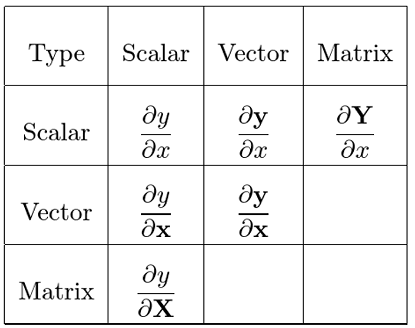
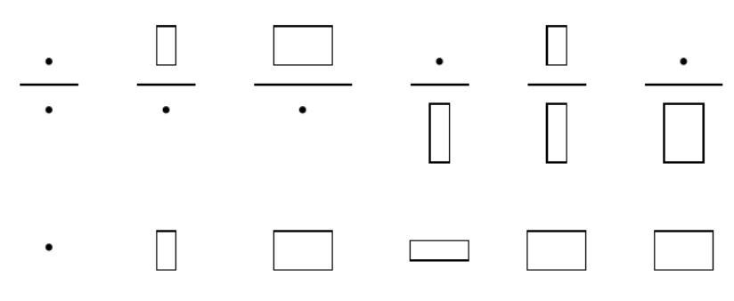

## 初始介绍

### 符号规定

在本文中，我们做如下规定：  
Matrix矩阵为：$\mathbf{A}, \mathbf{X}, \mathbf{Y}$
Vector向量（规定为$\color{red} {列} $向量）为：$ \mathbf{a}, \mathbf{x}, \mathbf{y}$  
Scalar标量为：$a, x, y$  

### 分子布局

在矩阵求导中，我们有两种布局（分子与分母）
为了方便起见，本文只阐述了分子布局即：

$$\frac{\partial \mathbf{y}}{\partial {x}}=\left[\begin{array}{c}  \frac{\partial y_{1}}{\partial x}  \\\  \frac{\partial y_{2}}{\partial x} \\\ \vdots \\\  \frac{\partial y_{m}}{\partial x}\end{array}\right]\\ \\ \\
\frac{\partial y}{\partial \mathbf {x}} = \left[\frac{\partial y}{\partial x_{1}} ,\frac{\partial y}{\partial x_{2}}, \cdots ,\frac{\partial y}{\partial x_{n}}\right]$$
分母布局为分子布局的转置。
**记忆方法：分子列向量分母标量，看作长筒冰淇淋，分母看作小盒子，“能站住”。分子标量分母列向量，则盒子把冰淇淋“压倒了”。或可看最后结果的行数，是分子的行数便是分子布局。**
一般的，我们会遇到如下布局,且可用记忆方法配合右图形象理解(下面是结果）：

当分子为矢量、矩阵时，结果为分子的行；当分子为标量时，结果是分母转置的行。
### Vector-by-Vector
另外我们有：

$\mathbf{y}=\begin{bmatrix}
y_1 \\\
y_2 \\\
\vdots \\\
y_m
\end{bmatrix}$
$\mathbf{x}=\begin{bmatrix}
x_1 \\\
x_2 \\\
\vdots \\\
x_n
\end{bmatrix}$
由 $ \frac{\partial \mathbf{y}}{\partial \mathbf{x}}$ 运算后产生m行n列矩阵：
$ \frac{\partial \mathbf{y}}{\partial \mathbf{x}} \stackrel{\text { def }}{=}\left[\begin{array}{cccc}\frac{\partial y_{1}}{\partial x_{1}} & \frac{\partial y_{1}}{\partial x_{2}} & \ldots & \frac{\partial y_{1}}{\partial x_{n}} \\\ \frac{\partial y_{2}}{\partial x_{1}} & \frac{\partial y_{2}}{\partial x_{2}} & \ldots & \frac{\partial y_{2}}{\partial x_{n}} \\\ \vdots & \vdots & \ddots & \vdots\\\ \frac{\partial y_{m}}{\partial x_{1}} & \frac{\partial y_{m}}{\partial x_{2}} & \ldots & \frac{\partial y_{m}}{\partial x_{n}}\end{array}\right] $
这种矩阵可被称为**Jacobian matrix**。
接下来举个例子，若我们有：
$$\mathbf{y}=\begin{bmatrix}
y_1 \\\
y_2 \\\
\end{bmatrix}
   \\ \\ \\ \mathbf{x}=\begin{bmatrix}
x_1 \\\
x_2 \\\
x_3
\end{bmatrix}\\ \\ 且y_1=x^2_1-2x_2 \\ ,\\ y_2=x^2_3-4x_2$$
则能得到:
$$\frac{\partial \mathbf{y}}{\partial \mathbf{x}} =\begin{bmatrix}
2x_1 & -2 & 0 \\\
0 & -4 & 2x_3 \\\
\end{bmatrix}
$$

### Matrix-by-Scalar

同样的，我们可以给出矩阵与向量间的运算关系：
$ \frac{\partial \mathbf{Y}}{\partial {x}} \stackrel{}{=}\left[\begin{array}{cccc}\frac{\partial Y_{11}}{\partial x} & \frac{\partial Y_{12}}{\partial x} & \ldots & \frac{\partial Y_{1n}}{\partial x} \\\ \frac{\partial Y_{21}}{\partial x} & \frac{\partial Y_{22}}{\partial x} & \ldots & \frac{\partial Y_{2n}}{\partial x} \\\ \vdots & \vdots & \ddots & \vdots\\\ \frac{\partial Y_{m1}}{\partial x} & \frac{\partial Y_{m2}}{\partial x} & \ldots & \frac{\partial Y_{mn}}{\partial x}\end{array}\right]$
$ \\ \\ \\ \\ \\ and \\ \\ \\ \\ \frac{\partial y}{\partial\mathbf{X}} \stackrel{}{=}\left[\begin{array}{cccc}\frac{\partial y}{\partial X_{11}} & \frac{\partial y}{\partial X_{21}} & \ldots & \frac{\partial y}{\partial X_{m1}} \\\ \frac{\partial y}{\partial X_{12}} & \frac{\partial y}{\partial X_{22}} & \ldots & \frac{\partial y}{\partial X_{m2}} \\\ \vdots & \vdots & \ddots & \vdots\\\ \frac{\partial y}{\partial X_{1n}} & \frac{\partial y}{\partial X_{2n}} & \ldots & \frac{\partial y}{\partial X_{mn}}\end{array}\right] $
可以注意到当矩阵在分母时$\mathrm{X}$已经“被转置”

## 常用求导公式

注：其中$\mathbf{a},\mathrm{A}$都不是$\mathbf{x}, \mathrm{X}$的函数
$$\frac{\mathrm{d} \mathbf{a}}{\mathrm{d} x} =\mathbf{0} \tag{1} \qquad  (column \\ matrix)$$
$$\frac{\mathrm{d}a }{\mathrm{d} \mathbf{x}} =\mathbf{0}^{\mathrm{T}}  \tag{2} \qquad  (row \\ matrix)$$
$$\frac{\mathrm{d}a }{\mathrm{d} \mathbf{X}} =\mathbf{0}^{\mathrm{T}} \tag{3} \qquad  (matrix)$$
$$\frac{\mathrm{d} \mathbf{a} }{\mathrm{d} \mathbf{X}} =\mathbf{0} \tag{4} \qquad  (matrix)$$
$$\frac{\mathrm{d} \mathbf{x} }{\mathrm{d} \mathbf{x}} =\mathbf{I} \tag{5} \qquad  (matrix)$$
若想从“直观上”理解结果为什么会有转置符，可以反复理解 **(1.2)分子布局** 中的右图
$$\frac{\mathrm{d} \mathbf{a}^{\mathrm{T}}\mathbf{x} }{\mathrm{d} \mathbf{x}}=\frac{\mathrm{d} \mathbf{x}^{\mathrm{T}}\mathbf{a} }{\mathrm{d} \mathbf{x}}=\mathbf{a}^{\mathrm{T}} \tag{6} $$
$$\frac{\mathrm{d} \mathbf{x}^{\mathrm{T}}\mathbf{x} }{\mathrm{d} \mathbf{x}}=2\mathbf{x}^{\mathrm{T}} \tag{7} $$
$$\frac{\mathrm{d} ({\mathbf{x}^{\mathrm{T}}\mathbf{a}})^2 }{\mathrm{d} \mathbf{x}}=2\mathbf{x}^{\mathrm{T}}\mathbf{a}\mathbf{a}^{\mathrm{T}} \tag{8} $$
$$\frac{\mathrm{d} \mathbf{Ax} }{\mathrm{d} \mathbf{x}} =\mathbf{A} \tag{9} $$
$$\frac{\mathrm{d} \mathbf{x}^{\mathrm{T}}\mathbf{A} }{\mathrm{d} \mathbf{x}}=\mathbf{A}^{\mathrm{T}} \tag{10} $$
$$\frac{\mathrm{d} \mathbf{x}^{\mathrm{T}}\mathbf{A}\mathbf{x} }{\mathrm{d} \mathbf{x}}=\mathbf{x}^{\mathrm{T}}(\mathbf{A}+\mathbf{A}^{\mathrm{T}}) \tag{11} $$

注：其中(11)用到了矩阵求导中的"莱布尼兹法则"（仔细思考前者的行列与后者的行列就可以明白）:
$$\frac{\partial \mathbf u^{\mathrm{T} }\mathbf v}{\partial \mathbf x} =
\mathbf u^{\mathrm{T}} \frac{\partial \mathbf v}{\partial \mathbf x} +
\mathbf v^{\mathrm{T}}\frac{\partial \mathbf u}{\partial \mathbf x}$$
## 实例练习
我们会好奇一个问题：为什么大多数求导后以及求导时形式都是转置在前？
可以这么理解，假设有参数$\mathbf{\Theta } =\begin{bmatrix}
 \theta_0\\\
 \theta_1\\\
 \theta_2
\end{bmatrix}$
以及列向量$\mathbf{x}=\begin{bmatrix}
   1 \\\
 x_1 \\\
 x_2
\end{bmatrix}$
我们可以把多元函数表达为$$f(x_1,x_2)=\Theta^{\mathrm{T}} \mathbf{x}=\theta_0 + \theta_1x_1 + \theta_2x_2$$
方便计算，且符合目的。在计算结果直觉中一定要紧紧把握结果与分子（上下拉长）分母（左右拉宽）的关系。
### 多元线性回归推导
在西瓜书第三章开头中，我们需要求解最小error$\\ E=(\boldsymbol{y}-\mathbf{X}\boldsymbol{\hat{w}})^{\mathrm{T}}(\boldsymbol{y}-\mathbf{X}\boldsymbol{\hat{w}}) $
对其展开有：$$ \begin{aligned}(\boldsymbol{y}-\mathbf{X}\boldsymbol{\hat{w}})^{\mathrm{T}}(\boldsymbol{y}-\mathbf{X}\boldsymbol{\hat{w}}) &=(\boldsymbol{y}^{\mathrm{T}}-\boldsymbol{\hat{w}}^{\mathrm{T}}\mathbf{X}^{\mathrm{T}})(\boldsymbol{y}-\mathbf{X}\boldsymbol{\hat{w}}) \\\
&= \boldsymbol{y}^{\mathrm{T}} \boldsymbol{y}- (\boldsymbol{y}^{\mathrm{T}} \mathbf{X})  \boldsymbol{\hat{w}}-\boldsymbol{\hat{w}}^{\mathrm{T}} (\mathbf{X}^{\mathrm{T}} \boldsymbol{y})
+\boldsymbol{\hat{w}}^{\mathrm{T}} (\mathbf{X}^{\mathrm{T}} \mathbf{X})  \boldsymbol{\hat{w}} \end{aligned}$$

把括号中看作常数，每一项分别对 $\boldsymbol{\hat{w}}$ 求导，利用公式$(9),(10),(11)$可得:
$$ \frac{\partial \boldsymbol{E}_{\boldsymbol{\hat{w}}} }{\partial \boldsymbol{\hat{w}}} = -\boldsymbol{y}^{\mathrm{T}} \mathbf{X} - \boldsymbol{y}^{\mathrm{T}} \mathbf{X} + \boldsymbol{\hat{w}}^{\mathrm{T}} [\mathbf{X}^{\mathrm{T}} \mathbf{X}+(\mathbf{X}^{\mathrm{T}} \mathbf{X})^{\mathrm{T}}] = -2\boldsymbol{y}^{\mathrm{T}} \mathbf{X} + 2\boldsymbol{\hat{w}}^{\mathrm{T}} \mathbf{X}^{\mathrm{T}} \mathbf{X} $$
令其等于零可得：
$$\boldsymbol{y}^{\mathrm{T}} \mathbf{X} = \boldsymbol{\hat{w}}^{\mathrm{T}} \mathbf{X}^{\mathrm{T}} \mathbf{X}$$
同时转置可得：
$$ \mathbf{X}^{\mathrm{T}} \boldsymbol{y}  = \mathbf{X}^{\mathrm{T}} \mathbf{X} \boldsymbol{\hat{w}}  $$
若此时 $\mathbf{X}^{\mathrm{T}} \mathbf{X}$ 为满秩、非奇异矩阵，我们可以得到：
$$\boldsymbol{\hat{w}}=( \mathbf{X}^{\mathrm{T}} \mathbf{X})^{-1} \mathbf{X}^{\mathrm{T}} \boldsymbol{y}   \\\ \\ \\\ Q.E.D$$

## 上文公式的证明过程
- 如果你不知道计算结果是否正确，可以使用[验算矩阵求导结果是否正确](http://www.matrixcalculus.org/)进行验证。  

1. 证明(6)
$$
Let \\; s=\boldsymbol{a}^T\mathbf{x}={a}_1x_1+\cdots +a_nx_n.\quad Then,\\;\frac{\partial s}{\partial x_i}=a_i
\\\
So,\\:\frac{\mathrm{d} \boldsymbol{a}^{\mathrm{T}}\mathbf{x} }{\mathrm{d} \mathbf{x}}=\frac{\mathrm{d} s}{\mathrm{d} \mathbf{x}}=\left[ \frac{\mathrm{d}s}{\mathrm{d}x_1},\frac{\mathrm{d}s}{\mathrm{d}x_2},\cdots ,\frac{\mathrm{d}s}{\mathrm{d}x_n} \right] =\left[ a_1,a_2,\cdots ,a_n \right] =\boldsymbol{a}^T
$$
2. 证明(7)
$$
Let \\; s=\boldsymbol{\mathbf{x}}^{\mathrm{T}}\mathbf{x}=\sum_i{x_{i}^{2}}. \quad
Then,\\;\frac{\partial s}{\partial x_i}=2x_i \\\ So, \\;\\; \frac{\mathrm{d} s}{\mathrm{d} \mathbf{x}}=2\mathbf{x}^{\mathrm{T}}
$$

3. 证明(8)
当成复合函数即可，相信你可以自己证明！

4. 证明(9)
比较麻烦的方法，由：
$$
\mathbf{A}\mathbf{x}=\left[ \begin{matrix}
 a_{11}&  \cdots&  a_{1n}\\\
 \vdots&  \ddots&  \vdots\\\
 a_{n1}&  \cdots&  a_{nn}\\\
\end{matrix} \right] \left[ \begin{array}{c}
 x_1\\\
 \vdots\\\
 x_n\\\
\end{array} \right] =\left[ \begin{array}{c}
 a_{11}x_1+\cdots +a_{1n}x_n\\\
 \vdots\\\
 a_{n1}x_1+\cdots +a_{nn}x_n\\\
\end{array} \right]
$$
再由“分子决定行，分母决定列，分别求导”原则（如果不理解可以返回开头再看一遍）
得到：
$$
\left[ \begin{matrix}
 a_{11}&  \cdots&  a_{1n}\\\
 \vdots&  \ddots&  \vdots\\\
 a_{n1}&  \cdots&  a_{nn}\\\
\end{matrix} \right]=\mathbf{A}
$$
比较简单的方法：（类似上面的证明）

$$
Let\\,\\,  \boldsymbol{s}=\mathbf{A} \mathbf{x}. \\;\\;  Then,  s_i=\sum_j{\begin{array}{c}
 a_{ij}x_j\\\
\end{array}}, and\\,\\,\frac{\partial s_i}{\partial x_j}=a_{ij}.
\\\
So, \frac{\mathrm{d} \boldsymbol{s}}{\mathrm{d} \mathbf{x}}=A.
$$

注释:有些情况（比如矩阵对向量、向量对矩阵、矩阵对矩阵求导）可能存在不好表达的情况（详情参考Reference4)因为列向量对列向量求导本质是用雅可比矩阵定义的。在这里建议直接记住结果,或者用网站验证结果；如果会用张量指标计算也行。如果你想学习更一般地做法，可以参考附录3的文章。

## Reference
- [matrix_calculus NTU (Po-Chen Wu)](https://github.com/sanbuphy/chiguaqunzhong/blob/main/matrix_calculus%20NTU%20.pdf)
- [Matrix Differentiation NUS(Leow Wee Kheng)](https://wenku.baidu.com/view/ace84aa564ce0508763231126edb6f1aff0071f2.html)
- [矩阵求导公式的数学推导（矩阵求导——基础篇）](https://zhuanlan.zhihu.com/p/273729929)
- [机器学习中的矩阵、向量求导](https://daiwk.github.io/assets/matrix+vector+derivatives+for+machine+learning.pdf)
