# Vision GNN: An Image is Worth Graph of Nodes

论文链接： <https://arxiv.org/abs/2206.00272>

代码开源链接（暂无）：<https://github.com/huawei-noah/Efficient-AI-Backbones>

最近都在关注GNN在图像识别上的应用，发现已经被Huawei Noah’s Ark Lab做完了。。。

但我很好奇他们是怎么处理训练集本身（loss是什么），对拆分后图结构的标注应该也是一个相对大的工程，这点需要等开源后仔细研究（也许还需要多读几遍**Graph Representation of Image**以及VIG BLock）

该文基于图像的图表示（graph representation）提出了 vision graph neural network (ViG)。该文应该是首次将图神经网络用于视觉任务，同时取得很好的效果，在 ImageNet 分类任务上超过了 CNN (ResNet), MLP (CycleMLP) 和 transformer (Swin-T)

These parts linked by joints naturally form a graph structure. By analyzing the graph.

通过图结构分解，各部分间的连接显得更加紧密：（相似的语义能够互相跨区域关联）

“we are able to recognize the human. **Moreover, graph is a generalized data structure that grid and
sequence can be viewed as a special case of graph.** Viewing an image as a graph is more flexible and effective for visual perception”

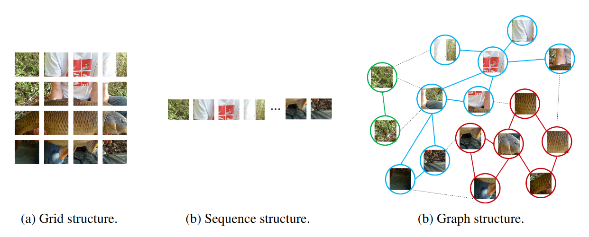

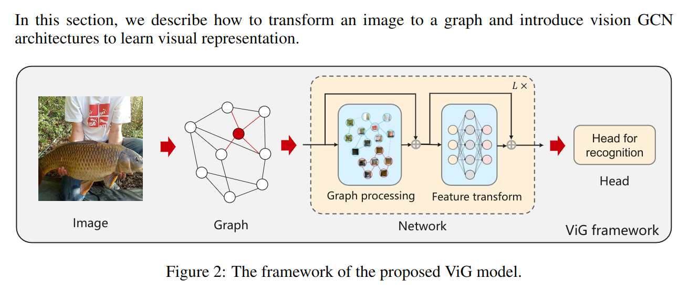

## VIG Block

Huawei Noah’s Ark Lab提出了一个特殊的VIG块结构，相比GCNs可以提高特征的多样性，减少因网络深度加强导致的特征减少现象。ViG 块是构成 ViG 网络的基本构建单元，其由Grapher 模块和 FFN 模块叠加而成的。

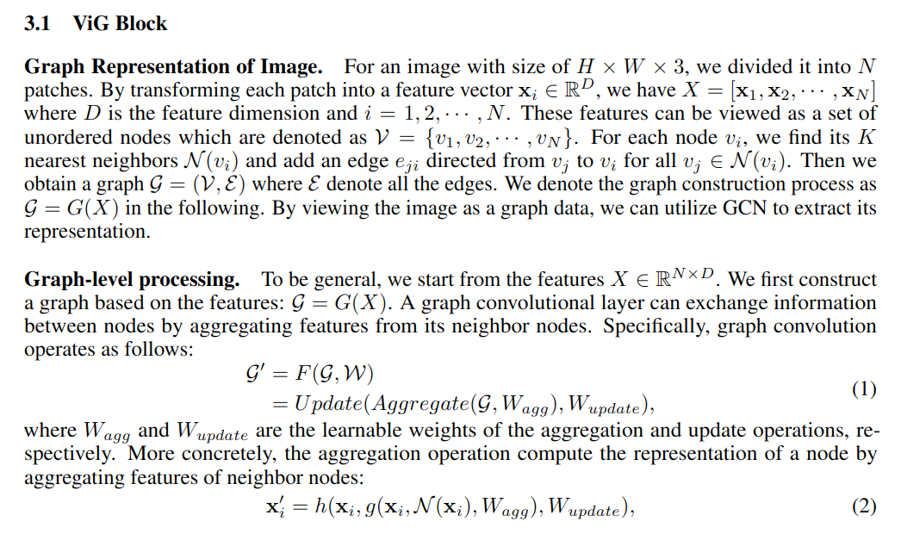

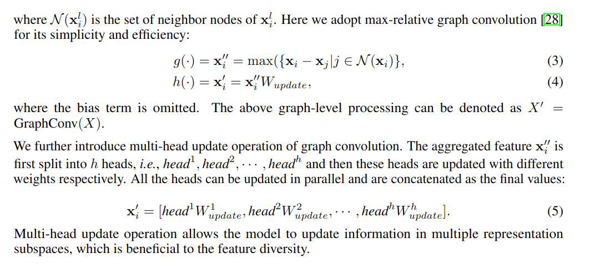

如何避免Feature diversity of nodes as layer changes 降低，即：

“The over-smoothing phenomenon in deep GCNs  will decrease the distinctiveness of node features and lead to performance degradation for visual recognition,”

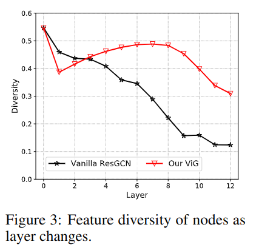

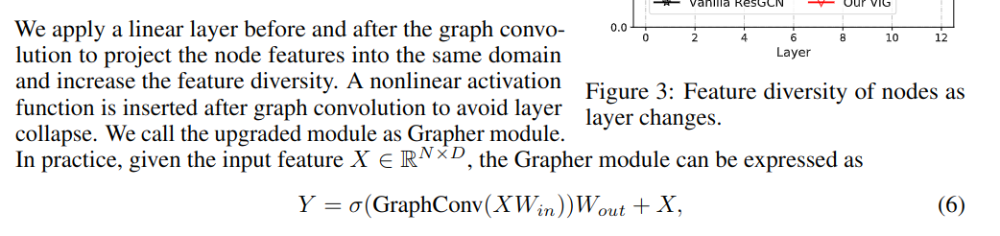

他们还提供了两种结构用于构建VIG，分别为各向同性与金字塔型：

”we build two kinds of network architectures for ViG, i.e., isotropic architecture and pyramid architecture“

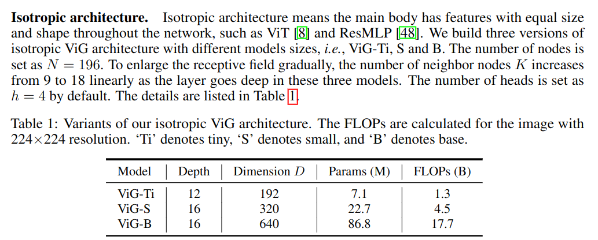

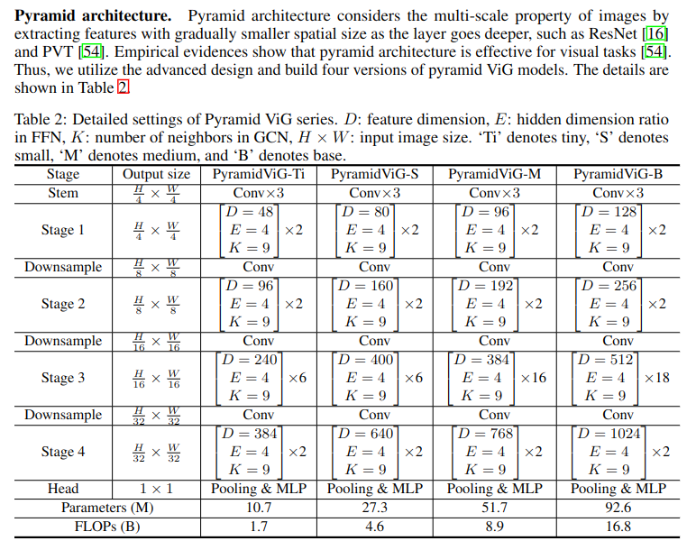

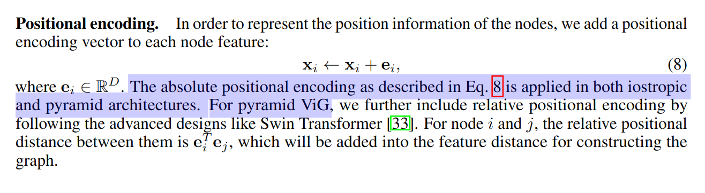

验证数据集：

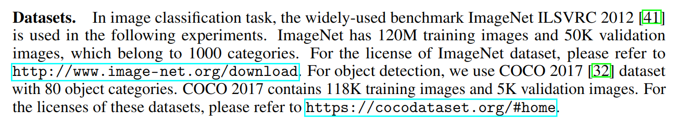

跑数据集的设置：

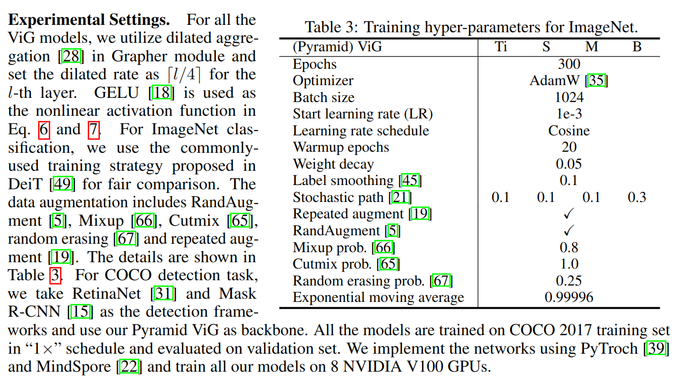

最后结果展示：

Isotropic ViG：

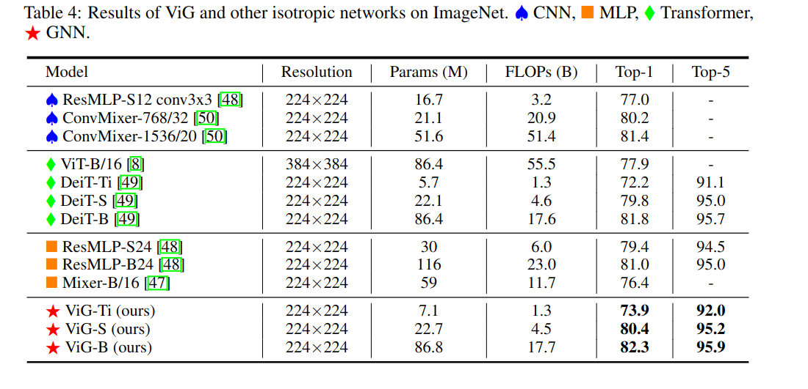

Pyramid ViG

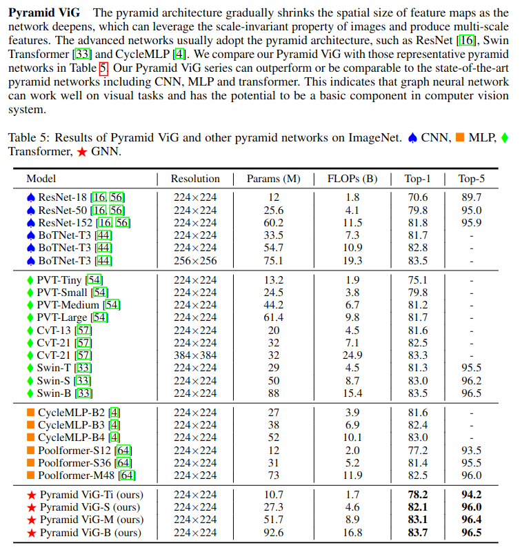

在目标检测的效果：

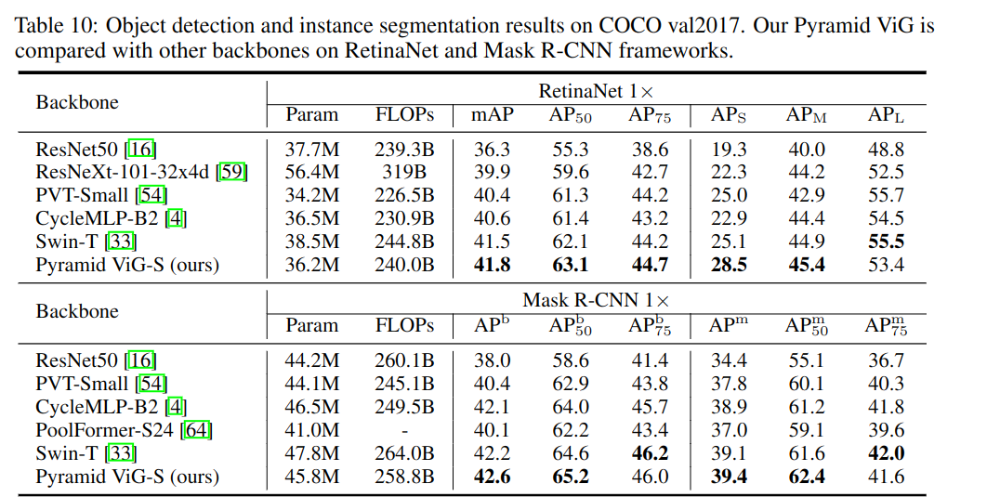

Ablation Study测试的结果（关闭一些配件）

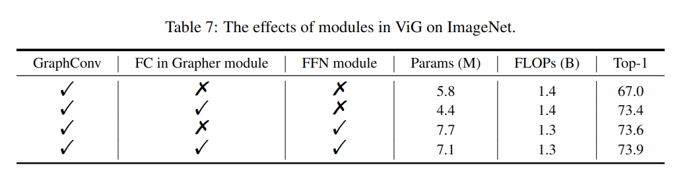

过程的可视化：

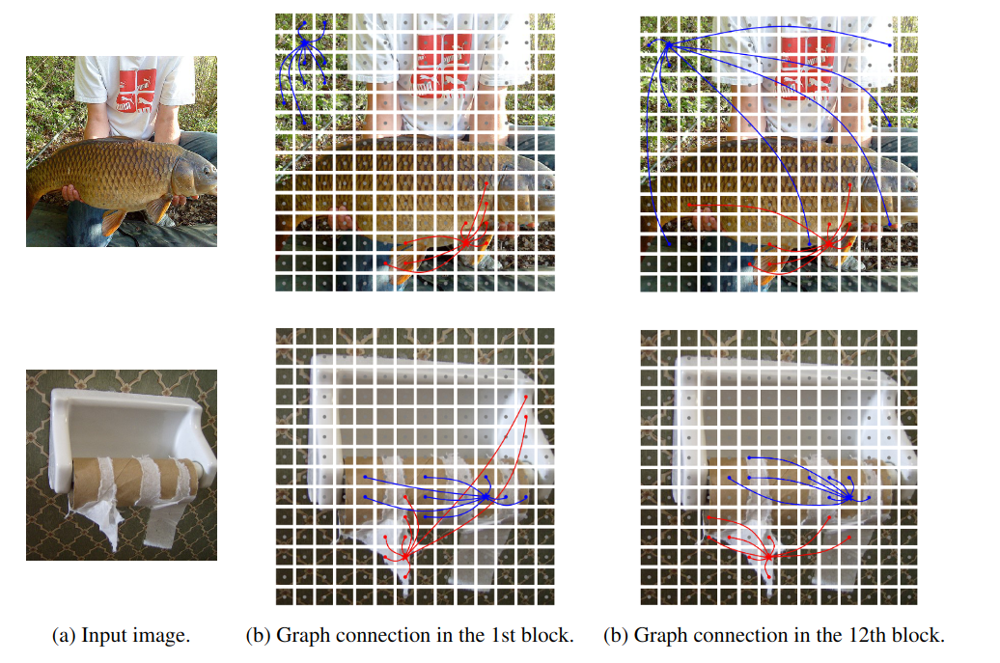
通过上图可以看到，浅层网络的跨区域图只是结合了颜色或形状等一些表象语义；

而深层网络的图结构则更加专注于细化特征本身“比如鱼就是鱼，人就是人”

The pentagram is the center node, and the nodes with the same color are its neighbors

Two center nodes are visualized as drawing all the edges will be messy.

We can observe that our model can select the
**content-related nodes** as the first order neighbors,

In the shallow layer, the neighbor nodes tend to be selected based on low-level and local features( such as color and texture)

In the deep layer, the neighbors of the center nodes are more semantic and belong to the same categor.
