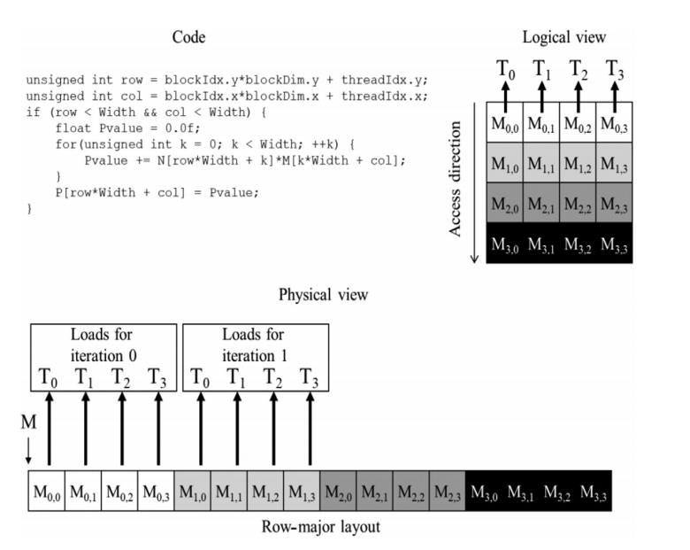
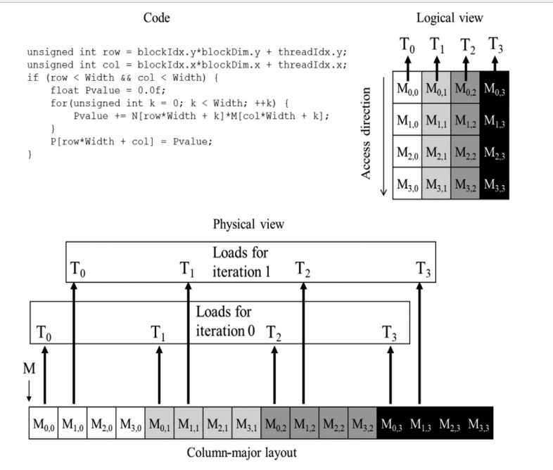

本文特别感谢 [CodeLearner](https://www.zhihu.com/people/arm-29-70)

## **1 全局内存管理**

本质就是管理dram的内存

### 1.1 内存分配与释放

```C
// count : 所分配全局内存的字节 
// devptr：指针返回该内存的地址
cudaError_t cudaMalloc(void **devPtr, size_t count);
// 如果地址空间已经被释放，那么cudaFree返回一个错误
cudaError_t cudaFree(void *devPtr);
```

### **1.2 内存传输**

分配好全局内存，就可以使用下列函数进行内存传输

```C
// 函数从内存位置src复制count字节到内存位置dst
cudaError_t cudaMemcpy(void *dst, 
                       const void *src, 
                       size_t count,
                       enum cudaMemcpyKind kind);
/*
kind表示内存传输方向(要与src到dst保持一致)
kind取值：
cudaMemcpyHostToHost
cudaMemcpyHostToDevice
cudaMemcpyDeviceToHost
cudaMemcpyDeviceToDevice
*/
```

## **2 全局内存访问模式**

首先我们要知道什么是内存事务：

“事务”(Transaction)，一般是指访问并可能更新数据库中各种数据项的**一个程序执行单元**(unit)。

一般来说，对全局内存的访问都会通过缓存：如果通过一二级缓存， 那么内存访问由一个**128字节**的内存事务实现；如果只通过二级缓存， 那么这个内存访问由一个**32字节**的内存事务实现。

**一行一级缓存**是**128**个字节， 它映射到**设备内存**中一个128字节的对齐段。 如果线程束中的每个线程请求一个4字节的值， 那么每次请求就会获取4×32=128字节的数据， 这恰好与**缓存行**和**设备内存段**的大小相契合。在优化应用程序时， 需要注意**对齐内存访问**和**合并内存访问**。

CUDA全局内存事务是指[GPU](http://www.volcengine.com/product/gpu)访问全局内存的方式。它们以不同的大小进行，例如32字节、64字节和128字节。这些事务可以优化内存访问，提高代码的效率。

下面是一个示例，展示了如何使用32字节事务来访问CUDA全局内存：

```Plain Text
__global__ void globalMemoryAccess(float *a, float *b, int n) {
    int tid = blockIdx.x * blockDim.x + threadIdx.x;
    int offset = tid * 4; // 4 floats per transaction

    // 32-byte transaction
    float4 data1 = *((float4*)(&a[offset]));
    float4 data2 = *((float4*)(&b[offset]));

    // perform calculations
    float4 result = data1 + data2;

    // write result back to memory
    *((float4*)(&a[offset])) = result;
}
```

在此示例中，我们将使用float类型的全局内存数组，使用float4实现32字节的事务大小。从全局内存中读取数据需要两个事务，一个事务来读取前32字节，另一个事务来读取接下来的32字节。在此示例中，我们使用float4来读取全局内存中的数据，只需一个事务。这可以减少内存访问时间，提高效率。

### **2.1 对齐合并访问**


DRAM

全局内存是从逻辑角度的叫法，**实际的全局内存就是设备的DRAM，**从上图可以发现，所有对全局内存的访问都会经过L2 Cache，有部分会经过L1 Cache。因为CUDA可以通过指令来选择是否启用L1 Cache，由此每次**访问全局内存**有两种**粒度**：**同时使用L1 Cache 和 L2 Cache则粒度为128字节**和**只使用L2 Cache则粒度为32字节**

优化程序时需要注意对全局内存访问的两个特性：

- **对齐内存访问**：当内存事务的第一个地址是缓存粒度(32字节的二级缓存或128字节的一级缓存)的偶数倍时就会出现对齐内存访问。运行非对齐的加载会造成带宽的浪费。

- **合并内存访问**：当一个线程束中全部的32个线程访问一个连续的内存块时，就会出现合并内存访问。

最理想的内存访问就是**对齐合并内存访问**，而最坏的情况就是**非对齐未合并的内存访问**，分别如上图和下图所示


对齐合并内存访问


非对齐未合并内存访问

在对CUDA进行编译时，可以通过如下标志通知nvcc是否使用一级缓存

```CMake
# 禁用一级缓存
-Xptxas -dlcm=cg
# 启用一级缓存
-Xptxas -dlcm=ca
```

### **2.2 全局内存读取**

以一个线程束32个线程为例，每个线程访问4字节数据，即每次内存事务访问数据为128字节

> 注意：内存段和缓存行的区别，使用一级缓存时访问是以缓存行(128字节)为单位访问，而不使用一级缓存则是使用内存段(32字节)为单位访问

### **2.2.1 使用一级缓存读**

当使用一级缓存时，此时访问粒度为128字节，即缓存行为128字节，所谓缓存行就是主存上一个可以被一次读取到缓存的一段数据

- 最理想的情况，对齐合并访问，利用率 100%


- 对齐访问，但访问地址不是连续的线程ID，依然只需要一个128字节的内存事务完成，总线利用率100%


- 非对齐但连续访问，此时因为粒度为128字节，而访问首地址又不是128整数倍，所以需要两个内存事务得到线程束中的全部地址，总线利用率50%


- 线程束中所有线程请求相同地址(必然属于一个缓存行(128字节))，如果加载的值是4字节，那么利用率为4/128=3.125%


- 最坏情况，非对齐且不连续，那么此时需要进行N次缓存读取(0<=N<=32)，利用率1/N


> CPU的一级缓存优化了时间和空间局部性，而GPU一级缓存是专为空间局部性设计的，即频繁访问一个一级缓存的内存位置不会增加数据留在缓存中的概率

### **2.2.2 不使用一级缓存读**

不经过一级缓存读，它在内存段的粒度上(32字节)而非缓存池(128字节)

- 对齐合并访问，最理想利用率100%


- 对齐但不连续访问，利用率100%


- 非对齐但连续，线程束请求32个连续的4字节元素，但加载没有对齐。请求的地址最多落在5个内存段(粒度为32字节)，所以利用率4/5=80%


- 所有线程束访问同一个地址(必然属于一个内存段(32字节))，所以总线利用率 4/32 = 12.5%


- 最坏的情况，非对齐不连续，所以就会出现N次内存访问(0<=N<=32)，不过与使用一级缓存相比，此时最多的是32个内存段(32个字节)而不是32个缓存行(128字节)，所以也有改善


### **2.3 全局内存写入**

CUDA写入操作只通过二级缓存，所以写入操作在32个字节段的粒度上被执行，而内存事务可以同时被分为一段、两段或四段

- 内存对齐合并写入，1个四段内存事务


- 分散在192字节范围内，不连续，使用3个一段事务


- 对齐的，在64字节内连续，则使用一个两段事务完成


## 3 合并访问的好处例

对于 row major 的代码，只有对矩阵乘法 N （列上遍历元素k）的时候才是合并访问的，因为这时候按照单次k取的是所有col的第一个元素，也就是第一行的所有元素，而这个才是合并访问。



如果是 M 矩阵（所有线程取第零列），这个是非合并访问。



怎么避免 这个 dram的合并问题？ 答案是用  shared memory。由于他在片上不需要担心行列访问的问题。

## Reference

CUDA编程学习笔记-03(内存访问) - CodeLearner的文章 - 知乎
[https://zhuanlan.zhihu.com/p/632244210](https://zhuanlan.zhihu.com/p/632244210)

如何在 CUDA C/C++ 内核中高效访问全局内存

[https://developer.nvidia.com/zh-cn/blog/how-access-global-memory-efficiently-cuda-c-kernels/](https://developer.nvidia.com/zh-cn/blog/how-access-global-memory-efficiently-cuda-c-kernels/)
