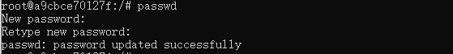
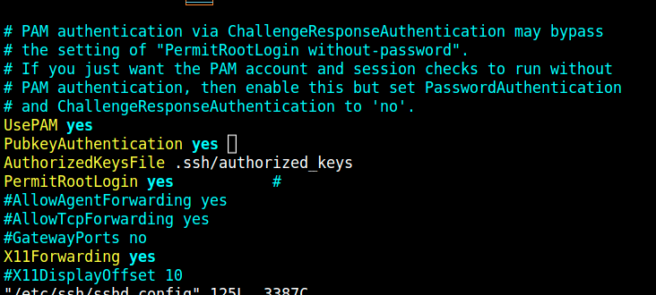
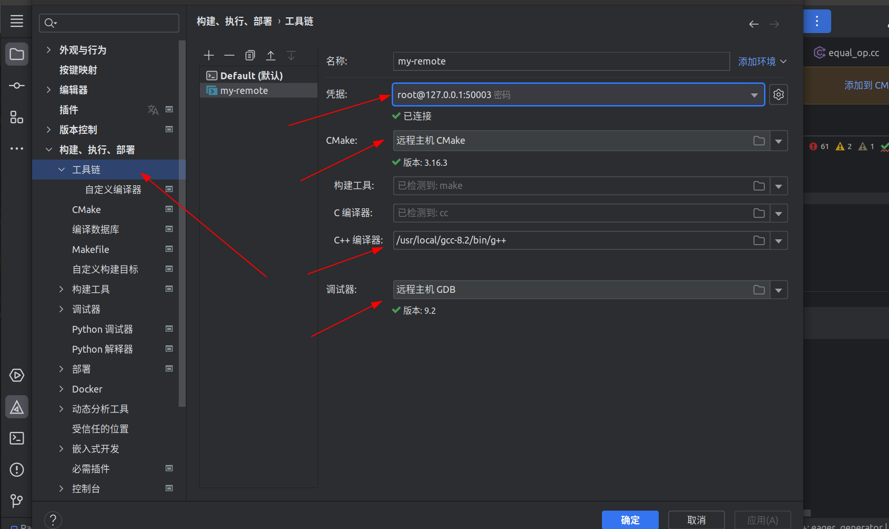
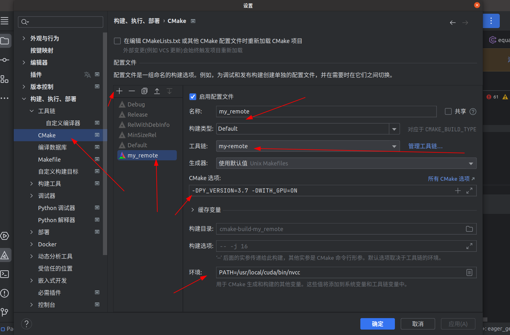
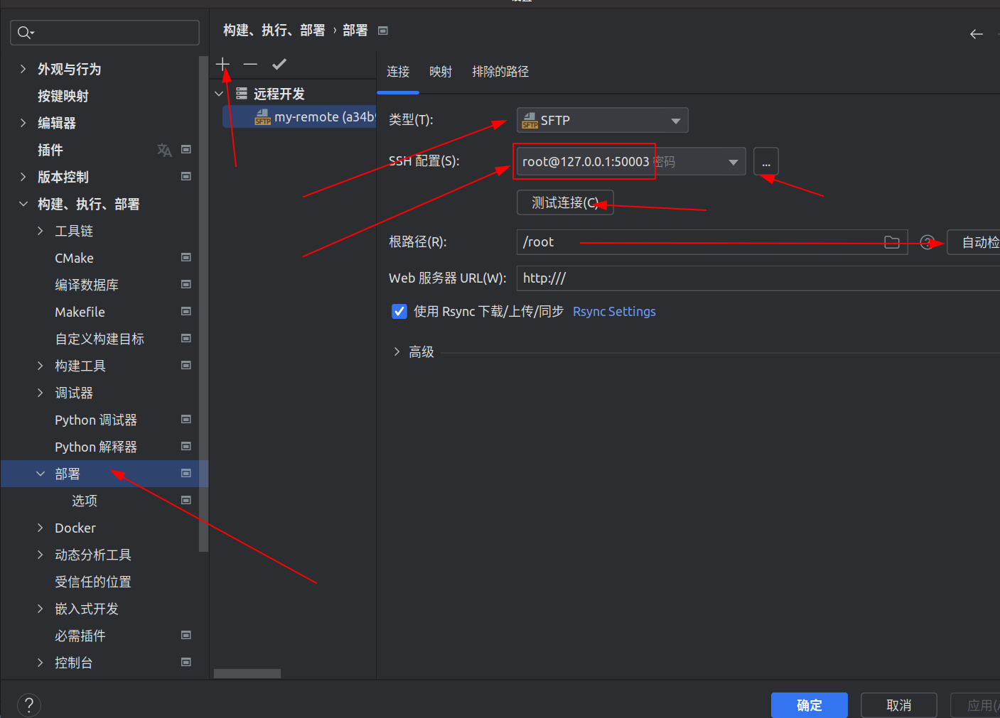
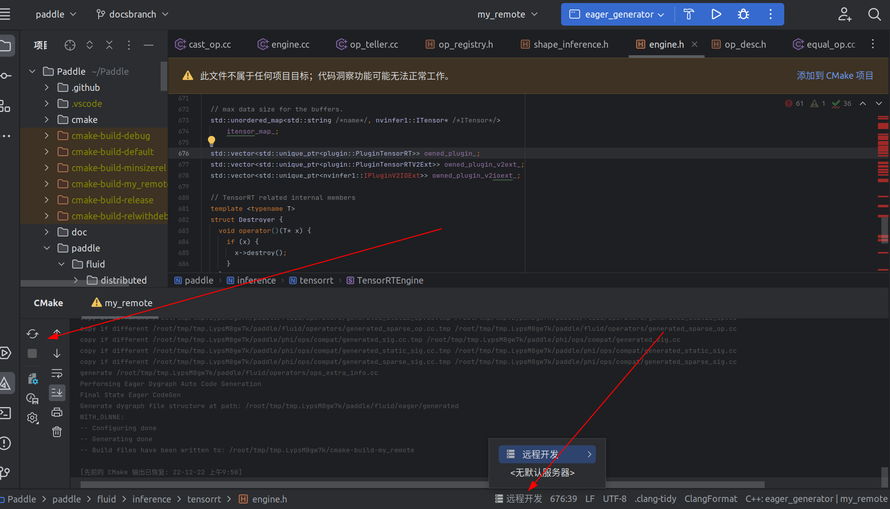

补全大型C++项目符号信息，完美体验代码跳转——以Paddle源码为例

## 前言

最近在接触部分paddle源码，但由于本地搭建特容易出现环境依赖问题和其他奇怪的问题，故选择了docker编译。有很多朋友遇到这类问题第一想法便是：

- 直接用vscode gnu global凑合就完事了  （缺点：符号信息缺失）
- 找个其他可以的服务器编译 （缺点：需要钱）
- 其他codespace之类的东西 （缺点：速度慢）
- 直接用 vscode attach docker就完事了（缺点：想要用到clangd配合cmake的compile的json生成完整符号信息，但是attach后我发现我不能给它安装vscode的clangd插件）💡【注意！】后来我换台电脑进入到他挂载好文件的项目后发现这个还是可以安装的，可能在我原来那台电脑上有bug。。。。或者vscode版本不对。。那这样对于不复杂的场景可以直接用vscode attach就可以了。不过但不管怎么样这个ssh方式可以适配绝大多数情况和各类IDE。。。。

综上所述，我们需要一个强大的统一开发环境使用，这时候最好的选择就是docker了，clion可以完美支持c++项目的跳转以及cmake的调试以及符号信息的获取，所以我们使用clion进行符号跳转的查看。

但clion不像vscode可以很方便的attach，我们需要远程ssh进行处理

具体编译细节和各平台的编译过程可参考paddle官方手册：[https://www.paddlepaddle.org.cn/documentation/docs/zh/develop/install/compile/linux-compile.html#paddlepaddle-paddlepaddle-github-paddle](https://www.paddlepaddle.org.cn/documentation/docs/zh/develop/install/compile/linux-compile.html#paddlepaddle-paddlepaddle-github-paddle "https://www.paddlepaddle.org.cn/documentation/docs/zh/develop/install/compile/linux-compile.html#paddlepaddle-paddlepaddle-github-paddle")

## 快速开始（编译GPU完整环境的paddle）

GPU rt版本建议使用官方docker，在WSL中编译请使用`docker run —gpus all`，进入后记得nvidia测试一下是否成功启动带GPU的环境，这样就可以编译了！具体流程可参考：

一、拉取tensorrt镜像：

[官方镜像选择](https://www.paddlepaddle.org.cn/documentation/docs/zh/install/docker/linux-docker.html)

以11.2为例：

```bash
nvidia-docker pull registry.baidubce.com/paddlepaddle/paddle:2.4.2-gpu-cuda11.2-cudnn8.2-trt8.0
```

```bash
docker pull registry.baidubce.com/paddlepaddle/paddle:2.4.2-gpu-cuda11.2-cudnn8.2-trt8.0
```

二、进入容器:

然后在Paddle源码那打开终端，
docker images 查看镜像名，填充到下列语句：

```bash
docker run -it --gpus=all --name paddle-gpu -v $PWD:/paddle -p 50003:22 registry.baidubce.com/paddlepaddle/paddle:2.4.2-gpu-cuda11.2-cudnn8.2-trt8.0 /bin/bash
```

三、开始编译：

`cmake . -B build -DPY_VERSION=3.7 -DWITH_GPU=ON -DWITH_TENSORRT=ON`

然后make
等待即可完成~

## 一、docker基础依赖安装

如果没有pull docker，先使用：`nvidia-docker pull paddlepaddle/paddle:latest-gpu-cuda10.2-cudnn7-dev`

因为我的是11.5的cuda，所以使用`nvidia-docker pull paddlepaddle/paddle:latest-dev-cuda11.2-cudnn8-gcc82`

pull之后直接run：

注意！【这里和官方建议不同的是我没有用`--network=host`而是用`-p 50003:22`为了ssh的端口映射】

值得注意的是，WSL2中我们不需要安装nvidia-docker，直接使用docker-desktop关联的环境然后docker就可以使用nvidia相关的容器。

[https://www.docker.com/blog/wsl-2-gpu-support-for-docker-desktop-on-nvidia-gpus/](https://www.docker.com/blog/wsl-2-gpu-support-for-docker-desktop-on-nvidia-gpus/)

```bash
nvidia-docker run --name paddle-test -v $PWD:/paddle -p 50003:22 -it registry.baidubce.com/paddlepaddle/paddle:latest-dev-cuda11.2-cudnn8-gcc82 /bin/bash

```

如果你已经run了，直接docker exec -it即可，或者在vscode或clion中直接attach到终端。

## 二、换源

进入docker终端后首先对docker内进行一波换源：vim 修改 `/etc/apt/sources.list`  全部替换为：

```text

deb https://mirrors.ustc.edu.cn/ubuntu/ focal main restricted universe multiverse
deb-src https://mirrors.ustc.edu.cn/ubuntu/ focal main restricted universe multiverse
deb https://mirrors.ustc.edu.cn/ubuntu/ focal-updates main restricted universe multiverse
deb-src https://mirrors.ustc.edu.cn/ubuntu/ focal-updates main restricted universe multiverse
deb https://mirrors.ustc.edu.cn/ubuntu/ focal-backports main restricted universe multiverse
deb-src https://mirrors.ustc.edu.cn/ubuntu/ focal-backports main restricted universe multiverse
deb https://mirrors.ustc.edu.cn/ubuntu/ focal-security main restricted universe multiverse
deb-src https://mirrors.ustc.edu.cn/ubuntu/ focal-security main restricted universe multiverse
deb https://mirrors.ustc.edu.cn/ubuntu/ focal-proposed main restricted universe multiverse
deb-src https://mirrors.ustc.edu.cn/ubuntu/ focal-proposed main restricted universe multiverse

```

## 三、ssh依赖安装与启动

接下来的操作大体参考：[https://www.anquanclub.cn/6674.html](https://www.anquanclub.cn/6674.html "https://www.anquanclub.cn/6674.html")

第一步：安装依赖

```bash
apt-get update
apt-get install passwd
apt-get install openssh-server
apt-get install rsync  #后续clion同步文件需要用到

```

第二步：设置登录名密码：通过`passwd`命令来设置root的密码，比如123456



第三步：启动ssh服务

```bash
service ssh start
```

这句话最好不要加入 ~/.bashrc（对于clion）否则远程连接环境变量可能会出错，当然你可以尝试调整不同地方看看。

对于vscode你应该可以加入bashrc省的每次重启docker都要自己写。

可以通过`ps -e |grep ssh`查看服务是否启动

第四步：修改配置文件，通过vim编辑器打开配置文件 `vim /etc/ssh/sshd_config`

在配置文件中随便找个地方写入以下内容(#号后是注释)

```txt
PubkeyAuthentication yes        #启用公钥私钥配对认证方式
AuthorizedKeysFile .ssh/authorized\_keys #公钥文件路径
PermitRootLogin yes           #root能使用ssh登录
```



第五步：重启服务

```bash
service ssh restart
```

这时候就可以愉快的ssh操作docker了！

你可以在终端中进行测试，使用：

```bash
ssh -p 50003 root@127.0.0.1
```

输入123456密码发现可以成功进入，这时候已经基本成功，接下来进入到clion配置的环节

## 四、Clion配置

接下来进入到clion配置的环节，只要处理好这几个部分就可以完美体验！

主要参考：[https://imhuwq.com/2018/12/02/Clion 使用 Docker 作为开发环境/](<https://imhuwq.com/2018/12/02/Clion 使用 Docker 作为开发环境/> "https://imhuwq.com/2018/12/02/Clion 使用 Docker 作为开发环境/")

### 一、工具链设置

在 Clion `Settings-Build,Execution,Deployment-Toolchains` 页面先新建一个 Toolchains 设置，名字叫 **my-project** 吧，类型选 **Remote Host**。 Credential 设置里面填入 Container 的 IP。端口、用户名和密码按自己创建 Docker 镜像的时候来设置。由于我是从源码编译的 Cmake，所以需要变更一下 Cmake 地址为 `/usr/local/bin/cmake`。大家自己会意，按情况来改就好:


我的参考实现：（点+号选择远程主机）【如果没有检测到，到cmake或者其他东西，在docker内apt安装一下就好；g++编译器可能自动搜索不到，所以`whereis g++`看一下地址，然后填入即可】



这里插播一下傅傅猪的建议：
补充一个操作，toochainl那边 可以直接把ssh的配置拖动到最前面

- 工具链设置在 Clion Settings-Build,Execution,Deployment-Toolchains 页面先新建一个 Toolchains 设置，名字叫 my-project 吧。 这里的几个toolchains是可以拖动的，你把docker的那个toolchain拖动到最前面也可以
- 然后有两个坑点，有时候头文件找不到，可以用shift shift, 选择resync with remote hosts
- 还有就是docker里的tmp代码目录找不到了，就shift shift 选择reload cmake project,重新传输一下代码。

### 二、CMAKE设定

创建 Toolchains 配置后，在 `Settings-Build,Execution,Deployment-CMake` 页面的 **Toolchain** 下拉菜单里面选择刚才创建的 `my-project`。 然后点击 **Apply** 保存到目前为止的配置:


我的实现参考：（工具链选择第一步设定的）



cmake选项中需要加入`-DPY_VERSION=3.7 -DWITH_GPU=ON`  这是我们需要的cmake参数

如果你想要带上tensorrt编译，可以这么写：`-DPY_VERSION=3.7 -DWITH_GPU=ON -DWITH_TENSORRT=ON`

```纯文本
  No CMAKE_CUDA_COMPILER could be found.

  Tell CMake where to find the compiler by setting either the environment
  variable "CUDACXX" or the CMake cache entry CMAKE_CUDA_COMPILER to the full
  path to the compiler, or to the compiler name if it is in the PATH.
```

同时你需要`export PATH=/usr/local/cuda/bin:$PATH`直接附加到终端或者是加入到环境变量中,否则会找不到。

### 三、管理同步

其实他的用法就是创建一个tmp（你可以在映射中看到）

然后把文件拷贝进去编译后再把信息拿回来。

记得测试连接，根路径自动检测即可



## 五、快乐体验

### 注释：每次重启docker后的操作

需要注意的是，每次重启后我们都需要在docker终端内启动一下ssh服务否则不能使用：

```bash
service ssh start
```

这时候已经大功告成，我们可以在下面选择对应的开发环境（如果它没有自动切换的话）

这时候你会看到它正在传输文件，并且开始有个漫长的符号表加载过程（需要一点点时间，但重复打开后就不需要时间了！）

如果出现问题可以修改后（大部分是环境变量的问题，根据上面的第二步骤进行修改即可）



经过漫长的等待我们就可以看到结果了。

### cmake过程坑点注意

cmake过程中可能需要下载一些仓库，但无法成功下载（网络原因），你可以bind 172.17.0.1 走proxy，或者使用这个方法：参考自[https://www.cnblogs.com/isLinXu/p/16693491.html](https://www.cnblogs.com/isLinXu/p/16693491.html "https://www.cnblogs.com/isLinXu/p/16693491.html")

> 由于在paddle源码编译过程中，需要安装相应的依赖库，这些依赖库是通过github仓库拉取源码的形式下载下来的。 &#x20;
> 若docker环境下能够网络通畅的使用github，可跳过此项。 &#x20;
> 若网络情况不稳定，那么这里建议参考下面，分别将这些仓库手动clone下来，同时要注意当前的目录（放在根目录）。（因为是映射目录，你可以找各种方法在本地下载后放到目标位置即可，有必要的话弄一下DNS）
>
> - extern\_gflags [https://github.com/gflags/gflags.git](https://github.com/gflags/gflags.git "https://github.com/gflags/gflags.git")
> - extern\_cryptopp [https://github.com/weidai11/cryptopp.git](https://github.com/weidai11/cryptopp.git "https://github.com/weidai11/cryptopp.git")
> - extern\_mkldnn [https://github.com/oneapi-src/oneDNN](https://github.com/oneapi-src/oneDNN "https://github.com/oneapi-src/oneDNN")
> - extern\_warpctc git clone [https://github.com/espnet/warp-ctc.git](https://github.com/espnet/warp-ctc.git "https://github.com/espnet/warp-ctc.git")
> - extern\_protobuf [https://github.com/protocolbuffers/protobuf.git](https://github.com/protocolbuffers/protobuf.git "https://github.com/protocolbuffers/protobuf.git")

虽然有些符号还是不能看到定义和实现，但已经足够看代码了（支持绝大部分，而且可以自由跳转）！（有些是cuda调用so本来就不能看到）

享受符号跳转带来的遍历把。（有了那个小标志就说明全部加载完成，如果加载符号表过程中卡住了卡了非常久，可以尝试重启clion）


### Tensorrt扩展解析

此时有些跳转还是失效的，因为根本没有选择对应编译选项与库，所以我们需要做两步操作：

1. 增加cmake 选项  `-DWITH_TENSORRT=ON`
2. 在docker中根据 nvidia 官方教程安装 tensorrt：

[https://docs.nvidia.com/deeplearning/tensorrt/install-guide/index.html#installing-debian](https://docs.nvidia.com/deeplearning/tensorrt/install-guide/index.html#installing-debian)

重新启动clion即可成功~（所有nvinfer1相关都点亮了）如果还出现不可跳转的情况，可以点击设置菜单中的 工具——与远程主机重新同步，然后符号加载完后就可以了，实在不行重启clion解决一切问题。

## 外传——没clion但用vscode凑合

> “放过vscode吧！他只是一个编辑器，不是IDE！”——沃兹季硕德

vscode下我们可以使用clangd+cmake插件实现一定的跳转功能，之前我们知道了用docker直接attach到vscode是失败的，不能安装插件。

但clion展示了他的强大功力（可以ssh后使用目标编译链进行编译和符号表的导入操作），那我们可以大胆猜想可以用vscode也直接ssh到docker然后看下是否可以安装插件。

幸运的是，vscode 在ssh链接docker后是可以安装clangd和cmake插件的，我们只需安装好插件然后配置好下方的build的相关参数，等他自己构建即可。

我的话是生成了clangd需要使用的compile\_commands.json 文件。在paddle的根目录下使用这个即可成功！（CMAKE\_EXPORT\_COMPILE\_COMMANDS为了生成json）

```bash
cmake .  -B build  -DPY_VERSION=3.7 -DWITH_GPU=ON -DCMAKE_EXPORT_COMPILE_COMMANDS=1
```

安装生成完后重启vscode即可看到一个index加载过程，等待全部完成后就可以体验基本功能的跳转了（虽然肯定还是没有clion强大，但是对于没有clion的情况下还需要什么自行车呢？而且比GNU  global的提示肯定是更全更舒适的）

如果你想要vscode识别cmake参数，可以在.vscode的settings中添加：

```text
    "cmake.configureArgs": [
        "-DPY_VERSION=3.7",
        "-DWITH_GPU=ON",
        "-DWITH_TENSORRT=ON",
    ],
```

## reference

使用ssh连接docker服务器的方法\_docker

[https://www.anquanclub.cn/6674.html](https://www.anquanclub.cn/6674.html "https://www.anquanclub.cn/6674.html")

【健忘笔记】Clion连接docker远程开发

[https://zhuanlan.zhihu.com/p/429270402](https://zhuanlan.zhihu.com/p/429270402 "https://zhuanlan.zhihu.com/p/429270402")

## 备忘-Docker常用命令

参考：[https://zhuanlan.zhihu.com/p/410056073](https://zhuanlan.zhihu.com/p/410056073 "https://zhuanlan.zhihu.com/p/410056073") &#x20;
