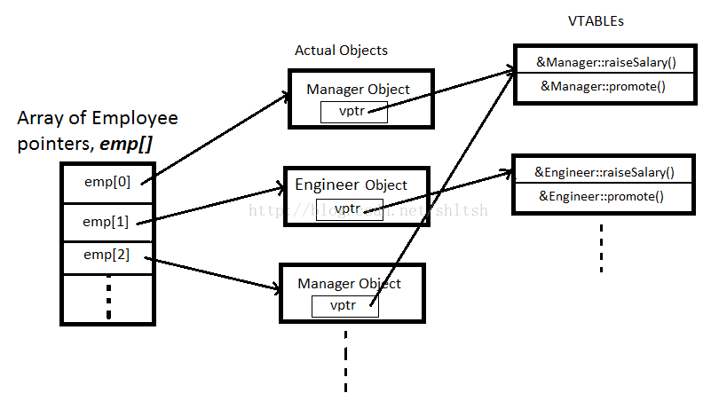
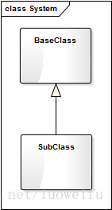
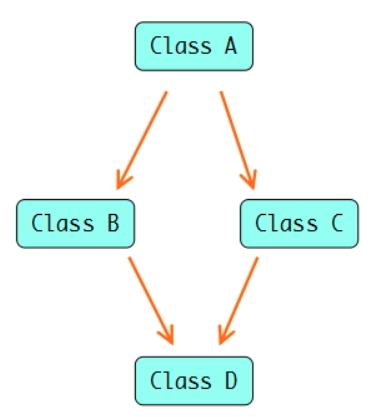
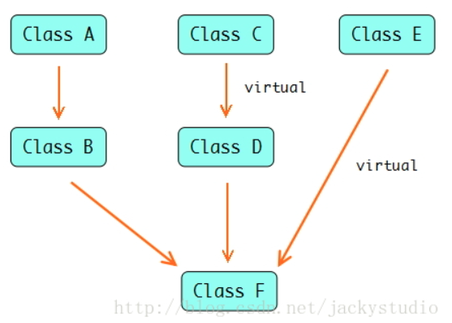

全文经过各类参考的整理与摘抄（若有错误欢迎邮件告知，感谢。）

## 什么是虚函数

为什么需要虚函数？什么时候使用了虚函数？

比如你有个游戏，游戏里有个虚基类叫「怪物」，有[纯虚函数](https://www.zhihu.com/search?q=纯虚函数\&search_source=Entity\&hybrid_search_source=Entity\&hybrid_search_extra={"sourceType":"answer","sourceId":26263735} "纯虚函数") 「攻击」。然后派生出了三个子类「狼」「蜘蛛」「蟒蛇」，都实现了自己不同的「攻击」函数，比如狼是咬人，蜘蛛是吐丝，蟒蛇把你缠起来～～

然后出现好多怪物的时候就可以定义一个 [虚基类指针数组](https://www.zhihu.com/search?q=虚基类指针数组\&search_source=Entity\&hybrid_search_source=Entity\&hybrid_search_extra={"sourceType":"answer","sourceId":26263735} "虚基类指针数组")，把各种怪物的指针给它，然后迭代循环的时候直接 monster\[i]->attack() 攻击玩家就行了，大概见下图：


如果没有虚函数的话，管理一堆差不多但是类型又不一样的对象的时候就比较麻烦了。

### 虚函数需要注意的细节

- 只有成员函数才可定义为虚函数，友元/全局/static/构造函数都不可以
- 构造函数不可以是虚函数，而析构函数可以且常常是虚函数。
- 记得加上关键字virtual
- 成员函数如果不是虚函数，其解析过程发生在编译时而非运行时
- 派生类可以不覆盖（重写）它继承的虚函数
- 派生类重写（覆盖）基类中的函数，**其中函数名，参数列表，返回值类型都必须一致，并且重写（覆盖）的函数是virtual函数**
- 虚函数在子类和父类中的访问权限可以不同
- 相关规则：
  - ①如果虚函数的返回值类型是基本数据类型：返回值类型必须相同
  - ②如果虚函数的返回值类型是类本身的指针或引用：返回值类型可以不同，但派生类的返回值类型小于基类返回值类型
  - 基类与派生类的虚函数名与参数列表相同，至于参数列表为什么一致是为了避免虚函数被隐藏

定义他为虚函数是为了允许用基类的指针来调用子类的这个函数，不代表没有实现。

定义一个函数为纯虚函数，才代表函数没有被实现。定义纯虚函数是为了实现一个接口，起到一个规范的作用，规范继承这个类的程序员必须实现这个函数。（抽象类多用）

基类通常都应该定义一个虚析构函数。即使该函数不执行任何实际操作！&#x20;

#### 构造函数不能是虚函数

1. 从vptr角度解释

    vtable: 记录函数指针的一张表。 每个类维护一个虚表。 vptr: 指向虚表vtable的指针。 每个对象拥有一个vptr。

    C++标准并没有明确要求如何实现运行时多态，但是各编译器基本上都基于这种机制，加入小的修改。

    现代的C++编译器对于每一个多态类型，其所有的虚函数的地址都以一个表V-Table的方式存放在一起，虚函数表的首地址储存在每一个对象之中，称为虚表指针vptr，这个虚指针一般位于对象的起始地址。通过虚指针和偏移量计算出虚函数的真实地址实现调用。

    

    虚函数的调用是通过虚函数表来查找的，而虚函数表由类的实例化对象的vptr指针(vptr可以参考C++的虚函数表指针vptr)指向，该指针存放在对象的内部空间中，需要调用构造函数完成初始化。如果构造函数是虚函数，那么调用构造函数就需要去找vptr，但此时vptr还没有初始化！
2. 从多态角度解释

虚函数主要是实现多态，在运行时才可以明确调用对象，根据传入的对象类型来调用函数，例如通过父类的指针或者引用来调用它的时候可以变成调用子类的那个成员函数。而构造函数是在创建对象时自己主动调用的，不可能通过父类的指针或者引用去调用。那使用虚函数也没有实际意义。

在调用构造函数时还不能确定对象的真实类型（由于子类会调父类的构造函数）；并且构造函数的作用是提供初始化，在对象生命期仅仅运行一次，不是对象的动态行为，没有必要成为虚函数。

- 构造对象时需要知道对象的实际类型，而虚函数行为是在运行期间才能确定实际类型的，由于对象还未构造成功，编译器无法知道对象的实际类型，俨然**是个鸡和蛋的问题**。
- 如果构造函数是虚函数，那么构造函数的执行将依赖虚函数表，而虚函数表又是在构造函数中初始化的，而在构造对象期间，虚函数表又还没有被初始化，又**是个死循环问题**。

从编译器的角度去看，构造函数就是为了在编译阶段确定对象类型、分配空间等工作，虚函数为了实现动态多态需要在运行期间才能确定具体的行为，显然构造函数不可能同时具备静态特性和动态特性。

#### 析构函数可以且常是虚函数

这个原理上就很好理解啦，因为此时 vtable 已经初始化了，完全可以把析构函数放在虚函数表里面来调用。

C++类有继承时，析构函数必须为虚函数。如果不是虚函数，则使用时可能存在内存泄漏的问题。

假设我们有这样一种继承关系：  &#x20;



如果我们以这种方式创建对象：
SubClass\* pObj = new SubClass();
delete pObj;
不管析构函数是否是虚函数(即是否加virtual关键词)，delete时基类和子类都会被释放；

如果我们以这种方式创建对象：
BaseClass\* pObj = new SubClass();
delete pObj;
若析构函数是虚函数(即加上virtual关键词)，delete时基类和子类都会被释放；
若析构函数不是虚函数(即不加virtual关键词)，delete时只释放基类，不释放子类；
（1）基类的析构函数不是虚函数的话，删除指针时，只有基类的内存被释放，派生类的没有。这样就内存泄漏了。

（2）析构函数不是虚函数的话，直接按指针类型调用该类型的析构函数代码，因为指针类型是基类，所以直接调用基类析构函数代码。

（3）养成习惯：基类的析构一定virtual。但如果某个类不包含虚函数，一般表示它将不作为一个基类来使用，因此不使虚析构函数，否则增加一个虚函数表和虚指针，使得对象的体积增大。如果某个类将作为基类那么建议使用虚析构，包含虚函数则这条要求成为必然。无故使用虚析构函数和永远不使用一样是错误的。

代码测试：

```c++
#include <iostream>
using namespace std;
 
class Father
{
public:
    Father(){cout<<"contructor Father!"<<endl;};
    ~Father(){cout<<"destructor Father!"<<endl;};
};
 
class Son:public Father
{
public:
    Son(){cout<<"contructor Son!"<<endl;};
    ~Son(){cout<<"destructor Son!"<<endl;};
};
 
int main()
{
    Father *pfather=new Son;
    delete pfather;
    pfather=NULL;
 
    return 0;
}
/*输出结果为：
    contructor Father!
    contructor Son!
    destructor Father!
*/
```

### 函数重载、函数隐藏、函数覆盖和函数重写

牢记以下几点，就可区分函数重载、函数隐藏、函数覆盖和函数重写的区别：&#x20;

（1）函数重载发生在相同作用域； （2）函数隐藏发生在不同作用域； （3）函数覆盖就是函数重写。准确地叫作虚函数覆盖和虚函数重写，也是函数隐藏的特例。

关于三者的对比，李健老师在《编写高质量代码：改善C++程序的150个建议》给出了较为详细的总结，如下表所示：

| 三者 | 作用域 | 有无virtual | 函数名 | 形参列表  | 返回值类型  |
| -- | --- | --------- | --- | ----- | ------ |
| 重载 | 相同  | 可有可无      | 相同  | 不同    | 可同可不同  |
| 隐藏 | 不同  | 可有可无      | 相同  | 可同可不同 | 可同可不同  |
| 重写 | 不同  | 有         | 相同  | 相同    | 相同（协变） |

### 动态绑定

首先知道什么是静态什么是动态：

- 静态绑定：程序编译过程中把函数调用与执行调用所需的代码相关联，这种绑定发生在编译期，程序未运行就已确定，也称为前期绑定。
- 动态绑定：当某个虚函数通过指针或引用调用时，编译器产生的代码直到运行时才能确定到该调用哪个版本的函数（根据该指针所绑定的对象），这种发生于运行期，程序运行时才确定响应调用的方法，也称为后期绑定。
- 动态绑定只有当我们通过指针或引用调用“虚函数”时才会发生，如果通过对象进行的函数调用，那么在编译阶段就确定该调用哪个版本的函数了（比如基函数的某个方法打印A，继承后改写打印的是B，同时运行基类和继承类的同样方法会发现打印出了AB而不是B，说明运行时才绑定。）
- 如果派生类没有重写基类的虚函数，那么通过基类指针指向于派生类时，调用虚函数还是调用的基类的虚函数（因为派生类没有重写）
- 动态绑定与“派生类对象转换为基类对象”是相似的，原理相同

虚函数一定是运行期才绑定么？ - 知乎用户的回答 - 知乎 [https://www.zhihu.com/question/491602524/answer/2165605549](https://www.zhihu.com/question/491602524/answer/2165605549 "https://www.zhihu.com/question/491602524/answer/2165605549")

### 虚函数与多态

在C++泛型编程中可以基于模板template和重载override两种形式来实现静态多态。

动态多态主要依赖于虚函数机制来实现，不同的编译器对虚函数机制的实现也有一些差异，本文主要介绍Linux环境下gcc/g++编译器的实现方法。

> 多态本质上是一种泛型技术，说白了就是试图使用不变的代码来实现可变的算法，要么试图在编译时决定，要么试图在运行时决定。  ——左耳朵耗子-陈皓

我们知道C++三大特征：继承、多态、封装。

虚函数为多态提供了基础，并且借助于继承来发挥多态的优势，从而完善了语言设计的封装。

下面就是运行时多态的简单例子。

```c++
#include<iostream>

using namespace std;

class Base

{

public:

  virtual void show() { cout<<" In Base \n"; }

};

class Derived: public Base

{

public:

  void show() { cout<<"In Derived \n"; }

};

int main(void)

{

  Base *bp = new Derived;

  bp->show();  // 运行时多态

  return 0;

}
```

运行结果：

In Derived

上面程序中最主要的一点是，使用了一个基类指针来调用子类的成员函数。虚函数的调用不依赖调用它的指针或引用本身的类型，而取决于引用或指针所指向的对象类型。

### 纯虚函数（抽象类）

虚函数的声明以=0结束，便可将它声明为纯虚函数，包含纯虚函数的类不允许实例化，称为抽象类，但是纯虚函数也可以有函数体，纯虚函数提供了面向对象中接口的功能，类似于Java中的接口。

语法格式为：virtual 返回值类型 函数名(函数参数) = 0;

**需要抽象类的场景：**

- 功能不应由基类去完成
- 无法确认如何写基类的函数
- 基类本身不应被实例化

就像虽然有Animal类，但是并不能生成一个动物实例，并且Animal的类的成员函数无法定义，需要其派生类Tiger类、Fish类来具体实现

### 虚继承

看这样一个例子：



B和C从A中继承，而D多重继承于B，C。那就意味着D中会有A中的两个拷贝。因为成员函数不体现在类的内存大小上，所以实际上可以看到的情况是D的内存分布中含有2组A的成员变量。如下代码：

```c++
class A
{
public:
  A():a(1){};
  void printA(){cout<<a<<endl;}
  int a;
};
 
class B : public A
{
};
 
class C : public A
{
};
 
class D:  public B ,  public C
{
};
 
int _tmain(int argc, _TCHAR* argv[])
{
  D d;
  cout<<sizeof(d);
}
```

输出d的大小为8。也就是d中有2个a成员变量。这样一来如果要使用a就报错了。谁知道你要用哪一个？同样的访问成员函数也会出现“二义性”这个问题。

```bash
d.a=10;//error C2385: 对“a”的访问不明确

d.printA();//error C2385: 对“printA”的访问不明确
```

即使成员函数有不同的形参表也不行，如下。

```c++
class A
{
public:
  A():a(1){};
  void printA(){cout<<a<<endl;}
  int a;
};
 
class B : public A
{
public:
  void printB(){cout<<"from B"<<endl;}
};
 
class C : public A
{
public:
  void printB(int v){cout<<"from C"<<endl;}
};
 
class D:  public B ,  public C
{
};
 
int _tmain(int argc, _TCHAR* argv[])
{
  D d;
  cout<<sizeof(d);
  d.printB();
}
```

当然你可以无耻地使用作用域来规避这个问题。但这并不是一个好主意。

```c++
d.B::a=10;
d.C::printB(1);

```

这时候虚继承就挺身而出，扛下搞定此问题的重担了。虚继承是一种机制，类通过虚继承指出它希望共享虚基类的状态。对给定的虚基类，无论该类在派生层次中作为虚基类出现多少次，只继承一个共享的基类子对象，共享基类子对象称为虚基类。虚基类用virtual声明继承关系就行了。这样一来，D就只有A的一份拷贝。

```c++
class A
{
public:
  A():a(1){};
  void printA(){cout<<a<<endl;}
  int a;
};
 
class B : virtual public A
{
};
 
class C : virtual public A
{
};
 
class D:  public B ,  public C
{
};
 
int _tmain(int argc, _TCHAR* argv[])
{
  D d;
  cout<<sizeof(d);
  d.a=10;
  d.printA();
}
```

输出d的大小是12（包含了2个4字节的D类虚基指针和1个4字节的int型整数）。而a和printA()都可以正常访问。最典型的应用就是iostream继承于istream和ostream，而istream和ostream虚继承于ios。

```c++
class istream : virtual public ios{...};
class ostream : virtual public ios{...};
class iostream : public istream, public ostream{...};
```

#### 构造和析构顺序

以本图为例



```bash
C()
E()
A()
B()
D()
F()
~F()
~D()
~B()
~A()
~E()
~C()

```

可以看出，首先按声明顺序检查直接基类（包括其子树），看是否有虚基类，先初始化虚基类（例中首先初始化C和E）。一旦虚基类构造完毕，就按声明顺序调用非虚基类的构造函数（例中ABDF），析构的调用次序和构造调用次序相反。

## 常见关键字

### virtual

- 放在函数的返回值前面，用于表示该成员函数为虚函数
- 父类虚函数前必须写；子类虚函数前可以省略（不困省不省略，该函数在子类中也是虚函数类型）
- virtual只能出现在类内部的声明语句之前而不能用于类外部的函数定义

### override

一旦类中的某个函数被声明为虚函数，那么在所有的派生类中它都是虚函数。一个派生类的函数如果覆盖了某个继承而来的虚函数，那么它的形参类型必须与基类函数完全一致。

> 派生类中如果定义了一个函数与基类中虚函数的名字相同但是形参列表不同，编译器会认为新定义的函数与基类中原有的函数是相互独立的。这会带来一个问题：如果我们本来希望派生类可以覆盖掉基类中的虚函数，**但是一不小心把形参列表写错了，这可能与我们的本意不符。**

C++11新标准提供了`override`关键字来**显式地告知虚拟器进行重载，编译器将检查基类是否存在这样的虚函数，否则将无法通过编译。** 这样的好处是使得程序员的意图更加清晰（覆盖基类中的虚函数），如果我们使用`override`关键字标记了某个函数但是该函数没有覆盖已有的虚函数，此时编译器会报错。

他可以拦截以下错误：

```c++
class A{
virtual void f1(int) const;
virtual void f2();
void f3();
};
calss B:public A{
void f1(int)const override; //正确
void f2(int)override;       //错误，参数不一致
void f3()override;          //错误，f3不是虚函数
void f4()override;          //错误，B没有名为f4的函数
};
```

### final

- 如果我们定义的一个虚函数不想被派生类覆盖（重写），那么可以在虚函数之后添加一个final关键字，声明这个虚函数不可以被派生类所覆盖（重写）
- 如果函数有尾指返回类型，那么要放在尾指返回类型后

**(since C++11) final 对虚函数的多态性具有向下阻断作用。经 final 修饰的虚函数或经 final 修饰的类的所有虚函数，自该级起，不再具有多态性。** 因此，此处一定是编译时绑定，而不是运行时绑定。

业务代码中，对于多态类，如果确定一个虚函数不会再被覆盖，或者该类不会再被继承，则推荐标上 final。**这可以为编译器提供非常有价值的编译优化信息，总而将原本需要推迟到运行期才能确定的虚函数调用提前在编译期就已确定。** 如被调用的函数能与上层调用方一起进一步地做函数内联、[常量折叠](https://www.zhihu.com/search?q=常量折叠\&search_source=Entity\&hybrid_search_source=Entity\&hybrid_search_extra={"sourceType":"answer","sourceId":2165605549} "常量折叠")、无用代码消除等优化，则可以压榨出非常可观的性能提升。

## 其他

C++20里面解除了[虚函数](https://www.zhihu.com/search?q=虚函数\&search_source=Entity\&hybrid_search_source=Entity\&hybrid_search_extra={"sourceType":"answer","sourceId":2165019198} "虚函数")不能是 `constexpr`的限制，虚函数完全可以在编译期绑定，

虚函数的话，不是“只能”在运行时动态绑定，也存在可以静态绑定的情况。你能看出来实际调用函数的场合，编译器也有一定可能看出来。这时函数去虚化作为一种优化存在。

模拟虚函数表技术可参考：

虚函数技术：多态的上下文+运行时动态类型识别+虚函数表及指针
[https://www.toutiao.com/article/7006183609581257228/?wid=1671356502138](https://www.toutiao.com/article/7006183609581257228/?wid=1671356502138 "https://www.toutiao.com/article/7006183609581257228/?wid=1671356502138")

C++中虚函数、虚继承内存模型

[https://zhuanlan.zhihu.com/p/41309205](https://zhuanlan.zhihu.com/p/41309205 "https://zhuanlan.zhihu.com/p/41309205")

C++类的3种继承方式，分别是public继承，protected继承，private继承:

[https://www.wuyuze.vip/2019/09/06/C-继承关系/](https://www.wuyuze.vip/2019/09/06/C-继承关系/ "https://www.wuyuze.vip/2019/09/06/C-继承关系/")

## reference

c++虚函数的作用是什么？

[https://www.zhihu.com/question/23971699](https://www.zhihu.com/question/23971699 "https://www.zhihu.com/question/23971699")

C++:44---关键字virtual、override、final

[https://cloud.tencent.com/developer/article/1784495](https://cloud.tencent.com/developer/article/1784495 "https://cloud.tencent.com/developer/article/1784495")

虚函数一定是运行期才绑定么？

[https://www.zhihu.com/question/491602524](https://www.zhihu.com/question/491602524 "https://www.zhihu.com/question/491602524")

C++继承(2) - 虚函数与运行时多态

[https://blog.csdn.net/shltsh/article/details/45960377](https://blog.csdn.net/shltsh/article/details/45960377 "https://blog.csdn.net/shltsh/article/details/45960377")

虚函数技术：多态的上下文+运行时动态类型识别+虚函数表及指针

[https://www.toutiao.com/article/7006183609581257228/?wid=1671356502138](https://www.toutiao.com/article/7006183609581257228/?wid=1671356502138 "https://www.toutiao.com/article/7006183609581257228/?wid=1671356502138")

面试必知必会：理解 C++ 虚函数

[https://toutiao.io/posts/zaxcvwp/preview](https://toutiao.io/posts/zaxcvwp/preview "https://toutiao.io/posts/zaxcvwp/preview")

C++中函数重载、隐藏、覆盖和重写的区别

[https://cloud.tencent.com/developer/article/1177174](https://cloud.tencent.com/developer/article/1177174 "https://cloud.tencent.com/developer/article/1177174")

C++ 构造函数和析构函数可以是虚函数嘛？

[https://blog.csdn.net/qq\_28584889/article/details/88749862](https://blog.csdn.net/qq_28584889/article/details/88749862 "https://blog.csdn.net/qq_28584889/article/details/88749862")

菱形继承和虚继承

[https://blog.csdn.net/jackystudio/article/details/17877219](https://blog.csdn.net/jackystudio/article/details/17877219 "https://blog.csdn.net/jackystudio/article/details/17877219")
