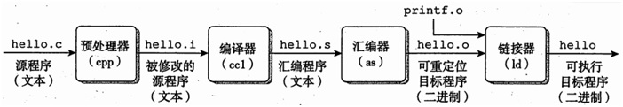
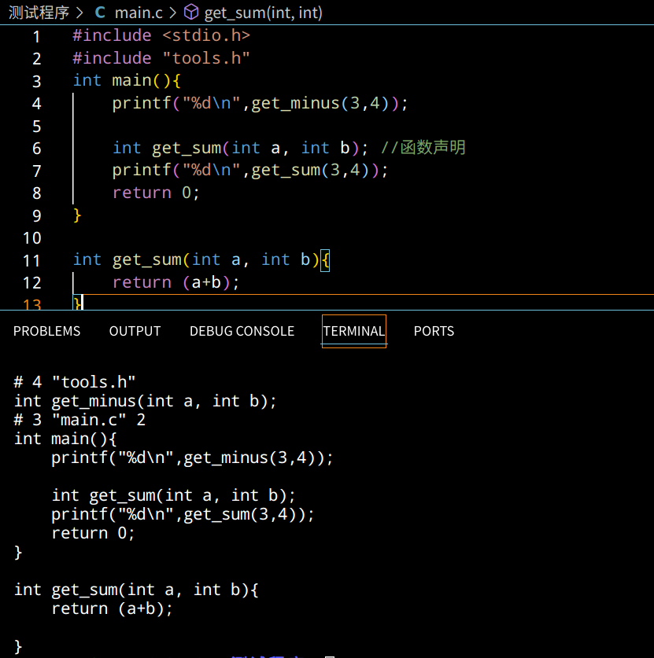
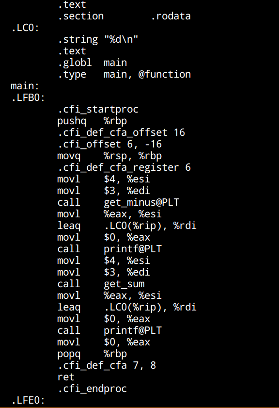
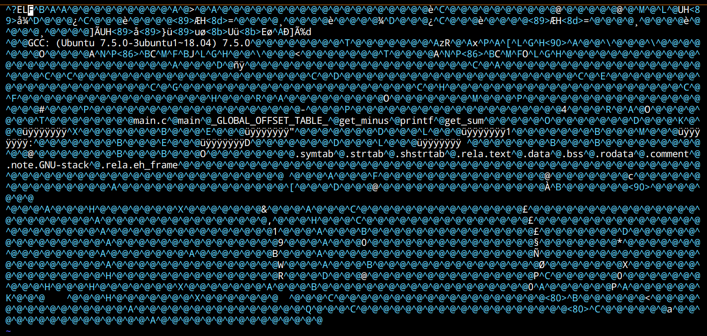
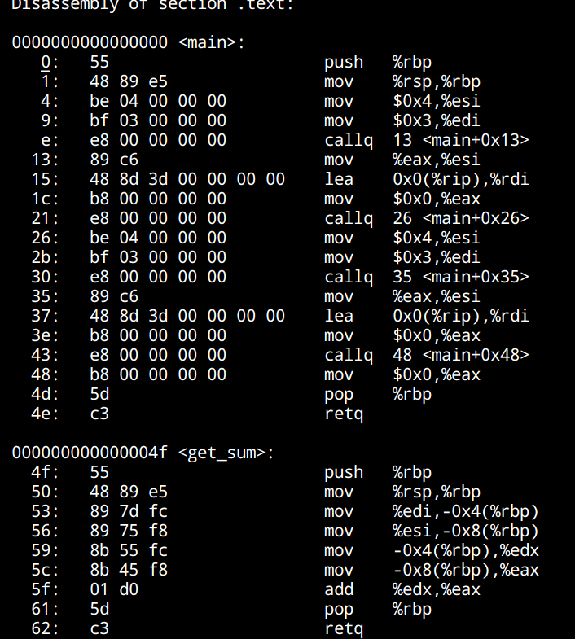
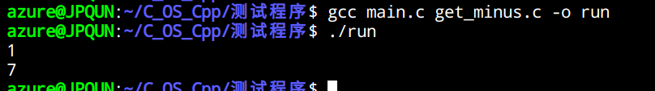

如果想要了解更仔细地过程，建议看csapp或者《程序员的自我修养》

## 最直接的编译过程

初始.c文件通过预处理器、编译器、汇编器、链接器得到最后的可执行程序（比如linux系统下的a.out）

hello.i：hello.c经预处理生成的文本文件。

hello.s：hello.i经编译生成的汇编语言文件。

hello.o：hello.s经汇编生成的可重定位目标文件。

hello：hello.o经链接生成的可执行目标文件。

在经过不同处理阶段的程序到底是怎么样的呢？让我们用gcc分步调试即可：

你可以使用这个命令获得所有输出：`gcc -save-temps main.c –o main`

## 一、预处理过程

在预处理阶段，编译器主要完成了这几件事：

* 去掉所有的注释

* 展开所有的宏定义（也就是做字符替换）

* 插入#include文件的内容

* 处理所有的条件编译（形如#ifndef的语句，详见 [条件编译](https://docs.microsoft.com/zh-cn/cpp/preprocessor/hash-if-hash-elif-hash-else-and-hash-endif-directives-c-cpp?view=msvc-170)

如果想要获得.i的预处理文件，需要输入 `gcc -E main.c -o main.i`  ，`-E`选项保留预处理器的输出文件，但默认输出到标准输出流，你需要`-o`指定一个输出文件。

因为头文件可能相当大，如果源文件包括了多个头文件，那么它的预处理器输出可能会庞杂难读。使用`-C`选项会很有帮助，这个选项可以阻止预处理器删除源文件和头文件中的注释：`gcc -E -C main.c -o main.c`

测试效果如下，我们能确实看到上述几件事情的发生：（可以使用`cat main.i`或者`vim main.i`查看结果）

* 有关预编译，如果想知道更多信息，可以参考 [预编译器](https://docs.microsoft.com/zh-cn/cpp/preprocessor/preprocessor-directives?view=msvc-170)

* 标准输出流默认是显示器，但理论上通过控制stdout的实现来源dup可以修改成文件或者其他可写空间

## 二、编译过程

编译能够将hello.i 文件编译生成汇编语言程序 hello.s，为之后的汇编过程做铺垫。汇编语言程序中的每条语句都以一种标准的文本格式确切地描述了一条低级机器语言指令，汇编语言为不同高级语言的不同编译器提供了通用的输出语言。如果想看懂他们，可以去看看csapp的第三章。

使用`gcc -S main.i -o main.s`或者 `gcc -S main.c`生成汇编程序，即可看到效果：

* 如果你尝试不同代码，你会发现汇编代码逻辑比起源代码逻辑发生了简化甚至更换位置，这是因为编译器会自动对程序的汇编实现进行优化，编译器是很聪明的。但如果你想获得原汁原味结构的汇编代码，可以使用`gcc -0g -E main.c`获得符合结构的优化等级（如果要获得较好的优化一般需要把`-0g`改为`-01`或者`-01`）

## 三、汇编过程

接下来，汇编器将hello.s翻译成机器语言指令，把这些指令打包成一种叫做可重定位目标程序的格式，并将结果保存在目标文件main.o中。

使用`gcc -c main.s -o main.o`或者`gcc -c main.c`得到main.o目标文件。main.o文件是一个二进制文件，它的字节编码是机器语言指令而不是字符，如果vim强制打开main.o文件，看到的将是一堆乱码：

如果想看他的汇编代码，可以用反汇编器来查看它的编码：`objdump –d main.o`

* 实际上，二进制文件也能直接改，在jyy操作系统课程中你能学到这种有趣的操作

## 四、链接过程

链接器（ld）负责将多个可重定位的目标文件（.o文件）合并为一个可执行文件，虽然前面已经得到了机器语言文件，但我们还需要把目标文件、操作系统的启动代码和用到的库文件进行组织得到最后的执行文件（比如printf就是从别的库文件来的）。

通过链接过程将main.o变为可执行文件，使用`gcc main.c -o main`或者`gcc main.c`

由于这里用到了其他文件的函数（实际上尝试实现了一个静态库，如果是单文件就按照前面的方法即可）需要使用`gcc main.c get_minus.c -o run` ，可以看到最后生成了run，使用`./run`即可看到结果：

如果直接进行`gcc main.c`的操作，得到的将是a.out文件，用同样的方法可以运行得到结果。

通过`ls -l`我们可以将.o文件与最后可执行文件进行大小比较，可以发现最后的执行文件大小还是大很多的。

* 如果想用gdb进行调试，你需要这样对文件进行编译：`gcc main.c -o main -g`

* 如果想进一步学习怎么生成自己的静态链接库与动态链接库，可以参考：[静态链接库与动态链接库](https://wangjunstf.github.io/2021/09/30/jing-tai-ku-he-dong-tai-ku-zhi-zuo/)

## Reference

<https://blog.csdn.net/Shrimp_millet/article/details/94574406>

<https://zhuanlan.zhihu.com/p/307730265>

<https://blog.csdn.net/u012184539/article/details/81348529>

<https://www.runoob.com/cprogramming/c-examples.html>

<https://wangjunstf.github.io/2021/09/30/jing-tai-ku-he-dong-tai-ku-zhi-zuo/>

<https://www.runoob.com/cprogramming/c-functions.html>

<http://c.biancheng.net/view/2375.html>
