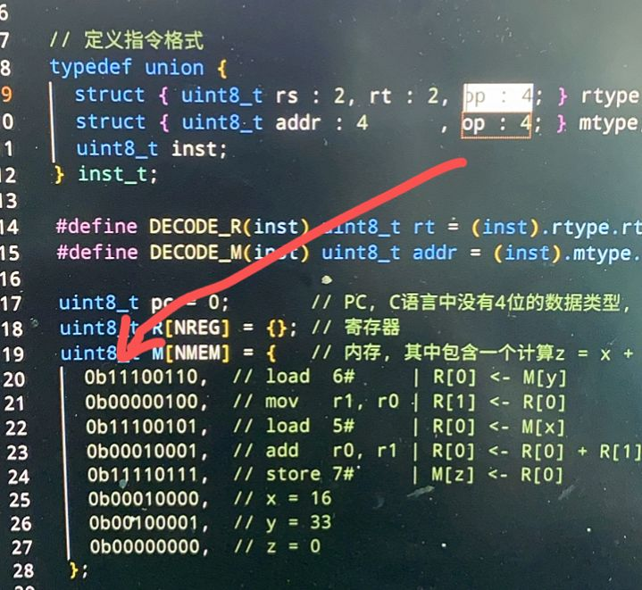
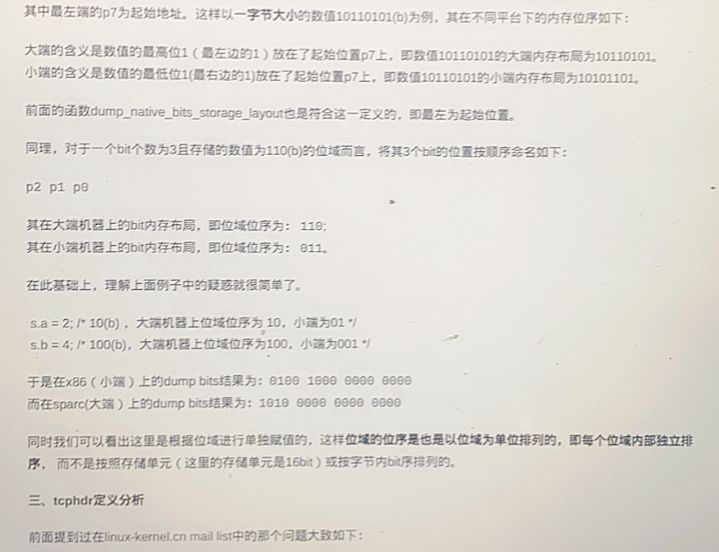
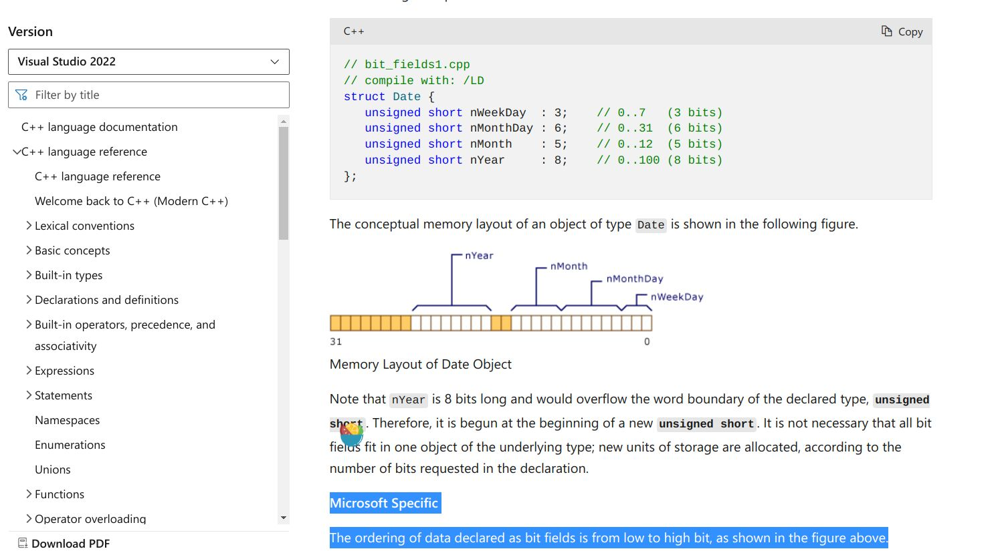
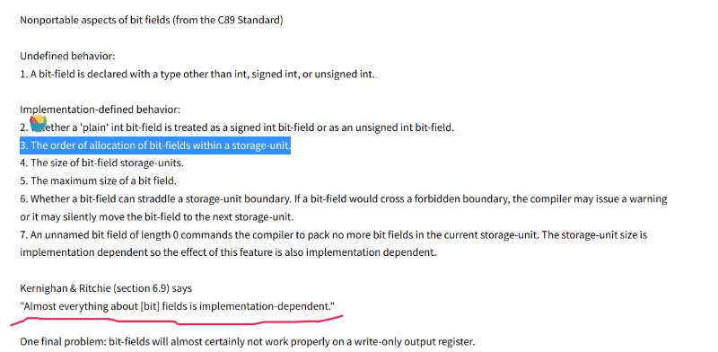
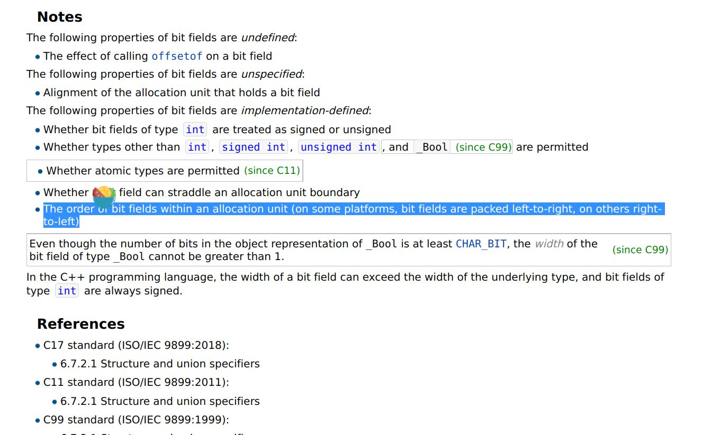

反向排列的原因是C编译器，还是机器？

在做PA的过程中，发现这样的一段代码（模拟cpu的过程）：

> 那么问题就来了——为什么这里op位段会自动匹配前面的部分？（为什么不匹配后面） 和大端法有关系吗？

我怀疑就是小端定义，但不明白原因，于是开始了漫长的搜索.....

（直接看结果【不一定对，如果有疑问欢迎提出一起讨论，谢谢，我对编译器也不熟悉】）：  
我认为bit field的反向读取本质上也是由于计算机结构大小端实现的，编译器会先看机器是否有定义当然也可以改变定义，C语言标准中本身没有定义。）

查到了也有人遇到类似的问题：

在一个[编译器的网站](https://downloads.ti.com/docs/esd/SPRUI04C/bit-fields-stdz0545438.html)下，我发现了这样一段话：  
>For big-endian mode, bit fields are packed into registers from most significant bit (MSB) to least significant bit (LSB) in the order in which they are defined. Bit fields are packed in memory from most significant byte (MSbyte) to least significant byte (LSbyte). For little-endian mode, bit fields are packed into registers from the LSB to the MSB in the order in which they are defined, and packed in memory from LSbyte to MSbyte.

那此时我们知道确实可能和大小端法是有关的,至少在C语言上是这样的。而C++上只给了说明，没有为什么，只给出了定义。

但问题又来了，一般机器中大小端看的是字节排序，但是我发的位域是对一个字节进行划分，一个字节内的bit也要遵循大小端排序吗？

在查阅C标准中我发现原来这个位域排布是**implementation-dependent**的（也就是说不管怎么样，首先位域排布是C标准没有明确定义的，取决于编译器）

>Implementation dependent means that the standard says nothing about some occurance in C/C++ and leaves the choice up to the people who create compilers and operating systems. It means that what you use on one system/compiler may not work the same way on another, but the behavior is well defined for that particular implementation. For example, whether the result of a right bitwise shift on a signed variable results in a logical or arithmetic shift is implementation defined.

那么我们的检索范围就可以缩小了，只要知道这个行为是不是编译器规定的即可。  

继续查看[GCC的手册](https://gcc.gnu.org/onlinedocs/gccint/Bit-Fields.html)
>This represents a reference to a sign-extended bit-field contained or starting in loc (a memory or register reference). The bit-field is size bits wide and starts at bit pos. The compilation option BITS_BIG_ENDIAN says which end of the memory unit pos counts from.

答案很接近了，我猜想只要知道BITS_BIG_ENDIAN是做什么的即可

同样继续查看[GCC的手册StorageLayout](https://www.cse.unr.edu/~sushil/class/cs202/help/man/gcc-2.7.0/gcc_181.html)

>**BITS_BIG_ENDIAN**
Define this macro to have the value 1 if the most significant bit in a byte has the lowest number; otherwise define it to have the value zero. This means that bit-field instructions count from the most significant bit. If the machine has no bit-field instructions, then this must still be defined, but it doesn't matter which value it is defined to. This macro need not be a constant. This macro does not affect the way structure fields are packed into bytes or words; that is controlled by BYTES_BIG_ENDIAN.

里面出现了“If the machine has no bit-field instructions”，所以倾向于还是机器为准的。

综上所述，我认为bit field的反向读取本质上也是由于计算机结构大小端实现的，编译器会先看机器是否有定义当然也可以改变定义，C语言标准中本身没有定义。
