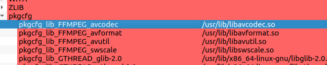

## 使用ffmpegGPU相关拓展加速编码解码

一些依赖可选择安装：（最好用系统默认镜像源，否则容易被嵌套依赖问题电脑GG）

sudo apt-get install autoconf automake build-essential libass-dev libfreetype6-dev  libtheora-dev libtool libvorbis-dev pkg-config texinfo zlib1g-dev unzip cmake yasm libx264-dev libmp3lame-dev libopus-dev libsdl1.2-dev libva-dev libvdpau-dev libxcb1-dev libxcb-shm0-dev libxcb-xfixes0-dev libfaac\* libopenjpeg \* libv4l-dev libvpx-dev libssl-dev

参考用官方手册：

Using\_FFmpeg\_with\_NVIDIA\_GPU\_Hardware\_Acceleration.pdf

[https://docs.nvidia.com/video-technologies/video-codec-sdk/pdf/Using\_FFmpeg\_with\_NVIDIA\_GPU\_Hardware\_Acceleration.pdf](https://docs.nvidia.com/video-technologies/video-codec-sdk/pdf/Using_FFmpeg_with_NVIDIA_GPU_Hardware_Acceleration.pdf "https://docs.nvidia.com/video-technologies/video-codec-sdk/pdf/Using_FFmpeg_with_NVIDIA_GPU_Hardware_Acceleration.pdf")

按照分支选择对应版本的nv-codec-headers进行编译安装

[https://github.com/FFmpeg/nv-codec-headers](https://github.com/FFmpeg/nv-codec-headers "https://github.com/FFmpeg/nv-codec-headers")

你可以直接下载别人的docker：

[https://yinguobing.com/docker-image-for-nvidia-gpu-accelerated-ffmpeg-opencv/](https://yinguobing.com/docker-image-for-nvidia-gpu-accelerated-ffmpeg-opencv/ "https://yinguobing.com/docker-image-for-nvidia-gpu-accelerated-ffmpeg-opencv/")

下载：

[https://ffmpeg.org/download.html](https://ffmpeg.org/download.html "https://ffmpeg.org/download.html")

```
首先你需要编译H264库

（1）下载X264 : git clone [http://git.videolan.org/git/x264.git](http://git.videolan.org/git/x264.git)

（2）安装X264：

sudo ./configure –enable-shared –disable-asm

sudo make

sudo make install
```

接着重新编译ffmpeg：

```bash
./configure --enable-shared --enable-cuda --enable-cuvid --enable-nvenc --enable-libnpp \
  --enable-nonfree\  #可选--enable-gpl --enable-libx264   --enable-libx265 
 --extra-cflags=-I/usr/local/cuda/include --extra-ldflags=-L/usr/local/cuda/lib64 \
 --prefix=/usr/  


```

> 注意，这里prefix之所以要指定为/usr/是为了让opencv能找到ffmpeg
> 如果还是找不到，你可以用cmake-gui 然后打开grouped advanced找到pkgcfg，按照这样类似的命名规则，再找到你现在拥有的相应的so在右上角增加入口添加进去即可。



你也可以参考：[https://www.jianshu.com/p/59da3d350488](https://www.jianshu.com/p/59da3d350488 "https://www.jianshu.com/p/59da3d350488")

到这里基本上就结束了，为了让命令行可以使用记得在\~/.bashrc中添加如下命令：
export PATH=/usr/local/ffmpeg/bin/:\$PATH
保存后执行
source \~/.bashrc

## Reference

利用ffmpeg转接摄像头RTSP流硬解码

[https://www.pianshen.com/article/31441500162/](https://www.pianshen.com/article/31441500162/ "https://www.pianshen.com/article/31441500162/")

ffmpeg使用硬件加速hwaccel、cuvid、h264_cuvid、h264_nvenc
<https://blog.csdn.net/zengraoli/article/details/119789655>

NVIDIA FFmpeg 转码指南【非常推荐，英伟达官方良心之作，适合写个笔记】
<https://developer.nvidia.com/zh-cn/blog/nvidia-ffmpeg-transcoding-guide/>

ffmpeg命令行使用nvidia CUDA scaling高速转分辨率转码(libnpp)
<https://blog.csdn.net/n66040927/article/details/84525611>

### Video Encoding Sessions并发数目限制(OpenEncodeSessionEx failed: out of memory)

[https://github.com/keylase/nvidia-patch](https://github.com/keylase/nvidia-patch "https://github.com/keylase/nvidia-patch")

<https://blog.csdn.net/TracelessLe/article/details/113755792>

<https://blog.csdn.net/charleslei/article/details/105761627>

<https://www.cnblogs.com/geoffreyone/p/14715487.html>
