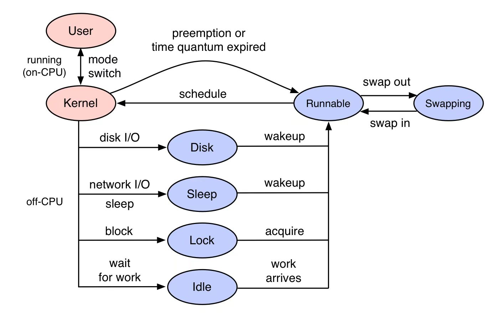

## 基础检查

最简单的可使用下列脚本直接看结果。

```Plain Text
#!/bin/bash

# 检查是否安装了 iostat
if ! command -v iostat &> /dev/null
then
    echo "iostat 未安装，请先安装 sysstat 包。"
    exit 1
fi

# 获取 CPU 使用率和负载信息
iostat_output=$(iostat -c -d 1 2)
cpu_idle=$(echo "$iostat_output" | awk 'NR==7 {print $6}')
cpu_iowait=$(echo "$iostat_output" | awk 'NR==7 {print $4}')
load_average=$(uptime | awk -F'load average:' '{ print $2 }' | cut -d, -f1 | tr -d ' ')

# 设定阈值
idle_threshold=30.0
iowait_threshold=10.0
load_threshold=1.0

# 判断 CPU 状态
if (( $(echo "$cpu_idle > $idle_threshold" | bc -l) )); then
    echo "CPU 大部分时间在空转。"
elif (( $(echo "$cpu_iowait > $iowait_threshold" | bc -l) )); then
    echo "CPU 高 I/O 等待，可能有磁盘或网络瓶颈。"
elif (( $(echo "$load_average > $load_threshold" | bc -l) )); then
    echo "CPU 负载高，可能有 CPU 密集型任务。"
else
    echo "CPU 负载和使用率正常。"
fi
```

或者是使用 BPF 工具：

offcputime-bpfcc -df -p `pgrep -nx a.out` 30 > out.stacks

可尝试使用

```Plain Text
offcputime-bpfcc -df -p pgrep -nx a.out 30 > out.stacks
```

这条命令使用 `offcputime-bpfcc` 工具来分析指定进程在 off-CPU（非运行态）时的时间分布，具体做了以下事情：

- **`offcputime-bpfcc`**: 这是一个 BPF (Berkeley Packet Filter) 工具，用于捕获进程在 off-CPU 时的堆栈跟踪。

- **`-d`**: 打印详细的堆栈信息。

- **`-f`**: 以格式化的方式输出堆栈信息，便于分析。

- **`-p $(pgrep -nx a.out)`**: 指定要分析的进程 ID。这里使用 `pgrep -nx a.out` 来获取名为 `a.out` 的进程的最新进程 ID。

- **`30`**: 运行时间，表示收集数据持续 30 秒。

- **`> out.stacks`**: 将输出内容重定向到 `out.stacks` 文件中。

这个命令的目的是分析 `a.out` 进程在 off-CPU 时的行为，帮助找出可能的性能瓶颈，例如 I/O 等待、锁竞争等。收集的数据会被保存到 `out.stacks` 文件中以供后续分析。

## 硬盘 io 测试

```
# Linux

# 写测试
dd if=/dev/zero of=/mnt/your_disk/testfile bs=1G count=1 oflag=direct

# 读测试
dd if=/mnt/your_disk/testfile of=/dev/null bs=1G count=1 iflag=direct

# 删除测试文件
rm -f /mnt/your_disk/testfile

#########################
# Windows

# 写测试
Write-Host "Writing test file..."
$testFile = "D:\testfile"
$buffer = New-Object Byte[] (1MB)
[IO.File]::WriteAllBytes($testFile, $buffer)

# 读测试
Write-Host "Reading test file..."
$buffer = [IO.File]::ReadAllBytes($testFile)

# 删除测试文件
Remove-Item $testFile
```
