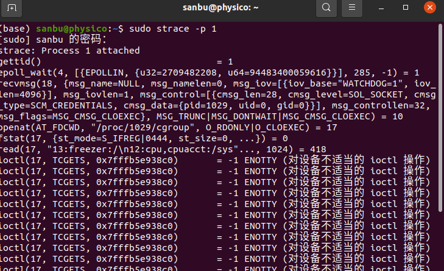

+++
title = "Linux常见性能与瓶颈等维护监控工具合集-内存、磁盘、cpu瓶颈监控 2022-12-31"
+++
## 基础

top 不多说 （我更喜欢htop有时候）

ps 进程信息

free 系统内存整体使用率

ldd 动态链接信息

nm 二进制符号表信息

objdump 不多说

readelf 不多说

## sysstat工具介绍

sysstat主要作用是观察服务负载，比如cpu\内存的占用率，网络的使用率以及磁盘写入和读取的速度等。。。

`sudo apt install sysstat`

sysstat工具包含

1.  iostat工具提供cpu使用率以及硬盘吞吐效率
2.  mpstat提供单个或多个处理器相关数据
3.  pidstat 关于运行中的进程 任务 cpu 内存统计等信息
4.  **sar工具负责收集**，报告并存储系统活跃信息（我感觉这个比较厉害）

### sar

常见问题：

-   没有统计权限，参考：[https://blog.csdn.net/lord\_y/article/details/100139049](https://blog.csdn.net/lord_y/article/details/100139049 "https://blog.csdn.net/lord_y/article/details/100139049")
-   无法打开/sysstat/sa02 没有那个文件或目录：[https://blog.csdn.net/lord\_y/article/details/100139049](https://blog.csdn.net/lord_y/article/details/100139049 "https://blog.csdn.net/lord_y/article/details/100139049")
-   刚开统计权限后，要过一会儿才能在sar -u 看到具体的信息

sar -u 回显说明

主要看下面两条：

若iowait过高表示存在I/O 瓶颈，即磁盘I/O无法满足业务需求

若idle过低持续低于10，**表示cpu使用率比较严重，最需要解决的资源是cpu**，需要结合内存使用情况判断cpu是否瓶颈，若idle过高但系统响应慢，**有可能是cpu等待分配内存，此时应加大内存容量**。

-   %user 用户模式下消耗的CPU时间的比例；
-   %nice 通过nice改变了进程调度优先级的进程，在用户模式下消耗的CPU时间的比例
-   %system 系统模式下消耗的CPU时间的比例；
-   **%iowait** CPU**等待磁盘I/O导致空闲状态消耗的时间比例；**（即cpu等待io的百分比）
-   %steal 利用Xen等操作系统虚拟化技术，等待其它虚拟CPU计算占用的时间比例；
-   **%idle** CPU空闲时间比例；

如果想要看实时的10条，可以使用`sar -u ALL 1 10`

#### sar -I 3 1  统计某个硬中断频率

可以用来看是否有异常的硬终端频率。

比如硬盘中断过高有时候是内存炸了，swap过度。一直在硬盘中断。

（Q：swap一般什么时候满了？  A:网络卡了发不出信息塞满缓存，一直在交换。。。或者空间碎片过多不连续导致卡爆，可能造成重启事故）

#### 系统瓶颈判断方法：

除了常见的**top和free**

#### 1-怀疑cpu存在瓶颈

可用两个指令查看：

sar -u&#x20;

sar -q

#### 2-怀疑内存存在瓶颈可用

sar -B

sar -r

sar -w

#### 3-怀疑I/O存在瓶颈，可用

sar -b

sar -u

sar -d

### pidstat

查看cpu的使用情况，每秒统计一次

-   查看进程的线程运行在那个cpu上，随便找了一个进程为例：
-   `pidstat -u -p 587990 -t`

查看内存使用情况，每秒统计一次 统计三次

`pidstat -r -p 587990 1 3`

-   RSS 物理内存
-   VSZ 虚拟内存
-   majflt/s 大缺页次数，需要读磁盘
-   minflt/s 小缺页次数，需要读内存

&#x20;

### mpstat

linux cpu实时监控，每秒显示一次cpu使用状态（类似top）

`mpstat -P ALL 1`

## perf

系统性能分析工具，返回cpu正在执行的函数名以及调用栈。

**perf能做什么**

-   提供各种角度的系统性能分析，cpu/内存 磁盘 网络等等
-   定位性能异常，辅助性能优化

**需要掌握的**部分

-   性能数据收集
    -   perf stat
    -   perf recordf
-   火焰图的生成
    -   基于perf生成的svg图片，用于展示cpu调用栈

## strace

跟踪系统调用与信号（syscall等。。）

比如跟踪一号进程（init）

`sudo strace -p 1`

统计系统函数调用次数：

查看系统调用的时间

`sudo strace -p 1 -t` 精确到秒   -tt精确到微妙

#### strace能做的事情

1.  判断线程是否卡死
2.  观察耗时操作有哪些
3.  观察加载了那些动态库
4.  观察打开了那些文件

## lsof

查看进程打开文件信息，查看某个文件是否被打开

-   lsof | grep deleted 处理磁盘已满但是找不到对应大文件的问题。 一种方法是kill相应进程，或者停掉这个文件的应用，让os自动回收磁盘空间。

## dmesg【**注意 只最近1小时的信息！！！！！！！**】

-   查看内核日志，内核日志也会被syslogd同步转储，转储位置取决于syslogd启动参数。
-   **可以根据dmesg查询指定进程ID是否被系统杀掉**` dmesg | grep 进程id`
-   **注意 只最近1小时的信息！！！！！！！**
-   比如linux的oom机制，某个进程占用很大的内存，会导致进程被kill了。。。。`cat /var/log/messages | grep Kill`是否查到了 Out of memory: Kill process、可以结合more less grep tail查看

## /proc

通过虚拟文件（内核数据结构可视化接口）获得内核信息，主要有：

1.  进程信息
2.  内存资源信息
3.  磁盘分区信息（proc只读，/sys 可以读写）

## 利用gdb查看死锁问题

gdb attach查看死锁问题

结论：锁的范围一定要控制好，在复杂的嵌套逻辑中更加需要谨慎。

再调策过程中，碰到线程不运转的情况，猜测线程已经死锁僵死了，

定位思路1：

1.  构造线程，`gdb attach $(pid)`进入线程
2.  `info threads`直接查看线程堆栈，查看是否有线程一直在等待锁。
3.  `thread $(gdb id)`查看线程堆栈

定位思路2：

1.  top 查看要调试的进程id
2.  `gdb pstack pid`进入trace模式
3.  `thread apply all bt`查看所有线程的 back trace信息；
4.  查看所有等待锁的线程，找到最早的一个线程，在代码中找到对应的位置，对应锁的函数，具体锁在哪个线程。
5.  `thread 定位锁线程id` bt查看bt信息
6.  使用f7进入然后 `p lockName`查看锁被哪个线程所拥有

## taskset

busybox工具中的命令，可以将进程放到指定的cpu核上运行，绑核（亲和力）。

## pstree

进程树父子关系

## netstat

监控tcp/ip网络。显示路由表，实际网络连接和每一个网络接口设备的状态信息。

`netstat -tunlp`用于显示tcp udp 的端口和进程的相关情况

`netstat -tunlp | grep 端口号`

## vmstat

属于sysstat包，可以展示给定时间间隔的服务器的状态值（CPU使用率，内存使用，虚拟内存交换情况）

相比top，可以看到整个机器的cpu 内存 io使用情况，而不是各个进程的cpu 内存使用率。

## pidof

快速找到应用的pid，相当于 ps -ef | grep&#x20;

## lscpu

不解释

## valgrind

用于linux程序的内存调试和代码剖析

用于内存泄漏检测调试。（申请释放不匹配，二次释放，使用释放后内存，使用未初始化内存）

## iotop

类似top ，更方便监控进程对磁盘读取情况

`sudo apt install iotop`

## iostat

对系统的磁盘操作活动进行监视（监视网卡、cpu、tty、磁盘的io负载情况）

## clockdiff

测算设备间系统时间差

## fuser

**显示所有正在使用指定的file，file system或者sockets的进程信息。**

linux情况下，当用umount卸载挂载点会遇到device is busy提示，用fuser就可以查到谁在使用这个资源。当然使用umount -lf \[挂载点] 也可以强制卸载

假设无法卸载的设备为/dev/sdb1

1.  运行下面命令查看xx用户xx进程正在占用这个设备 `fuser -m -v /dev/sdb12`
2.  运行命令沙了对应进程 `fuser -m -v -k /dev/sdb1` 或者`fuser -m -v -k -i /dev/sdb1`这个会在杀掉进程前进行确认！
3.  重新umount

查看哪些程序使用tcp的80端口：

`fuser -n tcp 80`或者`fuser -v -n tcp 80`或者`fuser -v 80/tcp`

## dd

用指定大小块拷贝文件，拷贝同时进行指定的转换（用于备份）

## uptime

系统运行了多长时间。。。。查看多少个用户连接。。。以及平均负载值

## Reference

嵌入式无人驾驶系统进阶与调测（本文主要参考）

[https://www.bilibili.com/video/BV1MA4y1S7zu/?spm\_id\_from=333.337.search-card.all.click](https://www.bilibili.com/video/BV1MA4y1S7zu/?spm_id_from=333.337.search-card.all.click "https://www.bilibili.com/video/BV1MA4y1S7zu/?spm_id_from=333.337.search-card.all.click")

sar —— Linux 上最为全面的系统性能分析工具之一

[https://shockerli.net/post/linux-tool-sar/](https://shockerli.net/post/linux-tool-sar/ "https://shockerli.net/post/linux-tool-sar/")
