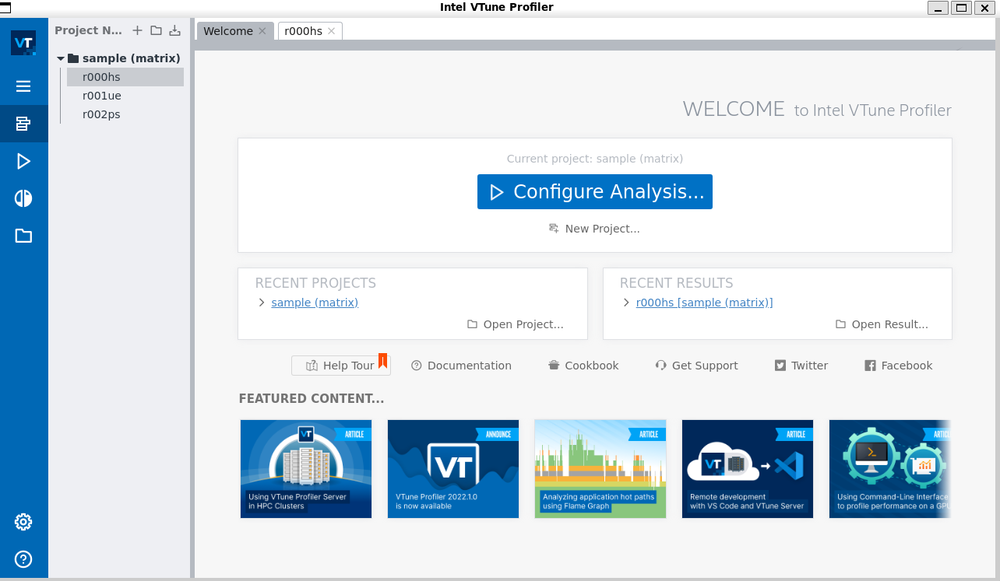
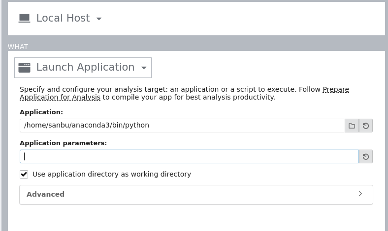
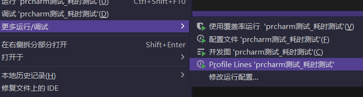
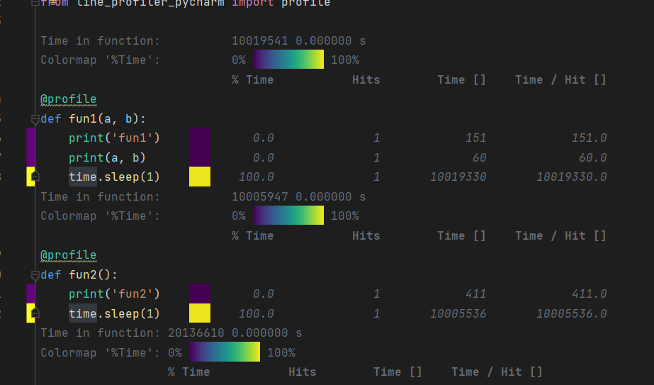

## 通用类

### Vtune（Intel）

#### 简介

VTune是 Intel 提供性能分析软件，VTune Amplifier XE 2011 集成了Intel VTune Performance Analyzer 和 Thread Profiler的主要功能，同时吸取了Performance Tool Utility 这个产品的优点。

perf 看不到L3cache 等硬件特性，需要更强大的工具。

其中，Vtune Performance Analyzer是性能分析工具，找到软件性能热点、瓶颈部分；

Vtune Threading Profiler是线程性能检测工具 , 分析负载平衡、同步开销过大等线程相关的性能问题。

VTune Amplifier XE 可以指明在相关的硬件资源上应用程序的改善点，具体来说，使用该软件用户获取的信息主要有以下几点：

l         确定占用大量处理器时间的区域(热点)；

l         查看应用运行过程中的情况(通过检测绑定process)；

l         没有充分的有效利用可用的处理器时间的代码；

l         影响应用程序性能的同步对象；

l         应用程序是否浪费时间在输入输出操作上，在哪里浪费的，为何浪费；

l         对比不同的同步方法、不同的线程数量、不同的算法之间对性能的影响；

l         线程的活动状态和状态的转换；

l         代码中与硬件相关的性能瓶颈(如缓存缺失、分支预测失败等)；

官方安装地址：

[https://www.intel.com/content/www/us/en/develop/documentation/vtune-install-guide/top.html](https://www.intel.com/content/www/us/en/develop/documentation/vtune-install-guide/top.html "https://www.intel.com/content/www/us/en/develop/documentation/vtune-install-guide/top.html")

使用指南：

[https://www.intel.com/content/www/us/en/develop/documentation/get-started-with-vtune/top/linux-os.html](https://www.intel.com/content/www/us/en/develop/documentation/get-started-with-vtune/top/linux-os.html "https://www.intel.com/content/www/us/en/develop/documentation/get-started-with-vtune/top/linux-os.html")

#### python代码分析指南

python代码分析指南：

[https://www.intel.com/content/www/us/en/develop/documentation/vtune-help/top/analyze-performance/code-profiling-scenarios/python-code-analysis.html](https://www.intel.com/content/www/us/en/develop/documentation/vtune-help/top/analyze-performance/code-profiling-scenarios/python-code-analysis.html "https://www.intel.com/content/www/us/en/develop/documentation/vtune-help/top/analyze-performance/code-profiling-scenarios/python-code-analysis.html")

视频教程：

[https://www.intel.com/content/www/us/en/developer/videos/performance-analysis-of-python-applications-with-intel-vtune-amplifier.html](https://www.intel.com/content/www/us/en/developer/videos/performance-analysis-of-python-applications-with-intel-vtune-amplifier.html "https://www.intel.com/content/www/us/en/developer/videos/performance-analysis-of-python-applications-with-intel-vtune-amplifier.html")

#### C++代码分析指南

待定

本次在 WSL2 ubuntu20.04环境下进行python代码的性能测试。（如果是可执行文件就更简单了，直接输入地址就行）

我选择的是online安装，令人惊喜的是WSL2完美支持安装过程中的gui显示。

安装完了后source进行变量的配置，然后使用`vtune-gui`打开软件，在这过程中遇到了几个动态链接库缺失问题：`libatk-1.0.so.0` 以及 `libcups.so.2`以及`libgtk-3.so.0`

分别使用以下命令解决：（估计是WSL2会遇到这个问题）

```bash
sudo apt-get install -y libatk-bridge2.0-0
sudo apt-get install -y libcups2
sudo apt install -y libgtk-3-0  #如果这个不管用可以选择安装：sudo apt install -y libgtk-3-dev
sudo apt install -y libnss3-dev libgdk-pixbuf2.0-dev libgtk-3-dev libxss-dev
sudo apt install -y libasound2

```

即可成功进入主界面`vtune-gui` （如果进不去请先确保使用了source）



接下来选择 configure analysis 然后输入解释器地址以及对应的parameter（就是python文件的地址）



进去后发现粒度还是太细，我想要代码和函数层面的信息，所以继续尝试其他东西。

CPU性能指标（其实这个应该看vtune更好一点

[https://zhuanlan.zhihu.com/p/521597381?utm\_id=0\&utm\_medium=social\&utm\_psn=1604820983428329473\&utm\_source=qzone\&utm\_oi=751534157867290624](https://zhuanlan.zhihu.com/p/521597381?utm_id=0\&utm_medium=social\&utm_psn=1604820983428329473\&utm_source=qzone\&utm_oi=751534157867290624 "https://zhuanlan.zhihu.com/p/521597381?utm_id=0\&utm_medium=social\&utm_psn=1604820983428329473\&utm_source=qzone\&utm_oi=751534157867290624")

google perftools

[https://www.cnblogs.com/GODYCA/archive/2013/05/28/3104281.html](https://www.cnblogs.com/GODYCA/archive/2013/05/28/3104281.html "https://www.cnblogs.com/GODYCA/archive/2013/05/28/3104281.html")

## python

### cprofile

目前最推荐使用cprofile，标准库提供的工具，使用方法如下：

`python -m cProfile -o out.prof my_test.py`

产生的序列化文件可以通过一个叫做 snakeviz 的工具进行可视化，具体效果可参考：

官网：[https://jiffyclub.github.io/snakeviz/](https://jiffyclub.github.io/snakeviz/ "https://jiffyclub.github.io/snakeviz/")

github：[https://github.com/jiffyclub/snakeviz/](https://github.com/jiffyclub/snakeviz/ "https://github.com/jiffyclub/snakeviz/")

但是这个只适合对大部分自己写的或者是完全自己实现的小模块进行测试，要做到更随心所欲的控制我自己写了一个工具，稳定后开源。

你只要`pip install snakeviz`，然后`snakeviz out.prof`就可以在产生的网页服务中查看python性能开销的火焰图了。

### line\_profiler

PyInstrument也不错，但还是更喜欢 line\_profiler

[https://github.com/pyutils/line\_profiler](https://github.com/pyutils/line_profiler "https://github.com/pyutils/line_profiler")

[https://zhuanlan.zhihu.com/p/88193562](https://zhuanlan.zhihu.com/p/88193562 "https://zhuanlan.zhihu.com/p/88193562")

可视化插件：【注意，只能在商业版上使用，无法在社区版上使用】

[https://zhuanlan.zhihu.com/p/215302708](https://zhuanlan.zhihu.com/p/215302708 "https://zhuanlan.zhihu.com/p/215302708")

但是这里我只能在windows上成功测试（windows上安装的python解释器和pytcharm），WSL下无法成功生成，感兴趣的朋友可以用ubuntu系统试试看是只能在windows上看还是WSL支持不好。

使用流程如下：

1、准备测试代码

```python
import time
from line_profiler_pycharm import profile

@profile
def fun1(a, b):
    print('fun1')
    print(a, b)
    time.sleep(1)
@profile
def fun2():
    print('fun2')
    time.sleep(1)
@profile
def fun3():
    print('fun3')
    time.sleep(2)
@profile
def fun4():
    print('fun4')
    time.sleep(1)
@profile
def fun5():
    print('fun5')
    time.sleep(1)
    fun4()

fun1('foo', 'bar')
fun2()
fun3()
fun5()

```

2、pycharm上安装插件：

插件中搜索`line_profiler_pycharm`安装后重启即可

3、安装line\_profiler和pycharm适配用库

```bash
 pip install line_profiler
 pip install line_profiler_pycharm
```

4、开始运行



然后就能看到详细的报告：



更详细的代码级的分析以及内存瓶颈分析可以参考：

[https://zhuanlan.zhihu.com/p/392210020](https://zhuanlan.zhihu.com/p/392210020 "https://zhuanlan.zhihu.com/p/392210020")

[https://blog.vicyu.com/2017/12/26/more-about-python-profiling/](https://blog.vicyu.com/2017/12/26/more-about-python-profiling/ "https://blog.vicyu.com/2017/12/26/more-about-python-profiling/")

案例参考：

[https://www.cnblogs.com/dechinphy/p/line-profiler.html](https://www.cnblogs.com/dechinphy/p/line-profiler.html "https://www.cnblogs.com/dechinphy/p/line-profiler.html")

## c++

函数粒度直接使用 google benchmark

[https://blog.vicyu.com/2017/12/26/more-about-python-profiling/](https://blog.vicyu.com/2017/12/26/more-about-python-profiling/ "https://blog.vicyu.com/2017/12/26/more-about-python-profiling/")

[https://geek-docs.com/numpy/numpy-tutorials/parallelizing-a-numpy-vector-operation.html](https://geek-docs.com/numpy/numpy-tutorials/parallelizing-a-numpy-vector-operation.html "https://geek-docs.com/numpy/numpy-tutorials/parallelizing-a-numpy-vector-operation.html")

## 算子层级的profile

其他工具待更新。

参考paddle lite

[https://paddlelite.paddlepaddle.org.cn/user\_guides/profiler.html](https://paddlelite.paddlepaddle.org.cn/user_guides/profiler.html "https://paddlelite.paddlepaddle.org.cn/user_guides/profiler.html")

paddle lite支持的算子信息：

[https://paddlelite.paddlepaddle.org.cn/user\_guides/opt/opt\_bin.html](https://paddlelite.paddlepaddle.org.cn/user_guides/opt/opt_bin.html "https://paddlelite.paddlepaddle.org.cn/user_guides/opt/opt_bin.html")
