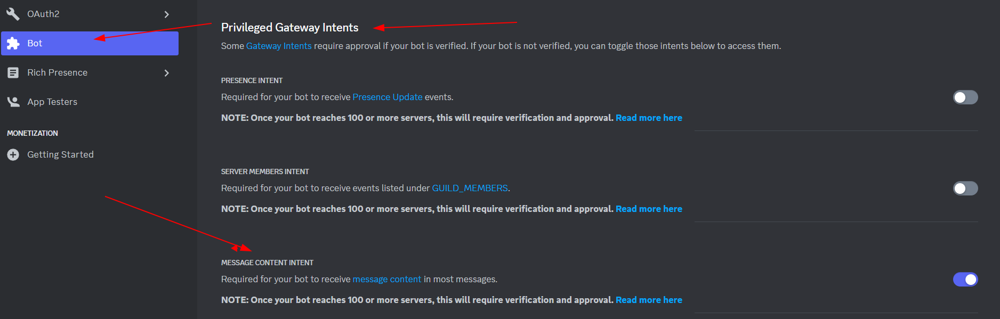
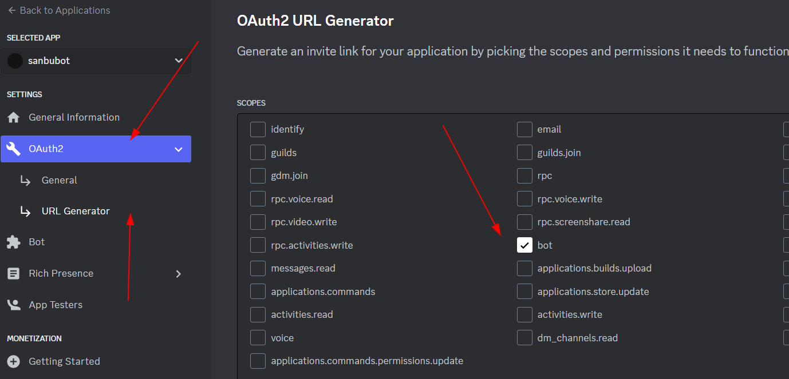
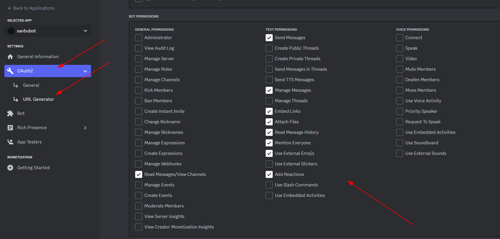
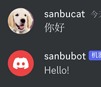
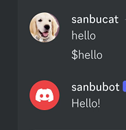
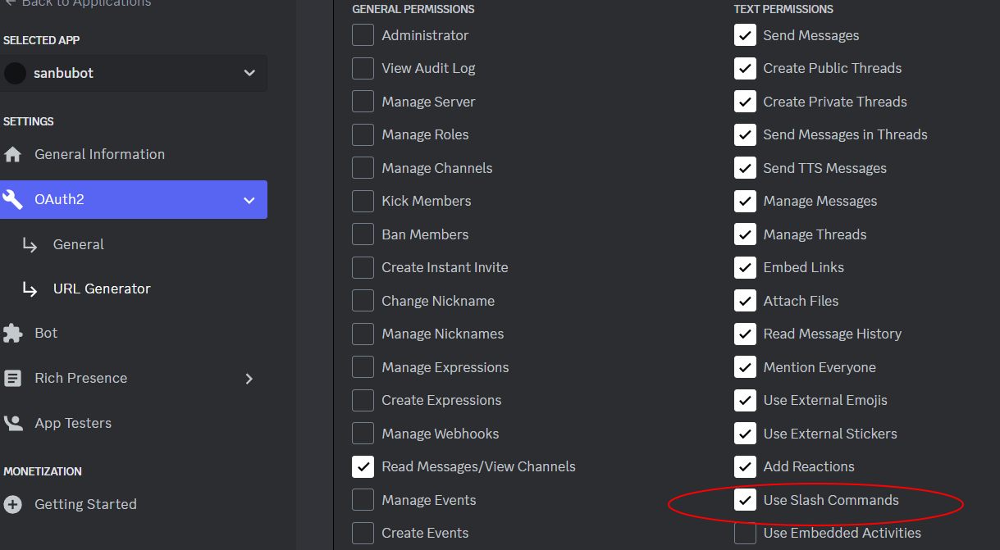
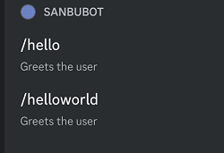
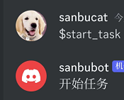
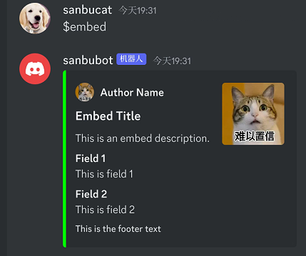

首先，非常感谢这篇文章：如何用 Python 构建 Discord 机器人并免费托管

[https://www.freecodecamp.org/chinese/news/create-a-discord-bot-with-python/](https://www.freecodecamp.org/chinese/news/create-a-discord-bot-with-python/ "https://www.freecodecamp.org/chinese/news/create-a-discord-bot-with-python/")

以及这个合集文章：

[https://ithelp.ithome.com.tw/users/20162267/ironman/6248?page=2](https://ithelp.ithome.com.tw/users/20162267/ironman/6248?page=2 "https://ithelp.ithome.com.tw/users/20162267/ironman/6248?page=2")

【非常感谢这些文章，我的这个教程是基于这些进行魔改的】

看完本文，你100%可以获得一个属于自己的discord机器人。

## 基础篇

### 创建 Discord Bot 账户

为了使用 Python 库和 Discord API，我们必须首先创建一个 Discord Bot 账户。

以下是创建 Discord Bot 账户的步骤。

1. 确保你已经登录到 [Discord 网站](https://discord.com/ "Discord 网站")
2. 进入[应用程序页面](https://discord.com/developers/applications "应用程序页面")
3. 点击 `New Application` 按钮


1. 给应用程序一个名称，然后点击 `Create` 按钮


1. 进入 `Bot` 标签，然后点击 `Add Bot`。你必须点击 `Yes, do it!`


同时记得在下面Privileged Gateway Intents中打开这个选项，否则你的机器人只能【在私聊回复】



你的机器人已经创建完毕。下一步是复制令牌（token）。


这个令牌是你的机器人的密码，所以不要与任何人分享它。它可以让别人登录到你的机器人并做各种坏事。

如果不小心被分享，你可以重新生成令牌。

### 邀请机器人接入服务器

现在你必须让你的机器人用户接入一个服务器。要做到这一点，你应该为它创建一个邀请 URL。

转到 `OAuth2` 标签。然后在 `scopes` 部分选择 `bot`。



现在为机器人选择你想要的权限。【还是在一样的界面，往下滑就能看到了】我们的机器人将主要使用文本信息，所以我们不需要很多的权限。你可能需要更多的权限，这取决于你希望你的机器人做什么。对 `Administrator` 的权限要小心，你可以参考我的方式来构建自己的bot



选择适当的权限后，拉到最底下找到 GENERATED URL， 然后点击右侧的 `copy` 按钮，把这个 URL 粘贴到你的浏览器，选择一个服务器来接入机器人，然后一路给权限即可。

注意：要添加机器人，你的账户需要 `Manage Server` 的权限。【如果显示没有任何服务器，你需要先去创建一个自己的频道！】

现在你已经创建了机器人用户，我们将开始为机器人编写 Python 代码进行调用！

### 用 discord.py 库编写一个基本的 Discord 机器人代码

我们将使用 discord.py， 这个 Python 库来编写机器人的代码。discord.py 是 Discord 的一个 API 封装器，使在 Python 中更容易创建一个 Discord 机器人。

首先你需要安装环境：

`python3 -m pip install discord.py`

接下来看看如何处理事件，

discord.py 基于事件的概念。一个事件是你监听的东西，然后对其作出回应。例如，当一条消息发生时，你会收到一个关于它的事件，你可以对其作出回应。

让我们做个最简单的例子【注意，这个版本在私聊机器人进行测试才能得到回复，暂时无法在频道使用】

你需要先在一个`.env`文件中写入TOKEN=XXXXXXX，这个TOKEN我们已经在之前获取过了(左侧点击bot），然后copy对应的key：


之后我们就可以愉快的运行这个脚本了！

```python
import discord
import os
from dotenv import load_dotenv
# 读取本地环境变量
load_dotenv()

client = discord.Client(intents=discord.Intents.default())

@client.event
async def on_ready():
    print('We have logged in as {0.user}'.format(client))

@client.event
async def on_message(message):
    if message.author == client.user:
        return
    if message.content.startswith('你好'):
        print("检测到回复")
        await message.channel.send('Hello!')
        
client.run(os.getenv('TOKEN'))
```

如果运行成功，你可以看到：【注意！ 是私聊机器人而不是在频道中！！】



### 制作一个鼓励机器人

现在我们有了一个基本的机器人工作，我们将改进它成为 `鼓励机器人` 。

每当有人发来含有悲伤或压抑字眼的信息时，这个机器人就会以鼓励的信息来回应。

当有人在聊天中输入 `$inspire` 信息时，机器人也会从 API 中随机返回一句鼓舞人心的话。

我们将从添加 `$inspire` 功能开始，通过运行下列代码，你只需要和机器人对话就可以得到一个激动人心的鼓励。

```python
import discord
import os
import requests
import json
from dotenv import load_dotenv
load_dotenv()

client = discord.Client(intents=discord.Intents.default())

def get_quote():
  response = requests.get("https://zenquotes.io/api/random")
  json_data = json.loads(response.text)
  quote = json_data[0]['q'] + " -" + json_data[0]['a']
  return(quote)

@client.event
async def on_ready():
  print('We have logged in as {0.user}'.format(client))

@client.event
async def on_message(message):
  if message.author == client.user:
    return

  if message.content.startswith('$inspire'):
    quote = get_quote()
    await message.channel.send(quote)

client.run(os.getenv('TOKEN'))
```

### 实现在频道中对话

```python
if message.author == client.user:
    return
```

首先我们还要说明一下之前的代码，为什么要加上这一句？——因为客户端无法区分bot用户和普通用户帐户，所以您的on\_message（）处理程序应该防止bot发送它自己可能处理的消息的潜在递归情况（也就是无限检测到某句话触发然后一直循环下去。。。）

为了能够在频道中对话，我们需要开启对应的信息处理权限，我们需要用下列方式启用对所有消息的处理：

```python
intents = discord.Intents.default()
intents.message_content = True
client = discord.Client(intents=intents)
```

显示启动权限后，你就可以在频道愉快的和你的机器人聊天了。

这是为什么呢？我们再来回顾下当初注册bot的时候看到的特权指定：

```纯文本
在Bot选项里还有Privileged Gateway Intents这个分类，在这个分类里有着机器人的特权选项，包含了PRESENCE INTENT、SERVER MEMBERS INTENT和MESSAGE CONTENT INTENT分别具有以下功能：

PRESENCE INTENT：这个意图允许您的机器人接收关于用户在线状态和活动的信息，例如他们正在玩什么游戏或在线时间。
SERVER MEMBERS INTENT：这个意图允许您的机器人接收关于服务器成员的信息，例如成员加入或离开服务器。
MESSAGE CONTENT INTENT：这个意图允许您的机器人接收消息内容、附件、嵌入和组件字段。如果您的机器人或应用程序未获批准使用消息内容，则当您收到消息时，消息对象中的这些字段将为空。
这些意图被定义为"特权意图"。而因为数据的敏感性。如果您的机器人未经验证且在少于100个服务器中，则可以在Discord Developer Portal中启用特权门户意图。如果您的机器人已经验证或即将需要验证，则需要申请特权意图。

```

## 进阶篇

### 再看事件调用

discord bot主要是事件(event)为中心在运作的，首先要先理解装饰器，它是用于在 Discord bot 程序中注册事件处理程序。当你在函数前面添加@bot.event（或者@client.event）装饰器时，代表告诉 Discord bot 当特定事件发生时要调用该函数。

关于Discord bot连接事件和响应事件，来简单介绍一下：

- 连接事件 &#x20;

这些事件在bot启动并连接到Discord时被触发：

```text
on_ready: bot启动完毕，登录成功后被调用。这表示bot已经准备好工作了。

on_resumed: 当bot重连成功后被调用。

on_disconnect: 当bot失去连接时被调用。
```

- 响应事件 &#x20;

这些事件在接收到Discord事件时被调用，用于使bot响应用户操作：

```纯文本
on_message: 当收到新消息时调用，这是最常用的事件。在这里可以处理用户命令。

on_reaction_add: 当消息接收新反应时。

on_reaction_remove: 当消息反应被移除时。

on_message_edit: 当消息被编辑时。

on_member_join: 有新成员加入服务器时。

on_member_remove: 有成员离开服务器时。

on_typing: 用户正在输入时。
```

等等。

通过为这些事件编写异步的处理函数，可以使bot检测事件并做出反应，实现各种功能。

传入的参数需要参照以下的discord.py文档来传入，才可以正确使用。

需要正确配置intents，否则对应事件不会被接收到。

总之，使用这些事件可以使得Discord bot检测到服务器活动并做出反应，基本上所有bot功能都是基于事件的处理。

更多事件可至以下网址查看
[https://discordpy.readthedocs.io/en/stable/api.html?highlight=on\_disconnect#event-reference](https://discordpy.readthedocs.io/en/stable/api.html?highlight=on_disconnect#event-reference "https://discordpy.readthedocs.io/en/stable/api.html?highlight=on_disconnect#event-reference")

### 使用bot专属指令

从现在开始，我们将使用 discord.py库专门为bot设置的api进行操作，我们还是进行一个hello world的操作，检查message并回复：

```纯文本
import discord 
import os
from discord.ext import commands
from dotenv import load_dotenv
load_dotenv()

intents = discord.Intents.default()
# 如果你想要进一步提高权限可以设置Intents.all()，但是记得在bot的官方设置 Privileged Gateway Intents 中打开所有权限
intents.message_content = True
bot = commands.Bot(command_prefix="$", intents=intents) # 注册前缀

@bot.event
async def on_ready():
    print('We have logged in as {0.user}'.format(bot)) 

@bot.command()
async def hello(ctx):
    await ctx.send('Hello!') 
bot.run(os.getenv('TOKEN'))

```

此时只要你输入`$hello`就可以看到对应的结果输出了：



### 实现第一个'/'指令

如果你经常去别人的服务器玩耍，你一定可以看到别人有各式bot支持了 / 指令，那么我们该如何创建一个类似的bot功能实现自己想要的功能调用呢？这一小节会满足你的需求，但在开始之前，请记得打开你的bot的对应权限：



在Discord中输入指令通常是通过使用机器人的指令前缀加上指令名称，但实际上也可以使用斜杠指令（slash command）使使用指令更加简单。以下简单介绍斜杠命令（slash command）的优点。

```纯文本
与传统文本指令相比，使用Discord斜杠命令具有以下几个主要优点和区别：

更好的用户体验：斜杠命令提供参数提示和说明等功能，使用起来更直观。

减少用户输入错误：斜杠命令的参数具有类型，可以避免用户输入格式错误。

支持交互式参数：斜杠命令支持让用户通过菜单、下拉选项等方式输入参数，提供更好的体验。

支持同步申请：斜杠命令可以主动提交申请，无需等待用户触发。

直观的参数提示：将鼠标悬停在斜杠命令上可以看到参数提示，增加可发现性。

支持权限设置：斜杠命令可以设置用户权限，进行更精细的控制。
```

总结来说，斜杠命令提供更好、更直观的用户体验，并且具有更多的控制能力，是未来 Discord 机器人的重要发展方向。

让我们来谈谈如何使用斜杠指令。discord.py有许多方法可以为机器人创建斜杠指令，这里使用最简单的`@bot.hybrid_command()`修饰器来进行示范。使用这个修饰器可以使指令既可以注册为斜杠指令，也可以使用原本的指令前缀方式进行输入。

```纯文本
import discord 
import os
from discord.ext import commands
from dotenv import load_dotenv
load_dotenv()
from typing import Optional

intents = discord.Intents.all()
# 记得在bot的官方设置 Privileged Gateway Intents 中打开所有权限，这里需要bot的全部权限。
bot = commands.Bot(command_prefix="$", intents=intents)

@bot.command()
async def simplehello(ctx):
    await ctx.send('Hello!') 

@bot.hybrid_command(name='hello', help='Greets the user')  
async def hello(ctx):
    await ctx.send("Hello World!")

@bot.hybrid_command(name='helloworld', help='Greets the user')
async def helloworld(
    ctx, 
    name: str, # 用戶名
    age: Optional[int] = None # 可選年齡
):
    """
    Parameters:
        name (str): 用戶名
        age (Optional[int]): 可選年齡
    """
    if age:
        await ctx.send(f"Hello {name}! You are {age} years old.") 
    else:
        await ctx.send(f"Hello {name}!")

@bot.event
async def on_ready():
    try:
        # 必须实现——同步斜杠指令
        print("start sync commands")
        synced = await bot.tree.sync()
        print(f"Synced {synced} commands")
    except Exception as e:
        print("An error occurred while syncing: ", e)

bot.run(os.getenv('TOKEN'))

```

此时我们已经可以在频道和私聊中都能使用对应功能（如果你权限不够，则只能在私聊中使用这个功能）



### 实现定时操作

我们还可以利用机器人实现定时操作（比如每隔一段时间提醒、推送通知）

```python
import discord
from discord.ext import tasks, commands
import os
from dotenv import load_dotenv
load_dotenv()

intents= discord.Intents.all()
bot = commands.Bot(command_prefix='$',
                   intents=intents)

# 任务定义

@tasks.loop(seconds=2) # 這裡可以是 seconds,minutes,hours 等參數設置間隔時間
async def called_once_a_day():
    print("两秒执行一次！") 

@called_once_a_day.before_loop
async def before():
    await bot.wait_until_ready()
    print("开始定时任务！")

# 任务操作
@bot.command()
async def start_task(ctx:commands.context.Context):
    called_once_a_day.start()
    await ctx.send("开始任务")
    
@bot.command()  
async def stop_task(ctx:commands.context.Context):
    called_once_a_day.stop()
    await ctx.send("停止任务")

bot.run(os.getenv('TOKEN'))

```

首先执行开始命令后看到返回：



之后你就可以在终端中看到定时任务的打印信息了。

如果你还想定时操作中发送特定频道消息，可参考：[https://cloud.tencent.com/developer/ask/sof/106666765](https://cloud.tencent.com/developer/ask/sof/106666765 "https://cloud.tencent.com/developer/ask/sof/106666765")

### 发送富文本信息

首先认识下什么是富文本信息，这里有请gpt老师：

富文本信息是指在文本中包含了丰富的样式和格式，例如字体、颜色、大小、链接、图片等。它允许在文本中添加更多的表现力和交互性，以增强用户体验。

在许多应用程序和平台中，富文本信息被广泛用于展示和编辑文本内容。以下是一些常见的富文本信息的元素和特性：

1. **字体样式和大小**：富文本信息可以使用不同的字体样式（如粗体、斜体、下划线）和字体大小来突出显示文本的重要部分。
2. **字体颜色**：可以为文本指定不同的颜色，以便区分不同的内容或引起注意。
3. **链接和超链接**：可以将文本转换为链接，使其可点击，并在点击后导航到指定的URL或其他内容。
4. **图片和媒体**：可以插入图像、视频、音频等媒体文件来丰富文本内容。
5. **列表和引用**：可以创建有序或无序列表，以及引用块，以更好地组织和呈现信息。
6. **表格**：可以使用表格来展示结构化数据或创建布局。
7. **代码块**：可以将代码片段以特定的样式呈现，使其在文本中与其他内容区分开来。
8. **换行和段落**：可以使用换行符和段落标记来控制文本的布局和结构。

富文本信息通常由特定的标记语言或格式进行描述，如HTML、Markdown等。这些标记语言提供了一种在文本中添加样式和格式的方式，并且在许多应用程序和平台中得到广泛支持。

无论是在网页上显示富文本内容，还是在聊天应用程序中发送格式化消息，富文本信息都能够提供更丰富和具有吸引力的用户体验。

我们就可以通过以下方法为embed添加内容:

embed.title - 设置embed的标题
embed.description - 设置embed的描述文本
embed.add\_field() - 添加字段，可以设置字段名称、值、是否换行等
embed.set\_thumbnail() - 设置缩略图
embed.set\_image() - 设置大图
embed.set\_footer() - 设置页尾文本
embed.set\_author() - 设置作者信息
embed.color - 设置颜色
详细更多参数与方法可参考 [https://discordpy.readthedocs.io/en/stable/api.html?highlight=embed#discord.Embed](https://discordpy.readthedocs.io/en/stable/api.html?highlight=embed#discord.Embed "https://discordpy.readthedocs.io/en/stable/api.html?highlight=embed#discord.Embed")

最后通过channel.send(embed=embed)来发送这个embed。

使用embed可以让我们的Discord消息更加丰富多彩，定制性也更强。掌握embed的使用可以帮助我们创建更好的用户体验！

当然你也不必自己写embed，可以通过以下网站来帮你生成你想要的形式的embed。[https://cog-creators.github.io/discord-embed-sandbox/](https://cog-creators.github.io/discord-embed-sandbox/ "https://cog-creators.github.io/discord-embed-sandbox/")

那么接下来我们还是直接上代码：

```python
import discord
from discord.ext import commands
import os
from dotenv import load_dotenv
load_dotenv()

intents= discord.Intents.all()
bot = commands.Bot(command_prefix='$',
                   intents=intents) 

@bot.command()
async def embed(ctx):
    embed = discord.Embed(title="Embed Title", description="This is an embed description.", color=0x00ff00)
    embed.set_author(name="Author Name", icon_url="https://pic2.zhimg.com/80/v2-eba6920dc3b55453c77baff7d11e5895_720w.webp")
    embed.set_thumbnail(url="https://pic2.zhimg.com/80/v2-eba6920dc3b55453c77baff7d11e5895_720w.webp") 
    embed.add_field(name="Field 1", value="This is field 1", inline=False)
    embed.add_field(name="Field 2", value="This is field 2", inline=True)
    embed.set_footer(text="This is the footer text")

    await ctx.send(embed=embed)

bot.run(os.getenv('TOKEN'))
```

最后效果：



### 实现cog封装

这里可以实现更复杂的模块化功能包括机器人debug功能，你已经是个discord bot master了，详细请自己学习：

[https://hackmd.io/@nsysu-code-club/r112DAejt](https://hackmd.io/@nsysu-code-club/r112DAejt "https://hackmd.io/@nsysu-code-club/r112DAejt")

## 参考资料

discord官方文档

[https://discord.com/developers/docs/getting-started](https://discord.com/developers/docs/getting-started "https://discord.com/developers/docs/getting-started")

利用js创建discord机器人：
[https://www.freecodecamp.org/chinese/news/build-a-100-days-of-code-discord-bot-with-typescript-mongodb-and-discord-js-13/](https://www.freecodecamp.org/chinese/news/build-a-100-days-of-code-discord-bot-with-typescript-mongodb-and-discord-js-13/ "https://www.freecodecamp.org/chinese/news/build-a-100-days-of-code-discord-bot-with-typescript-mongodb-and-discord-js-13/")

discord.py详细使用example

[https://github.com/Rapptz/discord.py/tree/master/examples](https://github.com/Rapptz/discord.py/tree/master/examples "https://github.com/Rapptz/discord.py/tree/master/examples")

selenium爬蟲應用至discord bot 系列（目前全互联网我觉得写的最好的教程）

[https://ithelp.ithome.com.tw/users/20162267/ironman/6248?page=2](https://ithelp.ithome.com.tw/users/20162267/ironman/6248?page=2 "https://ithelp.ithome.com.tw/users/20162267/ironman/6248?page=2")
