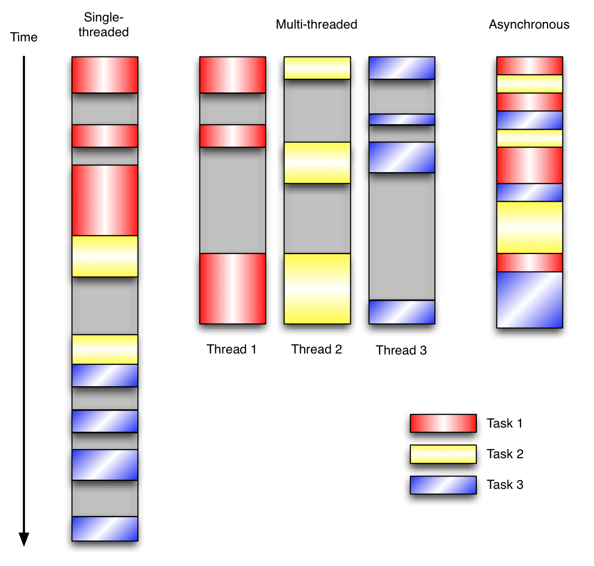

首先建议你了解下**事件驱动模型**：

[https://www.cnblogs.com/wdliu/p/6890930.html](https://www.cnblogs.com/wdliu/p/6890930.html "https://www.cnblogs.com/wdliu/p/6890930.html")

Python线程、协程探究（3）——协程的调度实现大龙

[https://zhuanlan.zhihu.com/p/96969508](https://zhuanlan.zhihu.com/p/96969508 "https://zhuanlan.zhihu.com/p/96969508")

python cookbook 11.12 理解事件驱动的IO

[https://python3-cookbook.readthedocs.io/zh\_CN/latest/c11/p12\_understanding\_event\_driven\_io.html](https://python3-cookbook.readthedocs.io/zh_CN/latest/c11/p12_understanding_event_driven_io.html "https://python3-cookbook.readthedocs.io/zh_CN/latest/c11/p12_understanding_event_driven_io.html")



需要注意的是，协程并不是万能的，由于系统事件循环的限制，所以文件IO一般还是使用多线程来执行，具体见：[github.com/python/asyn…](https://link.juejin.cn/?target=https://github.com/python/asyncio/wiki/ThirdParty#filesystem "github.com/python/asyn…")

协程的关键在于future、task。

与Coroutine只有让步和接收结果不同的是Future除了让步和接收结果功能外，它还是一个只会被动进行事件调用且带有状态的容器，它在初始化时就是`Pending`状态，这时可以被取消，被设置结果和设置异常。而在被设定对应的操作后，Future会被转化到一个不可逆的对应状态，并通过`loop.call_sonn`来调用所有注册到本身上的回调函数，同时它带有`__iter__`和`__await__`方法使其可以被`await`和`yield from`调用。

Task是Future的子类，除了继承了Future的所有方法，它还多了两个重要的方法`__step`和`__wakeup`，通过这两个方法赋予了Task调度能力，这是Coroutine和Future没有的。

本次调试的问题在于：“为什么当下面的接受代码结束(break)后，发送代码仍然会陷入阻塞？又是为什么可以将他重新唤醒？”

```python
# socket_start.py
import asyncio
import websockets
import json
from loguru import logger
async def sen_data(websocket, path):
    logger.error("初始化完成")
    while 1:
        data1 = {"value":1}
        data1 = json.dumps(data1).encode('utf-8')
        try:
            await websocket.send(data1)
        except Exception:
            logger.debug("重新启动")
            break
    logger.debug("结束了！")

start_serve1 = websockets.serve(sen_data, "127.0.0.1", 1122, ping_interval=None)
asyncio.get_event_loop().run_until_complete(start_serve1)
asyncio.get_event_loop().run_forever()
```

```python
# socket_get.py
import json
import asyncio
import websockets
import time
from loguru import logger

async def hello(uri):
    async with websockets.connect(uri, ping_interval=None) as websocket:
        while True:
            recv_text = await websocket.recv()
            print("> {}".format(recv_text))
            print(time.time())
            time.sleep(1)

asyncio.get_event_loop().run_until_complete(
    hello('ws://127.0.0.1:1122'))  # 地址改为自己的地址
```

为了搞清楚，需要画一个时序状态机：
_4afc4NNYmA.png>)

时序状态机绘制地址：

[https://tooltt.com/sequence/](https://tooltt.com/sequence/ "https://tooltt.com/sequence/")

时序绘制代码：

```
Note right of socket\_start: -> 开始执行程序
Note right of socket\_start: self.\_run\_once()
Note right of socket\_start: （base\_events.py）self.\_selector.select(timeout)
Note right of socket\_start: （[selectors.py](http://selectors.py "selectors.py")）self.*selector.poll(timeout, max\_ev)
Note right of socket\_start: 陷入阻塞
Note left of socket\_get: 开始执行程序 <-
Note left of socket\_get: aenter
Note left of socket\_get: await
Note left of socket\_get: await\_impl\_timeout
Note left of socket\_get: await\_impl
Note left of socket\_get: protocol handshake  start
Note left of socket\_get: write\_http\_request
Note left of socket\_get: self.transport.write(request.encode())
socket\_get->socket\_start: self.transport.write(request.encode())
socket\_get->socket\_start: asyncio/selector\_events.py
socket\_get->socket\_start: self.* sock.send(data)
Note right of socket\_start: 跳出阻塞
Note right of socket\_start: （[selectors.py](http://selectors.py "selectors.py")）for fd, event in fd\_event\_list:
Note right of socket\_start: 之后反复运行self.\_ context.run(self.\_callback, \*self.\_args)
```

另外的一些细节：

## 启动sen\_data函数相关的协程

（【socket\_start文件】此时应当在asyncio.get\_event\_loop().run\_forever()）

【socket\_start文件】接收到【socket\_get文件的connect后执行如下片段】

connection\_made
await self.handshake
start hand shake !!!!!!
read\_http\_request
process\_request
process\_origin
process\_extensions
process\_subprotocol
write\_http\_response
handshake

此时开始执行协程相关项

```
客户端使用 time.sleep 导致事件循环阻塞
在客户端的 hello 协程中，你使用了 time.sleep(1)，这是一个同步阻塞调用，会阻塞整个事件循环。这意味着当客户端在等待接收数据并执行 time.sleep(1) 时，事件循环无法调度其他协程，包括服务器端的发送操作。这是导致服务器端发送代码“陷入阻塞”的主要原因。

解决方案： 使用异步的 asyncio.sleep 代替同步的 time.sleep。

修改后的客户端代码：

python

复制
async def hello(uri):
    async with websockets.connect(uri, ping_interval=None) as websocket:
        while True:
            recv_text = await websocket.recv()
            print("> {}".format(recv_text))
            print(time.time())
            await asyncio.sleep(1)  # 异步睡眠，不阻塞事件循环

2.2 连接关闭后的发送操作
当客户端接收代码通过 break 退出循环并关闭连接后，服务器端的 sen_data 协程在下一次执行 await websocket.send(data1) 时，会因为连接已经关闭而抛出异常。这时，异常被捕获，日志记录“重新启动”，然后通过 break 跳出循环，最后记录“结束了！”。

然而，如果客户端在没有正确关闭连接的情况下突然断开（如强制关闭程序），服务器端的发送操作可能会陷入等待状态，直到事件循环检测到连接关闭并处理异常。
```

## reference&#x20;

Python的可等待对象在Asyncio的作用

[https://so1n.me/2022/04/11/python's\_waitable\_objects\_in\_asyncio/index.html](https://so1n.me/2022/04/11/python's_waitable_objects_in_asyncio/index.html "https://so1n.me/2022/04/11/python's_waitable_objects_in_asyncio/index.html")

Python Asyncio调度原理（）

[https://juejin.cn/post/7108367062463938597](https://juejin.cn/post/7108367062463938597 "https://juejin.cn/post/7108367062463938597")

如何给所有的async函数添加try/catch？（语法分析词法分析）

[https://juejin.cn/post/7155434131831128094](https://juejin.cn/post/7155434131831128094 "https://juejin.cn/post/7155434131831128094")

事件循环和协程：从生成器到协程（手写简单的协程实现）

[https://zhuanlan.zhihu.com/p/31634491](https://zhuanlan.zhihu.com/p/31634491 "https://zhuanlan.zhihu.com/p/31634491")

HTTP、TCP与UDP、Socket与Websocket之间的联系与区别

[https://segmentfault.com/a/1190000037620675](https://segmentfault.com/a/1190000037620675 "https://segmentfault.com/a/1190000037620675")
