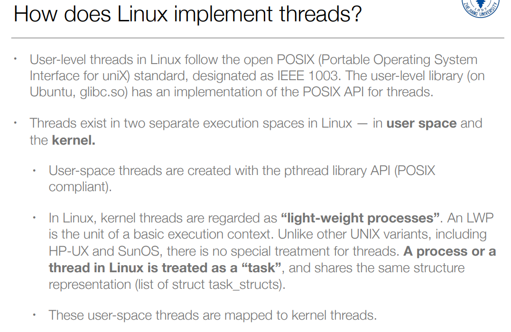
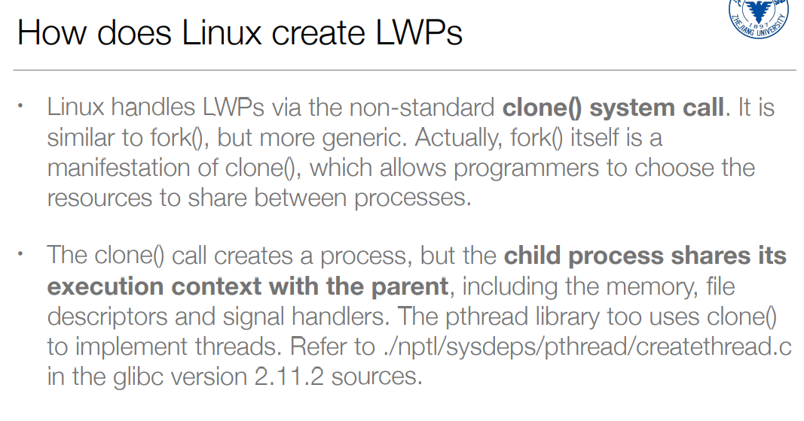
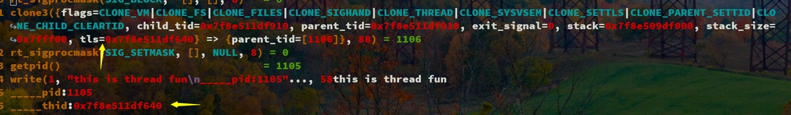
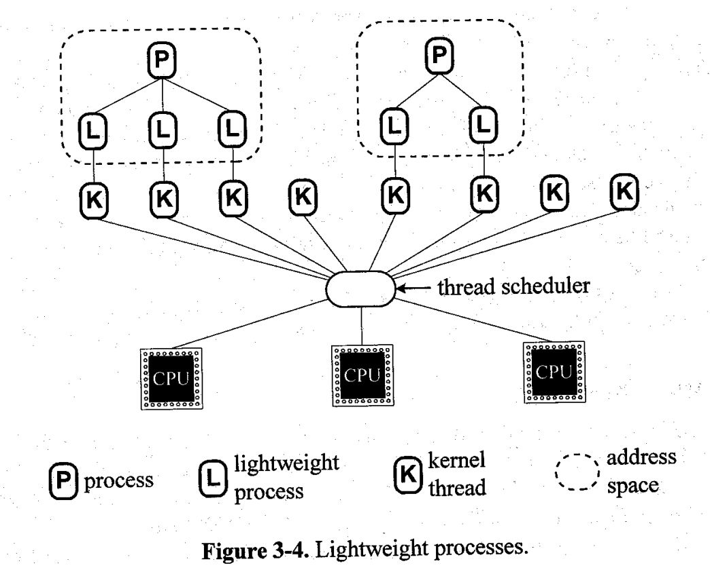
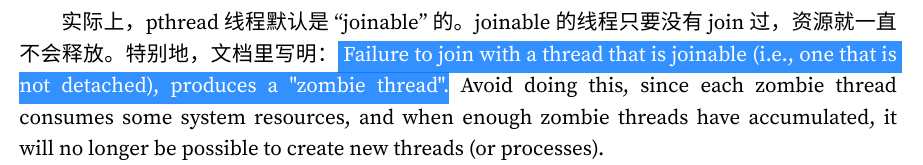
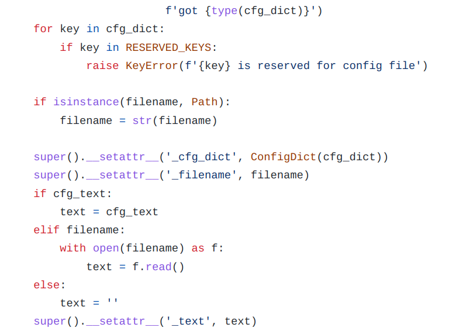
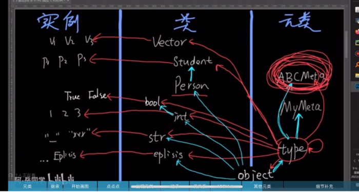
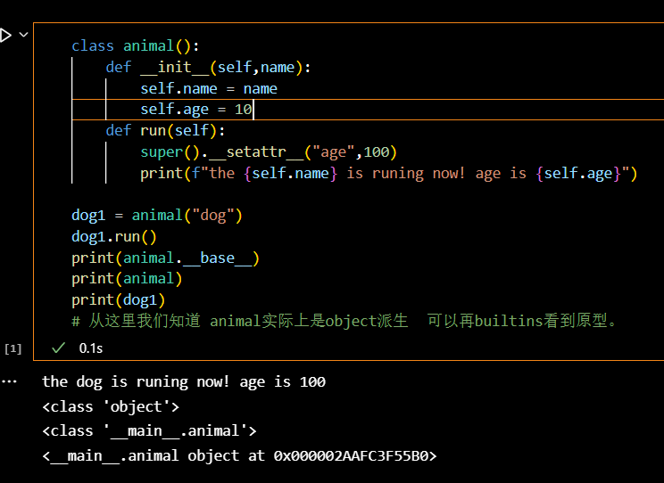
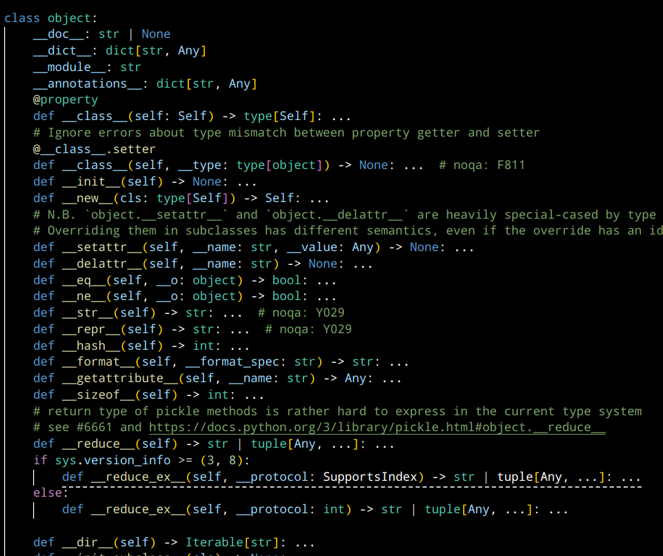

## 编译与链接相关

windows: 编译时需要lib文件运行时需要dll文件lib文件很小，只包含符号信息链接器通过lib文件知道函数在哪个dll中

```
源代码 -> 编译 -> 目标文件(.obj) 
                      ↓ 
                   链接器 ← 导入库(.lib) 
                      ↓          ↑
                   可执行文件    DLL文件(.dll)
```

linux: 编译和运行都只需要.so文件so文件包含所有需要的信息链接器直接从so文件读取符号信息

```
源代码 -> 编译 -> 目标文件(.o)
                     ↓
                   链接器 ← 动态库(.so)
                     ↓
                  可执行文件
```

【手把手教编写第一个动态链接库-哔哩哔哩】 [https://b23.tv/6pddFSv](https://b23.tv/6pddFSv "https://b23.tv/6pddFSv")

Q：**编译器前后端之区别是不是只在中间代码翻译的职责部分？**

比如clang负责转换成机器无关的中间代码。然后llvm后端把它可以转换成机器相关汇编代码

A：

```
源代码 -> [Clang前端] -> LLVM IR -> [LLVM后端] -> 机器码

Clang前端:
- 词法分析
- 语法分析
- 语义分析
- 生成LLVM IR

LLVM后端:
- IR级优化
- 目标代码生成
- 平台特定优化
```

## 操作系统相关

[https://yajin.org/os2018fall/](https://yajin.org/os2018fall/ "https://yajin.org/os2018fall/")

[https://yajin.org/os2018fall/02\_os\_structures.pdf](https://yajin.org/os2018fall/02_os_structures.pdf "https://yajin.org/os2018fall/02_os_structures.pdf")

**Q：用户线程为什么不能独立于内核线程存在？至少要有一个内核线程“与他关联”？**

A：

群友的看法：

我的理解是,如果在微内核, 比如fs模块在user层, 用户程序只需要调用fs模块, 那用户程序逻辑上是没有调用内核task, 但是物理上微内核fs模块肯定会调用微内核内核层的vm的task的, 所以用户线程不能独立存在。如果用户程序和操作系统在一个物理机中, 如果用户程序和操作系统要独立, 首先资源要独立, 内存可以协商独立, 比如0x00000a-0x0000fff是操作系统的, 然后0x0001ffff0-0xffffffff是用户程序的. cpu0是给操作系统的, cpu1是给用户程序的.  然后通信用网络, eth0是操作系统的, eth1是用户程序的. 这样的话应该能设计出用户线程是独立的。

我的看法：

（不同操作系统实现不同，这里只针对比较现代的linux。)

首先要注意这东西由于不同操作系统和不同年代的教材众说纷纭，很容易出现概念混淆和理解错误，这里我们以最新的linux手册为准。

在讨论这个问题之前首先要明确几个概念（什么是线程、什么是用户线程。），我们看到有很多地方说到多对一模型，其实这里的用户线程更应该叫协程（你看到很多地方会说这东西不需要syscall就可以创建，process内负责执行流切换无需os）。而我们常说的用户态创建的线程就是一对一模型（pthreads手册中明确提到`Both  of  these  are  so-called  1:1 implementations, meaning that each thread maps to a kernel scheduling entity`），本身需要和内核线程挂钩（创建过程需要syscall和内核线程绑定），而进程本身的主线程必定是和内核线程挂钩；另外在linux中我们用task去称呼会更加合适，linux系统层面没必要分进程线程只需要task就好。只有在我们执行的程序里有需求开pthread 这里才要强调，它会将对应的函数入口给内核线程以便切换。



需要注意的是，在xv6，内核初始化完了切换init后就进入了用户态，此后fork、exec的都是子task，但是需要调度流切换得需要和cpu联系，这就需要内核task才能够运作。（其实这里的子task本身就是可以被调度到的，因为就是PCB）

回答这个问题的关键是理解所谓的线程是怎么拿到cpu资源的，拿到资源意味着被调度器调度。（为什么不讨论进程？因为实际上进程只是一些共享内存的task，而且在linux中PCB就是task\_struct）。首先之所以是线程而不是函数是因为他能作为调度单元（可以被调度器切换上下文），在任务调度器（比如pa中的schedule）的眼里，只有task才是调度单元，即处理器上运行的每个任务都是调度器给分配的执行流，只要成为执行流就能够独立上处理器运行了，而内核task可以被内核直接调度，他可以直接做到操作页表，维护cache, 读写系统寄存器等操作。如果用户task（比如协程）不需要内核线程管理，容易出现一些意外现象（虽然还是可以让系统发指令杀死）。这里概念最坑的就是可能混淆协程和在用户态用pthread api 创建的线程以及LWP轻量化进程，实际上前者可以通过是否syscall是否需要和内核互动来区分；而LWP轻量化进程在linux中有时是内核线程的另一种称呼。

为什么说linux中用户态可以/需要绑定一个内核线程？具体看syscall，我们创建线程的过程会调用clone然后和一个内核线程“绑定”（大概是把上下文存储到内核线程task块中这样可以被os看到和调度。）用户task实际上用的是内核task的pcb块，需要一些高级权限的时候就保存上下文内陷然后在内核中处理即可。



如果想要最单纯的用户线程也有执行的权限，关键是你能够怎么切换他的执行流，此时应该只有协程能满足这个需求了，否则要提权的话就是内核线程了，因为能被内核直接schedule。所以严格来说独立的用户线程是不存在的，就算是协程也需要进程调度，而进程的cpu资源源于对应内核task的被调度。

（有趣的是，linux2.6才完全支持了我们现在意义上的用户态线程，linux2.6是2003年的内核版本，由此可见计算机确实是一门很新的学科:)   ）





reference：

浙大课件Light-Weight Processes: Dissecting Linux Threads：[https://yajin.org/os2018fall/04\_thread\_b.pdf](https://yajin.org/os2018fall/04_thread_b.pdf "https://yajin.org/os2018fall/04_thread_b.pdf")

深入理解Linux内核之内核线程（上）：[https://zhuanlan.zhihu.com/p/364898425](https://zhuanlan.zhihu.com/p/364898425 "https://zhuanlan.zhihu.com/p/364898425")

关于“内核线程”、“用户线程”概念的理解：[https://blog.csdn.net/u012927281/article/details/51602898](https://blog.csdn.net/u012927281/article/details/51602898 "https://blog.csdn.net/u012927281/article/details/51602898")

图解进程、线程：[https://blog.csdn.net/fuzhongmin05/article/details/119448800](https://blog.csdn.net/fuzhongmin05/article/details/119448800 "https://blog.csdn.net/fuzhongmin05/article/details/119448800")

Light-Weight Processes: Dissecting Linux Threads：[https://www.opensourceforu.com/2011/08/light-weight-processes-dissecting-linux-threads/](https://www.opensourceforu.com/2011/08/light-weight-processes-dissecting-linux-threads/ "https://www.opensourceforu.com/2011/08/light-weight-processes-dissecting-linux-threads/")

What are Linux Processes, Threads, Light Weight Processes, and Process State:[https://www.thegeekstuff.com/2013/11/linux-process-and-threads/](https://www.thegeekstuff.com/2013/11/linux-process-and-threads/ "https://www.thegeekstuff.com/2013/11/linux-process-and-threads/")

man pthreads:[https://man7.org/linux/man-pages/man7/pthreads.7.html](https://man7.org/linux/man-pages/man7/pthreads.7.html "https://man7.org/linux/man-pages/man7/pthreads.7.html")

**Q：linux**线程的生命周期是怎么样的？怎么被创建和销毁？内核task能不能被复用？

A: 这个说的比较清楚：[https://xieyu.github.io/blog/pthread/glibc-pthread-implement-thread-life-cycle.html](https://xieyu.github.io/blog/pthread/glibc-pthread-implement-thread-life-cycle.html "https://xieyu.github.io/blog/pthread/glibc-pthread-implement-thread-life-cycle.html")

* 如果 `pthread_join` 发生在结束后不久，资源还未被回收，函数会立即返回。

* 如果 `pthread_join` 发生在结束以后一段时间，可能会得到 `ESRCH` (no such thread) 错误。

* 如果 `pthread_join` 发生在之后很久很久很久很久，资源被释放又被再次复用 (`pthread_t` 是一个的确可能被复用的整数)，我不就 join 了另一个线程了吗？这恐怕要出大问题。

* 特别的：（其他情况exit后都会被资源回收）



没有task复用的说法。

reference:

jyy:[http://jyywiki.cn/OS/2022/labs/M2](http://jyywiki.cn/OS/2022/labs/M2 "http://jyywiki.cn/OS/2022/labs/M2")

## python相关

Q: 为什么开了multiprocessing的pool再开process就不会出现信息？

A：记住要多次fork只能一直process就对了。避免混用Pool和Process。如果需要混用，确保正确管理进程生命周期需要进程池管理：使用Pool,需要更细粒度控制：使用Process。使用上下文管理器(with语句)来管理Pool。总是记得调用join()等待进程完成

Q: python元类的派生 2022-08-13 如何进行？

一天看到有个群友问了这样一个问题：有父类也可以直接根据super()使用父类方法？



> 为什么这个类没有看到继承于谁，但是在里面可以直接super？

在这个栏目中我们先不谈有关\_\_setattr\_\_魔术方法的具体作用（其实就是反射）和应用场景，就单纯谈为什么在这里可以凭空super。

举个简单的例子：

```python
class Person:
    def __setattr__(self,name,value):
        print(f"setting attribute [{name}] to {value}")
        super().__setattr__(name,value)

```

看似没有集成任何类，为什么在这里我们直接可以super呢？其实相当于重写了Person类的父类的\_\_setattr\_\_方法，person类的父类是什么呢？这里我们需要了解元类的概念：（转载自b站阿岳同学）



实际上我们创建的类person本身就是object的派生类，所以当我们在person里直接super的时候，事实上使用的是object的魔术方法。

我们可以做个实验：



这里我们使用\_\_base\_\_查看父类能够看到class'object'，那么到底他是个什么呢？

在builtins.pyi中我们能一探究竟：



所以一切都很显然了，我们能够直接super原因是我们创造的class本身也是一种派生。
